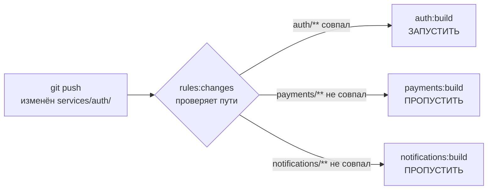
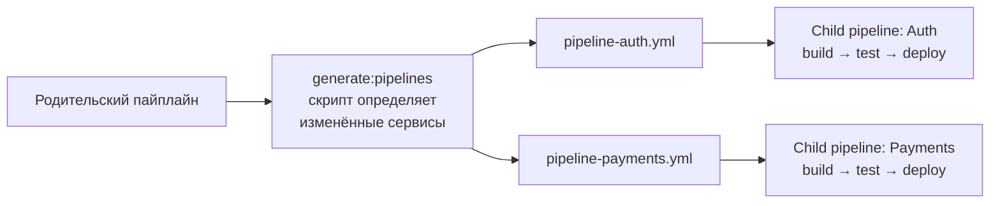
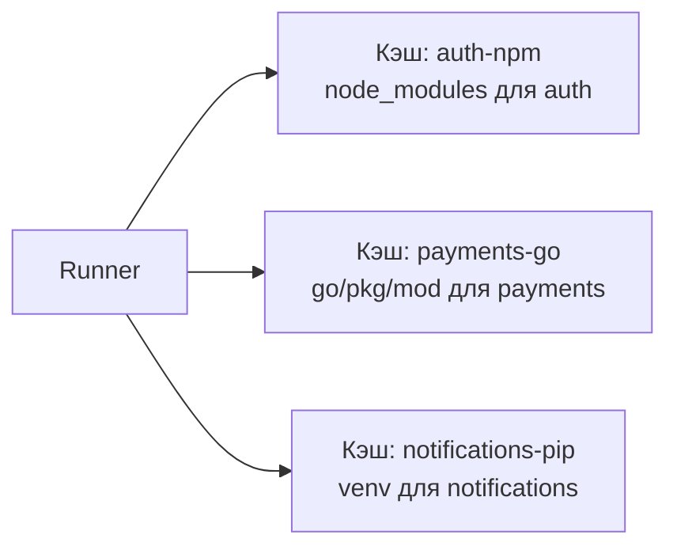
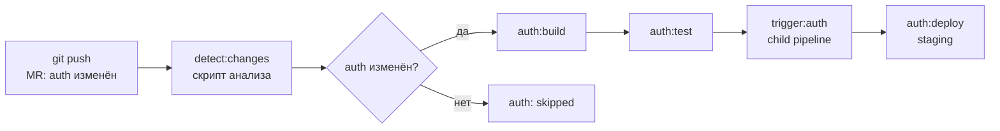

# Уровень 13: Monorepo CI/CD

## Что такое монорепо и почему это сложно для CI/CD?

Представь большой торговый центр. Там десятки магазинов: одежда, электроника, продукты. Все они находятся в одном здании (один репозиторий), но у каждого — своё расписание, свой персонал, своя касса.

Классический CI/CD-подход: если кто-то чихнул в магазине электроники — эвакуируем весь торговый центр и проверяем каждый магазин. Расточительно и медленно.

Умный подход: система датчиков определяет, в каком именно магазине проблема, и реагирует только там. Это и есть Monorepo CI/CD.

**Монорепо** — репозиторий, в котором живёт несколько независимых сервисов или пакетов:

```
my-company/
  ├── services/
  │   ├── auth/         # Node.js сервис авторизации
  │   ├── payments/     # Go сервис платежей
  │   └── notifications/ # Python сервис уведомлений
  ├── packages/
  │   ├── ui-kit/       # Общая библиотека компонентов
  │   └── utils/        # Общие утилиты
  └── .gitlab-ci.yml
```

Без умной конфигурации каждый коммит будет запускать сборку и тесты **всего**: и auth, и payments, и notifications. Это может занимать 30+ минут, хотя разработчик изменил одну строчку в одном сервисе.

---

## rules:changes — запускать джобы только когда нужно

### Базовая идея

`rules:changes` позволяет задать список путей. Джоб запустится **только если** в пайплайне изменился хотя бы один файл, соответствующий этим путям.



### Синтаксис rules:changes

```yaml
# Простой пример: джоб для сервиса auth
auth:build:
  stage: build
  script:
    - cd services/auth && docker build -t auth .
  rules:
    - if: $CI_PIPELINE_SOURCE == "merge_request_event"
      changes:
        - services/auth/**/*
        - packages/utils/**/*   # auth зависит от utils
```

💡 Ключевой момент: `changes` работает вместе с `if`. Джоб запустится, только если **оба** условия выполнены.

### Паттерны путей в changes

```yaml
rules:
  - changes:
      - services/auth/**/*        # все файлы внутри services/auth/ (рекурсивно)
      - services/auth/*           # только файлы в корне services/auth/ (не рекурсивно)
      - "**/*.go"                 # любые .go файлы в любом месте репозитория
      - packages/utils/src/*.ts   # .ts файлы в конкретной директории
      - docker-compose.yml        # конкретный файл
      - .gitlab-ci.yml            # если изменился сам CI-конфиг
```

📌 `**` означает "любое количество директорий", `*` — "любое имя файла без слешей".

### Что происходит, если changes не совпал?

По умолчанию джоб получит статус `skipped`. Он не упадёт, просто будет пропущен в пайплайне.

Если нужно изменить это поведение:

```yaml
auth:build:
  rules:
    - if: $CI_PIPELINE_SOURCE == "merge_request_event"
      changes:
        - services/auth/**/*
    - when: never   # явно говорим: во всех остальных случаях — не запускать
```

### Проблема с ветками по умолчанию

⚠️ `rules:changes` сравнивает с предыдущим коммитом в рамках MR. На ветке `main` при первом коммите GitLab сравнивает с пустым деревом — **все файлы считаются "изменёнными"**.

```yaml
auth:build:
  rules:
    # В MR — проверяем изменения
    - if: $CI_PIPELINE_SOURCE == "merge_request_event"
      changes:
        - services/auth/**/*
    # На main — запускаем всегда (защитная ветка)
    - if: $CI_COMMIT_BRANCH == $CI_DEFAULT_BRANCH
```

### Зависимости между сервисами

Реальная проблема: если изменился `packages/utils`, нужно пересобрать все сервисы, которые от него зависят.

```yaml
.auth-changes: &auth-changes
  changes:
    - services/auth/**/*
    - packages/utils/**/*    # общая зависимость
    - packages/ui-kit/**/*   # если auth использует ui-kit

auth:build:
  rules:
    - if: $CI_PIPELINE_SOURCE == "merge_request_event"
      <<: *auth-changes

auth:test:
  needs: [auth:build]
  rules:
    - if: $CI_PIPELINE_SOURCE == "merge_request_event"
      <<: *auth-changes
```

---

## Dynamic child pipelines — генерация пайплайнов на лету

### Проблема статических конфигов

В большом монорепо статический `.gitlab-ci.yml` быстро превращается в монстра: 500+ строк, дублирование, трудно поддерживать. Добавление нового сервиса требует правки CI-файла.



### Как работает trigger:include

```yaml
# Родительский пайплайн
generate:
  stage: .pre
  script:
    - python3 scripts/generate-pipelines.py
  artifacts:
    paths:
      - generated-pipelines/*.yml

trigger:auth:
  stage: deploy
  needs: [generate]
  trigger:
    include:
      - artifact: generated-pipelines/auth.yml
        job: generate
    strategy: depend   # родитель ждёт child pipeline
```

### Скрипт генерации пайплайна

```python
# scripts/generate-pipelines.py
import subprocess
import os

# Получаем список изменённых файлов
result = subprocess.run(
    ['git', 'diff', '--name-only', 'HEAD~1', 'HEAD'],
    capture_output=True, text=True
)
changed_files = result.stdout.strip().split('\n')

# Определяем затронутые сервисы
services = {
    'auth': 'services/auth',
    'payments': 'services/payments',
    'notifications': 'services/notifications',
}

os.makedirs('generated-pipelines', exist_ok=True)

for service, path in services.items():
    # Проверяем, есть ли изменения в этом сервисе
    affected = any(f.startswith(path) for f in changed_files)
    
    if affected:
        pipeline = f"""
{service}:build:
  stage: build
  script:
    - cd {path} && docker build -t {service}:$CI_COMMIT_SHA .

{service}:test:
  stage: test
  needs: [{service}:build]
  script:
    - cd {path} && ./run-tests.sh
"""
        with open(f'generated-pipelines/{service}.yml', 'w') as f:
            f.write(pipeline)
```

### Матричный подход с parallel:matrix

Если сервисы однотипны, можно использовать матрицу:

```yaml
build:service:
  stage: build
  parallel:
    matrix:
      - SERVICE: [auth, payments, notifications]
  script:
    - cd services/$SERVICE && docker build -t $SERVICE:$CI_COMMIT_SHA .
  rules:
    - changes:
        - services/$SERVICE/**/*
```

💡 GitLab автоматически создаст три джоба: `build:service: [auth]`, `build:service: [payments]`, `build:service: [notifications]`.

### strategy: depend vs strategy: mirror

```yaml
trigger:auth:
  trigger:
    include: generated-pipelines/auth.yml
    strategy: depend   # РЕКОМЕНДУЕТСЯ: родитель ждёт и "наследует" статус child
    # strategy: mirror  # родитель немедленно завершается со статусом child
```

📌 `strategy: depend` — родительский пайплайн отмечается как "запущен" до тех пор, пока child pipeline не завершится. Это важно для защитных веток — merge не будет разрешён, пока child pipeline не завершится успешно.

---

## Кэширование в монорепо

### Проблема общего кэша

В монорепо несколько сервисов используют одинаковый runner. Если все джобы пишут в один кэш — возникают конфликты и инвалидация.

Представь общий холодильник в офисе: все ставят туда свою еду без подписи. Через неделю — хаос. Решение: у каждого своя полка с именем.



### Per-service cache keys

```yaml
# Ключ кэша = имя сервиса + хэш lock-файла
auth:build:
  cache:
    key:
      files:
        - services/auth/package-lock.json
      prefix: auth-npm
    paths:
      - services/auth/node_modules/
    policy: pull-push

payments:build:
  cache:
    key:
      files:
        - services/payments/go.sum
      prefix: payments-go
    paths:
      - .go/pkg/mod/
    policy: pull-push
```

### Политики кэша

```yaml
# Пишем кэш только в build-джобе
build:
  cache:
    key: $CI_COMMIT_REF_SLUG
    policy: pull-push   # читаем и пишем

# В test-джобе только читаем, не обновляем
test:
  cache:
    key: $CI_COMMIT_REF_SLUG
    policy: pull        # только читаем

# В deploy-джобе кэш не нужен
deploy:
  cache: []             # явно отключаем
```

### Иерархия ключей кэша

Хорошая стратегия: сначала ищем точный ключ, потом — запасной (fallback).

```yaml
.cache-template:
  cache:
    - key:
        files: [services/auth/package-lock.json]
        prefix: "auth-$CI_COMMIT_REF_SLUG"
      paths: [services/auth/node_modules/]
      policy: pull-push
    # Fallback: если нет кэша для этой ветки — берём с main
    - key:
        files: [services/auth/package-lock.json]
        prefix: "auth-main"
      paths: [services/auth/node_modules/]
      policy: pull
```

### Что класть в кэш в монорепо?

```yaml
# Node.js сервис
auth:
  cache:
    key:
      files: [services/auth/package-lock.json]
      prefix: auth
    paths:
      - services/auth/node_modules/   # ✅ зависимости
      # НЕ кэшируй:
      # - services/auth/dist/         # ❌ артефакт сборки, не кэш
      # - .git/                       # ❌ никогда не кэшировать git

# Go сервис
payments:
  cache:
    key:
      files: [services/payments/go.sum]
      prefix: payments
    paths:
      - $GOPATH/pkg/mod/   # ✅ Go modules cache
      - .go-build-cache/    # ✅ build cache

# Python сервис
notifications:
  cache:
    key:
      files: [services/notifications/requirements.txt]
      prefix: notifications
    paths:
      - services/notifications/venv/  # ✅ virtualenv
```

---

## Оптимизация артефактов в монорепо

### Проблема: артефакты растут

В монорепо легко случайно загрузить артефакты всех сервисов в каждый джоб. Это замедляет пайплайн.

```yaml
# ❌ Плохо: все джобы скачивают все артефакты
test:auth:
  # Неявно загружает artifacts от ВСЕХ предыдущих джобов
  needs: [build:auth, build:payments, build:notifications]
  script: cd services/auth && ./test.sh

# ✅ Хорошо: точно указываем, что нужно
test:auth:
  needs:
    - job: build:auth
      artifacts: true   # скачиваем только артефакты auth
    - job: build:payments
      artifacts: false  # джоб нужен для порядка выполнения, но артефакты не нужны
  script: cd services/auth && ./test.sh
```

### Глобальный artifacts:exclude

```yaml
build:auth:
  artifacts:
    paths:
      - services/auth/dist/
    exclude:
      - services/auth/dist/**/*.map    # не нужны source maps в артефактах
      - services/auth/dist/**/*.test.* # тестовые файлы не нужны
    expire_in: 1 day
```

---

## Полная схема monorepo pipeline



---

## Ключевые переменные GitLab CI для монорепо

```yaml
variables:
  # Текущая ветка
  CI_COMMIT_BRANCH: "feature/auth-update"
  
  # Хэш коммита — уникальный тег для Docker образов
  CI_COMMIT_SHA: "abc123def456"
  CI_COMMIT_SHORT_SHA: "abc123d"
  
  # Slug ветки (безопасен для использования в именах кэша/тегов)
  CI_COMMIT_REF_SLUG: "feature-auth-update"
  
  # Для тегирования образов
  IMAGE_TAG: "$CI_REGISTRY_IMAGE/auth:$CI_COMMIT_SHA"
```

---

## Распространённые ошибки

### ❌ rules:changes без if условия

```yaml
# Проблема: без if conditions используется "always" как дефолт
# rules:changes работает корректно только в MR pipeline
auth:build:
  rules:
    - changes:
        - services/auth/**/*
# На ветке main при первом коммите — запустит всё!
```

```yaml
# ✅ Правильно: явно указать контекст
auth:build:
  rules:
    - if: $CI_PIPELINE_SOURCE == "merge_request_event"
      changes:
        - services/auth/**/*
    - if: $CI_COMMIT_BRANCH == $CI_DEFAULT_BRANCH
```

### ❌ Один ключ кэша на все сервисы

```yaml
# Проблема: auth и payments пишут в один кэш, инвалидируют друг друга
all:build:
  cache:
    key: node-modules    # ❌ одно имя для всех
    paths:
      - node_modules/
```

```yaml
# ✅ Правильно: уникальный ключ для каждого сервиса
auth:build:
  cache:
    key:
      files: [services/auth/package-lock.json]
      prefix: auth
    paths: [services/auth/node_modules/]

payments:build:
  cache:
    key:
      files: [services/payments/package-lock.json]
      prefix: payments
    paths: [services/payments/node_modules/]
```

### ❌ Не учитывать зависимости пакетов

```yaml
# Проблема: packages/utils изменился, но auth не пересобирается
auth:build:
  rules:
    - changes:
        - services/auth/**/*  # ❌ забыли про зависимость от utils
```

```yaml
# ✅ Правильно: добавить все зависимости
auth:build:
  rules:
    - changes:
        - services/auth/**/*
        - packages/utils/**/*  # ✅ если utils изменился — пересобираем auth
        - packages/ui-kit/**/* # ✅ если ui-kit изменился — тоже
```

### ❌ Child pipeline без strategy: depend

```yaml
# Проблема: родительский пайплайн завершается мгновенно,
# MR разрешает merge до того, как child pipeline завершится
trigger:auth:
  trigger:
    include: generated-pipelines/auth.yml
    # strategy не указана — по умолчанию "mirror"
```

```yaml
# ✅ Правильно: ждём завершения child pipeline
trigger:auth:
  trigger:
    include: generated-pipelines/auth.yml
    strategy: depend  # родитель ждёт child
```
