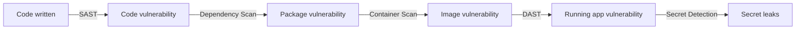
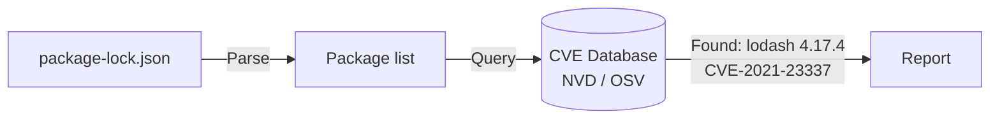
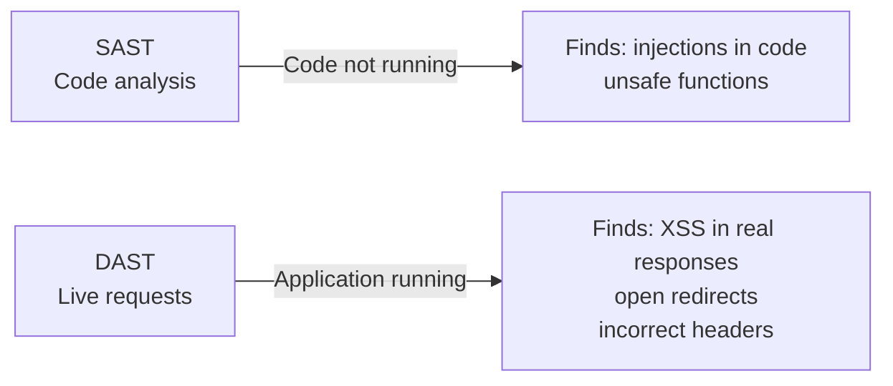
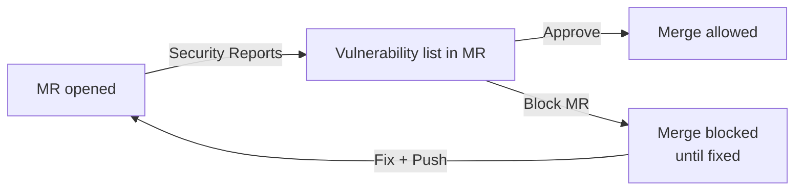

# Level 14: Security Scanning in CI/CD

## Why Scan for Security in the Pipeline?

Imagine you're building a house. You could wait until the house is finished and then call a fire inspector — they'll find violations and you'll have to tear down finished walls. Or you could check each floor as it's built: are the wires laid properly? Are exits clear?

In development it's the same:
- **Checking at the end** (pen-testing the finished product) — expensive, late, hard to fix
- **Checking in the pipeline** — cheap, fast, developer sees the problem immediately in their MR

This is called **"shifting left"** — moving security checks as early as possible in the development cycle.



Each tool finds its own class of vulnerabilities. A good security pipeline uses all five.

---

## SAST — Static Application Security Testing

### What It Is

SAST analyzes **source code** without executing it. The tool reads code as text, looking for dangerous patterns: SQL injection, XSS, unsafe cryptography usage, hardcoded secrets.

Analogy: a proofreader reading a manuscript and marking grammar errors — they don't need to read the book aloud to find typos.

### How SAST Finds Problems

```
Source code → Parser (AST) → Data flow graph → Rules → Report
```

Example: the tool sees that data from `request.query.id` flows into `db.query()` without sanitization — a potential SQL injection.

```javascript
// ❌ SAST will catch this
const id = req.query.id
db.query(`SELECT * FROM users WHERE id = ${id}`)

// ✅ SAST will be happy
const id = req.query.id
db.query('SELECT * FROM users WHERE id = ?', [id])
```

### SAST in GitLab CI

GitLab provides ready-made templates. One line is enough:

```yaml
include:
  - template: Security/SAST.gitlab-ci.yml

stages:
  - test
```

GitLab automatically detects languages in the repository and launches appropriate analyzers:
- **semgrep** — universal, supports 30+ languages
- **bandit** — Python
- **eslint** — JavaScript/TypeScript
- **gosec** — Go
- **sobelow** — Elixir

### Manual SAST Configuration

If you need full control — configure explicitly:

```yaml
stages:
  - test
  - security

sast:
  stage: security
  image: semgrep/semgrep
  script:
    - semgrep --config=auto --json --output=gl-sast-report.json .
  artifacts:
    reports:
      sast: gl-sast-report.json
    when: always
    expire_in: 1 week
  rules:
    - if: $CI_PIPELINE_SOURCE == 'merge_request_event'
    - if: $CI_COMMIT_BRANCH == $CI_DEFAULT_BRANCH
```

💡 `artifacts:reports:sast` — a special artifact type. GitLab parses it and shows found vulnerabilities directly in the Merge Request.

### Configuring Exclusions

Not all findings are critical. Some false positives need to be suppressed:

```yaml
variables:
  SAST_EXCLUDED_PATHS: 'spec,test,tests,tmp,vendor'
  SAST_EXCLUDED_ANALYZERS: 'nodejs-scan'
  SEMGREP_RULES: 'p/owasp-top-ten p/javascript'
```

📌 `.semgrepignore` works like `.gitignore` — list paths that shouldn't be scanned.

---

## Dependency Scanning — Scanning Dependencies

### The Problem

Your code may be perfectly clean. But if the `left-pad v1.0.0` package contains CVE-2024-12345 — your application is vulnerable. Statistics show over 80% of code in modern applications is dependencies, not own code.

### How It Works

The tool takes `package-lock.json` (or `Gemfile.lock`, `requirements.txt`, `pom.xml`) and compares each dependency against a vulnerability database (NVD, OSV, GitHub Advisory Database).



### Dependency Scanning in GitLab CI

```yaml
include:
  - template: Security/Dependency-Scanning.gitlab-ci.yml

# GitLab will find lock files and launch needed analyzers:
# gemnasium — for npm, pip, bundler, maven, gradle
# retire.js — for JavaScript
```

### Manual Configuration with trivy

```yaml
dependency-scanning:
  stage: security
  image:
    name: aquasec/trivy:latest
    entrypoint: ['']
  script:
    - trivy fs --format template
        --template "@/contrib/gitlab.tpl"
        --output gl-dependency-scanning-report.json
        --severity HIGH,CRITICAL
        .
  artifacts:
    reports:
      dependency_scanning: gl-dependency-scanning-report.json
    when: always
    expire_in: 1 week
  rules:
    - if: $CI_PIPELINE_SOURCE == 'merge_request_event'
```

### Configuring the Threshold

When should the pipeline stop? Better to use severity filtering:

```yaml
variables:
  DS_MAX_SEVERITY: 'high'  # stop at HIGH and CRITICAL
  # low, medium, high, critical
```

📌 Important: `DS_MAX_SEVERITY` only works with the GitLab template. With manual configuration, control via trivy's `--severity` flag.

---

## Container Scanning — Scanning Docker Images

### Why It's Separate

Dependency Scanning checks your code's dependencies. But a Docker image contains an operating system — Ubuntu, Alpine, Debian — which also has vulnerabilities. An outdated `openssl` package in the base image may be more dangerous than any JavaScript dependency.

```
┌─────────────────────────────┐
│  Your code (5%)             │  ← SAST
│  npm dependencies (30%)     │  ← Dependency Scan
│  OS packages (65%)          │  ← Container Scan
│  Ubuntu/Alpine/Debian       │
└─────────────────────────────┘
```

### Container Scanning in GitLab CI

Requires the image to be already built and pushed to Registry:

```yaml
stages:
  - build
  - security

build-image:
  stage: build
  script:
    - docker build -t $CI_REGISTRY_IMAGE:$CI_COMMIT_SHA .
    - docker push $CI_REGISTRY_IMAGE:$CI_COMMIT_SHA

include:
  - template: Security/Container-Scanning.gitlab-ci.yml

variables:
  CS_IMAGE: $CI_REGISTRY_IMAGE:$CI_COMMIT_SHA
```

### Manual Configuration with trivy

```yaml
container-scanning:
  stage: security
  image:
    name: aquasec/trivy:latest
    entrypoint: ['']
  variables:
    DOCKER_HOST: tcp://docker:2376
    DOCKER_TLS_VERIFY: '1'
  services:
    - docker:dind
  script:
    - trivy image
        --format template
        --template "@/contrib/gitlab.tpl"
        --output gl-container-scanning-report.json
        --severity HIGH,CRITICAL
        --ignore-unfixed
        $CI_REGISTRY_IMAGE:$CI_COMMIT_SHA
  artifacts:
    reports:
      container_scanning: gl-container-scanning-report.json
    when: always
```

💡 The `--ignore-unfixed` flag — skips vulnerabilities that don't yet have a patch. Without it, the report will be flooded with noise.

### Reducing the Attack Surface

The best way to reduce vulnerabilities — use minimal base images:

```dockerfile
# ❌ Many packages — many vulnerabilities
FROM ubuntu:22.04

# ✅ Alpine is minimal, ~5MB
FROM node:18-alpine

# ✅ Distroless — only runtime, no shell or extra packages
FROM gcr.io/distroless/nodejs18-debian12
```

---

## Secret Detection — Finding Secret Leaks

### The Problem

A developer accidentally commits an API key. It stays in git history forever, even if deleted in the next commit. An attacker can find it via GitHub search or by browsing history.

According to GitGuardian, in 2023 more than 10 million secret leaks were discovered in public repositories.

### What Secret Detection Finds

- API keys: AWS, GCP, Stripe, Twilio
- Tokens: GitHub, GitLab, JWT
- Private keys: RSA, SSH, PGP
- Passwords in configs: database URLs with passwords
- Certificates

```yaml
# ❌ This will immediately be found by Secret Detection
AWS_SECRET_KEY = "wJalrXUtnFEMI/K7MDENG/bPxRfiCYEXAMPLEKEY"
STRIPE_API_KEY = "sk_live_1234567890abcdef"

# ✅ Correct — environment variable from CI/CD Settings
AWS_SECRET_KEY = os.environ['AWS_SECRET_KEY']
```

### Secret Detection in GitLab CI

```yaml
include:
  - template: Security/Secret-Detection.gitlab-ci.yml
```

### Manual Configuration with gitleaks

```yaml
secret-detection:
  stage: security
  image: zricethezav/gitleaks:latest
  script:
    - gitleaks detect
        --source .
        --report-format sarif
        --report-path gl-secret-detection-report.json
        --log-level warn
  artifacts:
    reports:
      secret_detection: gl-secret-detection-report.json
    when: always
  allow_failure: false  # secret leak — blocking failure
```

### gitleaks Configuration

`.gitleaks.toml` file for rule configuration:

```toml
[allowlist]
  description = "Global Allowlist"
  paths = [
    '''tests/fixtures/.*''',   # test fixtures with fake keys
    '''\.env\.example$'''       # .env template — there are stubs
  ]

[[rules]]
  description = "Internal API Key"
  id = "internal-api-key"
  regex = '''internal_key_[a-f0-9]{32}'''
  secretGroup = 1
```

---

## DAST — Dynamic Application Security Testing

### Difference from SAST

SAST analyzes code at rest. DAST attacks the running application, simulating an attacker. It finds vulnerabilities that only appear at runtime: incorrect HTTP headers, open endpoints, authentication issues.



### DAST in GitLab CI

Requires a running application — often used with Review Apps:

```yaml
include:
  - template: Security/DAST.gitlab-ci.yml

variables:
  DAST_WEBSITE: https://staging.example.com
  DAST_FULL_SCAN_ENABLED: 'false'  # passive scan, not active attack
  DAST_PATHS: '/api/v1,/login,/register'
```

### Manual Configuration with OWASP ZAP

```yaml
dast:
  stage: dast
  image: owasp/zap2docker-stable:latest
  variables:
    TARGET_URL: 'http://review-app:8080'
  services:
    - name: $CI_REGISTRY_IMAGE:$CI_COMMIT_SHA
      alias: review-app
  script:
    - mkdir -p /zap/wrk
    - zap-baseline.py
        -t $TARGET_URL
        -r zap-report.html
        -J gl-dast-report.json
        -I  # don't fail on warnings
  artifacts:
    reports:
      dast: gl-dast-report.json
    paths:
      - zap-report.html
    when: always
    expire_in: 1 week
  allow_failure: true  # DAST is often unstable in CI
```

💡 `zap-baseline.py` — passive scanning, doesn't attack the application. `zap-full-scan.py` — active, may affect data. In CI, baseline is usually used.

---

## Complete Security Pipeline

Here's what a production-ready security pipeline looks like:

```yaml
stages:
  - build
  - test
  - security
  - deploy

include:
  - template: Security/SAST.gitlab-ci.yml
  - template: Security/Dependency-Scanning.gitlab-ci.yml
  - template: Security/Container-Scanning.gitlab-ci.yml
  - template: Security/Secret-Detection.gitlab-ci.yml
  - template: Security/DAST.gitlab-ci.yml

# Variables for all security jobs
variables:
  SAST_EXCLUDED_PATHS: 'spec,test,tests,tmp'
  DS_MAX_SEVERITY: 'high'
  CS_IMAGE: $CI_REGISTRY_IMAGE:$CI_COMMIT_SHA
  DAST_WEBSITE: $REVIEW_APP_URL

# SAST, Dependency Scan, Secret Detection — always run
# Container Scan — only when image is built
container-scanning:
  needs:
    - build-image

# DAST — only in MRs with review apps
dast:
  rules:
    - if: $CI_PIPELINE_SOURCE == 'merge_request_event'
      when: on_success
    - when: never
```

### Managing Results in GitLab

GitLab Security Dashboard shows all found vulnerabilities:



Configuring the threshold for blocking MRs — via **Project Settings → Security & Compliance → Merge Request Approvals**.

---

## Difference Between Tools

| Tool | What It Analyzes | When to Run | Speed |
|---|---|---|---|
| **SAST** | Source code | Every MR | Fast (1-5 min) |
| **Secret Detection** | Git history + changes | Every commit | Very fast |
| **Dependency Scanning** | Lock files | Every MR | Fast (2-5 min) |
| **Container Scanning** | Docker image | After build | Medium (3-10 min) |
| **DAST** | Running application | MR with review app | Slow (10-30 min) |

---

## Common Beginner Mistakes

⚠️ **Mistake 1: Running all tools synchronously in one stage**

```yaml
# ❌ All security jobs in one stage — but DAST waits for deploy, others don't
stages:
  - security

sast:
  stage: security

dast:
  stage: security  # can't run — application not deployed yet!
```

```yaml
# ✅ Different tools in different stages
stages:
  - build
  - security-static   # SAST, Dependency, Secret — don't need running service
  - deploy
  - security-dynamic  # DAST — need running service
```

⚠️ **Mistake 2: allow_failure: false for all security jobs**

```yaml
# ❌ DAST is often unstable — false positives will block all MRs
dast:
  allow_failure: false  # the team will ignore the security pipeline
```

```yaml
# ✅ Different approach for different tools
secret-detection:
  allow_failure: false  # secret leak — always blocks

sast:
  allow_failure: true   # start soft, tighten over time

dast:
  allow_failure: true   # DAST is unstable — warning, not blocking
```

⚠️ **Mistake 3: Ignoring scan results**

```yaml
# ❌ Running scans but nobody looks at results
sast:
  allow_failure: true
  # artifacts configured but GitLab Security Dashboard not set up
  # nobody is assigned to handle vulnerabilities
```

```yaml
# ✅ Set up Security Dashboard + assign a Security Champion on the team
# In GitLab: Security → Vulnerability Report
# Configure: Project → Settings → Security → Security Approvals
```

⚠️ **Mistake 4: Scanning vendor and test directories**

```yaml
# ❌ Thousands of false positives in vendor/
sast:
  # no exclusion variables — scans the entire repository
```

```yaml
# ✅ Exclude what isn't your code
variables:
  SAST_EXCLUDED_PATHS: 'vendor,node_modules,test,spec,fixtures,__mocks__'
```

---

## Summary

- **SAST** — analyzes your code statically. Fast, run on every MR.
- **Dependency Scanning** — checks for vulnerabilities in npm/pip/maven packages. Mandatory.
- **Container Scanning** — finds CVEs in OS packages of Docker images. Run after build.
- **Secret Detection** — catches API key and password leaks in code. `allow_failure: false`.
- **DAST** — attacks a live application. Slow, unstable, but finds runtime vulnerabilities.
- GitLab templates (`include: template:`) — the easiest way to launch security scanning in one line.
- Gradual adoption: start with `allow_failure: true`, then tighten as noise decreases.
