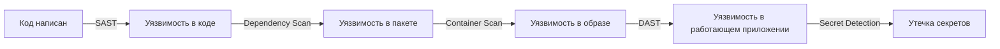
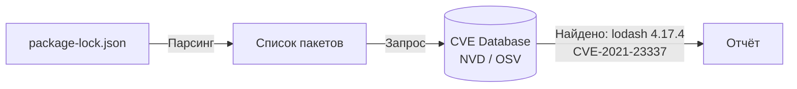
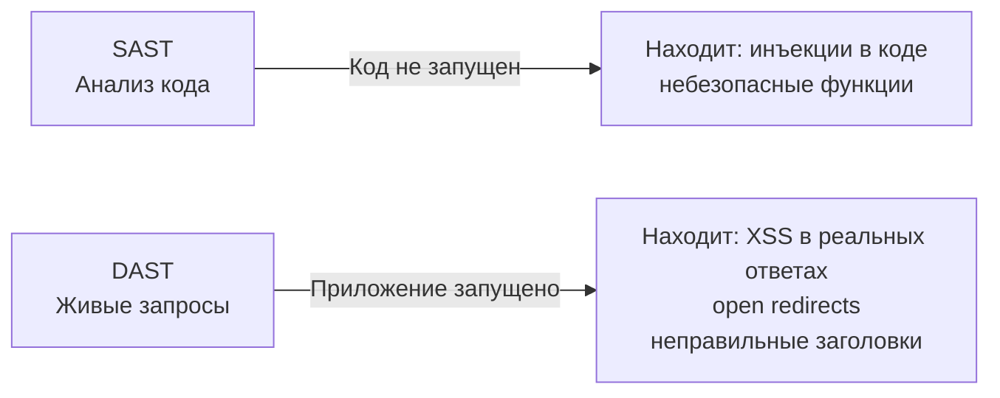
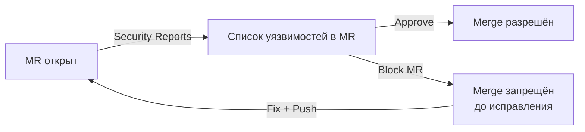

# Уровень 14: Security Scanning в CI/CD

## Зачем сканировать безопасность в пайплайне?

Представь, что ты строишь дом. Можно дождаться, пока дом готов, и тогда вызвать пожарного инспектора — он найдёт нарушения, и придётся ломать готовые стены. А можно проверять каждый этаж по мере строительства: провода уложены? Выходы свободны?

В разработке то же самое:
- **Проверка в конце** (pen-testing готового продукта) — дорого, поздно, сложно исправить
- **Проверка в пайплайне** — дёшево, быстро, разработчик видит проблему сразу в своём MR

Это называется **"сдвиг влево" (shift left)** — переносим проверку безопасности как можно раньше в цикл разработки.



Каждый инструмент находит свой класс уязвимостей. Хороший security pipeline использует все пять.

---

## SAST — Static Application Security Testing

### Что это такое

SAST анализирует **исходный код** без его выполнения. Инструмент читает код как текст, ищет опасные паттерны: SQL-инъекции, XSS, небезопасное использование криптографии, захардкоженные секреты.

Аналогия: корректор, который читает рукопись и помечает грамматические ошибки — ему не нужно читать книгу вслух, чтобы найти опечатки.

### Как SAST находит проблемы

```
Исходный код → Парсер (AST) → Граф потока данных → Правила (rules) → Отчёт
```

Пример: инструмент видит, что данные из `request.query.id` попадают в `db.query()` без санитизации — это потенциальная SQL-инъекция.

```javascript
// ❌ SAST это заметит
const id = req.query.id
db.query(`SELECT * FROM users WHERE id = ${id}`)

// ✅ SAST будет доволен
const id = req.query.id
db.query('SELECT * FROM users WHERE id = ?', [id])
```

### SAST в GitLab CI

GitLab предоставляет готовые шаблоны. Достаточно одной строки:

```yaml
include:
  - template: Security/SAST.gitlab-ci.yml

stages:
  - test
```

GitLab автоматически определит языки в репозитории и запустит подходящий анализатор:
- **semgrep** — универсальный, поддерживает 30+ языков
- **bandit** — Python
- **eslint** — JavaScript/TypeScript
- **gosec** — Go
- **sobelow** — Elixir

### Ручная настройка SAST

Если нужен полный контроль — можно настроить явно:

```yaml
stages:
  - test
  - security

sast:
  stage: security
  image: semgrep/semgrep
  script:
    - semgrep --config=auto --json --output=gl-sast-report.json .
  artifacts:
    reports:
      sast: gl-sast-report.json
    when: always
    expire_in: 1 week
  rules:
    - if: $CI_PIPELINE_SOURCE == 'merge_request_event'
    - if: $CI_COMMIT_BRANCH == $CI_DEFAULT_BRANCH
```

💡 `artifacts:reports:sast` — специальный тип артефакта. GitLab парсит его и показывает найденные уязвимости прямо в Merge Request.

### Настройка исключений

Не все находки критичны. Некоторые ложные срабатывания (false positives) нужно подавить:

```yaml
variables:
  SAST_EXCLUDED_PATHS: 'spec,test,tests,tmp,vendor'
  SAST_EXCLUDED_ANALYZERS: 'nodejs-scan'
  SEMGREP_RULES: 'p/owasp-top-ten p/javascript'
```

📌 Файл `.semgrepignore` работает как `.gitignore` — перечисляешь пути, которые не нужно сканировать.

---

## Dependency Scanning — сканирование зависимостей

### Проблема

Твой код может быть идеально чистым. Но если пакет `left-pad v1.0.0` содержит CVE-2024-12345 — твоё приложение уязвимо. По статистике, более 80% кода в современных приложениях — это зависимости, а не собственный код.

### Как это работает

Инструмент берёт `package-lock.json` (или `Gemfile.lock`, `requirements.txt`, `pom.xml`) и сравнивает каждую зависимость с базой данных уязвимостей (NVD, OSV, GitHub Advisory Database).



### Dependency Scanning в GitLab CI

```yaml
include:
  - template: Security/Dependency-Scanning.gitlab-ci.yml

# GitLab сам найдёт lock-файлы и запустит нужные анализаторы:
# gemnasium — для npm, pip, bundler, maven, gradle
# retire.js — для JavaScript
```

### Ручная настройка с trivy

```yaml
dependency-scanning:
  stage: security
  image:
    name: aquasec/trivy:latest
    entrypoint: ['']
  script:
    - trivy fs --format template
        --template "@/contrib/gitlab.tpl"
        --output gl-dependency-scanning-report.json
        --severity HIGH,CRITICAL
        .
  artifacts:
    reports:
      dependency_scanning: gl-dependency-scanning-report.json
    when: always
    expire_in: 1 week
  rules:
    - if: $CI_PIPELINE_SOURCE == 'merge_request_event'
```

### Настройка порога

Когда останавливать пайплайн? Лучше использовать фильтрацию по severity:

```yaml
variables:
  DS_MAX_SEVERITY: 'high'  # останавливать при HIGH и CRITICAL
  # low, medium, high, critical
```

📌 Важно: `DS_MAX_SEVERITY` работает только с шаблоном GitLab. При ручной настройке контролируй `--severity` флагом trivy.

---

## Container Scanning — сканирование Docker-образов

### Почему нужно отдельно

Dependency Scanning проверяет зависимости твоего кода. Но Docker-образ содержит операционную систему — Ubuntu, Alpine, Debian — у неё тоже есть уязвимости. Устаревший пакет `openssl` в базовом образе может быть опаснее любой JavaScript-зависимости.

```
┌─────────────────────────────┐
│  Твой код (5%)              │  ← SAST
│  Зависимости npm (30%)      │  ← Dependency Scan
│  OS пакеты (65%)            │  ← Container Scan
│  Ubuntu/Alpine/Debian       │
└─────────────────────────────┘
```

### Container Scanning в GitLab CI

Требует, чтобы образ уже был собран и запушен в Registry:

```yaml
stages:
  - build
  - security

build-image:
  stage: build
  script:
    - docker build -t $CI_REGISTRY_IMAGE:$CI_COMMIT_SHA .
    - docker push $CI_REGISTRY_IMAGE:$CI_COMMIT_SHA

include:
  - template: Security/Container-Scanning.gitlab-ci.yml

variables:
  CS_IMAGE: $CI_REGISTRY_IMAGE:$CI_COMMIT_SHA
```

### Ручная настройка с trivy

```yaml
container-scanning:
  stage: security
  image:
    name: aquasec/trivy:latest
    entrypoint: ['']
  variables:
    DOCKER_HOST: tcp://docker:2376
    DOCKER_TLS_VERIFY: '1'
  services:
    - docker:dind
  script:
    - trivy image
        --format template
        --template "@/contrib/gitlab.tpl"
        --output gl-container-scanning-report.json
        --severity HIGH,CRITICAL
        --ignore-unfixed
        $CI_REGISTRY_IMAGE:$CI_COMMIT_SHA
  artifacts:
    reports:
      container_scanning: gl-container-scanning-report.json
    when: always
```

💡 Флаг `--ignore-unfixed` — пропускает уязвимости, для которых ещё нет патча. Без него отчёт будет переполнен шумом.

### Уменьшение attack surface

Лучший способ снизить количество уязвимостей — использовать минималистичные базовые образы:

```dockerfile
# ❌ Много пакетов — много уязвимостей
FROM ubuntu:22.04

# ✅ Alpine минимален, ~5MB
FROM node:18-alpine

# ✅ Distroless — только runtime, никаких shell и лишних пакетов
FROM gcr.io/distroless/nodejs18-debian12
```

---

## Secret Detection — поиск утечек секретов

### Проблема

Разработчик случайно закоммитил API-ключ. В git history он остаётся навсегда, даже если был удалён в следующем коммите. Злоумышленник может найти его через GitHub search или просматривая историю.

По данным GitGuardian, в 2023 году было обнаружено более 10 миллионов утечек секретов в публичных репозиториях.

### Что ищет Secret Detection

- API-ключи: AWS, GCP, Stripe, Twilio
- Токены: GitHub, GitLab, JWT
- Приватные ключи: RSA, SSH, PGP
- Пароли в конфигах: database URLs с паролями
- Сертификаты

```yaml
# ❌ Это немедленно найдёт Secret Detection
AWS_SECRET_KEY = "wJalrXUtnFEMI/K7MDENG/bPxRfiCYEXAMPLEKEY"
STRIPE_API_KEY = "sk_live_1234567890abcdef"

# ✅ Правильно — переменная окружения из CI/CD Settings
AWS_SECRET_KEY = os.environ['AWS_SECRET_KEY']
```

### Secret Detection в GitLab CI

```yaml
include:
  - template: Security/Secret-Detection.gitlab-ci.yml
```

### Ручная настройка с gitleaks

```yaml
secret-detection:
  stage: security
  image: zricethezav/gitleaks:latest
  script:
    - gitleaks detect
        --source .
        --report-format sarif
        --report-path gl-secret-detection-report.json
        --log-level warn
  artifacts:
    reports:
      secret_detection: gl-secret-detection-report.json
    when: always
  allow_failure: false  # утечка секрета — блокирующий сбой
```

### Конфигурация gitleaks

Файл `.gitleaks.toml` для настройки правил:

```toml
[allowlist]
  description = "Global Allowlist"
  paths = [
    '''tests/fixtures/.*''',   # тестовые фикстуры с fake-ключами
    '''\.env\.example$'''       # шаблон .env — там заглушки
  ]

[[rules]]
  description = "Internal API Key"
  id = "internal-api-key"
  regex = '''internal_key_[a-f0-9]{32}'''
  secretGroup = 1
```

---

## DAST — Dynamic Application Security Testing

### Отличие от SAST

SAST анализирует код в покое. DAST атакует работающее приложение, имитируя злоумышленника. Он находит уязвимости, которые появляются только в runtime: неправильные HTTP-заголовки, открытые endpoint-ы, проблемы аутентификации.



### DAST в GitLab CI

Требует запущенного приложения — часто используется с Review Apps:

```yaml
include:
  - template: Security/DAST.gitlab-ci.yml

variables:
  DAST_WEBSITE: https://staging.example.com
  DAST_FULL_SCAN_ENABLED: 'false'  # passive scan, не active attack
  DAST_PATHS: '/api/v1,/login,/register'
```

### Ручная настройка с OWASP ZAP

```yaml
dast:
  stage: dast
  image: owasp/zap2docker-stable:latest
  variables:
    TARGET_URL: 'http://review-app:8080'
  services:
    - name: $CI_REGISTRY_IMAGE:$CI_COMMIT_SHA
      alias: review-app
  script:
    - mkdir -p /zap/wrk
    - zap-baseline.py
        -t $TARGET_URL
        -r zap-report.html
        -J gl-dast-report.json
        -I  # не падать при предупреждениях
  artifacts:
    reports:
      dast: gl-dast-report.json
    paths:
      - zap-report.html
    when: always
    expire_in: 1 week
  allow_failure: true  # DAST часто нестабилен в CI
```

💡 `zap-baseline.py` — пассивное сканирование, не атакует приложение. `zap-full-scan.py` — активное, может затронуть данные. В CI обычно используют baseline.

---

## Полный Security Pipeline

Так выглядит production-ready security pipeline:

```yaml
stages:
  - build
  - test
  - security
  - deploy

include:
  - template: Security/SAST.gitlab-ci.yml
  - template: Security/Dependency-Scanning.gitlab-ci.yml
  - template: Security/Container-Scanning.gitlab-ci.yml
  - template: Security/Secret-Detection.gitlab-ci.yml
  - template: Security/DAST.gitlab-ci.yml

# Переменные для всех security-джобов
variables:
  SAST_EXCLUDED_PATHS: 'spec,test,tests,tmp'
  DS_MAX_SEVERITY: 'high'
  CS_IMAGE: $CI_REGISTRY_IMAGE:$CI_COMMIT_SHA
  DAST_WEBSITE: $REVIEW_APP_URL

# SAST, Dependency Scan, Secret Detection — запускаем всегда
# Container Scan — только когда образ собран
container-scanning:
  needs:
    - build-image

# DAST — только в MR с review apps
dast:
  rules:
    - if: $CI_PIPELINE_SOURCE == 'merge_request_event'
      when: on_success
    - when: never
```

### Управление результатами в GitLab

GitLab Security Dashboard показывает все найденные уязвимости:



Настройка порога для блокировки MR — через **Project Settings → Security & Compliance → Merge Request Approvals**.

---

## Разница между инструментами

| Инструмент | Что анализирует | Когда запускать | Скорость |
|---|---|---|---|
| **SAST** | Исходный код | Каждый MR | Быстро (1-5 мин) |
| **Secret Detection** | Git история + изменения | Каждый коммит | Очень быстро |
| **Dependency Scanning** | lock-файлы | Каждый MR | Быстро (2-5 мин) |
| **Container Scanning** | Docker-образ | После build | Средне (3-10 мин) |
| **DAST** | Работающее приложение | MR с review app | Медленно (10-30 мин) |

---

## Частые ошибки новичков

⚠️ **Ошибка 1: Запускать все инструменты синхронно в одну stage**

```yaml
# ❌ Все security-джобы в одной stage — но DAST ждёт deploy, остальные нет
stages:
  - security

sast:
  stage: security

dast:
  stage: security  # не может запуститься — приложение ещё не задеплоено!
```

```yaml
# ✅ Разные инструменты в разных stage
stages:
  - build
  - security-static   # SAST, Dependency, Secret — не нужен запущенный сервис
  - deploy
  - security-dynamic  # DAST — нужен запущенный сервис
```

⚠️ **Ошибка 2: allow_failure: false для всех security-джобов**

```yaml
# ❌ DAST часто нестабилен — ложные срабатывания заблокируют все MR
dast:
  allow_failure: false  # команда будет игнорировать security-пайплайн
```

```yaml
# ✅ Разный подход для разных инструментов
secret-detection:
  allow_failure: false  # утечка секрета — всегда блокирует

sast:
  allow_failure: true   # начинаем мягко, со временем ужесточаем

dast:
  allow_failure: true   # DAST нестабилен — предупреждение, не блокировка
```

⚠️ **Ошибка 3: Игнорировать результаты сканирования**

```yaml
# ❌ Запускаем сканирование, но никто не смотрит на результаты
sast:
  allow_failure: true
  # artifacts настроены, но GitLab Security Dashboard не настроен
  # никто не назначен ответственным за уязвимости
```

```yaml
# ✅ Настрой Security Dashboard + назначь Security Champion в команде
# В GitLab: Security → Vulnerability Report
# Настрой: Project → Settings → Security → Security Approvals
```

⚠️ **Ошибка 4: Сканировать vendor и test директории**

```yaml
# ❌ Тысячи ложных срабатываний в vendor/
sast:
  # нет переменных исключений — сканирует весь репозиторий
```

```yaml
# ✅ Исключай то, что не твой код
variables:
  SAST_EXCLUDED_PATHS: 'vendor,node_modules,test,spec,fixtures,__mocks__'
```

---

## Итог

- **SAST** — анализирует твой код статически. Быстрый, запускай на каждый MR.
- **Dependency Scanning** — проверяет уязвимости в npm/pip/maven пакетах. Обязателен.
- **Container Scanning** — ищет CVE в OS-пакетах Docker-образа. Запускай после build.
- **Secret Detection** — ловит утечки API-ключей и паролей в коде. `allow_failure: false`.
- **DAST** — атакует живое приложение. Медленный, нестабильный, но находит runtime-уязвимости.
- GitLab шаблоны (`include: template:`) — простейший способ запустить security scanning одной строкой.
- Постепенное внедрение: сначала `allow_failure: true`, потом ужесточай по мере снижения шума.
