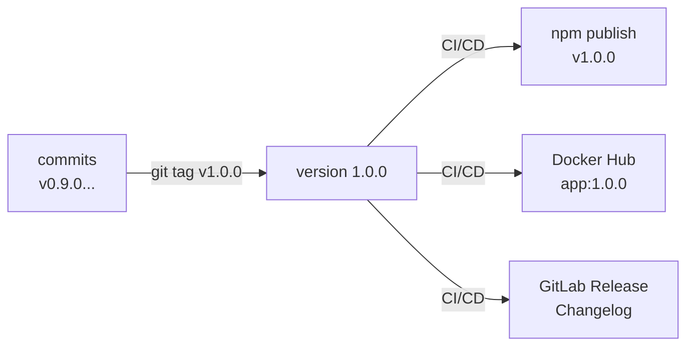
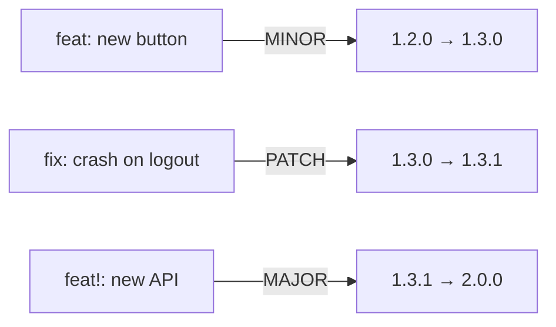
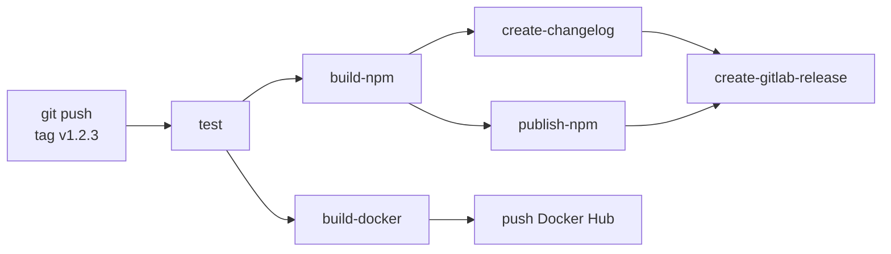
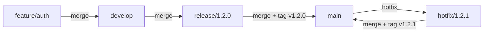

# Level 15: Releases and Versioning

## The Problem: How to Know What Exactly Is Deployed to Production?

Imagine you work in a team of 10 developers. Changes go to production every day. A month later, a client reports a bug. You open the server and see... what exactly is running there? `app:latest`? Commit `a3f7b2c`? When was it deployed and what was included?

**Versioning** is the answer to "what exactly and when." Without it, you can't:
- Roll back to a specific working state
- Tell the client in which version their bug is fixed
- Understand what changes went to production in the last 2 weeks



---

## Semantic Versioning — A Unified Version Language

Semantic Versioning (semver) — a standard where the version `MAJOR.MINOR.PATCH` carries meaning:

| Component | When It Increments | Example |
|---|---|---|
| **MAJOR** | Breaking changes | `1.x.x → 2.0.0` |
| **MINOR** | New functionality (backward compatible) | `1.2.x → 1.3.0` |
| **PATCH** | Bug fixes | `1.2.3 → 1.2.4` |

💡 Analogy: iOS version. `17.0` — new OS (MAJOR). `17.1` — new emojis (MINOR). `17.1.1` — crash fix (PATCH).

### Pre-release Suffixes

```
1.0.0-alpha.1     # early alpha
1.0.0-beta.3      # beta testing
1.0.0-rc.1        # release candidate
1.0.0             # stable release
```

📌 `0.x.x` means the API is unstable — any minor version may contain breaking changes. When the project is ready for production — it moves to `1.0.0`.

---

## Git Tags — Labels on Commits

A git tag is a named reference to a specific commit. Unlike a branch, a tag doesn't move — it permanently points to one commit.

```bash
# Create an annotated tag (recommended for releases)
git tag -a v1.2.3 -m "Release version 1.2.3"

# Create a lightweight tag (just a label)
git tag v1.2.3

# Push the tag to remote
git push origin v1.2.3

# Push all tags
git push origin --tags

# List all tags
git tag -l "v*"

# Show a tag
git show v1.2.3
```

### Annotated vs Lightweight Tags

```bash
# Annotated: contains author, date, message — a full git object
git tag -a v1.0.0 -m "Release 1.0.0: added OAuth"

# Lightweight: just a pointer to a commit
git tag v1.0.0
```

✅ For releases, always use annotated tags — they store metadata and appear as full objects.

---

## GitLab CI: Tag Trigger

The most important pattern: the release pipeline runs **only when a tag appears**.

```yaml
# Job runs only for tags like v1.2.3
release:
  only:
    - /^v\d+\.\d+\.\d+$/
  script:
    - echo "Releasing version $CI_COMMIT_TAG"
```

### Modern Syntax with rules

```yaml
release:
  rules:
    - if: '$CI_COMMIT_TAG =~ /^v\d+\.\d+\.\d+$/'
  script:
    - echo "Tag: $CI_COMMIT_TAG"
```

📌 `CI_COMMIT_TAG` — a predefined GitLab variable containing the tag name (e.g., `v1.2.3`). Only available in jobs triggered by a tag.

### Full Environment Variable for Version

```yaml
variables:
  VERSION: '$CI_COMMIT_TAG'

release:
  rules:
    - if: '$CI_COMMIT_TAG =~ /^v\d+\.\d+\.\d+$/'
  script:
    # Strip "v" prefix for npm/Docker
    - export VERSION=${CI_COMMIT_TAG#v}   # v1.2.3 → 1.2.3
    - echo "Publishing version $VERSION"
    - npm version $VERSION --no-git-tag-version
    - npm publish
```

---

## Automatic Version Detection: semantic-release

Manual tag management is error-prone. `semantic-release` analyzes commits and decides what version to release.

### Conventional Commits — The Basis for Automation

For tools to automatically determine version type, commits must follow a format:

```
<type>(<scope>): <description>

feat: add Google authorization                    # → MINOR (new feature)
fix: fix memory leak in worker                    # → PATCH (fix)
feat!: rewrite authentication API                 # → MAJOR (breaking change)
docs: update README                               # → no release
chore: update dependencies                        # → no release
```



### semantic-release in GitLab CI

```yaml
stages:
  - test
  - release

semantic-release:
  stage: release
  image: node:20
  rules:
    - if: '$CI_COMMIT_BRANCH == "main"'
  variables:
    GITLAB_TOKEN: '$GITLAB_TOKEN'
    NPM_TOKEN: '$NPM_TOKEN'
  script:
    - npx semantic-release
```

📌 `semantic-release` automatically creates a tag, generates changelog, and publishes the release. Developers only need to write proper commits.

---

## GitLab Releases — The Release Showcase

GitLab Release — a page in GitLab with version description, changelog, and artifact links. It's not just a tag — it's documentation for the team and users.

```yaml
stages:
  - build
  - release

create-release:
  stage: release
  image: registry.gitlab.com/gitlab-org/release-cli:latest
  rules:
    - if: '$CI_COMMIT_TAG =~ /^v\d+\.\d+\.\d+$/'
  script:
    - echo "Creating release $CI_COMMIT_TAG"
  release:
    tag_name: '$CI_COMMIT_TAG'
    name: 'Release $CI_COMMIT_TAG'
    description: './CHANGELOG.md'
    assets:
      links:
        - name: 'Docker Image'
          url: 'https://hub.docker.com/r/myapp/backend/tags/$CI_COMMIT_TAG'
```

### release-cli Syntax

`release-cli` — GitLab's official tool for creating releases from CI. Automatically installed when using the `registry.gitlab.com/gitlab-org/release-cli:latest` image.

```yaml
release:
  tag_name: '$CI_COMMIT_TAG'           # tag the release is tied to
  name: 'Release $CI_COMMIT_TAG'       # display name
  description: 'Automatic release'     # or file path: './CHANGELOG.md'
  milestones:                          # link to milestone
    - '$CI_COMMIT_TAG'
  released_at: '2024-01-15T10:00:00Z'  # date (optional)
  assets:
    links:
      - name: 'Linux Binary'
        url: 'https://example.com/binary-linux'
        link_type: 'package'           # other, runbook, image, package
```

---

## Automatic Changelog

A changelog — the `CHANGELOG.md` file describing what changed in each version. Manual maintenance is painful, automation is the way.

### git-cliff: Changelog Generator

```yaml
generate-changelog:
  stage: release
  image: orhunp/git-cliff:latest
  rules:
    - if: '$CI_COMMIT_TAG =~ /^v\d+\.\d+\.\d+$/'
  script:
    - git-cliff --latest -o CHANGELOG.md
  artifacts:
    paths:
      - CHANGELOG.md
    expire_in: never
```

### conventional-changelog-cli

```yaml
generate-changelog:
  stage: release
  image: node:20
  script:
    - npx conventional-changelog-cli -p angular -i CHANGELOG.md -s
  artifacts:
    paths:
      - CHANGELOG.md
```

### Proper CHANGELOG Format

```markdown
## [1.3.0] - 2024-01-15

### Features
- add Google authorization (#123)
- implement PDF export (#145)

### Bug Fixes
- fix crash on logout (#167)
- correctly handle 429 errors (#170)

### Breaking Changes
- removed `getUserById()`, use `getUser({ id })` (#155)
```

---

## Complete Release Pipeline

Let's put it all together: from a tagged commit to npm package publication, Docker image, and GitLab Release.

```yaml
stages:
  - test
  - build
  - release

variables:
  DOCKER_IMAGE: '$CI_REGISTRY_IMAGE'
  VERSION: '$CI_COMMIT_TAG'

# ==================== TEST ====================

test:
  stage: test
  image: node:20
  rules:
    - if: '$CI_COMMIT_BRANCH'
    - if: '$CI_COMMIT_TAG =~ /^v\d+\.\d+\.\d+$/'
  script:
    - npm ci
    - npm test

# ==================== BUILD ====================

build-npm:
  stage: build
  image: node:20
  rules:
    - if: '$CI_COMMIT_TAG =~ /^v\d+\.\d+\.\d+$/'
  script:
    - export PKG_VERSION=${CI_COMMIT_TAG#v}
    - npm ci
    - npm version $PKG_VERSION --no-git-tag-version
    - npm run build
  artifacts:
    paths:
      - dist/
    expire_in: never

build-docker:
  stage: build
  image: docker:24
  services:
    - docker:24-dind
  rules:
    - if: '$CI_COMMIT_TAG =~ /^v\d+\.\d+\.\d+$/'
  script:
    - docker login -u $CI_REGISTRY_USER -p $CI_REGISTRY_PASSWORD $CI_REGISTRY
    - docker build -t $DOCKER_IMAGE:$CI_COMMIT_TAG .
    - docker build -t $DOCKER_IMAGE:latest .
    - docker push $DOCKER_IMAGE:$CI_COMMIT_TAG
    - docker push $DOCKER_IMAGE:latest

# ==================== RELEASE ====================

publish-npm:
  stage: release
  image: node:20
  rules:
    - if: '$CI_COMMIT_TAG =~ /^v\d+\.\d+\.\d+$/'
  dependencies:
    - build-npm
  script:
    - echo "//registry.npmjs.org/:_authToken=$NPM_TOKEN" > ~/.npmrc
    - npm publish dist/

create-changelog:
  stage: release
  image: node:20
  rules:
    - if: '$CI_COMMIT_TAG =~ /^v\d+\.\d+\.\d+$/'
  script:
    - npx conventional-changelog-cli -p angular -i CHANGELOG.md -s -r 1
  artifacts:
    paths:
      - CHANGELOG.md
    expire_in: never

create-gitlab-release:
  stage: release
  image: registry.gitlab.com/gitlab-org/release-cli:latest
  rules:
    - if: '$CI_COMMIT_TAG =~ /^v\d+\.\d+\.\d+$/'
  dependencies:
    - create-changelog
  script:
    - echo "Creating GitLab release $CI_COMMIT_TAG"
  release:
    tag_name: '$CI_COMMIT_TAG'
    name: 'Release $CI_COMMIT_TAG'
    description: './CHANGELOG.md'
    assets:
      links:
        - name: 'Docker Image'
          url: '$CI_REGISTRY_IMAGE:$CI_COMMIT_TAG'
          link_type: 'image'
        - name: 'npm Package'
          url: 'https://www.npmjs.com/package/my-package/v/$CI_COMMIT_TAG'
          link_type: 'package'
```



---

## GitHub Actions: Release Workflow

For comparison — an equivalent pipeline on GitHub Actions:

```yaml
# .github/workflows/release.yml
name: Release

on:
  push:
    tags:
      - 'v*.*.*'

jobs:
  release:
    runs-on: ubuntu-latest
    steps:
      - uses: actions/checkout@v4
        with:
          fetch-depth: 0  # needed for changelog

      - name: Setup Node
        uses: actions/setup-node@v4
        with:
          node-version: '20'
          registry-url: 'https://registry.npmjs.org'

      - name: Install and build
        run: npm ci && npm run build

      - name: Publish to npm
        run: npm publish
        env:
          NODE_AUTH_TOKEN: ${{ secrets.NPM_TOKEN }}

      - name: Create GitHub Release
        uses: softprops/action-gh-release@v2
        with:
          generate_release_notes: true  # automatic changelog from PRs
          files: dist/**
```

---

## Versioning Strategies

### GitFlow: Tags Only on main/master



### Trunk-based Development: Auto-tags from CI

```yaml
# Tag created automatically when merged to main
bump-version:
  stage: release
  rules:
    - if: '$CI_COMMIT_BRANCH == "main"'
  script:
    - LAST_TAG=$(git describe --tags --abbrev=0 2>/dev/null || echo "v0.0.0")
    - NEW_TAG=$(semver bump patch $LAST_TAG)
    - git tag -a $NEW_TAG -m "Auto release $NEW_TAG"
    - git push origin $NEW_TAG
```

---

## Environment Variables in GitLab for Releases

| Variable | Value | Example |
|---|---|---|
| `CI_COMMIT_TAG` | Tag name | `v1.2.3` |
| `CI_COMMIT_SHA` | Commit SHA | `a3f7b2c...` |
| `CI_PROJECT_NAME` | Project name | `my-app` |
| `CI_REGISTRY_IMAGE` | Docker Registry path | `registry.gitlab.com/org/my-app` |
| `CI_REGISTRY_USER` | Registry login | automatic |
| `CI_REGISTRY_PASSWORD` | Registry password | automatic |

💡 `CI_REGISTRY_USER` and `CI_REGISTRY_PASSWORD` — temporary credentials that GitLab automatically generates for each pipeline. No manual configuration needed.

---

## Common Beginner Mistakes

⚠️ **Mistake 1: Creating a tag but not pushing it**

```bash
# ❌ Tag created locally, CI can't see it
git tag v1.2.3
# ... forgot git push origin v1.2.3

# ✅ Create and push immediately
git tag -a v1.2.3 -m "Release 1.2.3"
git push origin v1.2.3
```

⚠️ **Mistake 2: Using `latest` as the only Docker tag**

```yaml
# ❌ No way to roll back to a specific version
- docker build -t myapp:latest .
- docker push myapp:latest

# ✅ Tag with both version and latest
- docker build -t myapp:$CI_COMMIT_TAG -t myapp:latest .
- docker push myapp:$CI_COMMIT_TAG
- docker push myapp:latest
```

⚠️ **Mistake 3: Not stripping "v" from tag when publishing to npm**

```yaml
# ❌ npm doesn't accept version with "v"
- npm version $CI_COMMIT_TAG  # v1.2.3 — error!

# ✅ Strip the "v" prefix
- export VERSION=${CI_COMMIT_TAG#v}  # 1.2.3
- npm version $VERSION --no-git-tag-version
```

⚠️ **Mistake 4: Release pipeline runs on every commit**

```yaml
# ❌ Publish runs on every push to main
publish:
  script:
    - npm publish

# ✅ Only on tags
publish:
  rules:
    - if: '$CI_COMMIT_TAG =~ /^v\d+\.\d+\.\d+$/'
  script:
    - npm publish
```

⚠️ **Mistake 5: Changelog generated without fetch-depth**

```yaml
# ❌ Shallow clone doesn't have commit history for changelog
git-cliff:
  script:
    - git-cliff --unreleased -o CHANGELOG.md
    # error: no tag history

# ✅ Fetch full history or sufficient depth
git-cliff:
  variables:
    GIT_DEPTH: 0  # in GitLab CI
  script:
    - git-cliff --unreleased -o CHANGELOG.md
```

---

## Summary

- **Semantic Versioning** — the `MAJOR.MINOR.PATCH` standard. MAJOR — breaking changes, MINOR — new features, PATCH — fixes.
- **Git tags** — named labels on commits. Always use annotated tags for releases.
- **CI_COMMIT_TAG** — GitLab variable, only available in tag-triggered pipelines.
- **GitLab Release** — created via `release-cli` with `changelog`, `assets`, and `milestones`.
- **Conventional Commits** — commit format that allows automatic version detection.
- **Prefix stripping** — when passing the version to npm/Docker, strip `v` from `CI_COMMIT_TAG`.
