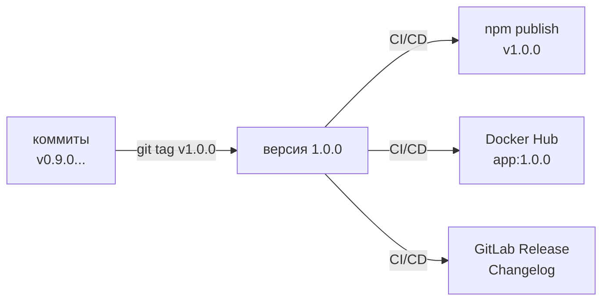
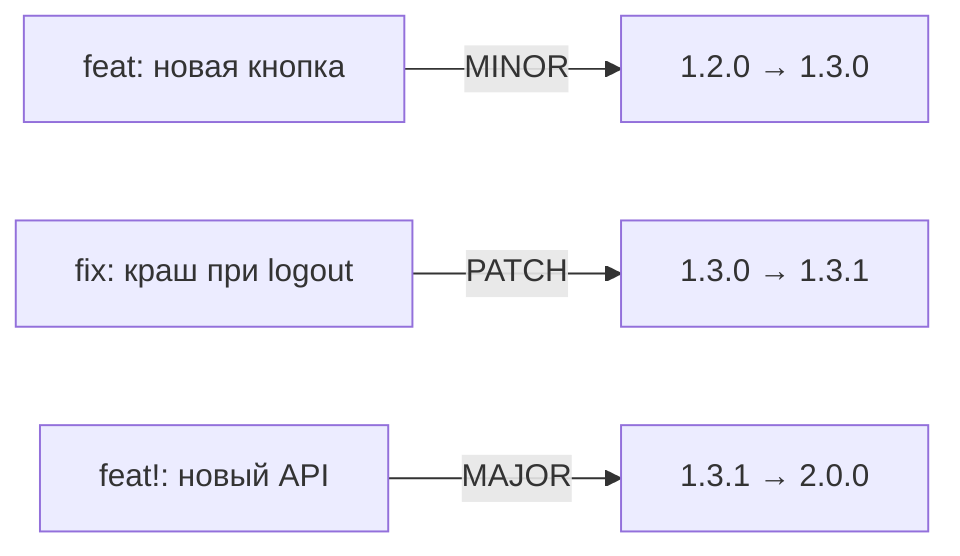
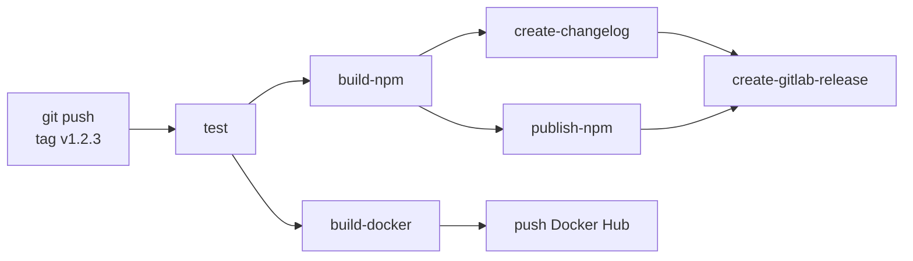
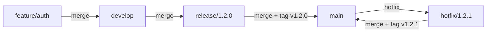

# Уровень 15: Releases и версионирование

## Проблема: как понять, что именно задеплоено в production?

Представь, что ты работаешь в команде из 10 разработчиков. Каждый день в production уходят изменения. Через месяц клиент сообщает о баге. Ты открываешь сервер и видишь... что именно там запущено? `app:latest`? Коммит `a3f7b2c`? Когда это было задеплоено и что в это входило?

**Версионирование** — это ответ на вопрос "что именно и когда". Без него невозможно:
- Откатиться к конкретному рабочему состоянию
- Сообщить клиенту, в какой версии исправлен его баг
- Понять, какие изменения вошли в production за последние 2 недели



---

## Semantic Versioning — единый язык версий

Semantic Versioning (semver) — стандарт, при котором версия `MAJOR.MINOR.PATCH` несёт смысл:

| Компонент | Когда увеличивается | Пример |
|---|---|---|
| **MAJOR** | Ломающие изменения (breaking changes) | `1.x.x → 2.0.0` |
| **MINOR** | Новая функциональность (обратно совместимая) | `1.2.x → 1.3.0` |
| **PATCH** | Исправления багов | `1.2.3 → 1.2.4` |

💡 Аналогия: версия iOS. `17.0` — новая ОС (MAJOR). `17.1` — новые эмодзи (MINOR). `17.1.1` — исправление краша (PATCH).

### Pre-release суффиксы

```
1.0.0-alpha.1     # ранняя альфа
1.0.0-beta.3      # бета-тестирование
1.0.0-rc.1        # release candidate
1.0.0             # стабильный релиз
```

📌 `0.x.x` означает, что API нестабилен — любая минорная версия может содержать breaking changes. Когда проект готов для production — он переходит на `1.0.0`.

---

## Git tags — метки на коммитах

Git tag — это именованная ссылка на конкретный коммит. В отличие от ветки, тег не движется — он навсегда указывает на один коммит.

```bash
# Создать annotated tag (рекомендуется для релизов)
git tag -a v1.2.3 -m "Release version 1.2.3"

# Создать lightweight tag (просто метка)
git tag v1.2.3

# Запушить тег в remote
git push origin v1.2.3

# Запушить все теги
git push origin --tags

# Посмотреть все теги
git tag -l "v*"

# Посмотреть тег
git show v1.2.3
```

### Annotated vs Lightweight tags

```bash
# Annotated: содержит автора, дату, сообщение — полноценный объект в git
git tag -a v1.0.0 -m "Release 1.0.0: добавлен OAuth"

# Lightweight: просто ссылка на коммит
git tag v1.0.0
```

✅ Для релизов всегда используй annotated tags — они хранят метаданные и отображаются как полноценные объекты.

---

## GitLab CI: триггер по тегу

Самый важный паттерн: release pipeline запускается **только при появлении тега**.

```yaml
# Джоб выполняется только для тегов вида v1.2.3
release:
  only:
    - /^v\d+\.\d+\.\d+$/
  script:
    - echo "Releasing version $CI_COMMIT_TAG"
```

### Современный синтаксис с rules

```yaml
release:
  rules:
    - if: '$CI_COMMIT_TAG =~ /^v\d+\.\d+\.\d+$/'
  script:
    - echo "Tag: $CI_COMMIT_TAG"
```

📌 `CI_COMMIT_TAG` — предопределённая переменная GitLab, содержащая имя тега (например, `v1.2.3`). Доступна только в джобах, запущенных по тегу.

### Полная переменная окружения для версии

```yaml
variables:
  VERSION: '$CI_COMMIT_TAG'

release:
  rules:
    - if: '$CI_COMMIT_TAG =~ /^v\d+\.\d+\.\d+$/'
  script:
    # Убрать префикс "v" для npm/Docker
    - export VERSION=${CI_COMMIT_TAG#v}   # v1.2.3 → 1.2.3
    - echo "Publishing version $VERSION"
    - npm version $VERSION --no-git-tag-version
    - npm publish
```

---

## Автоматическое определение версии: semantic-release

Ручное управление тегами — источник ошибок. `semantic-release` анализирует коммиты и сам решает, какую версию выпустить.

### Conventional Commits — основа автоматики

Чтобы инструменты могли автоматически определить тип версии, коммиты должны следовать формату:

```
<type>(<scope>): <description>

feat: добавить авторизацию через Google           # → MINOR (новая функция)
fix: исправить утечку памяти в worker             # → PATCH (исправление)
feat!: переписать API аутентификации              # → MAJOR (breaking change)
docs: обновить README                             # → нет релиза
chore: обновить зависимости                       # → нет релиза
```



### semantic-release в GitLab CI

```yaml
stages:
  - test
  - release

semantic-release:
  stage: release
  image: node:20
  rules:
    - if: '$CI_COMMIT_BRANCH == "main"'
  variables:
    GITLAB_TOKEN: '$GITLAB_TOKEN'
    NPM_TOKEN: '$NPM_TOKEN'
  script:
    - npx semantic-release
```

📌 `semantic-release` сам создаёт тег, генерирует changelog и публикует релиз. Разработчики только пишут правильные коммиты.

---

## GitLab Releases — витрина релизов

GitLab Release — страница в GitLab с описанием версии, changelog и ссылками на артефакты. Это не просто тег — это документ для команды и пользователей.

```yaml
stages:
  - build
  - release

create-release:
  stage: release
  image: registry.gitlab.com/gitlab-org/release-cli:latest
  rules:
    - if: '$CI_COMMIT_TAG =~ /^v\d+\.\d+\.\d+$/'
  script:
    - echo "Creating release $CI_COMMIT_TAG"
  release:
    tag_name: '$CI_COMMIT_TAG'
    name: 'Release $CI_COMMIT_TAG'
    description: './CHANGELOG.md'
    assets:
      links:
        - name: 'Docker Image'
          url: 'https://hub.docker.com/r/myapp/backend/tags/$CI_COMMIT_TAG'
```

### release-cli синтаксис

`release-cli` — официальный инструмент GitLab для создания релизов из CI. Устанавливается автоматически при использовании образа `registry.gitlab.com/gitlab-org/release-cli:latest`.

```yaml
release:
  tag_name: '$CI_COMMIT_TAG'           # тег, к которому привязан релиз
  name: 'Release $CI_COMMIT_TAG'       # отображаемое имя
  description: 'Автоматический релиз'  # или путь к файлу: './CHANGELOG.md'
  milestones:                          # связать с milestone
    - '$CI_COMMIT_TAG'
  released_at: '2024-01-15T10:00:00Z' # дата (опционально)
  assets:
    links:
      - name: 'Бинарник для Linux'
        url: 'https://example.com/binary-linux'
        link_type: 'package'           # other, runbook, image, package
```

---

## Автоматический Changelog

Changelog — файл `CHANGELOG.md`, в котором описано, что изменилось в каждой версии. Ручное ведение — боль, автоматическое — практика.

### git-cliff: генератор changelog

```yaml
generate-changelog:
  stage: release
  image: orhunp/git-cliff:latest
  rules:
    - if: '$CI_COMMIT_TAG =~ /^v\d+\.\d+\.\d+$/'
  script:
    - git-cliff --latest -o CHANGELOG.md
  artifacts:
    paths:
      - CHANGELOG.md
    expire_in: never
```

### conventional-changelog-cli

```yaml
generate-changelog:
  stage: release
  image: node:20
  script:
    - npx conventional-changelog-cli -p angular -i CHANGELOG.md -s
  artifacts:
    paths:
      - CHANGELOG.md
```

### Формат правильного CHANGELOG

```markdown
## [1.3.0] - 2024-01-15

### Features
- добавить авторизацию через Google (#123)
- реализовать экспорт в PDF (#145)

### Bug Fixes
- исправить краш при logout (#167)
- корректно обрабатывать 429 ошибки (#170)

### Breaking Changes
- удалён метод `getUserById()`, используй `getUser({ id })` (#155)
```

---

## Полный Release Pipeline

Соберём всё вместе: от коммита с тегом до публикации npm-пакета, Docker-образа и GitLab Release.

```yaml
stages:
  - test
  - build
  - release

variables:
  DOCKER_IMAGE: '$CI_REGISTRY_IMAGE'
  VERSION: '$CI_COMMIT_TAG'

# ==================== TEST ====================

test:
  stage: test
  image: node:20
  rules:
    - if: '$CI_COMMIT_BRANCH'
    - if: '$CI_COMMIT_TAG =~ /^v\d+\.\d+\.\d+$/'
  script:
    - npm ci
    - npm test

# ==================== BUILD ====================

build-npm:
  stage: build
  image: node:20
  rules:
    - if: '$CI_COMMIT_TAG =~ /^v\d+\.\d+\.\d+$/'
  script:
    - export PKG_VERSION=${CI_COMMIT_TAG#v}
    - npm ci
    - npm version $PKG_VERSION --no-git-tag-version
    - npm run build
  artifacts:
    paths:
      - dist/
    expire_in: never

build-docker:
  stage: build
  image: docker:24
  services:
    - docker:24-dind
  rules:
    - if: '$CI_COMMIT_TAG =~ /^v\d+\.\d+\.\d+$/'
  script:
    - docker login -u $CI_REGISTRY_USER -p $CI_REGISTRY_PASSWORD $CI_REGISTRY
    - docker build -t $DOCKER_IMAGE:$CI_COMMIT_TAG .
    - docker build -t $DOCKER_IMAGE:latest .
    - docker push $DOCKER_IMAGE:$CI_COMMIT_TAG
    - docker push $DOCKER_IMAGE:latest

# ==================== RELEASE ====================

publish-npm:
  stage: release
  image: node:20
  rules:
    - if: '$CI_COMMIT_TAG =~ /^v\d+\.\d+\.\d+$/'
  dependencies:
    - build-npm
  script:
    - echo "//registry.npmjs.org/:_authToken=$NPM_TOKEN" > ~/.npmrc
    - npm publish dist/

create-changelog:
  stage: release
  image: node:20
  rules:
    - if: '$CI_COMMIT_TAG =~ /^v\d+\.\d+\.\d+$/'
  script:
    - npx conventional-changelog-cli -p angular -i CHANGELOG.md -s -r 1
  artifacts:
    paths:
      - CHANGELOG.md
    expire_in: never

create-gitlab-release:
  stage: release
  image: registry.gitlab.com/gitlab-org/release-cli:latest
  rules:
    - if: '$CI_COMMIT_TAG =~ /^v\d+\.\d+\.\d+$/'
  dependencies:
    - create-changelog
  script:
    - echo "Creating GitLab release $CI_COMMIT_TAG"
  release:
    tag_name: '$CI_COMMIT_TAG'
    name: 'Release $CI_COMMIT_TAG'
    description: './CHANGELOG.md'
    assets:
      links:
        - name: 'Docker Image'
          url: '$CI_REGISTRY_IMAGE:$CI_COMMIT_TAG'
          link_type: 'image'
        - name: 'npm Package'
          url: 'https://www.npmjs.com/package/my-package/v/$CI_COMMIT_TAG'
          link_type: 'package'
```



---

## GitHub Actions: release workflow

Для сравнения — аналогичный пайплайн на GitHub Actions:

```yaml
# .github/workflows/release.yml
name: Release

on:
  push:
    tags:
      - 'v*.*.*'

jobs:
  release:
    runs-on: ubuntu-latest
    steps:
      - uses: actions/checkout@v4
        with:
          fetch-depth: 0  # нужно для changelog

      - name: Setup Node
        uses: actions/setup-node@v4
        with:
          node-version: '20'
          registry-url: 'https://registry.npmjs.org'

      - name: Install and build
        run: npm ci && npm run build

      - name: Publish to npm
        run: npm publish
        env:
          NODE_AUTH_TOKEN: ${{ secrets.NPM_TOKEN }}

      - name: Create GitHub Release
        uses: softprops/action-gh-release@v2
        with:
          generate_release_notes: true  # автоматический changelog из PR
          files: dist/**
```

---

## Стратегии версионирования

### GitFlow: теги только на main/master



### Trunk-based development: автотеги от CI

```yaml
# Тег создаётся автоматически при мерже в main
bump-version:
  stage: release
  rules:
    - if: '$CI_COMMIT_BRANCH == "main"'
  script:
    - LAST_TAG=$(git describe --tags --abbrev=0 2>/dev/null || echo "v0.0.0")
    - NEW_TAG=$(semver bump patch $LAST_TAG)
    - git tag -a $NEW_TAG -m "Auto release $NEW_TAG"
    - git push origin $NEW_TAG
```

---

## Переменные окружения в GitLab для релизов

| Переменная | Значение | Пример |
|---|---|---|
| `CI_COMMIT_TAG` | Имя тега | `v1.2.3` |
| `CI_COMMIT_SHA` | SHA коммита | `a3f7b2c...` |
| `CI_PROJECT_NAME` | Имя проекта | `my-app` |
| `CI_REGISTRY_IMAGE` | Путь к Docker Registry | `registry.gitlab.com/org/my-app` |
| `CI_REGISTRY_USER` | Логин для registry | автоматически |
| `CI_REGISTRY_PASSWORD` | Пароль для registry | автоматически |

💡 `CI_REGISTRY_USER` и `CI_REGISTRY_PASSWORD` — это временные credentials, которые GitLab генерирует автоматически для каждого пайплайна. Не нужно настраивать вручную.

---

## Частые ошибки новичков

⚠️ **Ошибка 1: Тег создать, но не запушить**

```bash
# ❌ Тег создан локально, CI его не видит
git tag v1.2.3
# ... забыли git push origin v1.2.3

# ✅ Создать и сразу запушить
git tag -a v1.2.3 -m "Release 1.2.3"
git push origin v1.2.3
```

⚠️ **Ошибка 2: Использовать `latest` как единственный тег Docker**

```yaml
# ❌ Нет возможности откатиться к конкретной версии
- docker build -t myapp:latest .
- docker push myapp:latest

# ✅ Тегировать и версионным тегом, и latest
- docker build -t myapp:$CI_COMMIT_TAG -t myapp:latest .
- docker push myapp:$CI_COMMIT_TAG
- docker push myapp:latest
```

⚠️ **Ошибка 3: Не убирать "v" из тега при публикации npm**

```yaml
# ❌ npm не принимает версию с буквой "v"
- npm version $CI_COMMIT_TAG  # v1.2.3 — ошибка!

# ✅ Убрать префикс "v"
- export VERSION=${CI_COMMIT_TAG#v}  # 1.2.3
- npm version $VERSION --no-git-tag-version
```

⚠️ **Ошибка 4: Release pipeline запускается на каждый коммит**

```yaml
# ❌ Publish запускается при каждом пуше в main
publish:
  script:
    - npm publish

# ✅ Только при тегах
publish:
  rules:
    - if: '$CI_COMMIT_TAG =~ /^v\d+\.\d+\.\d+$/'
  script:
    - npm publish
```

⚠️ **Ошибка 5: Changelog генерируется без fetch-depth**

```yaml
# ❌ shallow clone не имеет истории коммитов для changelog
git-cliff:
  script:
    - git-cliff --unreleased -o CHANGELOG.md
    # ошибка: нет истории тегов

# ✅ Получить полную историю или достаточную глубину
git-cliff:
  variables:
    GIT_DEPTH: 0  # в GitLab CI
  script:
    - git-cliff --unreleased -o CHANGELOG.md
```

---

## Итог

- **Semantic Versioning** — стандарт `MAJOR.MINOR.PATCH`. MAJOR — breaking changes, MINOR — новые функции, PATCH — исправления.
- **Git tags** — именованные метки на коммитах. Для релизов всегда используй annotated tags.
- **CI_COMMIT_TAG** — переменная GitLab, доступная только в тег-триггеред пайплайнах.
- **GitLab Release** — создаётся через `release-cli` с `changelog`, `assets` и `milestones`.
- **Conventional Commits** — формат коммитов, позволяющий автоматически определять тип версии.
- **Prefix stripping** — при передаче версии в npm/Docker убирай `v` из `CI_COMMIT_TAG`.
