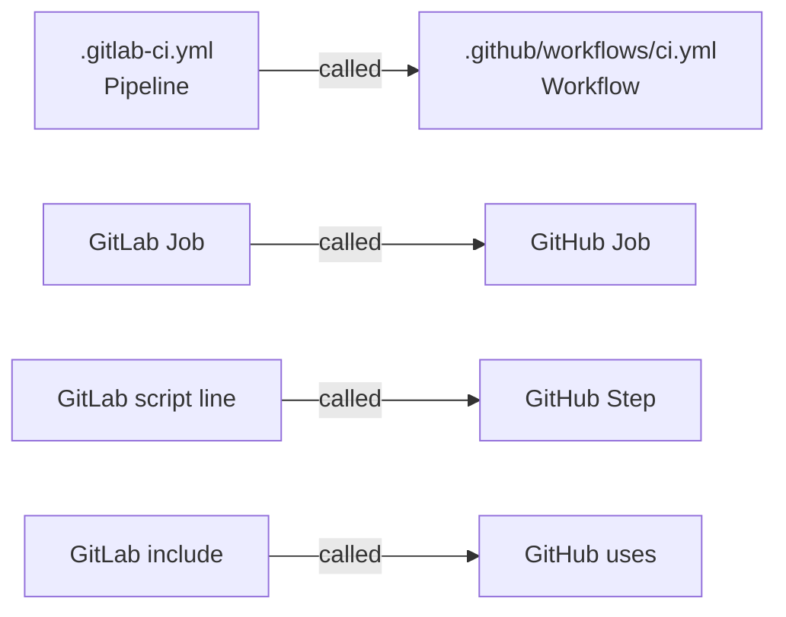
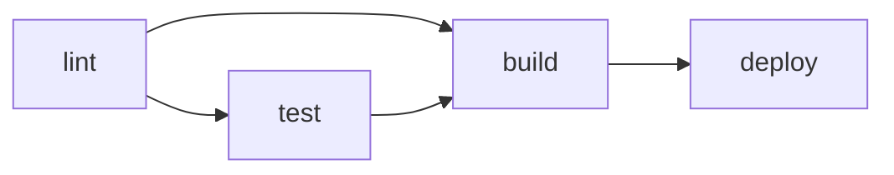
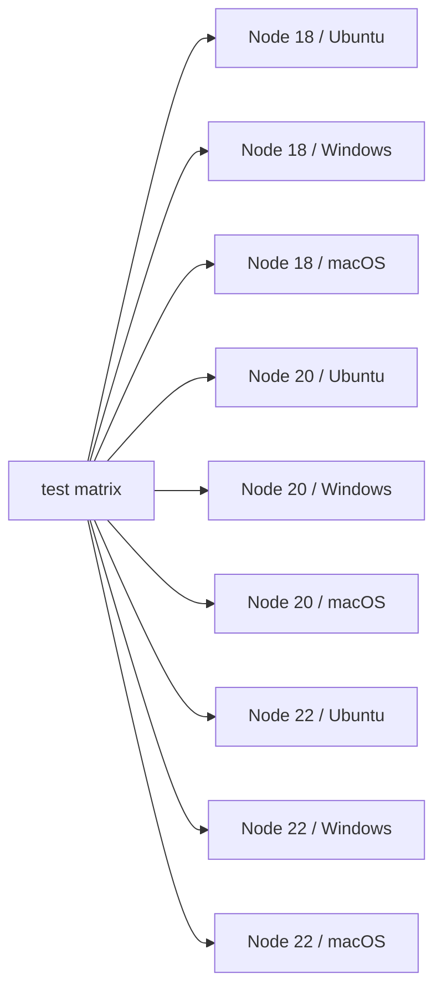
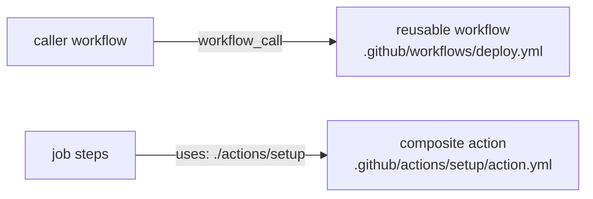

# Level 16: GitHub Actions

## GitHub Actions — CI/CD Built into GitHub

You've completed 15 levels on GitLab CI. Now let's look at GitHub Actions — a competing system used by millions of open-source and commercial projects.

Good news: **the concepts are the same, the terminology is slightly different**. It's like moving to another city: the streets have different names, but you still know how to drive.

---

## Concept Mapping: GitLab CI → GitHub Actions

Before learning the syntax, let's establish the correspondence between concepts:

| GitLab CI | GitHub Actions | Description |
|---|---|---|
| Pipeline | Workflow | The entire CI/CD process |
| Job | Job | Unit of execution |
| Stage | (no direct equivalent) | Job grouping |
| Script line | Step | Step inside a job |
| `.gitlab-ci.yml` | `.github/workflows/*.yml` | Configuration file |
| Runner | Runner | Execution machine |
| GitLab CI variables | Secrets / env vars | Environment variables |
| `include:` | `uses:` (reusable workflow) | Reuse |
| `extends:` | `uses:` (composite action) | Inheritance |
| Docker image | `runs-on` + `container:` | Execution environment |
| `artifacts:` | `actions/upload-artifact` | File transfer |
| `cache:` | `actions/cache` | Caching |



---

## Workflow File Structure

In GitLab everything was described in one `.gitlab-ci.yml` file. In GitHub Actions, files are in the `.github/workflows/` directory and there can be multiple.

### Minimal Workflow

```yaml
# .github/workflows/ci.yml

name: CI                          # Workflow name (displayed in UI)

on:                               # Triggers (analog of GitLab: only/when)
  push:
    branches: [main, develop]
  pull_request:
    branches: [main]

jobs:                             # All jobs (analog of GitLab: jobs at top level)
  build:                          # Job name
    runs-on: ubuntu-latest        # Which Runner to run on

    steps:                        # Steps (analog of GitLab: script)
      - uses: actions/checkout@v4 # Download code from repository
      - name: Install deps
        run: npm ci
      - name: Build
        run: npm run build
```

📌 Key difference: in GitLab the repository code is cloned **automatically**. In GitHub Actions you need to explicitly add `uses: actions/checkout@v4` to each job that needs the code.

---

## Triggers (on:)

In GitLab triggers were set via `only:`, `except:`, `rules:`. In GitHub Actions — via the `on:` key.

```yaml
on:
  # Run on push to branch
  push:
    branches:
      - main
      - 'release/**'     # glob patterns supported
    paths:               # Run only if these files changed
      - 'src/**'
      - 'package.json'

  # Run on Pull Request open/update
  pull_request:
    branches: [main]
    types: [opened, synchronize, reopened]

  # Schedule (analog of GitLab: schedules in UI)
  schedule:
    - cron: '0 2 * * 1'  # Every Monday at 2:00 UTC

  # Manual trigger (analog of GitLab: when: manual)
  workflow_dispatch:
    inputs:
      environment:
        description: 'Target environment'
        required: true
        default: 'staging'

  # Called from another workflow
  workflow_call:
    inputs:
      version:
        type: string
        required: true
```

💡 `paths:` — a powerful feature. Monorepo? Run the frontend pipeline only when files in `frontend/` change.

---

## Jobs and Dependencies

In GitLab, jobs were grouped by `stages` and ran sequentially. In GitHub Actions, order is set via `needs:`.

```yaml
jobs:
  lint:
    runs-on: ubuntu-latest
    steps:
      - uses: actions/checkout@v4
      - run: npm run lint

  test:
    runs-on: ubuntu-latest
    needs: lint             # Run after lint
    steps:
      - uses: actions/checkout@v4
      - run: npm test

  build:
    runs-on: ubuntu-latest
    needs: [lint, test]     # Run after BOTH
    steps:
      - uses: actions/checkout@v4
      - run: npm run build

  deploy:
    runs-on: ubuntu-latest
    needs: build            # Run after build
    if: github.ref == 'refs/heads/main'   # Analog of GitLab: only: [main]
    steps:
      - uses: actions/checkout@v4
      - run: ./deploy.sh
```



📌 Without `needs:` all jobs run **in parallel**. In GitLab, without stages, jobs would also run in parallel — the analogy is complete.

---

## Steps — Steps Inside a Job

Each job consists of steps. A step is either a command (`run:`) or a ready-made action (`uses:`).

```yaml
jobs:
  example:
    runs-on: ubuntu-latest
    steps:
      # Type 1: run — just a command (analog of a line in script:)
      - name: Run tests
        run: npm test

      # Multiple commands
      - name: Build and lint
        run: |
          npm run lint
          npm run build

      # Type 2: uses — ready-made action from Marketplace
      - uses: actions/checkout@v4

      # Type 3: uses with parameters
      - uses: actions/setup-node@v4
        with:
          node-version: '20'
          cache: 'npm'

      # Conditional step execution
      - name: Deploy to prod
        if: github.ref == 'refs/heads/main'
        run: ./deploy.sh

      # Environment variables for a specific step
      - name: Run with env
        env:
          API_KEY: ${{ secrets.API_KEY }}
        run: ./publish.sh
```

---

## Actions Marketplace

This is the main advantage of GitHub Actions. Actions Marketplace is a huge library of ready-made "bricks" for the pipeline.

The analog in GitLab is `include:` with templates, but Marketplace is incomparably larger.

### Popular Actions

```yaml
steps:
  # Download repository code (almost always required)
  - uses: actions/checkout@v4

  # Install specific Node.js version
  - uses: actions/setup-node@v4
    with:
      node-version: '20'
      cache: 'npm'           # Automatically cache npm

  # Install Python
  - uses: actions/setup-python@v5
    with:
      python-version: '3.11'
      cache: 'pip'

  # Install Java
  - uses: actions/setup-java@v4
    with:
      java-version: '17'
      distribution: 'temurin'

  # Upload artifacts
  - uses: actions/upload-artifact@v4
    with:
      name: build-output
      path: dist/
      retention-days: 7

  # Download artifacts
  - uses: actions/download-artifact@v4
    with:
      name: build-output
      path: dist/

  # Caching (manual, if setup-* doesn't support it)
  - uses: actions/cache@v4
    with:
      path: ~/.m2/repository
      key: ${{ runner.os }}-maven-${{ hashFiles('**/pom.xml') }}
```

💡 The `@v4` syntax — this is a tag or commit SHA. Best practice — use exact SHA (`@abc1234`) for security, or at least major version (`@v4`).

---

## Variables and Secrets

In GitLab, variables were set in Settings → CI/CD → Variables. In GitHub: Settings → Secrets and variables.

```yaml
jobs:
  deploy:
    runs-on: ubuntu-latest
    env:
      # Environment variables at job level
      NODE_ENV: production
      APP_VERSION: ${{ github.sha }}    # Built-in GitHub variables

    steps:
      - name: Deploy
        env:
          # Secrets — only via ${{ secrets.NAME }}
          AWS_ACCESS_KEY: ${{ secrets.AWS_ACCESS_KEY }}
          AWS_SECRET_KEY: ${{ secrets.AWS_SECRET_KEY }}
          # Regular variable
          DEPLOY_ENV: staging
        run: ./deploy.sh
```

### Built-in GitHub Variables (Analog of GitLab Variables)

| GitHub | GitLab | Meaning |
|---|---|---|
| `github.sha` | `$CI_COMMIT_SHA` | Commit SHA |
| `github.ref` | `$CI_COMMIT_REF_NAME` | Branch/tag name |
| `github.actor` | `$GITLAB_USER_LOGIN` | Who triggered |
| `github.repository` | `$CI_PROJECT_PATH` | Repository path |
| `github.run_id` | `$CI_PIPELINE_ID` | Run ID |
| `runner.os` | `$CI_RUNNER_DESCRIPTION` | Runner OS |

---

## Matrix Strategy

Matrix is a way to run the same job with different parameters. In GitLab this was done via `parallel:matrix:`. In GitHub Actions the syntax is slightly different, but the idea is the same.

```yaml
jobs:
  test:
    runs-on: ubuntu-latest
    strategy:
      matrix:
        node-version: [18, 20, 22]
        os: [ubuntu-latest, windows-latest, macos-latest]
      fail-fast: false      # Don't stop all on first failure
      max-parallel: 4       # Max 4 parallel jobs

    steps:
      - uses: actions/checkout@v4
      - uses: actions/setup-node@v4
        with:
          node-version: ${{ matrix.node-version }}
      - run: npm test
```

This creates **9 jobs** (3 Node versions × 3 OSes):



### Advanced Matrix

```yaml
strategy:
  matrix:
    include:
      # Add a job with custom parameters
      - node-version: 20
        os: ubuntu-latest
        experimental: true

    exclude:
      # Exclude a specific combination
      - node-version: 18
        os: macos-latest
```

---

## Reusable Workflows and Composite Actions

In GitLab, `include:` and `extends:` were used for reuse. In GitHub Actions — two mechanisms:

1. **Reusable Workflow** — reuse an entire workflow (multiple jobs)
2. **Composite Action** — reuse a set of steps inside a job



### Reusable Workflow

```yaml
# .github/workflows/deploy-reusable.yml
on:
  workflow_call:                  # This trigger makes the workflow reusable
    inputs:
      environment:
        type: string
        required: true
    secrets:
      DEPLOY_KEY:
        required: true

jobs:
  deploy:
    runs-on: ubuntu-latest
    steps:
      - uses: actions/checkout@v4
      - name: Deploy to ${{ inputs.environment }}
        env:
          KEY: ${{ secrets.DEPLOY_KEY }}
        run: ./deploy.sh ${{ inputs.environment }}
```

```yaml
# .github/workflows/production.yml — calling workflow
jobs:
  deploy-prod:
    uses: ./.github/workflows/deploy-reusable.yml    # Local
    # uses: org/repo/.github/workflows/deploy.yml@main  # From another repository
    with:
      environment: production
    secrets:
      DEPLOY_KEY: ${{ secrets.PROD_DEPLOY_KEY }}
```

### Composite Action

```yaml
# .github/actions/setup-node-project/action.yml
name: 'Setup Node Project'
description: 'Checkout, setup Node and install dependencies'

inputs:
  node-version:
    description: 'Node.js version'
    default: '20'

runs:
  using: 'composite'             # Type: composite
  steps:
    - uses: actions/checkout@v4
    - uses: actions/setup-node@v4
      with:
        node-version: ${{ inputs.node-version }}
        cache: 'npm'
    - name: Install dependencies
      run: npm ci
      shell: bash
```

```yaml
# Using the composite action
jobs:
  build:
    runs-on: ubuntu-latest
    steps:
      - uses: ./.github/actions/setup-node-project  # Local action
        with:
          node-version: '20'
      - run: npm run build
```

---

## Environments and Approvals

In GitLab there were protected environments and manual approvals in jobs. In GitHub Actions, this is implemented through Environments.

```yaml
jobs:
  deploy-production:
    runs-on: ubuntu-latest
    environment:
      name: production           # Environment with rules in Settings
      url: https://myapp.com     # URL displayed in GitHub UI
    steps:
      - run: ./deploy-prod.sh
```

In Settings → Environments you can configure:
- Required reviewers (need approval before running)
- Wait timer (delay before deploy)
- Deployment branches (only from specific branches)

---

## Common Beginner Mistakes

⚠️ **Mistake 1: Forgetting actions/checkout**

```yaml
# ❌ Job doesn't have repository code
jobs:
  build:
    runs-on: ubuntu-latest
    steps:
      - run: npm run build    # Error: no package.json, no src/
```

```yaml
# ✅ First checkout
jobs:
  build:
    runs-on: ubuntu-latest
    steps:
      - uses: actions/checkout@v4
      - run: npm run build
```

⚠️ **Mistake 2: Passing secrets through workflow environment variables**

```yaml
# ❌ Secret is visible in logs
jobs:
  deploy:
    env:
      API_KEY: ${{ secrets.API_KEY }}
    steps:
      - run: echo "Key is $API_KEY"   # GitHub masks it, but better not risk it
```

```yaml
# ✅ Pass secret only where needed
jobs:
  deploy:
    steps:
      - name: Deploy
        env:
          API_KEY: ${{ secrets.API_KEY }}
        run: ./deploy.sh    # script reads $API_KEY
```

⚠️ **Mistake 3: Using latest tags without version pinning**

```yaml
# ❌ @main can break at any time
- uses: some-org/some-action@main
```

```yaml
# ✅ Pin version — at least major version, better SHA
- uses: actions/checkout@v4
- uses: actions/checkout@11bd71901bbe5b1630ceea73d27597364c9af683  # even better
```

⚠️ **Mistake 4: Not using fail-fast: false with matrix**

```yaml
# ❌ If Node 18 fails, Node 20 and 22 are cancelled — we lose information
strategy:
  matrix:
    node: [18, 20, 22]
```

```yaml
# ✅ All versions tested independently — we see the full picture
strategy:
  fail-fast: false
  matrix:
    node: [18, 20, 22]
```

⚠️ **Mistake 5: Duplicating identical steps instead of composite action**

```yaml
# ❌ Same block copied across 5 jobs
jobs:
  job1:
    steps:
      - uses: actions/checkout@v4
      - uses: actions/setup-node@v4
        with:
          node-version: 20
          cache: npm
      - run: npm ci
      # ... actual work
  job2:
    steps:
      - uses: actions/checkout@v4       # Duplication
      - uses: actions/setup-node@v4
        with:
          node-version: 20
          cache: npm
      - run: npm ci
      # ... other actual work
```

```yaml
# ✅ Extract to composite action
jobs:
  job1:
    steps:
      - uses: ./.github/actions/setup
      # ... actual work
  job2:
    steps:
      - uses: ./.github/actions/setup
      # ... other actual work
```

---

## Summary

GitHub Actions and GitLab CI solve the same task with different tools. Key differences:

- **Workflow** = Pipeline, but there can be multiple files in `.github/workflows/`
- **Step** = line in `script:`, but a step can be an entire Action from Marketplace
- **needs:** instead of stages — explicit dependencies between jobs
- **actions/checkout** must be added explicitly — code is not cloned automatically
- **Reusable Workflows** — for reusing entire pipelines
- **Composite Actions** — for reusing steps inside a job
- **Matrix strategy** — parallel testing on different parameter combinations
