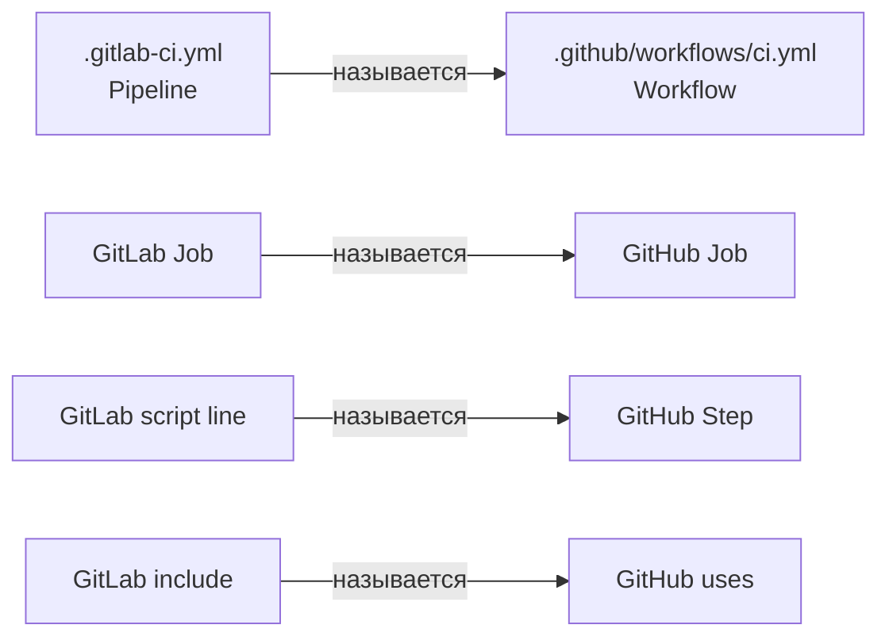
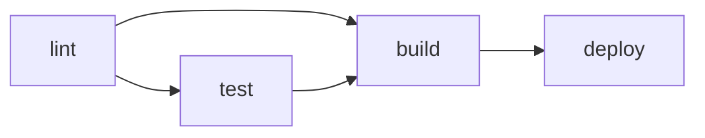
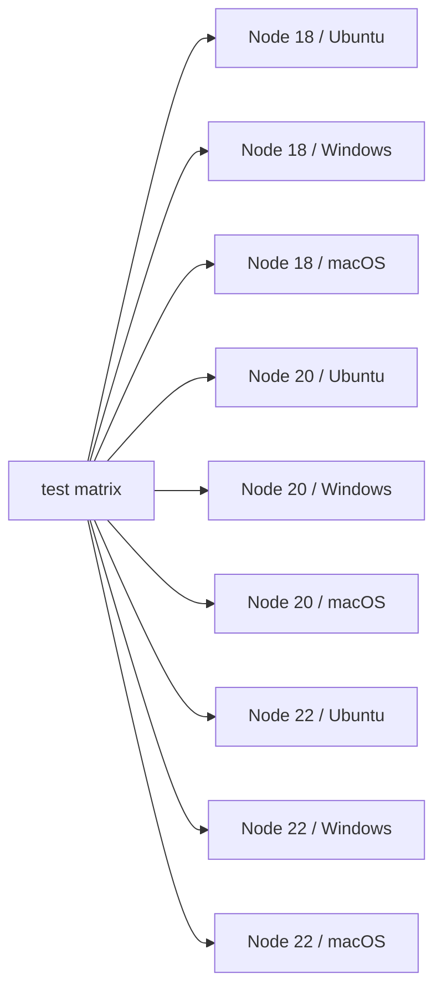
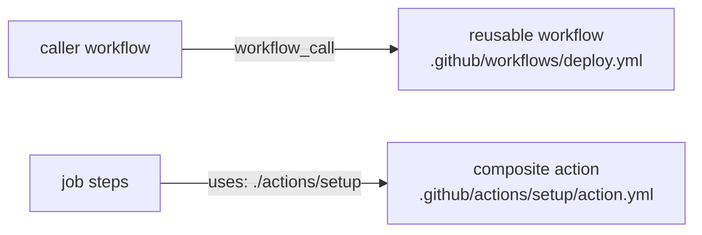

# Уровень 16: GitHub Actions

## GitHub Actions — CI/CD, встроенный в GitHub

Ты уже прошёл 15 уровней про GitLab CI. Теперь посмотрим на GitHub Actions — конкурирующую систему, которую используют миллионы open-source и коммерческих проектов.

Хорошая новость: **концепции те же, терминология — немного другая**. Это как переехать в другой город: улицы называются иначе, но ехать на машине ты всё равно умеешь.

---

## Маппинг концепций GitLab CI → GitHub Actions

Прежде чем изучать синтаксис, установим соответствие между понятиями:

| GitLab CI | GitHub Actions | Описание |
|---|---|---|
| Pipeline | Workflow | Весь процесс CI/CD |
| Job | Job | Единица выполнения |
| Stage | (нет прямого аналога) | Группировка джобов |
| Script line | Step | Шаг внутри джоба |
| `.gitlab-ci.yml` | `.github/workflows/*.yml` | Файл конфигурации |
| Runner | Runner | Машина-исполнитель |
| GitLab CI variables | Secrets / env vars | Переменные окружения |
| `include:` | `uses:` (reusable workflow) | Переиспользование |
| `extends:` | `uses:` (composite action) | Наследование |
| Docker image | `runs-on` + `container:` | Среда выполнения |
| `artifacts:` | `actions/upload-artifact` | Передача файлов |
| `cache:` | `actions/cache` | Кэширование |



---

## Структура Workflow-файла

В GitLab всё описывалось в одном файле `.gitlab-ci.yml`. В GitHub Actions файлы лежат в директории `.github/workflows/` и их может быть несколько.

### Минимальный workflow

```yaml
# .github/workflows/ci.yml

name: CI                          # Имя workflow (отображается в UI)

on:                               # Триггеры (аналог GitLab: only/when)
  push:
    branches: [main, develop]
  pull_request:
    branches: [main]

jobs:                             # Все джобы (аналог GitLab: jobs на верхнем уровне)
  build:                          # Имя джоба
    runs-on: ubuntu-latest        # На каком Runner запускать

    steps:                        # Шаги (аналог GitLab: script)
      - uses: actions/checkout@v4 # Скачать код из репозитория
      - name: Install deps
        run: npm ci
      - name: Build
        run: npm run build
```

📌 Ключевое отличие: в GitLab код репозитория клонируется **автоматически**. В GitHub Actions нужно явно добавить `uses: actions/checkout@v4` в каждый джоб, которому нужен код.

---

## Триггеры (on:)

В GitLab триггеры задавались через `only:`, `except:`, `rules:`. В GitHub Actions — через ключ `on:`.

```yaml
on:
  # Запуск при пуше в ветку
  push:
    branches:
      - main
      - 'release/**'     # glob-паттерны поддерживаются
    paths:               # Запускать только если изменились эти файлы
      - 'src/**'
      - 'package.json'

  # Запуск при открытии/обновлении Pull Request
  pull_request:
    branches: [main]
    types: [opened, synchronize, reopened]

  # Расписание (аналог GitLab: schedules в UI)
  schedule:
    - cron: '0 2 * * 1'  # Каждый понедельник в 2:00 UTC

  # Ручной запуск (аналог GitLab: when: manual)
  workflow_dispatch:
    inputs:
      environment:
        description: 'Target environment'
        required: true
        default: 'staging'

  # Вызов из другого workflow
  workflow_call:
    inputs:
      version:
        type: string
        required: true
```

💡 `paths:` — мощная фича. Монорепозиторий? Запускай frontend-пайплайн только когда изменились файлы в `frontend/`.

---

## Jobs и зависимости между ними

В GitLab джобы группировались по `stages` и выполнялись последовательно. В GitHub Actions порядок задаётся через `needs:`.

```yaml
jobs:
  lint:
    runs-on: ubuntu-latest
    steps:
      - uses: actions/checkout@v4
      - run: npm run lint

  test:
    runs-on: ubuntu-latest
    needs: lint             # Выполнять после lint
    steps:
      - uses: actions/checkout@v4
      - run: npm test

  build:
    runs-on: ubuntu-latest
    needs: [lint, test]     # Выполнять после ОБОИХ
    steps:
      - uses: actions/checkout@v4
      - run: npm run build

  deploy:
    runs-on: ubuntu-latest
    needs: build            # Выполнять после build
    if: github.ref == 'refs/heads/main'   # Аналог GitLab: only: [main]
    steps:
      - uses: actions/checkout@v4
      - run: ./deploy.sh
```



📌 Без `needs:` все джобы запускаются **параллельно**. В GitLab без stages джобы тоже шли бы параллельно — аналогия полная.

---

## Steps — шаги внутри джоба

Каждый джоб состоит из шагов (steps). Шаг — это либо команда (`run:`), либо готовый action (`uses:`).

```yaml
jobs:
  example:
    runs-on: ubuntu-latest
    steps:
      # Тип 1: run — просто команда (аналог строки в script:)
      - name: Run tests
        run: npm test

      # Несколько команд
      - name: Build and lint
        run: |
          npm run lint
          npm run build

      # Тип 2: uses — готовый action из Marketplace
      - uses: actions/checkout@v4

      # Тип 3: uses с параметрами
      - uses: actions/setup-node@v4
        with:
          node-version: '20'
          cache: 'npm'

      # Условное выполнение шага
      - name: Deploy to prod
        if: github.ref == 'refs/heads/main'
        run: ./deploy.sh

      # Переменные окружения для конкретного шага
      - name: Run with env
        env:
          API_KEY: ${{ secrets.API_KEY }}
        run: ./publish.sh
```

---

## Actions Marketplace

Это главное преимущество GitHub Actions. Actions Marketplace — огромная библиотека готовых "кирпичиков" для пайплайна.

Аналог в GitLab — это `include:` с шаблонами, но Marketplace несравнимо больше.

### Популярные actions

```yaml
steps:
  # Скачать код репозитория (обязателен почти всегда)
  - uses: actions/checkout@v4

  # Установить Node.js нужной версии
  - uses: actions/setup-node@v4
    with:
      node-version: '20'
      cache: 'npm'           # Автоматически кэшировать npm

  # Установить Python
  - uses: actions/setup-python@v5
    with:
      python-version: '3.11'
      cache: 'pip'

  # Установить Java
  - uses: actions/setup-java@v4
    with:
      java-version: '17'
      distribution: 'temurin'

  # Сохранить артефакты
  - uses: actions/upload-artifact@v4
    with:
      name: build-output
      path: dist/
      retention-days: 7

  # Скачать артефакты
  - uses: actions/download-artifact@v4
    with:
      name: build-output
      path: dist/

  # Кэширование (вручную, если setup-* не поддерживает)
  - uses: actions/cache@v4
    with:
      path: ~/.m2/repository
      key: ${{ runner.os }}-maven-${{ hashFiles('**/pom.xml') }}
```

💡 Синтаксис `@v4` — это тег или SHA коммита. Лучшая практика — использовать точный SHA (`@abc1234`) для безопасности, или хотя бы major version (`@v4`).

---

## Переменные и секреты

В GitLab переменные задавались в Settings → CI/CD → Variables. В GitHub: Settings → Secrets and variables.

```yaml
jobs:
  deploy:
    runs-on: ubuntu-latest
    env:
      # Переменные окружения на уровне джоба
      NODE_ENV: production
      APP_VERSION: ${{ github.sha }}    # Встроенные переменные GitHub

    steps:
      - name: Deploy
        env:
          # Секреты — только через ${{ secrets.NAME }}
          AWS_ACCESS_KEY: ${{ secrets.AWS_ACCESS_KEY }}
          AWS_SECRET_KEY: ${{ secrets.AWS_SECRET_KEY }}
          # Обычная переменная
          DEPLOY_ENV: staging
        run: ./deploy.sh
```

### Встроенные переменные GitHub (аналог GitLab переменных)

| GitHub | GitLab | Значение |
|---|---|---|
| `github.sha` | `$CI_COMMIT_SHA` | SHA коммита |
| `github.ref` | `$CI_COMMIT_REF_NAME` | Имя ветки/тега |
| `github.actor` | `$GITLAB_USER_LOGIN` | Кто запустил |
| `github.repository` | `$CI_PROJECT_PATH` | Путь к репозиторию |
| `github.run_id` | `$CI_PIPELINE_ID` | ID запуска |
| `runner.os` | `$CI_RUNNER_DESCRIPTION` | ОС Runner-а |

---

## Matrix Strategy

Matrix — это способ запустить один и тот же джоб с разными параметрами. В GitLab это делалось через `parallel:matrix:`. В GitHub Actions синтаксис немного другой, но идея та же.

```yaml
jobs:
  test:
    runs-on: ubuntu-latest
    strategy:
      matrix:
        node-version: [18, 20, 22]
        os: [ubuntu-latest, windows-latest, macos-latest]
      fail-fast: false      # Не останавливать все при первом провале
      max-parallel: 4       # Максимум 4 параллельных джоба

    steps:
      - uses: actions/checkout@v4
      - uses: actions/setup-node@v4
        with:
          node-version: ${{ matrix.node-version }}
      - run: npm test
```

Это создаст **9 джобов** (3 версии Node × 3 ОС):



### Расширенный matrix

```yaml
strategy:
  matrix:
    include:
      # Добавить джоб с нестандартными параметрами
      - node-version: 20
        os: ubuntu-latest
        experimental: true

    exclude:
      # Исключить конкретную комбинацию
      - node-version: 18
        os: macos-latest
```

---

## Reusable Workflows и Composite Actions

В GitLab для переиспользования был `include:` и `extends:`. В GitHub Actions — два механизма:

1. **Reusable Workflow** — переиспользовать целый workflow (несколько джобов)
2. **Composite Action** — переиспользовать набор шагов внутри джоба



### Reusable Workflow

```yaml
# .github/workflows/deploy-reusable.yml
on:
  workflow_call:                  # Этот trigger делает workflow переиспользуемым
    inputs:
      environment:
        type: string
        required: true
    secrets:
      DEPLOY_KEY:
        required: true

jobs:
  deploy:
    runs-on: ubuntu-latest
    steps:
      - uses: actions/checkout@v4
      - name: Deploy to ${{ inputs.environment }}
        env:
          KEY: ${{ secrets.DEPLOY_KEY }}
        run: ./deploy.sh ${{ inputs.environment }}
```

```yaml
# .github/workflows/production.yml — вызывающий workflow
jobs:
  deploy-prod:
    uses: ./.github/workflows/deploy-reusable.yml    # Локальный
    # uses: org/repo/.github/workflows/deploy.yml@main  # Из другого репозитория
    with:
      environment: production
    secrets:
      DEPLOY_KEY: ${{ secrets.PROD_DEPLOY_KEY }}
```

### Composite Action

```yaml
# .github/actions/setup-node-project/action.yml
name: 'Setup Node Project'
description: 'Checkout, setup Node and install dependencies'

inputs:
  node-version:
    description: 'Node.js version'
    default: '20'

runs:
  using: 'composite'             # Тип: composite
  steps:
    - uses: actions/checkout@v4
    - uses: actions/setup-node@v4
      with:
        node-version: ${{ inputs.node-version }}
        cache: 'npm'
    - name: Install dependencies
      run: npm ci
      shell: bash
```

```yaml
# Использование composite action
jobs:
  build:
    runs-on: ubuntu-latest
    steps:
      - uses: ./.github/actions/setup-node-project  # Локальный action
        with:
          node-version: '20'
      - run: npm run build
```

---

## Environments и approvals

В GitLab были protected environments и manual approvals в джобах. В GitHub Actions это реализуется через Environments.

```yaml
jobs:
  deploy-production:
    runs-on: ubuntu-latest
    environment:
      name: production           # Environment с правилами в Settings
      url: https://myapp.com     # URL отображается в GitHub UI
    steps:
      - run: ./deploy-prod.sh
```

В Settings → Environments можно настроить:
- Required reviewers (нужно одобрение перед запуском)
- Wait timer (задержка перед деплоем)
- Deployment branches (только из определённых веток)

---

## Частые ошибки новичков

⚠️ **Ошибка 1: Забыть actions/checkout**

```yaml
# ❌ Джоб не имеет кода репозитория
jobs:
  build:
    runs-on: ubuntu-latest
    steps:
      - run: npm run build    # Ошибка: нет package.json, нет src/
```

```yaml
# ✅ Сначала checkout
jobs:
  build:
    runs-on: ubuntu-latest
    steps:
      - uses: actions/checkout@v4
      - run: npm run build
```

⚠️ **Ошибка 2: Передавать секреты через переменные окружения workflow**

```yaml
# ❌ Секрет виден в логах
jobs:
  deploy:
    env:
      API_KEY: ${{ secrets.API_KEY }}
    steps:
      - run: echo "Key is $API_KEY"   # GitHub маскирует, но лучше не рисковать
```

```yaml
# ✅ Передавать секрет только туда, где нужен
jobs:
  deploy:
    steps:
      - name: Deploy
        env:
          API_KEY: ${{ secrets.API_KEY }}
        run: ./deploy.sh    # скрипт читает $API_KEY
```

⚠️ **Ошибка 3: Использовать latest теги без version pinning**

```yaml
# ❌ @main может сломаться в любой момент
- uses: some-org/some-action@main
```

```yaml
# ✅ Фиксировать версию — хотя бы major version, лучше SHA
- uses: actions/checkout@v4
- uses: actions/checkout@11bd71901bbe5b1630ceea73d27597364c9af683  # ещё лучше
```

⚠️ **Ошибка 4: Не использовать fail-fast: false при matrix**

```yaml
# ❌ Если Node 18 упал, Node 20 и 22 отменяются — теряем информацию
strategy:
  matrix:
    node: [18, 20, 22]
```

```yaml
# ✅ Все версии тестируются независимо — видим полную картину
strategy:
  fail-fast: false
  matrix:
    node: [18, 20, 22]
```

⚠️ **Ошибка 5: Дублировать одинаковые шаги вместо composite action**

```yaml
# ❌ Один и тот же блок копируется в 5 джобов
jobs:
  job1:
    steps:
      - uses: actions/checkout@v4
      - uses: actions/setup-node@v4
        with:
          node-version: 20
          cache: npm
      - run: npm ci
      # ... полезная работа
  job2:
    steps:
      - uses: actions/checkout@v4       # Дублирование
      - uses: actions/setup-node@v4
        with:
          node-version: 20
          cache: npm
      - run: npm ci
      # ... другая полезная работа
```

```yaml
# ✅ Вынести в composite action
jobs:
  job1:
    steps:
      - uses: ./.github/actions/setup
      # ... полезная работа
  job2:
    steps:
      - uses: ./.github/actions/setup
      # ... другая полезная работа
```

---

## Итог

GitHub Actions и GitLab CI решают одну задачу разными средствами. Ключевые отличия:

- **Workflow** = Pipeline, но файлов может быть несколько в `.github/workflows/`
- **Step** = строка в `script:`, но шагом может быть целый Action из Marketplace
- **needs:** вместо stages — явные зависимости между джобами
- **actions/checkout** нужно добавлять явно — код не клонируется автоматически
- **Reusable Workflows** — для переиспользования целых пайплайнов
- **Composite Actions** — для переиспользования шагов внутри джоба
- **Matrix strategy** — параллельное тестирование на разных комбинациях параметров
