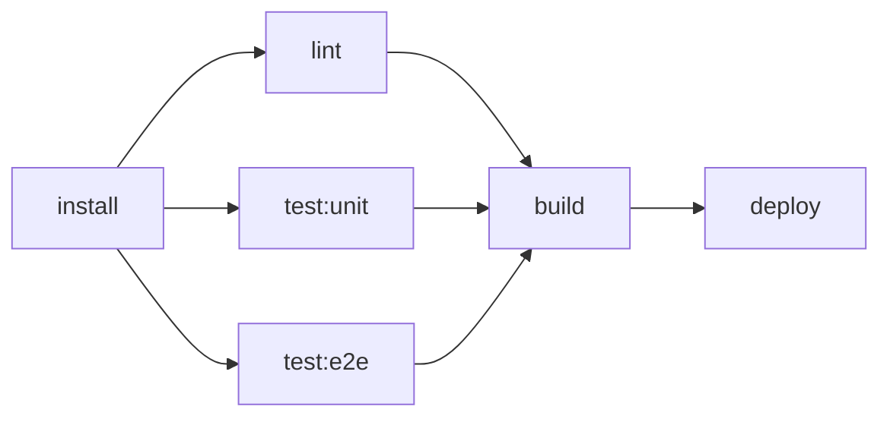
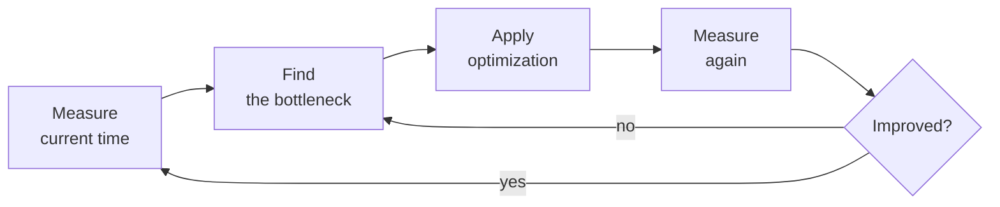
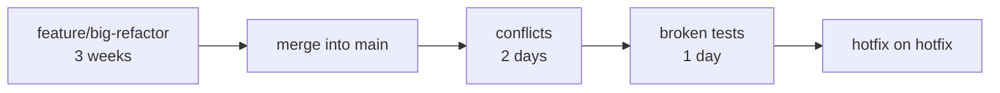
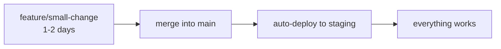
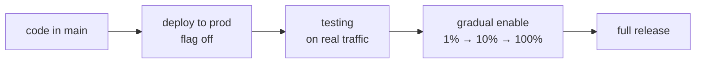
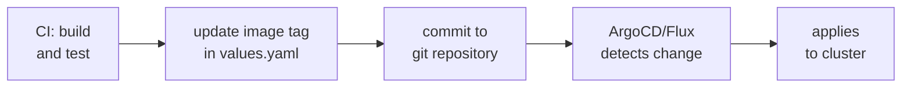

# Level 17: Best Practices — Bringing It All Together

## The Final Level: From a Working Pipeline to a Professional One

Imagine two restaurants. In the first one, everything works: food is prepared, guests eat. But the kitchen is chaotic: cooks get in each other's way, recipes are in the chef's head, a new employee takes a week to figure things out.

In the second restaurant, the same food, but the kitchen is streamlined: each cook knows their zone, recipes are documented, a new cook is ready for a shift on day two. And the kitchen runs faster — because processes are optimized.

CI/CD is the same. A pipeline can be written so that it works. Or it can be written so that it works **fast**, **clearly**, and **scales** without pain.

This level is about the difference between the first and second restaurant.

---

## Part 1: Pipeline Performance — Speed Matters

### Why Pipeline Speed Is Critical

A slow pipeline is not just inconvenient. It means:
- Developers wait 20 minutes for feedback instead of 5
- Harder to make small, frequent commits (scared to wait again)
- Merge Queue gets clogged, team loses focus
- Rolling back in production takes half an hour instead of two minutes

📌 Research shows: if the feedback loop is longer than 10 minutes, developers switch to other tasks. Concentration is lost.

### Parallelism: The Main Lever for Speedup

Sequential pipelines are like cooking breakfast one dish at a time: first eggs, then toast, then coffee. A parallel pipeline — everything simultaneously.



```yaml
# Sequential: 20 minutes
stages:
  - install
  - lint
  - test
  - build
  - deploy

# Parallel with needs: same tasks in 8 minutes
lint:
  stage: test
  needs: [install]     # doesn't wait for other test jobs

test:unit:
  stage: test
  needs: [install]     # starts right after install

test:e2e:
  stage: test
  needs: [install]     # parallel with unit

build:
  stage: build
  needs: [lint, test:unit, test:e2e]   # waits for all three
```

💡 `needs` creates a DAG (Directed Acyclic Graph) — a directed graph without cycles. A job starts as soon as all its dependencies are ready, not when the entire stage finishes.

### rules:changes — Don't Run What Hasn't Changed

In a monorepo or a project with independent components, there's no point running all tests when documentation is changed.

```yaml
test:frontend:
  script:
    - npm run test:frontend
  rules:
    - changes:
        - src/frontend/**/*
        - package.json
      when: on_success
    - when: never    # if frontend hasn't changed — skip

test:backend:
  script:
    - pytest tests/
  rules:
    - changes:
        - src/backend/**/*
        - requirements.txt
      when: on_success
    - when: never
```

⚠️ `rules:changes` works correctly only on `push`. In merge request pipelines, behavior depends on the base branch — check the documentation.

### Shallow Clone — Don't Pull the Entire History

By default, GitLab does a `git clone` with the **entire history** of the repository. For a project with 5 years of history, that can be gigabytes.

```yaml
variables:
  GIT_DEPTH: '10'    # download only the last 10 commits

# Or globally at the top of the file
variables:
  GIT_DEPTH: '1'     # most jobs don't need history at all
```

📌 `GIT_DEPTH: '0'` disables shallow clone. Only needed for jobs that analyze git history (e.g., changelog generation).

### Cache Optimization: Pull/Push Strategy

Instead of every job both reading and writing the cache (which creates race conditions and unnecessary operations), designate one job to build the cache:

```yaml
prepare:
  stage: .pre
  script:
    - npm ci
  cache:
    key:
      files: [package-lock.json]
    paths: [node_modules/]
    policy: push    # only builds the cache

test:
  stage: test
  needs: [prepare]
  cache:
    key:
      files: [package-lock.json]
    paths: [node_modules/]
    policy: pull    # only reads, doesn't waste time saving
  script:
    - npm test
```

### Measure Before Optimizing



The GitLab UI has built-in pipeline visualization with each job's time. Use it, not intuition.

---

## Part 2: Pipeline as Code — Organization and Readability

### The Problem with a Large .gitlab-ci.yml

A pipeline starts at 20 lines. A year later, it's 2000 lines, nobody understands what's happening, and everyone is afraid to change anything. Familiar?

> "Any fool can write code that a computer can understand. Good programmers write code that humans can understand." — Martin Fowler

The same principle applies to CI/CD configs.

### Structure Through Includes

```yaml
# .gitlab-ci.yml — the main file, structure only
include:
  - local: '.gitlab/ci/build.yml'
  - local: '.gitlab/ci/test.yml'
  - local: '.gitlab/ci/deploy.yml'
  - local: '.gitlab/ci/security.yml'

stages:
  - build
  - test
  - deploy

variables:
  DOCKER_REGISTRY: registry.gitlab.com/myorg/myproject
  NODE_VERSION: '20'
```

```
.gitlab/
  ci/
    build.yml       # everything about building
    test.yml        # unit, e2e, coverage
    deploy.yml      # staging, production
    security.yml    # SAST, dependency scanning
    templates.yml   # common templates (.job-template)
```

💡 Divide by **responsibility**, not alphabetically. `build.yml` — everything about builds. `security.yml` — everything about security.

### DRY Through extends

`extends` is inheritance for CI jobs. Move common settings into hidden jobs (starting with `.`):

```yaml
# Base template
.base-node-job:
  image: node:20-alpine
  cache:
    key:
      files: [package-lock.json]
    paths: [node_modules/]
    policy: pull
  before_script:
    - echo "Running as $CI_JOB_NAME"
  tags:
    - docker

# Specific jobs inherit the template
lint:
  extends: .base-node-job
  stage: test
  needs: [prepare]
  script:
    - npm run lint

test:unit:
  extends: .base-node-job
  stage: test
  needs: [prepare]
  script:
    - npm test -- --coverage
```

✅ DRY (Don't Repeat Yourself) — changed image in one place, changed everywhere.

❌ Anti-pattern — copying cache/image/tags blocks into every job.

### YAML Anchors vs extends

In GitLab CI there are two reuse methods: YAML anchors (`&`) and `extends`. They're similar, but `extends` is better:

```yaml
# YAML anchors — works but fragile
.common: &common
  image: node:20
  tags: [docker]

job1:
  <<: *common    # merge keys
  script: [npm test]

# extends — more explicit and readable
.common-job:
  image: node:20
  tags: [docker]

job1:
  extends: .common-job
  script: [npm test]
```

📌 `extends` supports inheritance from multiple templates and works with include. YAML anchors don't work with includes from other files.

### Pipeline Documentation

```yaml
# Good example: clear what, why, and how
build:docker:
  stage: build
  # Build Docker image and push to registry.
  # Using kaniko instead of Docker-in-Docker for security in shared runners.
  # Image is tagged by commit hash ($CI_COMMIT_SHORT_SHA) for uniqueness.
  image:
    name: gcr.io/kaniko-project/executor:debug
    entrypoint: ['']
  script:
    - /kaniko/executor
        --context $CI_PROJECT_DIR
        --dockerfile $CI_PROJECT_DIR/Dockerfile
        --destination $DOCKER_REGISTRY:$CI_COMMIT_SHORT_SHA
  rules:
    - if: $CI_COMMIT_BRANCH == $CI_DEFAULT_BRANCH
```

### Anchors for Environment Variables

```yaml
# Different environments — different variables, same deploy logic
.deploy-template:
  script:
    - helm upgrade --install $APP_NAME ./chart
        --set image.tag=$CI_COMMIT_SHORT_SHA
        --namespace $K8S_NAMESPACE
  environment:
    name: $ENV_NAME
    url: $APP_URL

deploy:staging:
  extends: .deploy-template
  variables:
    APP_NAME: myapp-staging
    K8S_NAMESPACE: staging
    ENV_NAME: staging
    APP_URL: https://staging.myapp.com
  rules:
    - if: $CI_COMMIT_BRANCH == $CI_DEFAULT_BRANCH

deploy:production:
  extends: .deploy-template
  variables:
    APP_NAME: myapp-production
    K8S_NAMESPACE: production
    ENV_NAME: production
    APP_URL: https://myapp.com
  rules:
    - if: $CI_COMMIT_TAG =~ /^v\d+\.\d+\.\d+$/
  when: manual
```

---

## Part 3: CI/CD Culture and Processes

### Trunk-based Development

Most CI/CD problems start not in the config, but in development processes. Long-lived feature branches are the biggest enemy of fast delivery.



Trunk-based development: small commits to main every day.



📌 Rule: if a branch lives longer than 2 days — something is wrong. Either the task is too big or the process is not optimized.

### Feature Flags — Deploy Without Release

Feature flags allow deploying code to production without enabling the functionality. This separates **deploy** and **release**.



```yaml
# .gitlab-ci.yml — always deploy, functionality controlled by flags
deploy:production:
  stage: deploy
  script:
    - helm upgrade myapp ./chart
        --set image.tag=$CI_COMMIT_SHORT_SHA
    # Flags managed separately via GitLab Feature Flags or LaunchDarkly
  rules:
    - if: $CI_COMMIT_BRANCH == $CI_DEFAULT_BRANCH
```

### GitOps — Infrastructure as Code for Deploys

In classic CI/CD, the pipeline pushes changes to the cluster. In GitOps — the cluster pulls changes from git itself.



```yaml
# Pipeline only updates manifests, doesn't deploy directly
update:manifests:
  stage: deploy
  script:
    # Update image tag in Helm values
    - sed -i "s/tag: .*/tag: $CI_COMMIT_SHORT_SHA/" deploy/values.yaml
    - git config user.email "ci@mycompany.com"
    - git config user.name "GitLab CI"
    - git add deploy/values.yaml
    - git commit -m "ci: update image to $CI_COMMIT_SHORT_SHA [skip ci]"
    - git push origin $CI_DEFAULT_BRANCH
```

### DORA Metrics — How to Measure CI/CD Health

DORA (DevOps Research and Assessment) — four metrics that show the maturity of DevOps processes:

| Metric | What It Measures | Elite | High | Medium |
|---|---|---|---|---|
| **Deployment Frequency** | How often we deploy | Multiple times a day | Once a day | Once a week |
| **Lead Time for Changes** | Commit → prod | < 1 hour | < 1 day | 1-7 days |
| **Change Failure Rate** | % deploys with incidents | < 5% | < 10% | 15-45% |
| **Time to Restore** | Recovery after incident | < 1 hour | < 1 day | < 1 week |

💡 These metrics can be collected automatically from GitLab. MR time from creation to merge is Lead Time. Number of hotfix commits is Change Failure Rate.

### Pipeline Monitoring

A pipeline is also software. It needs to be monitored.

```yaml
# Slack notification on pipeline failure on main
notify:failure:
  stage: .post
  image: curlimages/curl:latest
  script:
    - |
      curl -X POST $SLACK_WEBHOOK_URL \
        -H 'Content-type: application/json' \
        --data "{
          \"text\": \"Pipeline failed on $CI_COMMIT_BRANCH\",
          \"attachments\": [{
            \"color\": \"danger\",
            \"text\": \"Job: $CI_JOB_NAME | Commit: $CI_COMMIT_SHORT_SHA\",
            \"actions\": [{
              \"type\": \"button\",
              \"text\": \"View Pipeline\",
              \"url\": \"$CI_PIPELINE_URL\"
            }]
          }]
        }"
  rules:
    - if: $CI_COMMIT_BRANCH == $CI_DEFAULT_BRANCH
      when: on_failure
```

### Key Principles of Healthy CI/CD

🔥 **1. Fail Fast** — fastest checks first. A 30-second linter should stand before 10-minute tests.

🔥 **2. Everything in git** — not just code, but also configs, Dockerfiles, Helm charts, terraform. If a change isn't in git — it doesn't exist.

🔥 **3. Idempotence** — a pipeline can be run twice with the same result. Deploying to the same state shouldn't cause problems.

🔥 **4. Visibility** — pipeline state should be obvious. Green — working, red — broken, yellow — deploying.

🔥 **5. Automate everything** — if something is done by hand regularly, it should be in the pipeline.

---

## Common Mistakes When Scaling CI/CD

⚠️ **Mistake 1: Monolithic .gitlab-ci.yml with 1000+ lines**

```yaml
# ❌ One file, everything thrown together
# 50 jobs, nobody understands the structure
build-frontend:
  ...
test-backend:
  ...
deploy-staging:
  ...
# another 200 lines...
```

```yaml
# ✅ Split into files by responsibility
include:
  - local: '.gitlab/ci/build.yml'
  - local: '.gitlab/ci/test.yml'
  - local: '.gitlab/ci/deploy.yml'
```

⚠️ **Mistake 2: Copying configs between jobs instead of using extends**

```yaml
# ❌ image, cache, tags repeated across 10 jobs
test:unit:
  image: node:20-alpine
  tags: [docker]
  cache:
    key: { files: [package-lock.json] }
    paths: [node_modules/]
    policy: pull
  script: [npm test]

test:e2e:
  image: node:20-alpine   # copy-paste
  tags: [docker]          # copy-paste
  cache:                  # copy-paste
    key: { files: [package-lock.json] }
    paths: [node_modules/]
    policy: pull
  script: [npm run e2e]
```

```yaml
# ✅ One template, all inherit
.node-job:
  image: node:20-alpine
  tags: [docker]
  cache:
    key: { files: [package-lock.json] }
    paths: [node_modules/]
    policy: pull

test:unit:
  extends: .node-job
  script: [npm test]

test:e2e:
  extends: .node-job
  script: [npm run e2e]
```

⚠️ **Mistake 3: Optimizing pipeline without measurements**

```yaml
# ❌ "I feel like tests are slow — I'll add parallelism everywhere"
# Added parallel: 10, pipeline now uses 10 Runners
# But the bottleneck — 5 min cache load — remains
```

```yaml
# ✅ First measure, then optimize
# Check GitLab UI: which job takes the most time?
# Optimize that specific job, measure the result
```

⚠️ **Mistake 4: Ignoring DORA metrics**

```yaml
# ❌ "Pipeline works — means everything is fine"
# Without metrics, you don't see: Lead Time grew from 2 hours to 2 days
# Because MRs sit for 3 days without review
```

Set up a dashboard with pipeline metrics. GitLab's built-in analytics are a good start.

---

## Summary

Professional CI/CD has three layers:

1. **Works** (basic level) — pipeline runs and deploys
2. **Fast** (optimization) — parallelism, cache, rules:changes, shallow clone
3. **Scales** (architecture) — includes, extends, DRY, documentation, metrics

You've completed all 17 levels of this course. Now you have the tools for all three layers. Time to apply them in a real project.
