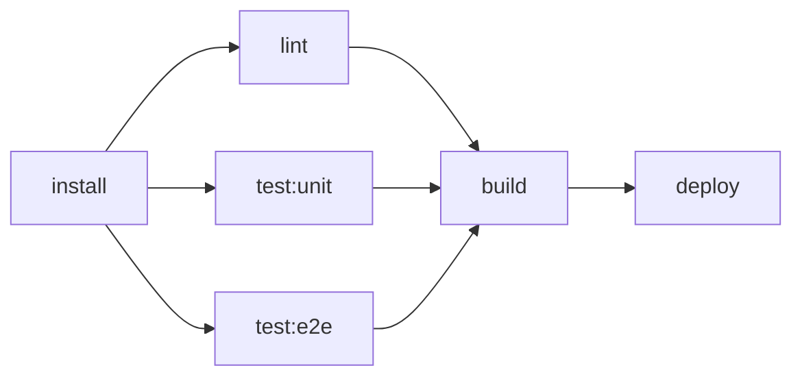
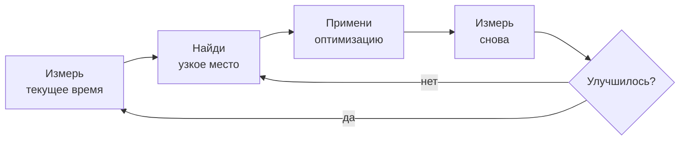
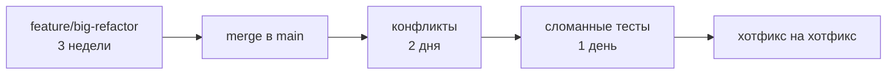
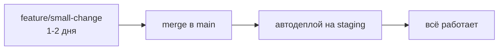
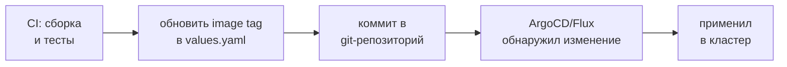

# Уровень 17: Best Practices — собираем всё вместе

## Финальный уровень: от работающего пайплайна к профессиональному

Представь два ресторана. В первом всё работает: еда готовится, гости едят. Но кухня хаотичная: повара мешают друг другу, рецепты хранятся в голове у шефа, новый сотрудник разбирается неделю.

Во втором ресторане та же еда, но кухня отлажена: каждый повар знает свою зону, рецепты задокументированы, новый повар выходит на смену на второй день. И кухня работает быстрее — потому что процессы оптимизированы.

CI/CD такой же. Пайплайн можно написать так, что он работает. А можно написать так, что он работает **быстро**, **понятно** и **масштабируется** без боли.

Этот уровень — про разницу между первым и вторым рестораном.

---

## Часть 1: Pipeline Performance — скорость имеет значение

### Почему скорость пайплайна критична?

Медленный пайплайн — это не просто неудобство. Это:
- Разработчики ждут обратную связь 20 минут вместо 5
- Сложнее делать небольшие частые коммиты (страшно ждать снова)
- Merge Queue забивается, команда теряет фокус
- Откат в продакшене занимает полчаса вместо двух минут

📌 Исследования показывают: если цикл обратной связи дольше 10 минут, разработчики переключаются на другие задачи. Концентрация теряется.

### Параллелизм: главный рычаг ускорения

Последовательные пайплайны — это как готовить завтрак, делая одно блюдо за раз: сначала яйца, потом тост, потом кофе. Параллельный пайплайн — всё одновременно.



```yaml
# Последовательно: 20 минут
stages:
  - install
  - lint
  - test
  - build
  - deploy

# Параллельно с needs: те же задачи за 8 минут
lint:
  stage: test
  needs: [install]     # не ждёт остальных test-джобов

test:unit:
  stage: test
  needs: [install]     # стартует сразу после install

test:e2e:
  stage: test
  needs: [install]     # параллельно с unit

build:
  stage: build
  needs: [lint, test:unit, test:e2e]   # ждёт все три
```

💡 `needs` создаёт DAG (Directed Acyclic Graph) — ориентированный граф без циклов. Джоб стартует, как только готовы все его зависимости, а не когда завершилась вся стадия.

### rules:changes — не запускай то, что не изменилось

В монорепозитории или в проекте с независимыми компонентами нет смысла прогонять все тесты при изменении документации.

```yaml
test:frontend:
  script:
    - npm run test:frontend
  rules:
    - changes:
        - src/frontend/**/*
        - package.json
      when: on_success
    - when: never    # если frontend не менялся — пропустить

test:backend:
  script:
    - pytest tests/
  rules:
    - changes:
        - src/backend/**/*
        - requirements.txt
      when: on_success
    - when: never
```

⚠️ `rules:changes` работает корректно только при `push`. В merge request pipeline поведение зависит от базовой ветки — проверяй документацию.

### Shallow clone — не тащи всю историю

По умолчанию GitLab делает `git clone` со **всей историей** репозитория. Для проекта с 5-летней историей это могут быть гигабайты.

```yaml
variables:
  GIT_DEPTH: '10'    # скачать только последние 10 коммитов

# Или глобально в верхнем уровне файла
variables:
  GIT_DEPTH: '1'     # большинству джобов история вообще не нужна
```

📌 `GIT_DEPTH: '0'` отключает shallow clone. Нужно только для джобов, которые анализируют git-историю (например, генерация changelog).

### Оптимизация кэша: стратегия pull/push

Вместо того чтобы каждый джоб и читал, и писал кэш (что создаёт гонку и лишние операции), выдели один джоб для построения кэша:

```yaml
prepare:
  stage: .pre
  script:
    - npm ci
  cache:
    key:
      files: [package-lock.json]
    paths: [node_modules/]
    policy: push    # только строит кэш

test:
  stage: test
  needs: [prepare]
  cache:
    key:
      files: [package-lock.json]
    paths: [node_modules/]
    policy: pull    # только читает, не тратит время на сохранение
  script:
    - npm test
```

### Измеряй перед оптимизацией



В GitLab UI есть встроенная визуализация пайплайна с временем каждого джоба. Используй её, а не интуицию.

---

## Часть 2: Pipeline as Code — организация и читаемость

### Проблема большого .gitlab-ci.yml

Пайплайн начинается с 20 строк. Через год это 2000 строк, никто не понимает что происходит, и все боятся что-то менять. Знакомо?

> "Любой дурак может написать код, который понимает компьютер. Хороший программист пишет код, который понимает человек." — Мартин Фаулер

Тот же принцип для CI/CD конфигов.

### Структура через includes

```yaml
# .gitlab-ci.yml — главный файл, только структура
include:
  - local: '.gitlab/ci/build.yml'
  - local: '.gitlab/ci/test.yml'
  - local: '.gitlab/ci/deploy.yml'
  - local: '.gitlab/ci/security.yml'

stages:
  - build
  - test
  - deploy

variables:
  DOCKER_REGISTRY: registry.gitlab.com/myorg/myproject
  NODE_VERSION: '20'
```

```
.gitlab/
  ci/
    build.yml       # всё про сборку
    test.yml        # unit, e2e, coverage
    deploy.yml      # staging, production
    security.yml    # SAST, dependency scanning
    templates.yml   # общие шаблоны (.job-template)
```

💡 Разделяй по **ответственности**, не по алфавиту. `build.yml` — всё про сборку. `security.yml` — всё про безопасность.

### DRY через extends

`extends` — это наследование для CI джобов. Выноси общие настройки в скрытые джобы (начинаются с `.`):

```yaml
# Базовый шаблон
.base-node-job:
  image: node:20-alpine
  cache:
    key:
      files: [package-lock.json]
    paths: [node_modules/]
    policy: pull
  before_script:
    - echo "Running as $CI_JOB_NAME"
  tags:
    - docker

# Конкретные джобы наследуют шаблон
lint:
  extends: .base-node-job
  stage: test
  needs: [prepare]
  script:
    - npm run lint

test:unit:
  extends: .base-node-job
  stage: test
  needs: [prepare]
  script:
    - npm test -- --coverage
```

✅ DRY (Don't Repeat Yourself) — изменил image в одном месте, изменилось везде.

❌ Антипаттерн — копировать блоки cache/image/tags в каждый джоб.

### Якоря YAML vs extends

В GitLab CI есть два способа переиспользования: YAML-якоря (`&`) и `extends`. Они похожи, но `extends` лучше:

```yaml
# YAML якоря — работает, но хрупко
.common: &common
  image: node:20
  tags: [docker]

job1:
  <<: *common    # merge ключей
  script: [npm test]

# extends — более явно и читаемо
.common-job:
  image: node:20
  tags: [docker]

job1:
  extends: .common-job
  script: [npm test]
```

📌 `extends` поддерживает наследование от нескольких шаблонов и работает с include. YAML-якоря не работают с includes из других файлов.

### Документирование пайплайна

```yaml
# Хороший пример: понятно что, зачем и как
build:docker:
  stage: build
  # Собираем Docker-образ и пушим в registry.
  # Используем kaniko вместо Docker-in-Docker для безопасности в shared runners.
  # Образ тегируется по хэшу коммита ($CI_COMMIT_SHORT_SHA) для уникальности.
  image:
    name: gcr.io/kaniko-project/executor:debug
    entrypoint: ['']
  script:
    - /kaniko/executor
        --context $CI_PROJECT_DIR
        --dockerfile $CI_PROJECT_DIR/Dockerfile
        --destination $DOCKER_REGISTRY:$CI_COMMIT_SHORT_SHA
  rules:
    - if: $CI_COMMIT_BRANCH == $CI_DEFAULT_BRANCH
```

### anchors для переменных окружения

```yaml
# Разные environments — разные переменные, одна логика деплоя
.deploy-template:
  script:
    - helm upgrade --install $APP_NAME ./chart
        --set image.tag=$CI_COMMIT_SHORT_SHA
        --namespace $K8S_NAMESPACE
  environment:
    name: $ENV_NAME
    url: $APP_URL

deploy:staging:
  extends: .deploy-template
  variables:
    APP_NAME: myapp-staging
    K8S_NAMESPACE: staging
    ENV_NAME: staging
    APP_URL: https://staging.myapp.com
  rules:
    - if: $CI_COMMIT_BRANCH == $CI_DEFAULT_BRANCH

deploy:production:
  extends: .deploy-template
  variables:
    APP_NAME: myapp-production
    K8S_NAMESPACE: production
    ENV_NAME: production
    APP_URL: https://myapp.com
  rules:
    - if: $CI_COMMIT_TAG =~ /^v\d+\.\d+\.\d+$/
  when: manual
```

---

## Часть 3: CI/CD культура и процессы

### Trunk-based Development

Большинство проблем с CI/CD начинаются не в конфиге, а в процессах разработки. Долгоживущие feature-ветки — главный враг быстрой доставки.



Trunk-based development: маленькие коммиты в main каждый день.



📌 Правило: если ветка живёт дольше 2 дней — что-то пошло не так. Либо задача слишком большая, либо процесс неоптимален.

### Feature Flags — деплой без релиза

Feature flags позволяют деплоить код в продакшен, но не включать функциональность. Это разделяет **деплой** и **релиз**.


```yaml
# .gitlab-ci.yml — деплой всегда, функциональность контролируется флагами
deploy:production:
  stage: deploy
  script:
    - helm upgrade myapp ./chart
        --set image.tag=$CI_COMMIT_SHORT_SHA
    # Флаги управляются отдельно через GitLab Feature Flags или LaunchDarkly
  rules:
    - if: $CI_COMMIT_BRANCH == $CI_DEFAULT_BRANCH
```

### GitOps — Infrastructure as Code для деплоев

В классическом CI/CD пайплайн пушит изменения в кластер. В GitOps — кластер сам тянет изменения из git.



```yaml
# Пайплайн только обновляет манифесты, не деплоит напрямую
update:manifests:
  stage: deploy
  script:
    # Обновляем тег образа в Helm values
    - sed -i "s/tag: .*/tag: $CI_COMMIT_SHORT_SHA/" deploy/values.yaml
    - git config user.email "ci@mycompany.com"
    - git config user.name "GitLab CI"
    - git add deploy/values.yaml
    - git commit -m "ci: update image to $CI_COMMIT_SHORT_SHA [skip ci]"
    - git push origin $CI_DEFAULT_BRANCH
```

### DORA Metrics — как измерить здоровье CI/CD

DORA (DevOps Research and Assessment) — четыре метрики, которые показывают зрелость DevOps-процессов:

| Метрика | Что измеряет | Элита | Высокий | Средний |
|---|---|---|---|---|
| **Deployment Frequency** | Как часто деплоим | Несколько раз в день | 1 раз в день | 1 раз в неделю |
| **Lead Time for Changes** | Коммит → прод | < 1 часа | < 1 дня | 1-7 дней |
| **Change Failure Rate** | % деплоев с инцидентами | < 5% | < 10% | 15-45% |
| **Time to Restore** | Восстановление после инцидента | < 1 часа | < 1 дня | < 1 недели |

💡 Эти метрики можно собирать автоматически из GitLab. Время MR от создания до merge — это Lead Time. Количество hotfix-коммитов — это Change Failure Rate.

### Мониторинг пайплайнов

Пайплайн — это тоже software. Его нужно мониторить.

```yaml
# Уведомление в Slack при падении пайплайна на main
notify:failure:
  stage: .post
  image: curlimages/curl:latest
  script:
    - |
      curl -X POST $SLACK_WEBHOOK_URL \
        -H 'Content-type: application/json' \
        --data "{
          \"text\": \"Pipeline failed on $CI_COMMIT_BRANCH\",
          \"attachments\": [{
            \"color\": \"danger\",
            \"text\": \"Job: $CI_JOB_NAME | Commit: $CI_COMMIT_SHORT_SHA\",
            \"actions\": [{
              \"type\": \"button\",
              \"text\": \"View Pipeline\",
              \"url\": \"$CI_PIPELINE_URL\"
            }]
          }]
        }"
  rules:
    - if: $CI_COMMIT_BRANCH == $CI_DEFAULT_BRANCH
      when: on_failure
```

### Ключевые принципы здорового CI/CD

🔥 **1. Fail Fast** — самые быстрые проверки первыми. Линтер за 30 секунд должен стоять перед тестами на 10 минут.

🔥 **2. Всё в git** — не только код, но и конфиги, Dockerfile, Helm charts, terraform. Если изменение не в git — его не существует.

🔥 **3. Идемпотентность** — пайплайн можно запустить дважды с тем же результатом. Деплой в одно и то же состояние не должен создавать проблем.

🔥 **4. Видимость** — состояние пайплайна должно быть очевидно. Зелёный — работает, красный — сломано, жёлтый — деплоится.

🔥 **5. Автоматизация всего** — если что-то делается руками регулярно, это должно быть в пайплайне.

---

## Частые ошибки при масштабировании CI/CD

⚠️ **Ошибка 1: Монолитный .gitlab-ci.yml на 1000+ строк**

```yaml
# ❌ Один файл, всё свалено в кучу
# 50 джобов, никто не понимает структуру
build-frontend:
  ...
test-backend:
  ...
deploy-staging:
  ...
# ещё 200 строк...
```

```yaml
# ✅ Разделить по файлам по ответственности
include:
  - local: '.gitlab/ci/build.yml'
  - local: '.gitlab/ci/test.yml'
  - local: '.gitlab/ci/deploy.yml'
```

⚠️ **Ошибка 2: Копировать конфиги между джобами вместо extends**

```yaml
# ❌ image, cache, tags повторяются в 10 джобах
test:unit:
  image: node:20-alpine
  tags: [docker]
  cache:
    key: { files: [package-lock.json] }
    paths: [node_modules/]
    policy: pull
  script: [npm test]

test:e2e:
  image: node:20-alpine   # копипаст
  tags: [docker]          # копипаст
  cache:                  # копипаст
    key: { files: [package-lock.json] }
    paths: [node_modules/]
    policy: pull
  script: [npm run e2e]
```

```yaml
# ✅ Один шаблон, все наследуют
.node-job:
  image: node:20-alpine
  tags: [docker]
  cache:
    key: { files: [package-lock.json] }
    paths: [node_modules/]
    policy: pull

test:unit:
  extends: .node-job
  script: [npm test]

test:e2e:
  extends: .node-job
  script: [npm run e2e]
```

⚠️ **Ошибка 3: Оптимизировать пайплайн без измерений**

```yaml
# ❌ "Мне кажется, тесты медленные — добавлю параллелизм везде"
# Добавили parallel: 10, пайплайн стал использовать 10 Runner-ов
# Но узкое место — загрузка кэша 5 минут — осталась
```

```yaml
# ✅ Сначала измерить, потом оптимизировать
# Посмотреть в GitLab UI: какой джоб занимает больше всего времени?
# Оптимизировать именно его, измерить результат
```

⚠️ **Ошибка 4: Игнорировать DORA-метрики**

```yaml
# ❌ "Пайплайн работает — значит всё хорошо"
# Без метрик не видно: Lead Time вырос с 2 часов до 2 дней
# Потому что MR висят по 3 дня без ревью
```

Настрой дашборд с метриками пайплайна. GitLab встроенные аналитики — хорошее начало.

---

## Итог

Профессиональный CI/CD — это три слоя:

1. **Работает** (базовый уровень) — пайплайн запускается и делает деплой
2. **Быстро** (оптимизация) — параллелизм, кэш, rules:changes, shallow clone
3. **Масштабируется** (архитектура) — includes, extends, DRY, документирование, метрики

Ты прошёл все 17 уровней этого курса. Теперь у тебя есть инструменты для всех трёх слоёв. Самое время применить их в реальном проекте.
