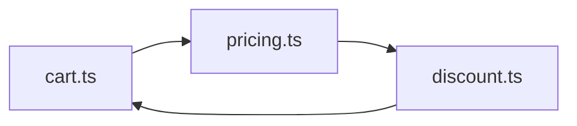

# Уровень 0 (подробно): Что такое циклическая зависимость

## 1. Проблема: код, который знает сам о себе

Возьмём два файла:

```ts
// user.ts
import { formatOrder } from './order'

export function formatUser(name: string) {
  return `User: ${name}`
}

export function describeUserWithLastOrder(name: string, orderId: string) {
  return `${formatUser(name)}, last order: ${formatOrder(orderId)}`
}
```

```ts
// order.ts
import { formatUser } from './user'

export function formatOrder(id: string) {
  return `Order #${id}`
}

export function describeOrderOwner(id: string, ownerName: string) {
  return `${formatOrder(id)} belongs to ${formatUser(ownerName)}`
}
```

`user.ts` импортирует `order.ts`, `order.ts` импортирует `user.ts`. Оба файла синтаксически корректны, оба экспортируют полезные функции — но вместе они образуют **прямую циклическую зависимость**.

Это не какая-то экзотика. В реальных проектах циклы почти никогда не пишут специально — они **прорастают** сами, когда два модуля постепенно обрастают взаимными удобными импортами.

## 2. Пример: прямой и транзитивный циклы

### Прямой цикл (2 узла)


`A` импортирует `B`, `B` импортирует `A`. Самый простой и самый заметный вид цикла — часто виден невооружённым глазом при чтении двух файлов рядом.

### Транзитивный цикл (3+ узла)



```ts
// cart.ts
import { calculatePrice } from './pricing'
export function getCartTotal(items: string[]) {
  return items.reduce((sum, i) => sum + calculatePrice(i), 0)
}

// pricing.ts
import { applyDiscount } from './discount'
export function calculatePrice(item: string) {
  return applyDiscount(100)
}

// discount.ts
import { getCartTotal } from './cart' // <-- замыкает цикл!
export function applyDiscount(base: number) {
  return base * 0.9
}
```

Ни один файл не импортирует сам себя напрямую — цикл спрятан в цепочке из трёх шагов. Такие циклы куда коварнее: их не видно, если смотреть на файлы по одному, их находят только инструменты (см. уровень 5 — madge, dependency-cruiser) или дебаг постфактум.

## 3. Как это работает: граф импортов

Формально: возьмём каждый файл проекта как **узел** графа. Каждую инструкцию `import X from './y'` превратим в **направленное ребро** `X → Y` («X использует Y»). Получившийся граф называется **графом импортов** (import graph / dependency graph).

**Циклическая зависимость = цикл в этом ориентированном графе**, то есть путь по стрелкам, который возвращается в исходный узел.

Это ровно та же задача, что «обнаружение цикла в ориентированном графе» из классической теории графов — и решается она тем же алгоритмом: обходом в глубину (DFS) с отслеживанием узлов «в текущем стеке вызова». Если DFS встречает узел, который уже находится в текущем стеке — цикл найден. Именно так внутри устроены и madge, и ESLint-правило `import/no-cycle` (уровни 5–6).

```ts
// Упрощённый алгоритм обнаружения цикла (DFS)
type Graph = Record<string, string[]> // module -> its imports

function hasCycle(graph: Graph): boolean {
  const visited = new Set<string>()
  const inStack = new Set<string>()

  function dfs(node: string): boolean {
    if (inStack.has(node)) return true // нашли путь назад в стек — цикл!
    if (visited.has(node)) return false

    visited.add(node)
    inStack.add(node)

    for (const dep of graph[node] ?? []) {
      if (dfs(dep)) return true
    }

    inStack.delete(node) // выходим из стека — узел больше не "в процессе"
    return false
  }

  return Object.keys(graph).some(dfs)
}
```

## 4. Цикл vs высокая связанность — в чём разница

Важно не путать два родственных, но разных понятия:

- **Высокая связанность (coupling)** — модули знают друг о друге больше, чем нужно, тесно переплетены логикой. Это может происходить и **без** цикла: `A` может знать очень много про `B`, при этом `B` вообще ничего не знает про `A` — связь однонаправленная.
- **Циклическая зависимость** — частный, наиболее опасный случай связанности, когда знание идёт **в обе стороны**. Именно двунаправленность создаёт проблему с порядком инициализации (уровень 1) и с границами модулей при сборке (уровень 2).

Любой цикл — это высокая связанность. Но не любая высокая связанность — это цикл.

## 5. Почему цикл — не всегда ошибка

Важно откалибровать ожидания: сам факт наличия цикла в графе импортов **не означает**, что программа сломана прямо сейчас. Многие циклы годами живут в реальных кодовых базах, ничем себя не проявляя — особенно если внутри модулей нет побочных эффектов на верхнем уровне, а всё взаимодействие происходит внутри функций, вызываемых уже после того, как оба модуля полностью загружены (это подробно разберём на уровне 1).

Но даже «работающий» цикл — это:

- 🔥 риск: любое изменение порядка импортов или добавление кода на верхнем уровне модуля может внезапно сломать инициализацию;
- 🔥 архитектурный запах: два модуля явно должны были бы быть одним модулем, либо им обоим не хватает третьего модуля-посредника, от которого оба бы зависели однонаправленно.

## ⚠️ Частые ошибки начинающих

### Ошибка 1: «Раз собралось и запустилось — значит цикла нет»

```ts
// ❌ Так рассуждать неверно
// "Приложение стартовало без ошибок — значит, циклов в коде нет"
```

Почему это проблема: рантайм может успешно разрулить цикл именно в конкретном порядке импортов, который сложился сейчас. Добавление нового `import` где-то совсем в другом месте графа способно изменить порядок инициализации и обнажить цикл, который был «замаскирован» месяцами.

```ts
// ✅ Правильно — использовать инструмент статического анализа
// который строит граф импортов и явно ищет циклы,
// не полагаясь на удачу конкретного запуска
// (madge --circular ./src, ESLint import/no-cycle — уровни 5-6)
```

### Ошибка 2: «Цикл — это всегда прямой A ⇄ B, транзитивные не считаются»

```ts
// ❌ Неверное упрощение: "у меня же нет import из a.ts обратно в a.ts"
```

Почему это проблема: транзитивные циклы (A → B → C → A) встречаются на практике даже чаще прямых, особенно в больших модулях с barrel-файлами (уровень 4), — и именно они незаметнее всего при ручном ревью.

```ts
// ✅ Правильно — искать цикл как ЛЮБОЙ путь, возвращающийся в исходный узел,
// а не только ребро "туда и обратно" между двумя файлами
```

### Ошибка 3: «Цикл — это баг, надо всегда чинить немедленно»

Почему это проблема: не каждый цикл одинаково опасен, а бездумное «лечение» без понимания причины (уровень 2) часто приводит к искусственному разрыву через ленивые `require` внутри функций — что маскирует симптом, но не убирает архитектурную причину высокой связанности.

```ts
// ✅ Правильно — сначала понять, ПОЧЕМУ модули стали зависеть друг от друга
// циклически (общая сущность? отсутствие модуля-посредника?),
// и устранять причину, а не просто "переставлять" импорт внутрь функции
```

## 💡 Лучшие практики

- 📌 Думайте о своём проекте как о **направленном графе** уже на этапе проектирования модулей — это упражнение быстро выявляет потенциальные циклы ещё до того, как они появятся в коде.
- 📌 Направление стрелки импорта должно совпадать с направлением «уровня абстракции»: низкоуровневые утилиты не должны импортировать высокоуровневую бизнес-логику, которая, в свою очередь, их использует.
- 📌 Если два модуля тянутся друг к другу — это сигнал, что, возможно, им обоим нужен третий, общий модуль (набор типов, констант, чистых функций), от которого оба будут зависеть **однонаправленно**.
- 📌 Не полагайтесь на визуальный осмотр кода для поиска циклов — используйте инструменты (уровень 5) начиная с самого раннего этапа проекта.
