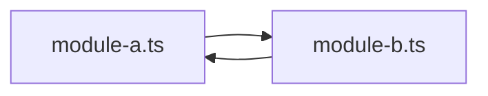
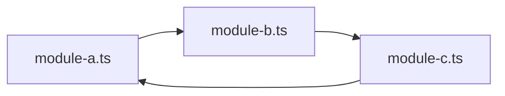

# Уровень 0: Что такое циклическая зависимость

## Аналогия: «только после вас»

Представь двух вежливых людей у одной двери. Первый говорит: «проходите, я подожду». Второй отвечает: «нет-нет, только после вас». Каждый ждёт, пока начнёт другой — и оба стоят на месте. Ни у кого нет ошибки в поведении, оба вежливы и правы по-своему, но вместе они образовали тупик.

Модули в коде ведут себя похоже. Модуль `A` говорит: «мне нужно то, что определено в `B`», а модуль `B` говорит: «мне нужно то, что определено в `A`». Возникает **циклическая зависимость** — ситуация, когда для того, чтобы полностью подготовить один модуль, движку нужен уже готовый другой, а он, в свою очередь, ждёт первый.

## Граф импортов

Проще всего думать о модулях проекта как о графе: каждый файл — узел, а каждый `import` — направленное ребро «этот модуль **использует** тот». Если, двигаясь по стрелкам, можно вернуться в тот же узел, откуда стартовали, — это и есть цикл.

Это **прямой** цикл: `A` импортирует `B`, `B` импортирует `A`. Бывают ещё **транзитивные** циклы — путь длиннее, но суть та же: он возвращается в начальную точку.

Здесь ни один файл напрямую не импортирует сам себя — цикл прячется в цепочке `A → B → C → A`, и заметить его на глаз, читая файлы по одному, почти невозможно.

## Цикл — это не всегда ошибка, но всегда риск

Код с циклом иногда прекрасно работает: сборщик и рантайм умеют разруливать многие такие ситуации. Но цикл — это всегда сигнал: два модуля знают друг о друге слишком хорошо, они склеены сильнее, чем должны быть. Это архитектурный «запах» (code smell), который рано или поздно аукнется — либо крашем при инициализации, либо неудобством при тестировании, либо распухшим бандлом (подробнее — на уровне 2).

📌 Запомнить: **ребро** графа = импорт, **цикл** = путь из узла в себя, **прямой** цикл — цепочка из 2 модулей, **транзитивный** — из 3 и более.
