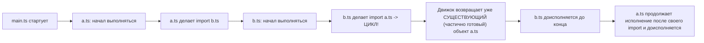
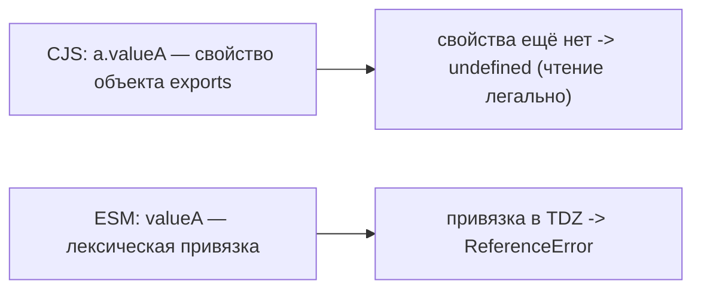

# Уровень 1 (подробно): Как модульные системы исполняют циклы

## 1. Проблема: один и тот же цикл ведёт себя по-разному

На уровне 0 мы разобрались, что такое цикл на уровне графа. Но граф — это статическая картинка. На практике важнее **динамика**: что конкретно происходит в момент, когда движок JS реально исполняет эти файлы по очереди. Именно здесь ESM (`import`/`export`) и CommonJS (`require`/`module.exports`) ведут себя принципиально по-разному — и именно здесь рождается большинство «необъяснимых» багов с циклами.

## 2. Порядок вычисления модулей: кто первый вошёл

Ключевое правило для обеих систем: когда модуль встречает зависимость, он **не ставит её в очередь на потом** — он немедленно передаёт управление зависимому модулю и ждёт, пока тот выполнится (или хотя бы дойдёт до места, где встретит цикл).

Смоделируем классический цикл: `main.ts` запускает `a.ts`, `a.ts` в процессе инициализации запрашивает `b.ts`, а `b.ts` в свою очередь запрашивает `a.ts` обратно.



Важно: движок не запускает `a.ts` заново и не падает в бесконечную рекурсию. Вместо этого он возвращает `b.ts` **тот же самый модульный объект `a.ts`, который уже существует, но ещё не полностью заполнен**. Дальше вопрос лишь в том, что именно из этого объекта в этот момент доступно.

## 3. CommonJS: частичные (partial) exports

В CommonJS `module.exports` — это обычный JS-объект, который заполняется **императивно**, инструкция за инструкцией, по мере исполнения файла сверху вниз.

```js
// a.js (CommonJS)
console.log('a.js: старт')
const b = require('./b.js')
console.log('a.js: то, что получили из b:', b)

exports.valueA = 'A is ready'
exports.useB = function () {
  return b.valueB // используется ЛЕНИВО — только при вызове функции
}
```

```js
// b.js (CommonJS)
console.log('b.js: старт')
const a = require('./a.js')
console.log('b.js: то, что получили из a:', a) // {} — a.js ещё не дошёл до exports.valueA!

exports.valueB = 'B is ready'
```

Если `main.js` делает `require('./a.js')`, порядок будет таким:

```
a.js: старт
b.js: старт
b.js: то, что получили из a: {}      <-- частичный (пустой) объект!
a.js: то, что получили из b: { valueB: 'B is ready' }
```

`b.js` получает `a` в виде **пустого объекта `{}`** — потому что на момент, когда `b.js` вызвал `require('./a.js')`, файл `a.js` ещё не успел дойти до строчки `exports.valueA = ...`. Обращение к `a.valueA` внутри `b.js` на верхнем уровне даёт `undefined`, а не ошибку — в этом коварство CJS: он **молчит**, подсовывая недостающее значение как `undefined`.

Механика здесь такая: `require` возвращает **ссылку** на объект `module.exports` модуля `a.js` (Node кэширует его в `require.cache`), а не снимок-копию. Переменная `a` внутри `b.js` — это тот же самый объект, что и `exports` в `a.js`; пустым он выглядит лишь в этот конкретный момент. Как только `a.js` доисполнится и выполнит `exports.valueA = ...`, тот же объект `a` внутри `b.js` автоматически обретёт `valueA`. Значит, `undefined` здесь — следствие не «снимка значения», а **момента чтения**: `b.js` заглянул в объект слишком рано. Прочитай `b.js` то же `a.valueA` лениво — внутри функции, вызванной уже после полной загрузки обоих модулей, — он получил бы корректное `'A is ready'`, ровно как в ESM.

## 4. ESM: живые привязки (live bindings)

В ES-модулях `import` создаёт **живую привязку (live binding)** к переменной модуля-источника. Это не снимок значения на момент импорта: если исходная переменная позже получит новое значение, импортирующий модуль увидит его автоматически, без повторного импорта.

Обрати внимание: речь именно о привязке к **переменной**, и это даже сильнее, чем ссылка на объект в CJS. `require` в CJS тоже отдаёт ссылку (на объект `module.exports`) — но там импортёр видит изменения только через _свойства_ этого объекта (`a.x`), а голое переприсваивание переменной модуля и деструктуризацию — уже нет (см. разбор ниже). Так что «ESM — ссылка, CJS — копия» — неверное упрощение: разница тоньше.

```ts
// counter.ts (ESM)
export let count = 0
export function increment() {
  count++
}
```

```ts
// display.ts (ESM)
import { count, increment } from './counter'

console.log(count) // 0
increment()
console.log(count) // 1 — тот же count автоматически "обновился"
```

Это принципиально другое поведение по сравнению с CJS. Важно не путать два случая:

- **Импорт объекта целиком** (`const counter = require('./counter')`) — это ссылка на `module.exports`, поэтому переприсваивания _свойств_ модулем (`exports.count = ...`) импортёр увидит через `counter.count`.
- **Деструктуризация** (`const { count } = require('./counter')`) — вот здесь `count` становится **копией примитива** на момент импорта и уже не обновится, даже когда модуль внутри изменит своё значение.

ESM же через `import { count }` связывает импортёра с самой _переменной_ модуля-источника, а не с её снимком: обновление видно всегда, без всяких `exports.x = ...` и независимо от того, деструктуризация это или нет.

## 5. TDZ: temporal dead zone при циклах

Живые привязки ESM решают проблему «устаревшей копии», но создают свою — **temporal dead zone**. Переменные, объявленные через `let`, `const` или `class`, физически существуют в области видимости с самого начала модуля, но находятся в TDZ до момента, когда движок дойдёт до строки их фактической инициализации. Обращение к ним в TDZ кидает `ReferenceError`.

```ts
// a.ts (ESM)
import { B_VALUE } from './b'

console.log(B_VALUE) // ⛔️ ReferenceError: Cannot access 'B_VALUE' before initialization
export const A_VALUE = 'A'
```

```ts
// b.ts (ESM)
import { A_VALUE } from './a' // на момент этого импорта a.ts ещё не дошёл до export const A_VALUE

export const B_VALUE = 'B'
```

Если `main.ts` импортирует `a.ts` первым: `a.ts` начинает исполняться → доходит до `import { B_VALUE } from './b'` → уступает `b.ts` → `b.ts` пытается получить `A_VALUE` из ещё не доинициализированного `a.ts` → `A_VALUE` физически объявлена (это `const`), но её присваивание ещё не выполнено → `ReferenceError`.

📌 В отличие от CJS, который в похожей ситуации молча даёт `undefined`, ESM с `const`/`let`/`class` в цикле **явно падает** — что на самом деле удобнее для отладки, хотя субъективно выглядит «более пугающе».

### 5.1. Тот же пример, но на ESM: почему результат другой

Естественный вопрос: если переписать CJS-пример из раздела 3 «один в один» на ESM, получим ли мы тот же результат — пустой объект и `undefined`? Нет. Идиоматичный ESM-аналог **не молчит, а бросает `ReferenceError`**:

```ts
// a.mjs
console.log('a: старт')
import { valueB } from './b.mjs'
console.log('a: получили из b:', valueB)
export const valueA = 'A is ready'
```

```ts
// b.mjs
console.log('b: старт')
import { valueA } from './a.mjs'
console.log('b: получили из a:', valueA) // ⛔️ ReferenceError: Cannot access 'valueA' before initialization
export const valueB = 'B is ready'
```

Порядок тот же, что и в CJS: `a` уступает `b`, `b` тянет `a` обратно. Но там, где CJS вернул `{}` и тихий `undefined`, ESM падает — и причина **не** в «ссылке против копии» (обе системы работают со ссылками), а в том, **что именно** мы читаем:



`exports.valueA = ...` — это присваивание свойства обычному объекту в рантайме: пока строка не выполнилась, свойства просто нет, а чтение отсутствующего свойства в JS всегда легально и даёт `undefined`. `export const valueA` — это лексическая привязка с временной мёртвой зоной: читать её до инициализации язык запрещает, отсюда бросок.

**Когда ESM всё же ведёт себя «как CJS».** Совпадение получится, только если уйти от идиоматичной связки «`const`/`let`/`class` + чтение на верхнем уровне»:

- **Ленивое чтение** — если `b` обращается к `valueA` не на верхнем уровне, а внутри функции, вызванной после полной загрузки: работают оба (CJS — потому что ссылка дозаполнилась, ESM — потому что привязка к этому моменту инициализирована).
- **Экспорт-функция** — `export function useB() {}` инициализируется на этапе линковки (hoisting), поэтому доступна ещё до исполнения тела модуля, в отличие от `const`. Ошибки нет.
- **`export var valueA`** — у `var` нет TDZ (стартует как `undefined`), поэтому раннее чтение даст `undefined`, буквально как в CJS. Неидиоматично, но показательно: разница именно в типе привязки, а не в «магии ESM».

Вывод: в типичном коде цикл на именованных `const`/`let`/`class` в ESM **падает явно там, где CJS молчит с `undefined`** — и оба сигнала указывают на одну и ту же проблему в графе.

## 6. Почему один и тот же цикл иногда работает, а иногда — нет

Всё решает **момент обращения** к значению из циклического импорта:

```ts
// ❌ Обращение на верхнем уровне модуля — во время инициализации
import { B_VALUE } from './b'
console.log(B_VALUE) // упадёт, если a.ts инициализировался раньше b.ts

// ✅ Обращение внутри функции — она вызовется позже, когда всё готово
import { B_VALUE } from './b'

export function useB() {
  console.log(B_VALUE) // к моменту ВЫЗОВА этой функции b.ts уже точно доинициализирован
}
```

Функция — это отложенное вычисление. Она не исполняется в момент объявления, поэтому обращение к `B_VALUE` внутри неё произойдёт значительно позже, когда оба модуля полностью прогрузились (например, при первом клике пользователя или первом вызове API-хендлера). Это и есть «ленивое обращение», которое временно спасает от крашей — но не устраняет сам факт наличия цикла в графе (устранение цикла — тема уровня 7).

## ⚠️ Частые ошибки начинающих

### Ошибка 1: считать, что CJS и ESM ведут себя одинаково при цикле

```js
// ❌ "У меня CJS-проект, ошибки TDZ мне не грозят — значит, цикл безопасен"
```

Почему это проблема: в CJS вместо явной ошибки вы получите **тихий** `undefined` — которое всплывёт значительно позже и в куда менее очевидном месте (например, `Cannot read property 'x' of undefined` где-то в глубине рендера).

```js
// ✅ Правильно — относиться к обоим случаям одинаково серьёзно:
// TDZ явно указывает на цикл через краш,
// partial exports скрывают его через undefined — оба сигнализируют о проблеме
```

### Ошибка 2: экспортировать значение через `const` на верхнем уровне и сразу его использовать в другом модуле цикла

```ts
// ❌ Оба на верхнем уровне модуля
// a.ts
import { B_READY } from './b'
export const A_CONFIG = { ready: B_READY } // риск TDZ
```

Почему это проблема: любое использование значения из циклической зависимости на верхнем уровне модуля — потенциальная точка отказа, зависящая от порядка первого импорта, который сборщик или окружение вправе поменять при рефакторинге.

```ts
// ✅ Правильно — обернуть в геттер/функцию, вызываемую после полной инициализации
// a.ts
import { getBReady } from './b'
export function getAConfig() {
  return { ready: getBReady() }
}
```

### Ошибка 3: «перестановка импортов исправила баг — значит, цикла больше нет»

Почему это проблема: перестановка `import` действительно может изменить порядок инициализации и «случайно» убрать симптом (TDZ/undefined) для текущей версии кода — но цикл в графе как был, так и остался, и он снова проявится при следующем изменении порядка (например, при добавлении нового модуля, который сам того не желая станет импортироваться первым).

```ts
// ✅ Правильно — устранять цикл архитектурно (см. уровень 7),
// а не подбирать "работающий" порядок импортов методом проб и ошибок
```

## 💡 Лучшие практики

- 📌 В CJS-проектах: если модуль экспортирует что-то, что используется другим модулем цикла на верхнем уровне — проверяйте фактическое значение (`console.log`), не полагайтесь на то, что «раз файл не упал — значит, всё корректно».
- 📌 В ESM-проектах: воспринимайте `ReferenceError` из-за TDZ не как досадную помеху, а как явный сигнал компилятора о реальной архитектурной проблеме — он появился не просто так.
- 📌 Откладывайте использование значений из потенциально циклических импортов внутрь функций/геттеров вместо верхнего уровня модуля — это безопасный временный приём, но не замена архитектурному решению.
- 📌 Не полагайтесь на «оно же работает» как на доказательство отсутствия цикла — поведение зависит от порядка первого импорта, который может незаметно поменяться при любом рефакторинге в другом месте проекта.
