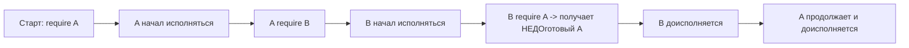

# Уровень 1: Как модульные системы исполняют циклы

## Суть проблемы

Цикл существует в двух мирах одновременно: на уровне графа (это мы разобрали на уровне 0) и на уровне **исполнения** — а вот тут начинаются сюрпризы. Один и тот же цикл `A ⇄ B` в зависимости от того, что именно экспортируется и когда именно используется, может:

- отработать без единой проблемы;
- незаметно подсунуть `undefined` вместо значения;
- упасть с `ReferenceError` (TDZ — temporal dead zone).

Причина — разница в том, **как** ESM (`import`/`export`) и CommonJS (`require`/`module.exports`) вычисляют модули при цикле.

## Порядок вычисления модулей

Когда движок встречает `require('./b')` или `import ... from './b'` внутри модуля `A`, он не может просто «встать и подождать» — он начинает выполнять `B` прямо сейчас, до того как `A` доделал свою инициализацию. Если `B`, в свою очередь, импортирует `A`, движок обнаруживает, что `A` уже «в процессе» — и отдаёт `B` **неполную**, частично инициализированную версию `A`.

## CommonJS: partial exports

В CJS объект `module.exports` заполняется постепенно, по ходу выполнения файла сверху вниз. Если `B` спрашивает `A.someExport` в момент, когда `A` до этой строчки ещё не дошёл — получит `undefined`.

При этом `require` возвращает **ссылку** на объект `module.exports`, а не его копию: тот же объект `A` внутри `B` доизменится, когда `A` доисполнится. Поэтому `undefined` — это не «снимок значения», а следствие того, что чтение произошло **слишком рано** (на верхнем уровне). Ленивое чтение — внутри функции, вызванной позже, — увидит уже готовое значение, как и в ESM.

## ESM: live bindings + TDZ

ESM устроен хитрее: `import` — это **живая привязка** (live binding) к переменной в модуле-источнике, а не снимок её значения на момент импорта. (В CJS `require` тоже отдаёт ссылку на объект, а не копию — но ESM привязывается к самой переменной, что ещё сильнее; подробнее — в «Подробно».) Значение обновится само, когда источник доинициализируется — _если_ к моменту обращения к нему переменная уже прошла свою инициализацию. Если же это `let`/`const`/`class`, объявленные, но ещё не инициализированные — попытка их прочитать до вычисления упадёт с `ReferenceError` (temporal dead zone, TDZ).

## Почему «то падает, то работает»

Ключевое отличие — **когда** происходит обращение к значению цикличного импорта:

- ✅ Внутри функции, которая вызовется **позже** (например, в обработчике события) — к моменту вызова оба модуля уже полностью инициализированы, всё работает.
- ❌ На **верхнем уровне модуля**, сразу при инициализации — это как раз момент, когда партнёр по циклу ещё не готов.

💡 Практический вывод: «ленивое» обращение (внутри функции) — самый частый и простой способ безопасно жить с существующим циклом, пока не устранили его архитектурно.
