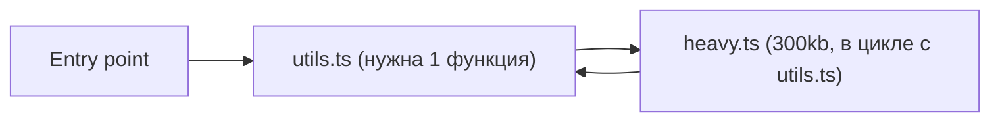
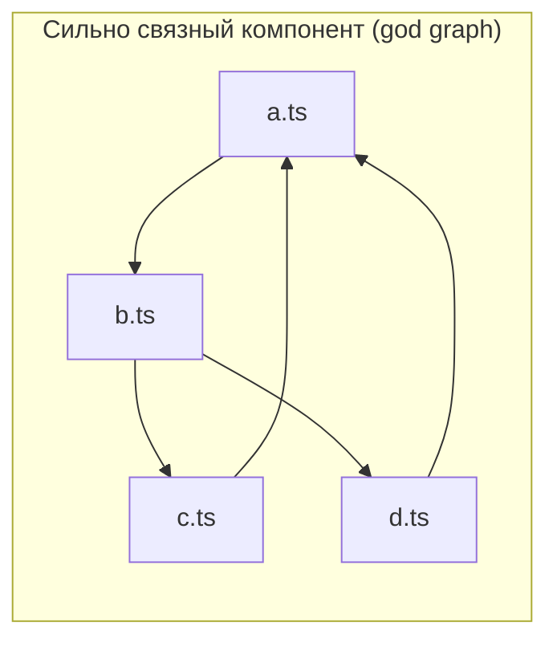

# Уровень 2 (подробно): Чем грозят циклы

## 1. Проблема: цена, которую платят незаметно

На уровне 1 мы увидели, что цикл может «просто работать». Именно поэтому циклические зависимости так живучи в реальных проектах — они не кричат о себе сразу. Но цена накапливается: она размазана по разным зонам разработки — надёжность, сборка, DX (developer experience), тестирование — и каждая из них бьёт по-своему.

## 2. Рантайм: TDZ-краши и хрупкий порядок импортов

Мы подробно разобрали это на уровне 1: цикл может годами «работать», а потом сломаться из-за, казалось бы, никак не связанного изменения — например, кто-то добавил новый `import` в третий модуль, который раньше не был частью инициализационной цепочки.

```ts
// main.ts — ДО рефакторинга
import { setupApp } from './app'
setupApp()
// Порядок инициализации: app.ts -> a.ts -> b.ts. Всё ок.

// main.ts — ПОСЛЕ добавления нового импорта в начало файла
import './analytics' // <-- эта строка теперь запускается ПЕРВОЙ
import { setupApp } from './app'
setupApp()
// Если analytics.ts транзитивно тянет за собой b.ts РАНЬШЕ, чем a.ts —
// порядок инициализации внутри цикла a.ts/b.ts меняется,
// и то, что раньше работало, теперь падает с TDZ ReferenceError
```

📌 Это одна из самых обидных категорий багов: тесты проходили, локально всё работало, а на проде — падение при холодном старте, потому что бандлер собрал чанки в другом порядке.

## 3. Сборка: сломанный tree-shaking и code-splitting

**Tree-shaking** — это способность бандлера выкинуть неиспользуемый экспорт из финального бандла. Для этого бандлер должен доказать: «этот кусок кода никто не использует и у него нет побочных эффектов». Цикл ломает эту логику — модули цикла становятся взаимно обусловленными, и статический анализатор вынужден консервативно оставлять оба модуля целиком, «на всякий случай», даже если реально нужен один маленький экспорт.



В этом примере даже если из `utils.ts` реально нужна одна маленькая функция, наличие цикла с `heavy.ts` вынуждает бандлер втянуть в общий чанк весь `heavy.ts` целиком — просто потому, что он не может доказать безопасность разделения.

То же самое происходит с **code-splitting**: динамический `import()` призван вынести код в отдельный чанк, догружаемый по требованию. Но если модуль внутри динамического чанка участвует в цикле с модулем из основного бандла, границы размываются — бандлер вынужден либо тащить весь цикл в основной чанк, либо создавать неэффективные пересекающиеся чанки (дублирование кода).

## 4. Разработка: медленный HMR и полная пересборка

Hot Module Replacement (HMR) работает по принципу инвалидации: «что нужно пересобрать после правки этого файла?». В здоровом ациклическом графе ответ ограничен явными потребителями изменённого модуля. В графе с циклами модуль `A` формально зависит от `B`, а `B` — от `A`, поэтому инструмент инвалидации на всякий случай считает, что изменение в любом из них может повлиять на весь связанный кластер — и перезагружает страницу целиком вместо точечной замены модуля. На больших проектах с раскинутым по всей кодовой базе циклом это превращает HMR из мгновенной операции в секунды ожидания при каждом сохранении файла.

## 5. Тестирование: моки тянут за собой весь клубок

Юнит-тест по определению тестирует один модуль в изоляции, мокая его зависимости.

```ts
// order.test.ts — модуль order.ts участвует в цикле с user.ts
import { describeOrderOwner } from './order'

// Чтобы замокать user.ts, нужно понимать ВСЮ логику взаимодействия
// order.ts <-> user.ts, потому что они инициализируются как единое целое
jest.mock('./user', () => ({
  formatUser: jest.fn(() => 'Mocked User'),
}))

test('describeOrderOwner works', () => {
  // Если внутри order.ts на верхнем уровне есть обращение
  // к чему-то из user.ts (см. уровень 1), мок должен полностью
  // повторить порядок инициализации — иначе тест падает с TDZ/undefined
  // ещё ДО того, как дошёл до самого тестируемого поведения
  expect(describeOrderOwner('1', 'Alice')).toBe('Order #1 belongs to Mocked User')
})
```

Проблема не в том, что мокать сложно синтаксически — а в том, что **непонятно, какую именно часть клубка нужно замокать**, чтобы тест не упал по причинам, не имеющим отношения к тестируемой логике. Это увеличивает время написания тестов и делает их хрупкими к рефакторингу.

## 6. God graph: архитектурная неразделимость

Когда циклов в проекте становится много, они начинают пересекаться друг с другом — модуль `A` в цикле с `B`, `B` — в цикле с `C`, `C` — снова с `A` по другому пути. Постепенно значительная часть графа импортов схлопывается в один огромный сильно связный компонент (strongly connected component, SCC) — **god graph**. У такого компонента нет внутренних границ: любое изменение потенциально влияет на весь компонент, и ни один модуль из него нельзя выдернуть и переиспользовать отдельно — например, вынести в отдельный npm-пакет или лениво подгрузить только его.



## Симптом → причина → опасность

| Симптом                                         | Причина                                                                    | Чем опасно                                            |
| ----------------------------------------------- | -------------------------------------------------------------------------- | ----------------------------------------------------- |
| `ReferenceError` при старте                     | TDZ: обращение к `let`/`const`/`class` до инициализации в цикле ESM        | Краш приложения, зависящий от порядка импортов        |
| Тихий `undefined` вместо значения               | Partial exports: обращение к CJS `module.exports` до того, как он заполнен | Баг проявляется не сразу, а в неожиданном месте позже |
| Бандл больше ожидаемого                         | Сломанный tree-shaking: бандлер не может разделить модули цикла            | Лишний вес в продакшене, медленная загрузка           |
| Медленный HMR / полная перезагрузка страницы    | Инвалидация не может определить границы влияния изменения                  | Замедление итераций разработки                        |
| Тесты падают по непонятным причинам при моках   | Модуль из цикла тянет за собой инициализацию всего кластера                | Хрупкие тесты, дорогая поддержка                      |
| Модуль нельзя вынести/переиспользовать отдельно | God graph: модули слились в один сильно связный компонент                  | Невозможность модуляризации и переиспользования       |

## ⚠️ Частые ошибки начинающих

### Ошибка 1: чинить только конкретный крашнувшийся сценарий

```ts
// ❌ Добавили try/catch вокруг TDZ-ошибки и на этом успокоились
try {
  console.log(B_VALUE)
} catch {
  console.log('fallback')
}
```

Почему это проблема: `try/catch` маскирует симптом, но архитектурная причина (цикл) остаётся, и он проявится снова в другом месте — например, при следующем обращении к другому экспорту того же цикла.

```ts
// ✅ Правильно — устранять сам цикл (техники разрыва — уровень 7),
// а не подавлять конкретные проявления его последствий
```

### Ошибка 2: игнорировать «тихие» проблемы, потому что нет краша

```ts
// ❌ "У нас в CJS-проекте нигде не падает — значит, циклы не мешают"
```

Почему это проблема: отсутствие краша в CJS не означает отсутствие проблем — partial exports тихо подсовывают `undefined`, а сломанный tree-shaking незаметно раздувает бандл. Обе проблемы не кидают исключений, но обе стоят реальных денег (медленная загрузка, скрытые баги).

```ts
// ✅ Правильно — регулярно анализировать граф зависимостей инструментами
// (уровень 5) и размер бандла, а не полагаться только на отсутствие ошибок
```

### Ошибка 3: считать, что проблема касается только «больших» проектов

Почему это проблема: даже в небольшом проекте один-единственный цикл между часто изменяемыми модулями способен ощутимо замедлить HMR и сделать пару тестов хрупкими — эффект пропорционален не размеру проекта, а тому, насколько «горячие» (часто редактируемые) модули вовлечены в цикл.

```ts
// ✅ Правильно — следить за циклами с первого дня проекта,
// а не откладывать до момента, когда граф станет большим и запутанным
```

## 💡 Лучшие практики

- 📌 Встройте детектор циклов (madge, dependency-cruiser, ESLint `import/no-cycle` — уровни 5-6) в CI как можно раньше — дешевле не пускать новый цикл в кодовую базу, чем потом распутывать god graph.
- 📌 Если наблюдаете необъяснимо медленный HMR — в первую очередь проверьте граф импортов на циклы, это частая, но неочевидная причина.
- 📌 При написании тестов: если для мока одного модуля приходится тянуть много контекста из «соседних» модулей — это красный флаг, вероятно, они в цикле, и стоит взглянуть на архитектуру.
- 📌 Регулярно проверяйте размер бандла по чанкам (`source-map-explorer`, `webpack-bundle-analyzer`) — неожиданно большой чанк часто указывает на цикл, ломающий разделение кода.
