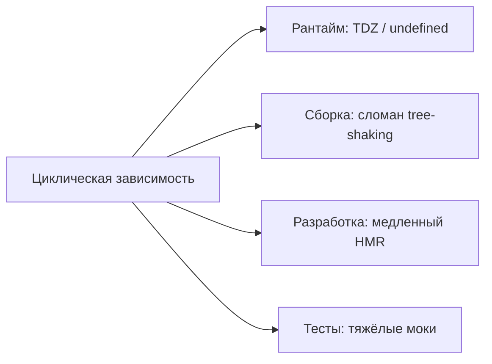

# Уровень 2: Чем грозят циклы

## Суть проблемы

Цикл — не абстрактная теоретическая неприятность, а источник вполне конкретных, дорогих в отладке проблем. Их можно сгруппировать в четыре зоны: **надёжность рантайма**, **качество сборки**, **скорость разработки**, **тестируемость**.

## Рантайм: хрупкость порядка импортов

Мы уже видели на уровне 1: результат цикла зависит от того, в каком порядке модули были затронуты первыми. Стоит переставить местами два `import` в третьем, вообще не связанном файле — и цикл, который «всегда работал», внезапно кидает `ReferenceError` или тихо подсовывает `undefined`. Такой баг почти невозможно поймать código-ревью — он проявляется только в конкретных сценариях запуска.

## Сборка: сломанный tree-shaking и code-splitting

Бандлер (Rollup, webpack, esbuild) умеет выбрасывать неиспользуемый код и резать приложение на чанки — но только если может доказать, что модуль **не имеет побочных эффектов** и его границы чёткие. Цикл рушит это доказательство: бандлер вынужден считать оба модуля единым неразделимым целым и тащить их в бандл вместе, даже если реально нужна половина кода.

## Разработка: медленный HMR и пересборка

При Hot Module Replacement сборщик должен понять: «что нужно пересобрать после правки этого файла?». Для модулей без циклов ответ простой — сам файл и то, что явно от него зависит. Для модулей в цикле ответ размывается: изменение в `A` может требовать пересборки всей группы `A-B-C`, потому что неясно, где заканчивается зона влияния.

## Тесты: тяжёлые моки

Чтобы протестировать модуль изолированно, юнит-тест обычно мокает его соседей. Но замокать один модуль из цикла — значит явно или неявно утащить в тест весь клубок взаимно зависимых модулей, потому что они инициализируются вместе. Тест перестаёт быть «юнит»-тестом и превращается в мини-интеграционный, со всеми его хрупкостями.

## God graph: невозможность переиспользовать модуль

Когда циклов много, граф зависимостей проекта постепенно превращается в один слипшийся «ком» — так называемый **god graph**. У такого графа нет чётких границ: нельзя выдернуть один модуль и использовать его отдельно (например, в другом проекте) — он тянет за собой половину кодовой базы.

📌 Итог: цикл сам по себе — это не runtime-исключение (хотя и оно возможно), а **симптом повышенной связанности**, которая бьёт сразу по нескольким метрикам качества кода.
