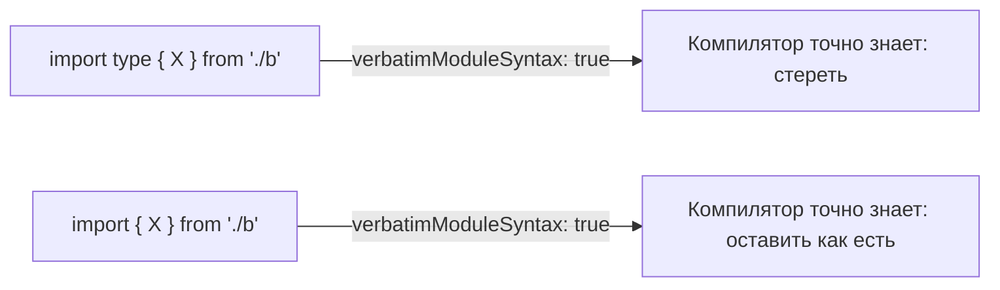

# Уровень 3 (подробно): Типовые vs рантайм-циклы

## 1. Проблема: madge и глаз видят «цикл», но что он значит?

Инструменты обнаружения циклов (madge, dependency-cruiser, `import/no-cycle`) в базовой конфигурации смотрят на **весь** `.ts`-файл целиком — то есть на все `import`, включая те, что нужны исключительно для типизации. В итоге отчёт показывает цикл `user.ts → order.ts → user.ts` — но не отвечает на главный вопрос: **этот цикл доживёт до рантайма или исчезнет при компиляции?**

Без ответа на этот вопрос разработчик либо:

- паникует и тратит время на разрыв безобидного типового цикла,
- либо, привыкнув, что «циклы у нас всегда безопасны», пропускает по-настоящему опасный рантайм-цикл.

Нужно уметь классифицировать цикл за секунды.

## 2. Пример: одна и та же структура кода, разный результат

**Файлы `user.ts` и `order.ts`, только типовая связь:**

```ts
// user.ts
import type { Order } from './order'

export interface User {
  id: string
  orders: Order[]
}
```

```ts
// order.ts
import type { User } from './user'

export interface Order {
  id: string
  owner: User
}
```

Скомпилированный JS (`tsc`, target ESM):

```js
// user.js
export {}
```

```js
// order.js
export {}
```

Импортов между файлами **не осталось вообще** — `import type` стирается компилятором целиком, вместе со строкой импорта. Цикла в рантайме нет, потому что нет рёбер графа: файлы даже не знают друг о друге при исполнении.

**Тот же сценарий, но с value-импортом:**

```ts
// user.ts
import { formatOrder } from './order' // используется как функция

export class User {
  describe(order: Order) {
    return formatOrder(order)
  }
}
```

```ts
// order.ts
import { User } from './user' // используется как значение (instanceof, конструктор)

export function formatOrder(order: Order) {
  return order.owner instanceof User ? '...' : '...'
}
```

Здесь `import` остаётся в скомпилированном JS как есть — это уже полноценный рантайм-цикл со всеми рисками уровня 2 (TDZ, `undefined` при частичной инициализации, хрупкий порядок).

## 3. Как это работает: стирание типов компилятором

TypeScript (и любой транспилятор — esbuild, swc, Babel + `@babel/preset-typescript`) удаляет из вывода:

- все `interface`, `type X = ...`;
- `import type { ... }` целиком (сам оператор импорта);
- обычный `import { X }`, если `X` использовался **только** в типовых позициях — TS отслеживает это и сам решает не эмитить импорт (это называется "type-only import elision").

Но здесь и кроется опасность: элизия по умолчанию (без явного `import type`) — это эвристика компилятора. Она может ошибиться или повести себя неожиданно при повторном экспорте (`export { X } from './y'`), и именно поэтому современные тулчейны рекомендуют быть явными.

### Ключевые флаги компилятора

| Флаг                                                                  | Что делает                                                                                                                    | Зачем нужен для циклов                                                                                                                                 |
| --------------------------------------------------------------------- | ----------------------------------------------------------------------------------------------------------------------------- | ------------------------------------------------------------------------------------------------------------------------------------------------------ |
| `verbatimModuleSyntax`                                                | Запрещает "угадывание": если импорт не помечен `type`, он **всегда** остаётся в выводе как есть                               | Заставляет разработчика явно объявлять, какие импорты типовые — это делает типовые/рантайм-рёбра видимыми прямо в коде                                 |
| `isolatedModules`                                                     | Требует, чтобы каждый файл транспилировался независимо (важно для esbuild/swc/Babel, которые не видят типов из других файлов) | Без этого транспилятор без типовой информации не отличит `import { Foo }` (тип) от `import { Foo }` (значение) и может оставить лишний импорт в бандле |
| `importsNotUsedAsValues` (устаревший, заменён `verbatimModuleSyntax`) | Раньше управлял похожим поведением (`remove` / `preserve` / `error`)                                                          | Встречается в легаси-конфигах; при миграции на новый TS стоит заменить на `verbatimModuleSyntax`                                                       |



## 4. Приём: разрыв рантайм-цикла через `import type`

Если цикл возник из-за того, что модуль импортирует из соседа **только тип** (сигнатуру параметра, поле интерфейса), а не значение — замена `import` на `import type` полностью убирает ребро из рантайм-графа, ничего не ломая в типизации.

**До (рантайм-цикл, хотя `Order` используется только как тип):**

```ts
// user.ts
import { Order } from './order' // остаётся в JS, хотя используется только как тип

export class User {
  orders: Order[] = []
}
```

**После (типовый цикл, безопасно):**

```ts
// user.ts
import type { Order } from './order' // стирается компилятором

export class User {
  orders: Order[] = []
}
```

Это самый дешёвый способ «починить» цикл, обнаруженный madge/`no-cycle`: не переписывать архитектуру, а сначала проверить — может, часть импортов вообще не нужна в рантайме.

## 4.1 Второй приём: общий `types.ts`, когда типы связаны симметрично

Точечный `import type` отлично работает, когда одному модулю нужен один тип соседа. Но встречается и другой случай: модуль одновременно экспортирует тип **и** значение (`export interface Order` рядом с `export function formatOrder`), а сосед вынужден импортировать этот модуль целиком ради типа. Раз модуль смешанный, `import type` на стороне соседа не помогает разложить ответственность — тип и значение всё ещё физически живут в одном файле, и завтра кто-то снова случайно возьмёт `import` вместо `import type`.

Более устойчивое решение — вынести тип в отдельный файл (`types.ts`), который ничего не импортирует и ничего не исполняет. Тогда:

```ts
// types.ts — нет ни одного import, только типы
export interface Order {
  id: string
  owner: string
}
```

```ts
// order.ts — рантайм-код, тип берёт из types.ts
import { userName } from './user'
import type { Order } from './types'

export function formatOrder(order: Order): string {
  return `${order.id} for ${userName}`
}
```

```ts
// user.ts — тоже берёт тип из types.ts, а не из order.ts
import type { Order } from './types'

export const userName = 'Ann'
```

Приём особенно оправдан, когда типы **симметричны** — оба модуля ссылаются друг на друга в собственных интерфейсах (`A.partner: B` и `B.partner: A`). В этом случае вынос общих типов в третий файл убирает саму возможность случайно завести рантайм-импорт между модулями, а не просто чинит текущий цикл разово.

📌 `types.ts`, состоящий только из `interface`/`type`, в принципе не может участвовать в рантайм-цикле — в него ничего не компилируется, кроме `export {}`.

## Частые ошибки новичков

**Ошибка 1: пытаться `import type` для enum, который используется как значение**

```ts
// ❌ status.ts экспортирует enum
export enum Status {
  Active,
  Archived,
}

// user.ts
import type { Status } from './status'

export function check(s: Status) {
  return s === Status.Active // ❌ ошибка компиляции: Status.Active — обращение к значению,
  // а Status импортирован только как тип
}
```

`enum` в TS — это не просто тип, а ещё и рантайм-объект (кроме `const enum`, но и там есть нюансы). Если используется значение (`Status.Active`), импорт обязан быть value-импортом.

```ts
// ✅ импортируем как значение — enum и как тип, и как объект
import { Status } from './status'

export function check(s: Status) {
  return s === Status.Active
}
```

**Ошибка 2: считать любой цикл через `interface`/`type` автоматически безопасным без проверки флагов**

```ts
// ❌ если verbatimModuleSyntax выключен и isolatedModules выключен,
// эвристика компилятора не гарантирована при работе через esbuild/swc в билд-пайплайне
import { Order } from './order' // выглядит "как тип", но явно не помечено
```

Без `import type` и без `isolatedModules`/`verbatimModuleSyntax` транспиляторы без полного тайпчекера (esbuild, swc, Babel) не знают, тип это или значение, и в спорных случаях могут **оставить импорт** в выводе — цикл останется в рантайме, хотя разработчик был уверен, что он «просто типовой».

```ts
// ✅ явное намерение — надёжно в любом тулчейне
import type { Order } from './order'
```

**Ошибка 3: путать `class`, используемый только как тип, с обычным типом**

```ts
// ❌ класс используется только в сигнатуре, но импортирован как значение —
// хотя тут можно было бы обойтись import type
import { Repository } from './repository'

function useRepo(repo: Repository) {
  // Repository нигде не используется как значение (нет `new Repository()`, `instanceof`)
}
```

```ts
// ✅ если класс нужен ТОЛЬКО в типовой позиции — используем import type,
// это разрывает потенциальный рантайм-цикл
import type { Repository } from './repository'

function useRepo(repo: Repository) {}
```

**Ошибка 4: декораторы и `import type`**

```ts
// ❌ класс-декоратор — это вызов функции в рантайме,
// import type для него использовать нельзя
import type { Injectable } from './di'

@Injectable() // ошибка: Injectable импортирован только как тип, но вызывается как значение
export class UserService {}
```

## Хорошие практики

- Включай `verbatimModuleSyntax: true` в новых проектах — он не даёт компилятору "угадывать" и заставляет расставлять `import type` осознанно.
- При работе с esbuild/swc/Babel как основным транспилятором обязательно включай `isolatedModules: true` — иначе тайпчекер (`tsc`) и билд-тул могут по-разному решить судьбу цикла.
- При отчёте madge/dependency-cruiser о цикле — сначала проверяй, есть ли в цепочке хотя бы один value-импорт. Если все импорты в цепочке — `import type`, цикл безопасен и чинить архитектуру не обязательно (но стоит явно задокументировать это решение).
- Настрой ESLint-правило `@typescript-eslint/consistent-type-imports` — оно автоматически приводит `import { X }` к `import type { X }`, когда `X` используется только как тип, снижая риск случайно оставить value-импорт там, где нужен только тип.
- Не путай "безопасно с точки зрения рантайма" с "архитектурно правильно": типовый цикл всё ещё сигнализирует о слишком тесной связи модулей и стоит держать в поле зрения.
