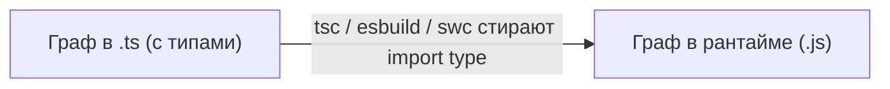

# Уровень 3: Типовые vs рантайм-циклы

## Аналогия: чертёж и стройка

Представь чертёж дома и саму стройку. На чертеже комната А ссылается на комнату Б («смотри размеры на листе 2»), а комната Б ссылается обратно на комнату А. Это взаимная ссылка — но она существует только на бумаге. Когда дом уже построен, чертежи можно выбросить: они не часть стен, не часть фундамента, они не мешают зданию стоять. А вот если бы труба из комнаты А физически проходила через комнату Б и обратно — это уже реальная, «несущая» зависимость, которую нельзя просто стереть после стройки.

В TypeScript ровно так же: `import type { X } from './b'` — это ссылка «только для чертежа», для компилятора. `import { x } from './b'` — это «труба», которая останется в здании (в скомпилированном JS-файле) и будет исполняться в рантайме.

## Два разных графа

У TS-проекта на самом деле два графа зависимостей, и они не обязаны совпадать:

Если цикл существует **только** в типовом графе — он не опасен: TDZ-крашей, `undefined` при инициализации и хрупкого порядка загрузки не будет, потому что в скомпилированном коде этого ребра графа попросту нет. Опасен только цикл, который остаётся в рантайм-графе — то есть построен на `import` **значений** (функций, классов, констант, инстансов).

## Как отличить

- `import type { Foo } from './b'` — стирается компилятором целиком → безопасно даже в цикле.
- `import { Foo } from './b'`, где `Foo` — тип, но объявлен без `import type`, а флаг `verbatimModuleSyntax`/`isolatedModules` включён — компилятор может не суметь сам понять, что импорт «только тип», и потребует явной аннотации.
- `import { SomeEnum } from './b'` или `import { SomeClass } from './b'` — это **значения** (`enum` компилируется в объект, класс используется как конструктор), даже если ты используешь их «как тип» в сигнатурах. `import type` тут использовать нельзя, если нужно и значение.

📌 Запомнить: цикл не опасен сам по себе — опасен **рантайм**-цикл. Первый шаг диагностики — понять, из какого графа цикл: типового или рантайм-графа.
