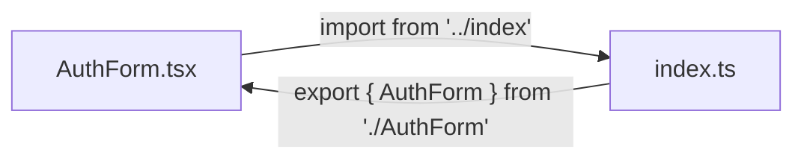
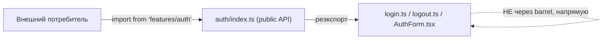

# Уровень 4 (подробно): Barrel-файлы как «фабрика циклов»

## 1. Проблема: удобство public API против скрытых циклов

Barrel-файл (`index.ts`, реэкспортирующий содержимое папки) — стандартный паттерн в React/TS-проектах, особенно в архитектурах вроде Feature-Sliced Design, где он выполняет роль **public API слайса**. Снаружи это выглядит отлично:

```ts
// внешний код, например widgets/header
import { AuthForm, login } from 'features/auth'
```

Потребителю не нужно знать про внутреннюю структуру `features/auth` — он получает готовый фасад. Проблема начинается, когда **сам** код внутри `features/auth` тоже начинает импортировать через этот же `index.ts`, вместо того чтобы обращаться к соседним файлам напрямую.

## 2. Пример 1: self-import цикл

```
features/auth/
├── index.ts       — barrel
├── login.ts
├── logout.ts
└── AuthForm.tsx
```

```ts
// index.ts
export { login } from './login'
export { logout } from './logout'
export { AuthForm } from './AuthForm'
```

```ts
// AuthForm.tsx
import { login } from '../index' // ❌ импорт через собственный barrel

export function AuthForm() {
  const handleSubmit = () => login()
  // ...
}
```

Граф зависимостей:



`AuthForm.tsx` зависит от `index.ts`, а `index.ts` зависит от `AuthForm.tsx` (он же его реэкспортирует). Формально это цикл A → B → A, хотя по смыслу задачи `AuthForm.tsx` просто хотел использовать соседнюю функцию `login` — путь через barrel был не нужен вообще.

## 3. Пример 2: раздувание графа между слайсами («barrel hell»)

```
features/
├── auth/
│   ├── index.ts     — export { login, AuthForm, useSession, validateToken, ... }
│   └── ...
└── profile/
    ├── index.ts      — export { ProfileCard, updateProfile, ... }
    └── ...
```

```ts
// features/profile/ProfileCard.tsx
import { useSession } from '../auth' // тянет ВЕСЬ barrel auth, а не только useSession

// features/auth/AuthForm.tsx
import { ProfileCard } from '../profile' // тянет ВЕСЬ barrel profile
```

Даже если `AuthForm.tsx` и `ProfileCard.tsx` по сути не пересекаются напрямую, оба barrel-файла реэкспортируют всё содержимое своих папок — и статический анализатор (madge, dependency-cruiser) увидит цикл `auth ⇄ profile`, потому что реальные графовые рёбра идут не между двумя конкретными файлами, а между двумя barrel-узлами, которые тянут за собой десятки файлов каждый.


Последствия barrel hell не ограничиваются циклами:

- **Tree-shaking ломается или ослабевает**: сборщик видит импорт из barrel и в консервативных случаях (особенно при наличии сайд-эффектов в реэкспортируемых модулях) вынужден включать в бандл больше кода, чем реально используется.
- **Сборка замедляется**: любое изменение одного файла внутри папки инвалидирует barrel, а значит и все модули, которые импортировали через него — граф пересборки шире, чем нужно.
- **IDE и tsc медленнее**: типовая проверка одного маленького файла неожиданно тянет за собой резолвинг всего barrel-графа.

## 4. Правило: прямой импорт внутри, barrel — только снаружи



**До (self-import цикл):**

```ts
// AuthForm.tsx
import { login } from '../index' // ❌
```

**После (прямой путь, цикла нет):**

```ts
// AuthForm.tsx
import { login } from './login' // ✅ прямой относительный путь к соседнему файлу
```

Правило универсально: **любой** модуль, физически находящийся внутри папки со своим barrel, должен обращаться к соседям напрямую. Barrel предназначен исключительно для модулей **снаружи** этой папки.

## ⚠️ Частые ошибки новичков

**Ошибка 1: импорт через `./index` или `.` вместо прямого пути**

```ts
// ❌ логика login.ts лежит рядом, но импортируется через barrel
import { validateToken } from '.'
```

```ts
// ✅ прямой путь к соседнему модулю в той же папке
import { validateToken } from './validateToken'
```

**Ошибка 2: barrel реэкспортирует ВСЁ содержимое папки без разбора, включая внутренние детали**

```ts
// ❌ index.ts экспортирует внутренние утилиты, которые не должны быть публичными
export * from './login'
export * from './logout'
export * from './internal/tokenStorage' // ⚠️ должно остаться приватной деталью
```

```ts
// ✅ barrel экспортирует только осознанный публичный контракт
export { login } from './login'
export { logout } from './logout'
// tokenStorage не реэкспортируется — используется только внутри features/auth
```

Чем шире barrel, тем больше вероятность, что кто-то (включая соседние файлы того же слайса) случайно завяжется на него, породив цикл или лишнюю связанность.

**Ошибка 3: считать, что перенос импорта на прямой путь всегда «ломает архитектуру»**

Некоторые разработчики боятся импортировать «мимо» barrel, думая, что это нарушает инкапсуляцию. На самом деле правило про public API касается **внешних** модулей — код внутри одной и той же папки/слайса не нарушает инкапсуляцию, обращаясь к соседям напрямую, потому что уже имеет полный доступ к их исходному коду.

**Ошибка 4: барrel, реэкспортирующий barrel другого слайса «для удобства»**

```ts
// ❌ features/dashboard/index.ts
export * from '../auth' // реэкспорт чужого barrel — расширяет цикл ещё дальше
export * from '../profile'
```

Такой «супер-barrel» затягивает в единый узел графа сразу несколько слайсов — при любом взаимном обращении между ними цикл гарантирован, а диагностировать его источник становится сложнее.

## ✅ Хорошие практики

- Импортируй файлы внутри одной папки/слайса напрямую, по относительному пути к конкретному файлу, а не через `index.ts`.
- Держи barrel «тонким»: экспортируй только то, что реально нужно внешним потребителям, не используй бездумный `export * from './internal'`.
- Настрой ESLint-правило `import/no-internal-modules` или `import/no-cycle` с учётом barrel-паттерна, чтобы автоматически ловить обращения к своему же `index.ts` изнутри папки.
- Не создавай «супер-barrel», реэкспортирующий чужие barrel — это резко увеличивает площадь потенциального цикла.
- При обнаружении цикла между двумя слайсами первым делом проверь: не идёт ли реальный путь цикла через их `index.ts` — часто конкретные файлы, вызвавшие цикл, вообще не связаны по смыслу задачи, просто barrel затянул лишнее.

## 7. Два приёма для практики

В практических заданиях уровня встречаются два разных по духу фикса:

1. **Прямой импорт вместо barrel** (задания 4.1–4.3) — модуль внутри пакета обращается к соседнему файлу напрямую, `index.ts` не трогаем. Подходит, когда проблема — только в пути импорта конкретного файла, а сама зависимость логически корректна и однонаправленна.
2. **Реорганизация barrel'ов** (задания 4.4–4.6) — когда прямой импорт «в обход» соседнего barrel сам по себе неправильный (например, две независимые фичи тянут друг друга), решение — вынести общее в третий модуль (`shared.ts`) и убрать реэкспорт чужого barrel «для удобства».

Различать эти два случая — ключевой навык: не каждый цикл через barrel лечится «просто замени `./index` на `./x`», иногда правильный фикс — это пересмотр того, что вообще должно быть публичным API и откуда берётся общий код.
