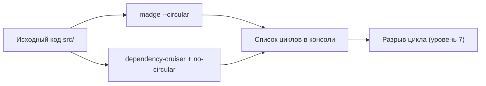

# Обнаружение циклов: madge и dependency-cruiser

## Аналогия

Циклическую зависимость нельзя увидеть глазами, листая файлы один за другим — это как искать петлю в клубке проводов, разглядывая каждый провод по отдельности. Нужен инструмент, который построит граф целиком и покажет: «вот здесь провод возвращается туда, откуда начался». `madge` и `dependency-cruiser` — это именно такие «просвечиватели» графа импортов.

## Суть

TypeScript и его компилятор **не проверяют** циклы импортов — код с циклом спокойно компилируется (см. уровень 2 про то, чем это чревато в рантайме). Поэтому обнаружение циклов — отдельная задача, для которой нужны специализированные инструменты:

- **madge** — быстро строит граф зависимостей и выводит список циклов флагом `--circular`. Хорош для разовой диагностики и визуализации (`--image graph.svg`).
- **dependency-cruiser** — полноценный линтер архитектурных правил. Правило `no-circular` — лишь одно из многих; инструмент умеет проверять границы слоёв, запрещённые импорты и многое другое, но требует конфигурации.

IDE (VS Code, WebStorm) могут подсвечивать проблемные импорты, но это не гарантия — полагаться на визуальный осмотр нельзя, нужен инструмент в CI.

## Диаграмма

## Дальше

В `task-5.1.md` — задание на чтение и интерпретацию вывода `madge` и `dependency-cruiser`. В квизе проверяются команды, флаги, чтение отчётов и понимание того, почему `tsc` эту задачу не решает.
