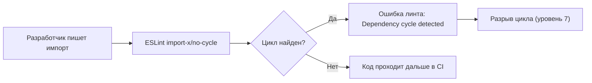

# ESLint import/no-cycle

## Аналогия

`madge`/`dependency-cruiser` — это как проверка здания инспектором раз в квартал: находит проблему, но постфактум. ESLint-правило `import/no-cycle` (в современном стеке — `import-x/no-cycle`) — это как сигнализация, которая срабатывает прямо в момент, когда рабочий кладёт кирпич не туда: разработчик видит красную волнистую линию под импортом ещё до коммита, до пуш-реквеста, до CI.

## Суть

Правило `no-cycle` встраивает поиск циклов в обычный линт-прогон — тот же самый, что уже проверяет неиспользуемые переменные и порядок импортов. Оно:

- Подсвечивает конкретный импорт, участвующий в цикле, прямо в редакторе.
- Сообщает путь цикла в тексте ошибки (`Dependency cycle detected` / `Dependency cycle via ./b:3`).
- Настраивается через `maxDepth` (глубина обхода графа — компромисс между полнотой поиска и скоростью), `ignoreExternal` (не учитывать node_modules), `allowUnsafeDynamicCyclicDependency` (разрешить цикл, если он разорван через `import()`).

Главное отличие от madge/dependency-cruiser — это самый ранний момент обнаружения: до рантайма, до сборки, ещё на этапе набора кода.

## Диаграмма

## Дальше

В `task-6.1.md` — разбор реального сообщения ESLint и опций правила. В квизе — что означает сообщение, как настроить опции и как связать правило с `import type`/dynamic import.
