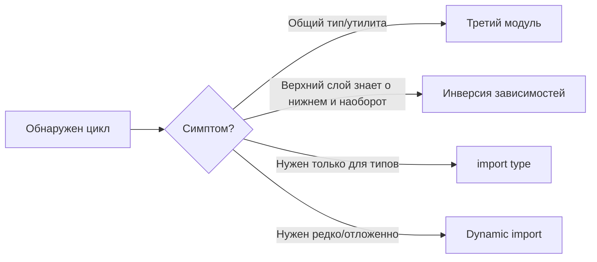

# Каталог приёмов разрыва циклов

## Аналогия

Цикл в графе импортов — это как затор из-за того, что две улицы с односторонним движением ссылаются друг на друга. Есть несколько способов расшить пробку: построить третью улицу-развязку, изменить направление одной из дорог, пустить объезд по требованию или вообще объединить два перекрёстка в один. У каждого приёма — своя цена и своя ситуация применения.

## Суть

Когда цикл найден (уровни 5–6), нужно выбрать конкретный приём разрыва:

1. **Третий модуль** — вынести общее (тип, константу, утилиту) в отдельный нижележащий файл, от которого зависят оба прежних участника цикла. Самый частый и самый чистый приём.
2. **Инверсия зависимостей (DIP)** — верхний модуль определяет интерфейс, нижний его реализует; зависимость направляется к абстракции, а не к конкретике.
3. **Внедрение зависимости** — передать нужное через параметр функции/конструктор вместо прямого импорта.
4. **События / mediator** — вместо прямого вызова A→B использовать publish/subscribe через шину событий.
5. **Dynamic `import()`** — отложить загрузку модуля до момента вызова, разрывая статический цикл.
6. **Слияние модулей** — если разделение на два файла было искусственным, объединить их в один.
7. **`import type`** — если реальный цикл нужен только ради типов, стереть его на этапе компиляции (см. уровень 3).

## Диаграмма

## Практика

Уровень даёт 9 LAB-заданий по трём приёмам — в каждом нужно отредактировать реальный код в песочнице так, чтобы граф импортов стал ациклическим:

1. **Инверсия зависимости (DIP)** — задания 7.1–7.3: убрать обратный импорт, внедрив нужную функцию параметром. Простое — 2 файла, среднее — цепочка из 3, сложное — приём применяется дважды.
2. **Dynamic `import()`** — задания 7.4–7.6: отложить импорт до момента вызова через `await import(...)`, статическое ребро цикла исчезает из графа.
3. **Вынос общего в третий модуль** — задания 7.7–7.9: создать новый нижележащий модуль и перенести туда общие типы, от которых оба (или несколько) прежних участника цикла зависят «вниз».

В каждом задании проверка «Проверить» подтверждает: цикл в графе рантайм-импортов исчез и приём применён именно тем способом, который требуется по условию.
