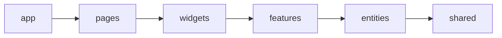
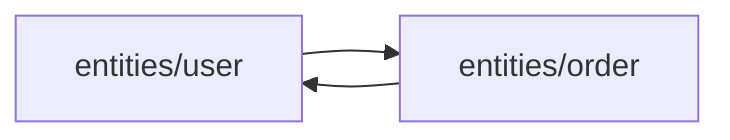

# Уровень 8 (подробно): FSD — слои, сегменты и однонаправленные импорты

## 1. Проблема: без правил проект превращается в спагетти-граф

Когда в проекте нет явной архитектурной конвенции, импорты появляются «по потребности» — разработчик пишет фичу, ему нужен кусок кода из другого места, и он его импортирует, не задумываясь о направлении:

```ts
// features/add-to-cart/model.ts
import { updateUserStats } from '../../widgets/user-dashboard/model' // widget → внутрь feature?!

// widgets/user-dashboard/model.ts
import { addToCart } from '../../features/add-to-cart/model' // feature → внутрь widget?!
```

Через полгода такой разработки граф импортов проекта выглядит как клубок ниток без единого направления, и обнаружение циклов превращается в постоянную борьбу с симптомами (уровни 5–7), а не с причиной. **Feature-Sliced Design** решает эту проблему не инструментами поиска циклов, а архитектурой, которая физически не позволяет циклам образовываться между крупными частями проекта.

## 2. Пример: 6 слоёв FSD v2

Официальная методология Feature-Sliced Design (v2) выделяет 6 слоёв, расположенных строго по убыванию уровня абстракции:



| Слой       | Назначение                                                        | Пример слайса                                         |
| ---------- | ----------------------------------------------------------------- | ----------------------------------------------------- |
| `app`      | Инициализация: провайдеры, роутинг, глобальные стили, точка входа | `app/providers`, `app/router`                         |
| `pages`    | Страницы — композиция виджетов под конкретный URL                 | `pages/product-page`, `pages/cart-page`               |
| `widgets`  | Крупные самостоятельные блоки UI                                  | `widgets/header`, `widgets/product-card`              |
| `features` | Пользовательские сценарии, действия                               | `features/add-to-cart`, `features/auth-by-email`      |
| `entities` | Бизнес-сущности предметной области                                | `entities/user`, `entities/product`, `entities/order` |
| `shared`   | Переиспользуемый код без знания о домене                          | `shared/ui`, `shared/api`, `shared/lib`               |

⚠️ В FSD v1 существовал ещё слой `processes` (сквозные бизнес-процессы вроде чекаута в несколько шагов) — в v2 он признан избыточным и устарел: такую логику размещают на уровне `pages` или выделяют в `features`.

Пример реальной структуры папок для интернет-магазина:

```
src/
├── app/
│   ├── providers/
│   └── router/
├── pages/
│   ├── product-page/
│   │   ├── ui/
│   │   └── index.ts
│   └── cart-page/
├── widgets/
│   ├── header/
│   └── product-card/
├── features/
│   ├── add-to-cart/
│   │   ├── ui/
│   │   ├── model/
│   │   └── index.ts
│   └── auth-by-email/
├── entities/
│   ├── user/
│   │   ├── ui/
│   │   ├── model/
│   │   ├── api/
│   │   └── index.ts
│   └── product/
└── shared/
    ├── ui/
    ├── api/
    ├── lib/
    └── config/
```

## 3. Как это работает: правило нисходящих импортов

**Правило импортов FSD**: модуль слоя `X` может импортировать код только из слоёв, расположенных **ниже** `X` в иерархии `app → pages → widgets → features → entities → shared`. Импорт «вбок» (между слайсами одного слоя без специальных механизмов, см. уровень 9) и импорт «вверх» запрещены.

```ts
// ✅ РАЗРЕШЕНО: features → entities (ниже по иерархии)
// features/add-to-cart/model.ts
import { Product } from 'entities/product'

// ✅ РАЗРЕШЕНО: widgets → features (ниже по иерархии)
// widgets/product-card/ui/ProductCard.tsx
import { AddToCartButton } from 'features/add-to-cart'

// ❌ ЗАПРЕЩЕНО: entities → features (выше по иерархии)
// entities/product/model.ts
import { addToCart } from 'features/add-to-cart' // нарушение!
```

Разберём, почему это гарантирует ациклический граф между слоями. Присвоим каждому слою число по позиции в иерархии:

```
app = 0, pages = 1, widgets = 2, features = 3, entities = 4, shared = 5
```

Правило импортов формально означает: если модуль слоя с номером `i` импортирует модуль слоя с номером `j`, то обязательно `j > i`. Это классическое условие **частичного порядка** (partial order) — как в топологической сортировке. Любой путь по графу импортов между слоями строго увеличивает номер слоя на каждом шаге, а значит, не может вернуться туда, откуда начался. Цикл требует хотя бы одного ребра «назад», а такое ребро правилами архитектуры запрещено в принципе. Граф — DAG (Directed Acyclic Graph) не в теории, а по построению.

```ts
// Упрощённая проверка правила — так работают линтеры границ (уровень 11)
const LAYER_ORDER = ['app', 'pages', 'widgets', 'features', 'entities', 'shared']

function isImportAllowed(fromLayer: string, toLayer: string): boolean {
  const fromIndex = LAYER_ORDER.indexOf(fromLayer)
  const toIndex = LAYER_ORDER.indexOf(toLayer)
  return toIndex > fromIndex // импорт разрешён только "вниз"
}
```

## 4. Сегменты — порядок внутри слайса

Внутри каждого слайса (папки конкретного домена/фичи/страницы) код принято делить на **сегменты** по техническому назначению:

- `ui/` — компоненты React/Vue, вёрстка;
- `model/` — состояние (стор, хуки состояния), бизнес-логика, типы домена;
- `api/` — запросы к бэкенду, относящиеся именно к этому слайсу;
- `lib/` — вспомогательные функции, используемые только внутри слайса;
- `config.ts` — константы и конфигурация слайса.

```
entities/user/
├── ui/         # UserAvatar, UserCard
├── model/      # user store, User type
├── api/        # getUser, updateUser
├── lib/        # formatUserName
└── index.ts    # public API — единственная точка входа
```

Сегменты не участвуют напрямую в предотвращении циклов между слоями — это вопрос внутренней организации. Но именно `index.ts` слайса становится **публичной границей**, через которую снаружи разрешено обращаться к слайсу — этот механизм разберём подробно на уровне 9.

## 5. Второй тип цикла: cross-import слайсов одного слоя

Правило нисходящих импортов защищает от циклов **между слоями**, но не от циклов **внутри одного слоя**. У FSD есть отдельное правило для этого случая: **слайсы одного слоя не должны импортировать друг друга напрямую** (единственное исключение — `shared`, у него нет деления на слайсы вовсе).

```ts
// ❌ entities/user/model/user.ts
import { getLastOrderId } from '../../order/model/order' // соседний слайс того же слоя!

// ❌ entities/order/model/order.ts
import { User } from '../../user/model/user' // и обратно — цикл user ↔ order
```



Оба импорта формально «горизонтальны» — ни один не идёт «вверх» по слоям, поэтому наивная проверка «слой цели должен быть ниже» их не отловит. Но `user` и `order` — независимые бизнес-сущности, и явная связь между ними превращает их в скрытый монолит: изменение в `order` может неожиданно сломать `user`, а граф импортов замыкается в цикл ровно так же, как при нарушении направления слоёв.

**Как лечится.** Три рабочих приёма, без создания новых сущностей:

1. **Примитив вместо объекта** — вместо `import { User } from '../../user/model/user'` в `order` принимать `ownerId: string` параметром. Слайс перестаёт знать о существовании соседа, работает только со значением.
2. **Композиция на слой выше** — если двум слайсам всё же нужно «дружить», собрать это в `features` или `widgets`, которые имеют право импортировать оба (`entities/user` и `entities/order`), и передать результат внутрь как параметры/пропсы.
3. **Явный публичный контракт (`@x`-нотация)** — сама методология FSD (v2.1+) допускает явные перекрёстные импорты через специальный синтаксис `entities/order/@x/user`, помечающий связь как осознанное исключение, а не случайность. Это продвинутый приём, который стоит использовать только когда 1 и 2 недостаточны.

## Частые ошибки новичков

### Ошибка 1: «Раз структура папок похожа на FSD — значит, циклов не будет»

```
src/
├── app/
├── pages/
├── widgets/
├── features/
├── entities/
└── shared/
```

Почему это проблема: сами по себе названия папок ничего не гарантируют. Ничто не мешает разработчику написать `import { X } from '../../../widgets/foo'` из файла в `entities`, если это не проверяется линтером. FSD — это **соглашение**, а не встроенное ограничение языка; без автоматической проверки (уровень 11 — eslint-plugin-boundaries, Steiger) правило легко нарушить случайно.

```ts
// ✅ Правильно — подключить линтер границ слоёв,
// который физически не даст закоммитить восходящий импорт
// (подробно — уровень 11)
```

### Ошибка 2: «processes — обязательный слой, без него FSD неполный»

Почему это проблема: слой `processes` был в FSD v1 и предназначался для сквозных многошаговых процессов (например, чекаут). В актуальной методологии (v2) он признан избыточным источником путаницы — такую логику располагают на `pages` или выделяют отдельным `features`.

```
// ✅ Правильно — использовать 6 слоёв v2:
// app, pages, widgets, features, entities, shared
```

### Ошибка 3: «Раз widgets ниже pages, то widgets может импортировать pages, если это удобно»

```ts
// ❌ widgets/header/ui/Header.tsx
import { CartPage } from 'pages/cart-page' // нарушение направления!
```

Почему это проблема: `widgets` расположен **ниже** `pages` в иерархии — значит, `pages` может использовать `widgets`, но не наоборот. Забыть, «кто ниже, кто выше» — самая частая ошибка новичков в FSD, из-за неё возникает как раз обратное ребро, ломающее DAG и создающее потенциальный цикл, если `pages` тоже что-то импортирует из `widgets` (а обычно так и есть).

```ts
// ✅ Правильно: widgets ничего не знает про конкретные pages
// widgets/header/ui/Header.tsx
import { Logo } from 'shared/ui' // только вниз, к shared
```

### Ошибка 4: «shared — это просто помойка для всего общего, включая доменную логику»

```ts
// ❌ shared/lib/format-user.ts
import { User } from 'entities/user' // shared импортирует entities — обратное ребро!
export function formatUserName(user: User) {
  /* ... */
}
```

Почему это проблема: `shared` — самый нижний слой, он не должен знать о существовании доменных сущностей вообще. Такой импорт разворачивает направление стрелки и создаёт риск транзитивного цикла: `entities → ... → shared → entities`. Разберём этот кейс подробно на уровне 10 («толстый shared»).

```ts
// ✅ Правильно — либо принимать примитивы вместо доменного типа,
// либо переносить функцию в entities/user/lib, если она специфична для домена
// shared/lib/format-user.ts
export function formatFullName(first: string, last: string) {
  return `${first} ${last}`
}
```

### Ошибка 5: «entities/order и entities/user — соседи, им можно ссылаться друг на друга напрямую, они же оба про заказ»

```ts
// ❌ entities/order/model/order.ts
import { User } from '../../user/model/user'
export function attachOwner(order: { id: string }, owner: User) {
  /* ... */
}
```

Почему это проблема: `entities/order` и `entities/user` — слайсы **одного** слоя, а не слоя и его соседа снизу. Правило нисходящих импортов тут не нарушено (импорт не идёт «вверх»), но нарушено другое правило — изоляция слайсов. Если `entities/user` когда-нибудь тоже импортирует что-то из `entities/order` (а по мере роста фичи это происходит почти всегда), граф замкнётся в цикл `order ↔ user`, при этом линтер границ слоёв (уровень 11), заточенный только на порядок слоёв, ничего не заметит.

```ts
// ✅ Правильно — принимать примитив вместо доменного объекта соседа
// entities/order/model/order.ts
export function attachOwner(order: { id: string }, ownerId: string) {
  /* ... */
}
```

## Хорошие практики

- 📌 Прежде чем писать код, спросите: «на каком уровне абстракции живёт то, что я создаю — целая страница, крупный блок UI, пользовательский сценарий, бизнес-сущность или переиспользуемая утилита?» — это сразу подскажет правильный слой.
- 📌 Держите в голове мнемонику направления: **app самый «умный» и знает про всё, shared самый «глупый» и не знает ни о чём** — стрелка знания всегда идёт от умного к глупому, никогда наоборот.
- 📌 Если модуль нижнего слоя (например, `entities`) хочет вызвать что-то из верхнего (`features`) — это почти всегда сигнал, что логику нужно поднять выше или ввести колбэк/событие вместо прямого импорта.
- 📌 Если двум слайсам одного слоя «очень нужно» знать друг о друге — передавайте примитив (`id`, строку) вместо целого доменного объекта, или поднимите композицию на слой выше (`features`/`widgets`), который имеет право импортировать оба слайса.
- 📌 Автоматизируйте проверку правила нисходящих импортов и изоляции слайсов линтером (уровень 11) с первого дня проекта — ручной контроль на code review неизбежно пропускает нарушения при росте команды.
