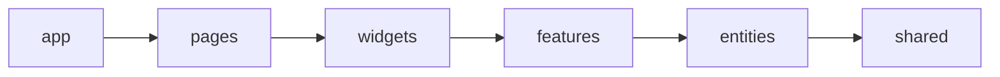
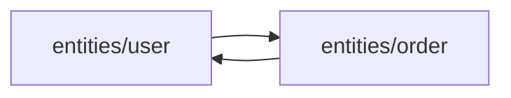

# Уровень 8: FSD — слои и однонаправленные импорты

## Аналогия: этаж, а не соседняя квартира

Представь многоэтажный дом с водопроводом, где вода умеет течь только вниз: с шестого этажа на пятый, с пятого на четвёртый и так далее. Ни один этаж физически не может «зациклить» трубу обратно наверх — конструкция дома этого не позволяет. Именно так устроены **слои Feature-Sliced Design**: `app → pages → widgets → features → entities → shared`. Каждый слой может «протекать» только вниз, к нижележащим соседям, и никогда — вверх.

## Слои — это не папки для красоты, а контракт направления

FSD делит код проекта на 6 стандартных слоёв, каждый из которых отвечает за свой уровень абстракции:

- **app** — инициализация приложения: провайдеры, роутинг, глобальные стили;
- **pages** — целые страницы, композиция виджетов под конкретный роут;
- **widgets** — крупные самостоятельные блоки UI (шапка, сайдбар, карточка товара с действиями);
- **features** — пользовательские сценарии («добавить в корзину», «поставить лайк», «авторизоваться»);
- **entities** — бизнес-сущности предметной области («пользователь», «товар», «заказ»);
- **shared** — переиспользуемый код без знания о домене: UI-кит, хелперы, api-клиент.

**Главное правило импортов**: модуль слоя может импортировать только из слоёв **ниже** себя. `features` может использовать `entities` и `shared`, но `entities` никогда не имеет права импортировать что-то из `features` — это запрещено архитектурой, а не просто «не принято».

## Почему это гарантирует отсутствие циклов между слоями

Если каждая стрелка импорта смотрит строго вниз по фиксированному списку слоёв, между слоями складывается **частичный порядок**: `app` всегда «выше» `pages`, `pages` всегда «выше» `widgets` и так далее. Пройти по стрелкам вниз и вернуться назад наверх — физически невозможно, ведь ни одна стрелка не смотрит вверх. Граф импортов между слоями получается **ациклическим по построению** (DAG) — не потому что кто-то аккуратно следил за каждым импортом вручную, а потому что сама структура проекта не оставляет для цикла места.

Внутри каждого слайса код делится ещё и на **сегменты**: `ui` (компоненты), `model` (состояние, бизнес-логика), `api` (запросы), `lib` (внутренние хелперы), `config` (константы, настройки). Сегменты — это про порядок внутри слайса, а не про циклы между слоями.

📌 Запомнить: 6 слоёв, строго нисходящие импорты, DAG между слоями гарантирован архитектурой — если её не нарушать (нарушения и их последствия — уровень 10).

## Второй источник циклов: соседи по этажу

Труба «вниз» — не единственное правило. У FSD есть ещё одно: **слайсы одного слоя не должны знать друг о друге** (кроме `shared`, у него слайсов вообще нет). `entities/user` и `entities/order` живут на одном этаже — если они начинают напрямую импортировать друг друга, это то же самое, что просверлить дыру в стене между двумя соседними квартирами: труба на «этаж ниже» тут ни при чём, а вода (импорт) всё равно может пойти по кругу.

Два задания уровня разбирают именно это: **8.1–8.3** — импорт «вверх» через слои, **8.4–8.6** — cross-import слайсов внутри одного слоя. Оба случая лечатся одинаково: убрать «лишнее» ребро — либо инвертировав зависимость, либо передав примитив (`id`) вместо целого объекта, либо подняв композицию на слой выше.
