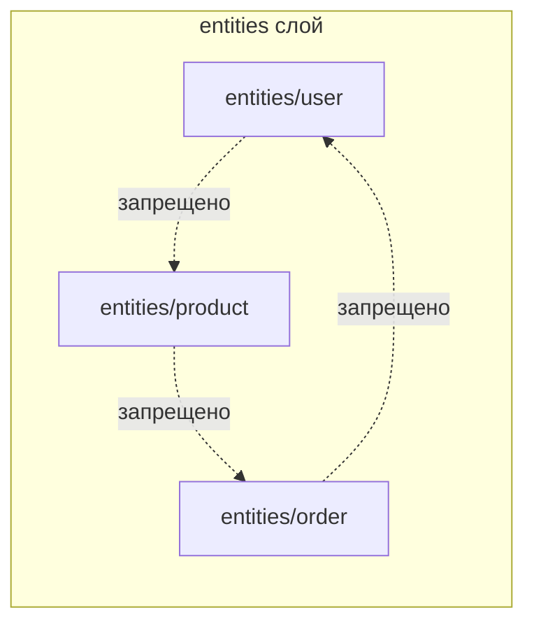
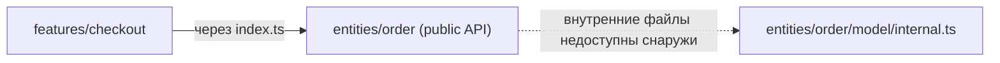

# Уровень 9 (подробно): Изоляция слайсов и public API

## 1. Проблема: правило слоёв не спасает от циклов «на одном этаже»

Уровень 8 показал, что нисходящие импорты между слоями гарантируют DAG на уровне слоёв. Но у слоя `entities` внутри может быть десяток слайсов: `user`, `product`, `order`, `review`, `category`... Правило «импортируй только вниз» ничего не говорит о том, что происходит **между слайсами одного и того же слоя** — а именно там прячется целый класс циклов, которые новички создают чаще всего:

```ts
// entities/user/model/index.ts
import { Order } from 'entities/order' // user знает про order...

export function getUserWithLastOrder(userId: string) {
  const orders = Order.findByUserId(userId)
  return { userId, lastOrder: orders[0] }
}
```

```ts
// entities/order/model/index.ts
import { User } from 'entities/user' // ...а order знает про user!

export function getOrderWithOwner(orderId: string) {
  const order = findOrder(orderId)
  return { order, owner: User.findById(order.userId) }
}
```

`entities/user` и `entities/order` находятся в одном слое, между ними формально нет запрета «выше/ниже» — правило нисходящих импортов не срабатывает, потому что оба слайса на одном уровне иерархии. Получился классический прямой цикл, просто внутри слоя `entities`, а не между слоями.

## 2. Пример: изоляция слайсов как отдельное правило

FSD вводит **второе, независимое от слоёв** правило: слайсы одного слоя не должны импортировать друг друга напрямую.



```
entities/
├── user/
│   ├── ui/
│   ├── model/
│   └── index.ts
├── product/
│   ├── ui/
│   ├── model/
│   └── index.ts
└── order/
    ├── ui/
    ├── model/
    └── index.ts
```

Ни один из этих трёх слайсов не должен писать `import ... from 'entities/product'` внутри `entities/user`, и наоборот. Если сущностям реально нужно ссылаться друг на друга (см. раздел 5 — легальный кросс-импорт через `@x`), это делается специальным механизмом, а не обычным импортом.

## 3. Как это работает: public API как единственная граница

Второй кирпичик защиты — **public API** слайса. Каждый слайс обязан экспортировать наружу только то, что явно указано в его `index.ts`:

```ts
// entities/user/index.ts — public API слайса
export type { User } from './model/types'
export { UserAvatar } from './ui/UserAvatar'
export { useUser } from './model/use-user'
// secretHelper, internalCache — НЕ экспортируются, они приватные
```

Снаружи разрешено импортировать только так:

```ts
// ✅ features/edit-profile/model.ts
import { User, useUser } from 'entities/user' // через public API
```

И запрещено так:

```ts
// ❌ features/edit-profile/model.ts
import { internalCache } from 'entities/user/model/cache' // обход public API — прямой путь к сегменту!
```

Почему это важно именно для циклов: если снаружи разрешено импортировать любой внутренний файл слайса напрямую, то количество потенциальных «точек входа» для импорта становится неограниченным — и отследить, не появился ли где-то скрытый цикл через внутренний файл, практически невозможно вручную. Public API сужает поверхность связей слайса до одного файла — `index.ts`, что делает граф зависимостей между слайсами читаемым и удобным для анализа инструментами (madge, dependency-cruiser — уровни 5–7).

```ts
// Технически публичный API — это barrel-файл (уровень 4),
// но здесь barrel — не источник циклов, а осознанная граница модуля.
// Разница: barrel опасен, когда re-export бесконтрольно раздувается;
// public API слайса — контролируемая, минимальная поверхность.
```

## 4. Изоляция + public API вместе

Комбинация этих двух правил закрывает целый класс циклов:

- **Изоляция слайсов** отвечает на вопрос «кому вообще можно ходить в гости» — только к слайсам нижних слоёв (правило уровня 8), никогда к соседям своего слоя.
- **Public API** отвечает на вопрос «куда именно можно войти» — только через `index.ts` разрешённого слайса, никогда во внутренние сегменты напрямую.



Вместе они гарантируют: единственные легальные рёбра графа импортов между слайсами — это рёбра «вниз, через публичную границу». Такая структура резко сокращает пространство возможных циклов по сравнению с проектом без FSD, где любой файл потенциально мог импортировать любой другой.

## 5. Легальные исключения: @x-нотация

Иногда сущности **реально** должны знать друг о друге — например, `entities/order` должен где-то хранить `userId` и, возможно, отображать имя пользователя рядом с заказом. FSD не заставляет притворяться, что такой связи нет — вместо хаотичного прямого импорта методология предлагает явный, контролируемый механизм — **cross-import через `@x`**:

```
entities/
└── user/
    ├── @x/
    │   └── order.ts   # что именно entities/order имеет право видеть из entities/user
    ├── model/
    └── index.ts
```

```ts
// entities/user/@x/order.ts — специально выделенный публичный интерфейс ДЛЯ entities/order
export type { UserId, UserShortInfo } from '../model/types'
```

```ts
// entities/order/model/index.ts
import type { UserShortInfo } from 'entities/user/@x/order' // явный, задокументированный кросс-импорт
```

Отличие от обычного нарушения изоляции принципиально: `@x`-импорт **явный** (сразу видно в имени пути, что это осознанное исключение), **узкий** (через `@x/order.ts` экспортируется только то, что нужно именно `order`, а не весь `entities/user`) и **контролируемый** (легко найти все такие исключения по паттерну пути `@x/`, отследить их линтером и держать их количество маленьким).

## ⚠️ Частые ошибки начинающих

### Ошибка 1: «Слои — единственное правило FSD, если импорт идёт вниз — всё ок»

```ts
// ❌ entities/product/model/index.ts
import { formatUserName } from 'entities/user' // оба в entities, но это не "вниз"!
```

Почему это проблема: разработчики часто запоминают только правило слоёв (уровень 8) и забывают, что внутри одного слоя действует отдельное правило изоляции. `entities/product` и `entities/user` — оба в слое `entities`, между ними нет «вниз» — есть только «вбок», а это запрещено вне зависимости от слоя.

```ts
// ✅ Правильно — либо переносить общую логику в shared/lib,
// либо использовать @x-нотацию, если связь действительно доменная
```

### Ошибка 2: «Public API — это формальность, можно импортировать напрямую из сегмента ради удобства»

```ts
// ❌ features/checkout/model.ts
import { calculateDiscount } from 'entities/product/lib/pricing' // обход index.ts
```

Почему это проблема: прямой импорт из внутреннего сегмента ломает инкапсуляцию слайса — теперь `entities/product` не может свободно рефакторить внутреннюю структуру `lib/pricing.ts` (переименовать, переместить), не сломав чужой код. А главное — такие «тайные тропы» не видны при анализе графа зависимостей на уровне публичных интерфейсов и часто оказываются источником неожиданных транзитивных циклов.

```ts
// ✅ Правильно — добавить экспорт в index.ts слайса,
// если функция действительно нужна снаружи
// entities/product/index.ts
export { calculateDiscount } from './lib/pricing'
```

### Ошибка 3: «@x — это просто способ обойти правило изоляции, когда лень разбираться»

```ts
// ❌ entities/product/@x/cart.ts
export * from '../model' // весь модуль целиком, "на всякий случай"
```

Почему это проблема: `@x` задуман как узкое, задокументированное исключение для по-настоящему необходимых доменных связей — а не как лазейка для любого удобного импорта. Экспорт `export *` из `@x`-файла фактически открывает весь слайс целиком, обнуляя смысл ограничения — с тем же успехом можно было импортировать напрямую из `model/`.

```ts
// ✅ Правильно — экспортировать через @x только то немногое,
// что реально нужно конкретному слайсу-потребителю
// entities/product/@x/cart.ts
export type { ProductPriceInfo } from '../model/types'
```

### Ошибка 4: «Если между слайсами нужна связь, значит, дизайн неправильный, надо всё объединить в один слайс»

Почему это проблема: доменные сущности в реальных проектах часто связаны по своей природе (заказ ссылается на пользователя, отзыв ссылается на товар) — это нормальная часть предметной области, а не архитектурная ошибка. Попытка слить всё в один слайс «entities/everything» ради избежания cross-import создаёт куда более серьёзную проблему — гигантский неструктурированный модуль.

```ts
// ✅ Правильно — оставить слайсы отдельными по смыслу домена,
// а связь между ними выразить явно через @x-нотацию
```

## 💡 Лучшие практики

- 📌 Всегда экспортируйте из слайса через `index.ts` и держите список экспортов минимальным — то, что не экспортировано, легко менять без риска что-то сломать снаружи.
- 📌 Настройте линтер (уровень 11 — eslint-plugin-boundaries, Steiger) на запрет импортов, обходящих `index.ts` слайса, — вручную это отследить в большом проекте нереально.
- 📌 Используйте `@x`-нотацию только для действительно необходимых доменных связей и держите список таких исключений маленьким и явным — большое количество `@x`-файлов сигнализирует, что границы слайсов выбраны неудачно.
- 📌 Если два слайса одного слоя тянутся друг к другу слишком часто — это повод задуматься, не должны ли они быть одним слайсом или не нужен ли им общий слайс-посредник пониже.
