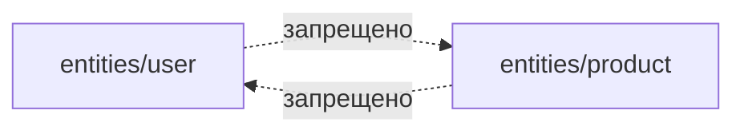

# Уровень 9: FSD — изоляция слайсов и public API

## Аналогия: соседние квартиры на одном этаже

Слои FSD (уровень 8) — это про этажи и трубы, которые текут только вниз. Но что происходит на **одном** этаже, между соседними квартирами? В хорошем доме соседи не ломают друг другу стены, чтобы срезать путь — у каждой квартиры есть только одна законная дверь на лестничную клетку. Если сосед сверху захочет зайти к соседу снизу — он спускается по общей лестнице, а не пробивает дыру в перекрытии.

Так же устроены **слайсы** FSD — папки внутри одного слоя (`entities/user`, `entities/product`, `features/auth`, `features/checkout`). Слой определяет _этаж_, слайс — _конкретную квартиру_ на этом этаже.

## Правило изоляции слайсов

**Слайсы одного слоя не импортируют друг друга напрямую.** `entities/user` не может импортировать что-то из `entities/product`, а `features/auth` не может напрямую тянуть код из `features/checkout`. Это правило гасит целый класс циклов — «горизонтальные» циклы внутри одного слоя, которые правило нисходящих импортов (уровень 8) само по себе не запрещает: ведь оба слайса лежат в одном слое, между ними нет разницы «выше/ниже».

## Public API — единственная законная дверь

Каждый слайс экспортирует наружу только через свой `index.ts` — это его **public API**. Внутренние сегменты (`ui/`, `model/`, `api/`, `lib/`) недоступны снаружи напрямую: нельзя написать `import { secretHelper } from 'entities/user/model/secret'` из другого места — только `import { User } from 'entities/user'`, если `User` реально экспортирован из `index.ts`.

Изоляция слайсов + public API работают вместе: изоляция запрещает _кому_ можно ходить в гости (только вниз по слоям, никогда вбок), а public API определяет _куда именно_ можно войти внутри разрешённого слайса — только через парадный вход, а не через любое окно.

📌 Запомнить: слайсы одного слоя равноправны и не видят друг друга напрямую; единственная точка входа в слайс — его `index.ts`; вместе эти два правила исключают горизонтальные и «скрытые» циклы.
