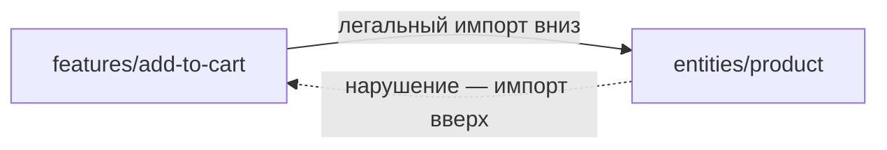
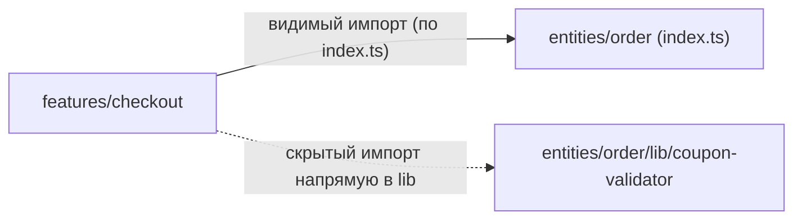
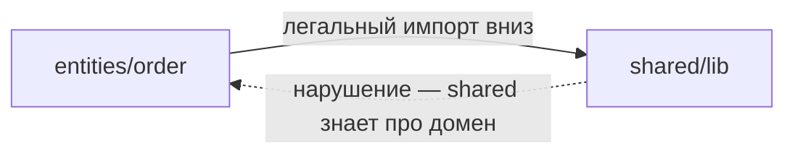

# Уровень 10 (подробно): Нарушения FSD, ведущие к циклам

## 1. Проблема: три правила защищают, но не защищают сами себя

Уровни 8–9 показали три принципа, которые вместе делают граф импортов FSD-проекта ациклическим:

1. **Однонаправленность слоёв** — импорт только вниз (`app → pages → widgets → features → entities → shared`).
2. **Изоляция слайсов** — слайсы одного слоя не импортируют друг друга напрямую.
3. **Доступ только через public API** — единственная точка входа в слайс — его `index.ts`.

Проблема в том, что эти правила — **конвенция**, а не встроенное ограничение TypeScript или бандлера. Ничто физически не мешает написать «неправильный» импорт, если его не проверяет линтер (уровень 11). На практике реальные циклы в FSD-проектах почти всегда сводятся к одному из пяти типовых нарушений. Разберём каждое подробно: какой именно цикл оно образует и как это чинить.

## 2. Нарушение 1: импорт вверх по слоям

```ts
// entities/product/model/index.ts
import { addToCart } from 'features/add-to-cart' // ❌ entities → features, вверх!

export function getProductWithCartAction(id: string) {
  const product = findProduct(id)
  return { product, addAction: () => addToCart(id) }
}
```



**Какой цикл образуется**: `features/add-to-cart` легально импортирует `entities/product` (это норма — фича использует сущность). Если `entities/product` в ответ импортирует `features/add-to-cart` — образуется прямой двухзвенный цикл `features → entities → features`.

**Как чинить**: функция `addToCart`, вызываемая из контекста продукта, — это, по сути, обработчик события уровня фичи, а не часть данных сущности. Правильно — передавать колбэк снаружи как параметр (dependency injection) вместо импорта:

```ts
// ✅ entities/product/ui/ProductCard.tsx
interface ProductCardProps {
  product: Product
  onAddToCart?: (id: string) => void // колбэк передаётся снаружи, а не импортируется
}

// widgets/product-card/ui/ProductCardWidget.tsx — компонует entities + features
import { ProductCard } from 'entities/product'
import { addToCart } from 'features/add-to-cart'

export function ProductCardWidget({ product }: { product: Product }) {
  return <ProductCard product={product} onAddToCart={addToCart} />
}
```

## 3. Нарушение 2: cross-import слайсов одного слоя

```ts
// features/auth/model/index.ts
import { updateProfile } from 'features/profile' // ❌ features/auth → features/profile

// features/profile/model/index.ts
import { getCurrentUser } from 'features/auth' // ❌ features/profile → features/auth
```


**Какой цикл образуется**: прямой горизонтальный цикл между двумя слайсами одного слоя — ровно то, что должно быть исключено правилом изоляции слайсов (уровень 9), но не исключено из-за нарушения.

**Как чинить**: вынести общую часть в нижележащий слой — например, `entities/user` может содержать `getCurrentUser` как часть модели пользователя, а `features/auth` и `features/profile` оба легально импортируют её оттуда, не зная друг о друге:

```ts
// ✅ entities/user/model/index.ts
export function getCurrentUser() {
  /* ... */
}

// ✅ features/auth/model/index.ts
import { getCurrentUser } from 'entities/user' // вниз, легально

// ✅ features/profile/model/index.ts
import { getCurrentUser } from 'entities/user' // вниз, легально, без знания про auth
```

## 4. Нарушение 3: обход public API

```ts
// features/checkout/model/index.ts
import { validateCoupon } from 'entities/order/lib/coupon-validator' // ❌ минуя index.ts
```



**Какой цикл образуется**: обход `index.ts` сам по себе не всегда сразу цикл, но создаёт **скрытое ребро**, невидимое при анализе публичных интерфейсов слайсов. Если позже кто-то внутри `entities/order/lib/coupon-validator` решит импортировать что-то из `features/checkout` (не заметив, что модуль уже используется извне «нелегально»), цикл замкнётся неожиданно — и его будет трудно найти, потому что связь никогда не документировалась через `index.ts`.

**Как чинить**: добавить `validateCoupon` в публичный экспорт слайса, если она действительно нужна снаружи:

```ts
// ✅ entities/order/index.ts
export { validateCoupon } from './lib/coupon-validator'

// ✅ features/checkout/model/index.ts
import { validateCoupon } from 'entities/order' // через public API
```

## 5. Нарушение 4: «толстый» shared, который знает о доменах

```ts
// shared/lib/format-order-summary.ts
import { Order } from 'entities/order' // ❌ shared импортирует entities!

export function formatOrderSummary(order: Order) {
  return `Order #${order.id}: ${order.items.length} items`
}
```



**Какой цикл образуется**: `shared` — самый нижний слой, его по определению могут импортировать все остальные слои, включая `entities`. Если `shared` начинает импортировать `entities` в ответ (потому что кому-то было удобно принять типизированный `Order`, а не примитивы), направление инвертируется, и любой модуль `entities`, использующий этот же файл `shared`, рискует замкнуть транзитивный цикл `entities → shared → entities`.

**Как чинить**: `shared` не должен знать о конкретных доменных типах — принимать только примитивы или дженерики, либо перенести доменно-специфичную функцию туда, где она действительно принадлежит — в `entities/order/lib`:

```ts
// ✅ shared/lib/format-order-summary.ts — знает только про примитивы
export function formatSummary(id: string, itemsCount: number) {
  return `Order #${id}: ${itemsCount} items`
}

// ✅ entities/order/lib/format.ts — доменная обёртка живёт в самом entities
import { formatSummary } from 'shared/lib/format-order-summary'
import type { Order } from '../model/types'

export function formatOrderSummary(order: Order) {
  return formatSummary(order.id, order.items.length)
}
```

## 6. Легальный кросс-импорт entities через @x — не нарушение, а решение

Когда сущности **действительно** должны ссылаться друг на друга (`entities/order` хранит `userId` и хочет показать имя пользователя), это не повод нарушать изоляцию слайсов хаотичным прямым импортом — для этого в FSD предусмотрена `@x`-нотация (подробно разобрана на уровне 9):

```ts
// entities/user/@x/order.ts — узкий публичный интерфейс специально для entities/order
export type { UserShortInfo } from '../model/types'
```

```ts
// entities/order/model/index.ts
import type { UserShortInfo } from 'entities/user/@x/order' // явно, узко, контролируемо
```

Разница между нарушением 2 (хаотичный cross-import) и `@x` принципиальна: `@x` **явный** (сразу видно по пути), **узкий** (экспортирует только необходимое) и **легко находится** линтером или поиском по паттерну `@x/` для контроля количества таких исключений.

## 7. Сводная таблица: нарушение → цикл → исправление

| Нарушение                       | Какой цикл образует                         | Как чинить                                                                  |
| ------------------------------- | ------------------------------------------- | --------------------------------------------------------------------------- |
| Импорт вверх по слоям           | Прямой цикл между слоями                    | Dependency injection: передать колбэк/данные сверху, не импортировать снизу |
| Cross-import слайсов            | Прямой горизонтальный цикл                  | Вынести общее в нижележащий слой (entities/shared)                          |
| Обход public API                | Скрытое ребро → неожиданный цикл            | Экспортировать нужное через index.ts слайса                                 |
| «Толстый» shared                | Инверсия направления → транзитивный цикл    | shared работает с примитивами, доменная обёртка — в entities                |
| Хаотичный cross-import entities | (то же, что нарушение 2, но между entities) | Заменить на явную @x-нотацию                                                |

## ⚠️ Частые ошибки новичков

### Ошибка 1: «Один нарушенный импорт — ещё не цикл, значит, можно оставить»

```ts
// ❌ "У меня всего один импорт вверх, обратного пути нет — не страшно"
```

Почему это проблема: единичный импорт вверх сам по себе может не создавать цикл прямо сейчас, но он оставляет «заряженное ружьё» — как только кто-то (в том числе не глядя на это конкретное место) добавит легальный импорт в обратную сторону, цикл замкнётся мгновенно и неожиданно, потому что нарушивший правило импорт никто не искал.

```ts
// ✅ Правильно — чинить нарушение сразу при обнаружении,
// не дожидаясь, пока реальный цикл проявит себя на практике
```

### Ошибка 2: «`@x` и хаотичный cross-import — это одно и то же, просто разная папка»

Почему это проблема: визуально `@x/order.ts` и обычный файл в `model/` могут выглядеть похоже, но смысл разный: `@x` — это осознанно выделенный, узкий, задокументированный публичный интерфейс именно для конкретного слайса-потребителя, а хаотичный cross-import — бесконтрольный доступ ко всему внутреннему устройству чужого слайса.

```ts
// ❌ entities/order/model/index.ts
import { internalUserCache } from 'entities/user/model/cache' // хаотично, напрямую

// ✅ entities/order/model/index.ts
import type { UserShortInfo } from 'entities/user/@x/order' // явно, через @x
```

### Ошибка 3: «Раз shared используется всеми — туда можно класть любую общую логику, включая доменную»

Почему это проблема: «общая» для нескольких сущностей логика — это не то же самое, что логика без знания о домене. Если функция принимает тип `Order` или `User`, она уже не является частью нижнего слоя `shared` по определению — её нужно либо обобщить до примитивов, либо перенести туда, где домен уже известен.

```ts
// ✅ Правильно — задать себе вопрос перед добавлением в shared:
// "Будет ли этот код работать одинаково для ЛЮБОГО проекта,
// даже без FSD и без этих конкретных сущностей?"
// Если нет — это не shared.
```

### Ошибка 4: «Обход public API — не проблема, если делаешь это только для чтения, а не записи»

Почему это проблема: направление операции (чтение/запись) не влияет на факт создания скрытого ребра в графе зависимостей. Даже безобидное на первый взгляд «просто прочитать тип из внутреннего файла» делает граф зависимостей непрозрачным для статического анализа и линтеров границ (уровень 11), а также ломает возможность рефакторить внутреннюю структуру слайса без опасений.

```ts
// ✅ Правильно — если что-то нужно снаружи, экспортировать явно
// через index.ts, даже если это "всего лишь" тип
```

## Хорошие практики

- 📌 Держите в голове три принципа как чек-лист при код-ревью: направление слоя правильное? слайсы не импортируют друг друга напрямую? доступ идёт через `index.ts`? Три вопроса — три возможных нарушения.
- 📌 Заводите `@x`-исключения осознанно и редко — большое количество `@x`-файлов сигнализирует, что границы слайсов выбраны неудачно, а не что методология не работает.
- 📌 При обнаружении нарушения чините причину (перенос кода, dependency injection, расширение public API), а не следствие (например, вместо `import(...)` "чтобы обойти проверку линтера").
- 📌 Автоматизируйте проверку всех трёх правил линтером с первого дня (уровень 11) — ручной код-ревью с ростом команды и кодовой базы неизбежно пропускает нарушения.
