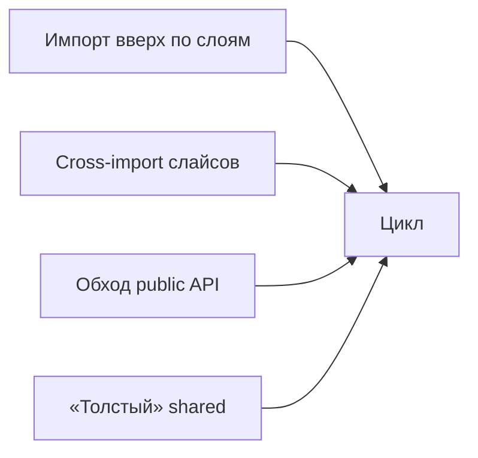

# Уровень 10: Нарушения FSD, ведущие к циклам

## Аналогия: дом ломается не архитектором, а жильцами

Дом с трубами, текущими только вниз (уровень 8), и квартирами с одной законной дверью (уровень 9) — надёжная конструкция. Но жильцы иногда пробивают дыры в перекрытии, чтобы срезать путь к соседу, или ломают дверной замок, если официальный вход кажется неудобным. Дом не перестаёт быть спроектирован правильно — просто кто-то нарушил его правила, и вода потекла туда, куда не должна была.

Так и с FSD: сама методология гарантирует ацикличность **при соблюдении правил**. Реальные циклы в FSD-проектах почти всегда — следствие одного из типовых нарушений.

## Каталог типовых нарушений

- **Импорт вверх** — `entities` импортирует из `features` — прямое нарушение правила уровня 8, замыкает петлю с нисходящим импортом того же самого модуля.
- **Cross-import слайсов** — `features/auth` ↔ `features/profile` напрямую — прямое нарушение правила уровня 9, горизонтальный цикл внутри слоя.
- **Обход public API** — импорт вглубь чужого слайса, минуя `index.ts`, — создаёт скрытые рёбра, которые не видны при поверхностном ревью и неожиданно замыкают цикл.
- **«Толстый» shared** — `shared` начинает импортировать из `entities`, зная о конкретных доменах, — инвертирует направление самого нижнего слоя.

Для по-настоящему нужных связей между сущностями FSD предлагает не нарушение, а легальный контролируемый путь — `@x`-нотацию (уровень 9), а не хаотичный прямой импорт.

📌 Запомнить: три принципа держат граф ациклическим — **однонаправленность слоёв**, **изоляция слайсов**, **доступ только через public API**. Любое нарушение одного из них — прямой путь к циклу.
