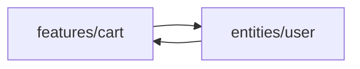
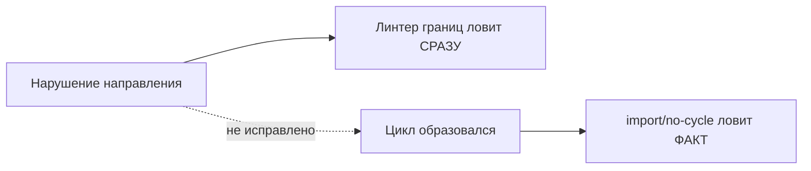

# Уровень 11 (подробно): Автоматизация границ FSD линтерами

## 1. Проблема: правила есть, соблюдения нет

На уровнях 8-10 мы разобрали правила FSD: слои импортируют только вниз, слайсы одного слоя не видят друг друга напрямую, снаружи слайса видно только его public API (`index.ts`). Это отличные правила — на бумаге. В реальности:

- новый разработчик в команде их ещё не выучил и импортирует `features/cart/model/store` напрямую, в обход `index.ts`;
- разработчик под дедлайном видит, что «так быстрее», и делает cross-import между `features/auth` и `features/profile`;
- ревьюер не заметил нарушение в PR на 40 файлов.

Каждое такое нарушение — потенциальный будущий цикл (уровень 10). Проблема не в том, что правила плохие, а в том, что они **держатся на дисциплине**, а дисциплина не масштабируется на команду из 20 человек и сотни PR в месяц.

Решение — перенести правила из головы разработчика в CI: пусть их проверяет машина при каждом коммите/пуше, а не только на код-ревью.

## 2. eslint-plugin-boundaries: конструктор с матрицей разрешений

`eslint-plugin-boundaries` не знает про FSD из коробки — вы сами описываете, что такое «слой» в вашем проекте (`element-types`), и матрицу допустимых переходов между ними.

```js
// eslint.config.js (ESLint 9, flat config)
import boundaries from 'eslint-plugin-boundaries'

export default [
  {
    plugins: { boundaries },
    settings: {
      'boundaries/elements': [
        { type: 'app', pattern: 'src/app/*' },
        { type: 'pages', pattern: 'src/pages/*' },
        { type: 'widgets', pattern: 'src/widgets/*' },
        { type: 'features', pattern: 'src/features/*' },
        { type: 'entities', pattern: 'src/entities/*' },
        { type: 'shared', pattern: 'src/shared/*' },
      ],
    },
    rules: {
      'boundaries/element-types': [
        'error',
        {
          default: 'disallow',
          rules: [
            { from: 'app', allow: ['pages', 'widgets', 'features', 'entities', 'shared'] },
            { from: 'pages', allow: ['widgets', 'features', 'entities', 'shared'] },
            { from: 'widgets', allow: ['features', 'entities', 'shared'] },
            { from: 'features', allow: ['entities', 'shared'] },
            { from: 'entities', allow: ['shared'] },
            { from: 'shared', allow: [] },
          ],
        },
      ],
    },
  },
]
```

Читается матрица построчно: `{ from: 'features', allow: ['entities', 'shared'] }` значит «файлам в `features/*` разрешено импортировать только из `entities/*` и `shared/*`, всё остальное — ошибка». `default: 'disallow'` — важная деталь: без него правило по умолчанию разрешает всё, что явно не запрещено, а нам нужно обратное — белый список.

Заметьте: слой `entities` не имеет `features` и `widgets` в списке `allow` — а значит, `entities → features` (импорт вверх) физически невозможен без падения линта. Это ровно та причина циклов, которую мы разбирали на уровне 10, придушенная на корню.

Плагин умеет ещё одно важное правило — `boundaries/entry-point`, которое заставляет импортировать элементы **только через их публичный `index.ts`**, запрещая `import { useCartStore } from 'features/cart/model/store'` в обход barrel-файла:

```js
rules: {
  'boundaries/entry-point': [
    'error',
    { default: 'disallow', rules: [{ target: '*', allow: 'index.ts' }] },
  ],
}
```

## 3. @feature-sliced/eslint-config: готовый пресет под FSD

Если писать матрицу самому не хочется — есть официальный конфиг от команды Feature-Sliced Design.

```bash
npm install -D @feature-sliced/eslint-config
```

```js
// eslint.config.js
import fsd from '@feature-sliced/eslint-config'

export default [
  ...fsd.configs.recommended,
  // ваши остальные правила
]
```

Что именно он проверяет из коробки:

- **направление импортов между слоями** — та же логика «сверху вниз», что мы задавали вручную выше, но уже настроенная под стандартные слои FSD (`app`, `processes`\*, `pages`, `widgets`, `features`, `entities`, `shared`);
- **изоляцию слайсов** — запрещает `features/cart` импортировать что-либо напрямую из `features/checkout` (тот самый cross-import слайсов из уровня 10);
- **обход public API** — требует, чтобы импорт извне слайса шёл через его `index.ts`, а не «залезал» во внутренние файлы.

Плюс готового пресета — вы получаете консенсус всего сообщества FSD «из коробки», без риска ошибиться в собственной матрице, и конфиг обновляется вместе с эволюцией методологии.

## 4. Steiger: архитектурный линтер, а не ESLint-плагин

Steiger — отдельный CLI-инструмент (не встраивается в ESLint), написанный специально под архитектурные проверки FSD. Запускается отдельной командой:

```bash
npx steiger ./src
```

```
src/features/cart/index.ts
  ⚠  public-api  Слайс должен экспортировать сущности только через index.ts

src/entities/order
  ⚠  insignificant-slice  Слайс содержит только один тривиальный файл — возможно, лишний уровень вложенности

✖ 2 problems
```

Steiger проверяет структуру всего дерева `src/` целиком, а не только отдельные импорты в отдельном файле — то есть видит FSD-проект «сверху», как архитектор, а не «построчно», как обычный линтер. Примеры правил:

- `public-api` — у каждого слайса/сегмента должен быть корректный `index.ts`, через который наружу отдаётся только то, что нужно;
- `insignificant-slice` — слайс, состоящий из одного крошечного файла, сигнализирует, что либо декомпозиция избыточна, либо слайс стоит объединить;
- `no-segmentless-slices`, `ambiguous-slice-names`, `no-processes` и другие — проверки специфики структуры FSD, которые ESLint-правилами реализовать было бы неудобно (они смотрят на файловую систему в целом, а не AST одного файла).

Steiger хорошо ставить отдельным шагом CI, параллельно с ESLint — они проверяют разные, дополняющие друг друга срезы одной и той же архитектуры.

## 5. Как это работает: где именно ловится причина цикла

Вспомним пример из уровня 10 — цикл вида:



`entities/user` не должен импортировать ничего из `features/*` — при матрице `{ from: 'entities', allow: ['shared'] }` любая попытка написать `import { addToCart } from 'features/cart'` внутри `entities/user` **упадёт на этапе линта**, ещё до коммита, задолго до того, как madge (уровень 5) вообще увидит эту связь в графе.

Именно в этом ценность линтеров границ: они не позволяют цикличности **возникнуть**, а не просто сообщают о ней постфактум.

## 6. Связка с import/no-cycle (уровень 6): два эшелона защиты

Важно понимать, что линтеры границ и `import/no-cycle` решают разные задачи и не заменяют друг друга:

|                                                   | Что проверяет                                              | Что не поймает                                                                                                                                                     |
| ------------------------------------------------- | ---------------------------------------------------------- | ------------------------------------------------------------------------------------------------------------------------------------------------------------------ |
| `eslint-plugin-boundaries` / FSD-конфиг / Steiger | Направление импорта, соответствие архитектурным правилам   | Цикл **внутри** одного разрешённого слоя (например, два файла внутри одного `shared/lib`, которые формально ничего не нарушают по слоям, но зациклены между собой) |
| `import/no-cycle`                                 | Сам факт цикла в графе импортов, независимо от архитектуры | Причину — почему он возник, и не запрещает архитектурно неверные, но пока ещё не зацикленные импорты                                                               |

Пример, где нужны оба: `shared/lib/format.ts` импортирует `shared/lib/validate.ts`, а тот — обратно `format.ts`. Оба файла лежат в одном разрешённом слое `shared` — граница FSD не нарушена, `boundaries/element-types` промолчит. Но цикл есть, и его поймает только `import/no-cycle`.

И наоборот: `entities/user` импортирует `features/cart` (уже нарушение направления), но `features/cart` пока ещё не импортирует `entities/user` обратно — цикла в графе формально ещё нет, `import/no-cycle` промолчит, но линтер границ уже кричит «нельзя!», не дожидаясь, пока нарушение превратится в цикл.



Поэтому в зрелом проекте на FSD оба слоя защиты включают одновременно: линтер границ — как профилактика, `import/no-cycle` — как страховочная сетка на случай, если граница была нарушена ещё до того, как в проекте появился сам линтер границ (легаси-код, старые PR, слияние веток).

## ⚠️ Частые ошибки начинающих

### Ошибка 1: «Поставили ESLint-плагин — и хватит»

```js
// ❌ Настроили только eslint-plugin-boundaries,
// import/no-cycle из уровня 6 выключили как "избыточный"
```

Почему это проблема: линтер границ не видит циклы **внутри** одного слоя (см. пример с `shared/lib` выше) и не защищает легаси-код, написанный до его подключения. Убрав `no-cycle`, вы теряете вторую линию защиты без всякой выгоды.

```js
// ✅ Правильно — держать оба правила одновременно,
// они проверяют разные срезы одной и той же проблемы
```

### Ошибка 2: «default: 'allow' вместо 'disallow'»

```js
// ❌
rules: {
  'boundaries/element-types': ['error', {
    default: 'allow', // всё разрешено, кроме явно запрещённого
    rules: [{ from: 'entities', disallow: ['features'] }],
  }],
}
```

Почему это проблема: с `default: 'allow'` вы обязаны перечислить **все** запреты вручную и не забыть ни одного — при добавлении нового слоя правило по умолчанию пропустит любое нарушение с его участием, пока вы явно не опишете запрет.

```js
// ✅ default: 'disallow' — белый список того, что МОЖНО,
// новый слой по умолчанию не сможет импортировать ничего, пока вы явно не разрешите
```

### Ошибка 3: «Steiger вместо ESLint-плагина заменяет ревью на каждый импорт»

```bash
# ❌ Ждать ночной прогон Steiger по всему репозиторию,
# вместо мгновенной подсветки ошибки в редакторе
```

Почему это проблема: Steiger хорош для структурных, «архитектурных» проверок (public API, состав слайса), но не даёт мгновенной обратной связи построчно во время набора кода, как это делает ESLint через IDE-интеграцию.

```bash
# ✅ ESLint-правила — на лету, в редакторе и в pre-commit hook
# Steiger — отдельным шагом CI, для проверки структуры целиком
```

### Ошибка 4: «Настроили линтер границ только для новых файлов»

Почему это проблема: если правило применяется через `overrides` только к новым директориям, легаси-часть проекта продолжает копить нарушения, которые рано или поздно всё равно всплывут циклами (уровень 13 — про baseline для такой ситуации).

```js
// ✅ Правильно — включить правило на весь src/ сразу,
// а существующие нарушения зафиксировать как временный baseline (уровень 13),
// а не исключать директории из проверки навсегда
```

## 💡 Лучшие практики

- 📌 Начинайте с `@feature-sliced/eslint-config`, если проект строго следует FSD — это избавит от ручного описания матрицы и рисков ошибиться в ней.
- 📌 Переходите на `eslint-plugin-boundaries` напрямую, если у вас **своя** слоистая архитектура, отличная от канонической FSD, но с похожей идеей направленных слоёв.
- 📌 Добавьте Steiger отдельным шагом CI (не обязательно блокирующим на старте) — он ловит структурные проблемы, которые ESLint не видит в принципе.
- 📌 Держите `import/no-cycle` включённым даже при наличии линтеров границ — это разные, дополняющие друг друга проверки, а не взаимозаменяемые.
- 📌 Настраивайте `boundaries/entry-point`, чтобы обход public API (уровень 9) ловился так же строго, как нарушение направления слоёв.
