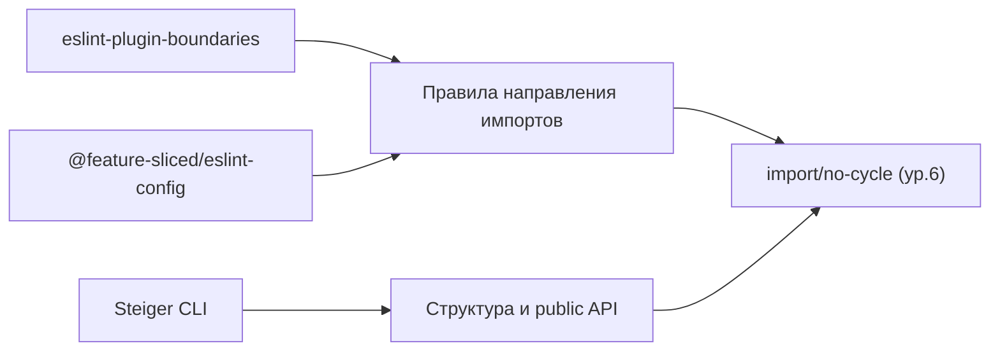

# Уровень 11: FSD — линтеры границ

## Аналогия: заборы вместо честного слова

На уровне 10 мы разобрали, какие нарушения FSD порождают циклы: импорт «вверх», cross-import слайсов, обход public API. Но одно дело — знать правила, другое — соблюдать их каждый день, в каждом PR, всей командой. «Просто договориться не импортировать вверх» работает ровно до пятницы вечером перед дедлайном.

Здесь работает та же логика, что и с забором вокруг стройки: можно повесить табличку «не ходить», а можно поставить забор, через который физически не пройти. Табличка полагается на дисциплину, забор — нет. Линтеры границ — это забор для импортов.

## Три инструмента, три уровня строгости

- **eslint-plugin-boundaries** — универсальный конструктор: вы сами описываете «типы элементов» (слои) и матрицу «кто кого может импортировать». Гибко, но конфиг пишете сами.
- **@feature-sliced/eslint-config** — готовый, официальный пресет именно под FSD: уже знает про слои, слайсы и public API, включается почти «из коробки».
- **Steiger** — отдельный CLI-линтер архитектуры (не ESLint-плагин), проверяет структуру FSD целиком: `npx steiger ./src` — и он находит не только неправильные импорты, но и «кривые» слайсы, отсутствие public API и т.п.

## Причина и симптом

Линтеры границ ловят **причину** — неправильное направление импорта, ещё до того, как оно замкнётся в цикл. `import/no-cycle` (уровень 6) ловит **симптом** — уже готовый цикл, каким бы путём он ни возник. Вместе они образуют два эшелона защиты: один не даёт архитектуре расползтись, второй — подстраховывает на случай, если что-то всё же проскочило.

📌 Запомнить: границы FSD стоит проверять автоматически, а не полагаться на код-ревью — человек устаёт, линтер — нет.
