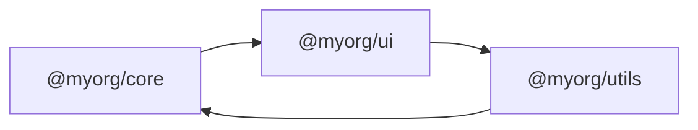
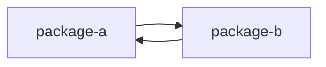
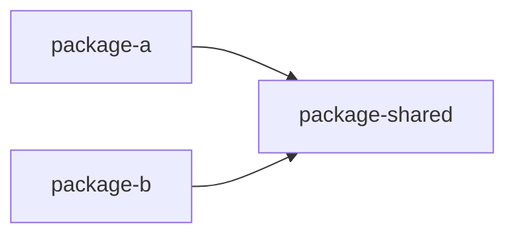

# Уровень 12 (подробно): Циклы в монорепозиториях

## 1. Проблема: другая единица измерения

Всё, что мы разбирали на уровнях 0-11, происходило на уровне **файлов** внутри одного проекта. В монорепозитории (Nx, Turborepo, pnpm workspaces, Yarn workspaces) появляется новая единица — **пакет** (package/project), у которого есть свой `package.json`, свои зависимости, своя граница публикации. И на этом уровне возможен точно такой же цикл, только с гораздо более тяжёлыми последствиями.

```json
// packages/package-a/package.json
{
  "name": "@myorg/package-a",
  "dependencies": {
    "@myorg/package-b": "workspace:*"
  }
}
```

```json
// packages/package-b/package.json
{
  "name": "@myorg/package-b",
  "dependencies": {
    "@myorg/package-a": "workspace:*"
  }
}
```

Формально каждый `package.json` в отдельности — валиден. Но вместе они описывают граф, где `package-a → package-b → package-a` — цикл на уровне пакетов.

## 2. Пример: чем это отличается от файлового цикла

Файловый цикл (уровни 0-10) — двусторонняя связь внутри одного модуля сборки, которую бандлер и рантайм чаще всего как-то разруливают (не всегда правильно, но разруливают). Цикл пакетов — это уже вопрос **топологического порядка** на уровне всей системы сборки:



Если `nx graph` или `turbo run build` должны собрать `core`, `ui` и `utils` в правильном порядке (сначала зависимости, потом зависящие от них пакеты), а граф зависимостей содержит цикл — **правильного порядка не существует**. Инструмент либо падает с явной ошибкой, либо (что хуже) собирает пакеты в произвольном, недетерминированном порядке, из-за чего сборка может успешно проходить локально и падать на CI, или наоборот.

## 3. Как это работает: топологическая сортировка и её крах

Все современные монорепо-инструменты внутри строят граф зависимостей между пакетами (аналогично графу импортов файлов из уровня 0) и применяют **топологическую сортировку** — тот же алгоритм на графах, что мы разбирали для файлов, только узлы — это пакеты, а рёбра — записи `dependencies` в `package.json`.

```bash
# pnpm — список пакетов и их зависимостей в workspace
pnpm list -r --depth -1

# pnpm — выполнить сборку с учётом порядка зависимостей
pnpm --filter "@myorg/*" run build
```

```bash
# Nx — визуальный граф зависимостей между проектами монорепо
nx graph

# Nx — какие проекты затронуты последним изменением (используется тем же графом)
nx affected --target=build
```

```bash
# Turborepo — запуск задач в топологическом порядке,
# определённом полем "dependsOn": ["^build"] в turbo.json
turbo run build
```

При наличии цикла между пакетами все эти команды либо явно сообщат об ошибке («Circular dependency detected»), либо (в худшем случае, для менее строгих конфигураций) войдут в противоречивое состояние, где кэш сборки одного пакета инвалидируется зависимостью, которая сама зависит от результата текущей сборки.

## 4. Специализированные инструменты для границ пакетов

### madge и dependency-cruiser на монорепо

Инструменты из уровня 5 умеют строить граф не только по файлам одного пакета, но и по всему монорепозиторию, если направить их на корень:

```bash
npx madge --circular --extensions ts,tsx packages/*/src
```

Это покажет файловые циклы, которые пересекают границы пакетов — например, файл в `package-a` напрямую импортирует файл из `package-b/src/internal/...` в обход его публичного экспорта, и наоборот. Это гибрид файлового и пакетного цикла: технически цикл в графе файлов, но фактически — нарушение границы пакета.

### Nx: @nx/enforce-module-boundaries

Nx предлагает собственный ESLint-плагин для проверки зависимостей между проектами монорепо через систему **тегов**:

```json
// nx.json — присваиваем пакетам теги
{
  "projects": {
    "package-a": { "tags": ["scope:core"] },
    "package-b": { "tags": ["scope:ui"] }
  }
}
```

```js
// eslint.config.js
{
  rules: {
    '@nx/enforce-module-boundaries': ['error', {
      depConstraints: [
        { sourceTag: 'scope:ui', onlyDependOnLibsWithTags: ['scope:core', 'scope:shared'] },
        { sourceTag: 'scope:core', onlyDependOnLibsWithTags: ['scope:shared'] },
      ],
    }],
  },
}
```

Это прямой аналог `eslint-plugin-boundaries` из уровня 11, только границы задаются не для слоёв FSD внутри файловой системы одного приложения, а для **целых пакетов** монорепозитория через теги. Правило `depConstraints` не даст `package-core` (с тегом `scope:core`) объявить зависимость от `package-ui` (`scope:ui`), даже если кто-то попробует добавить её в `package.json` вручную — CI упадёт на линте ещё до сборки.

### Turborepo: топология через turbo.json

Turborepo не имеет отдельного «линтера границ», но топологический порядок задач в `turbo.json` (`"dependsOn": ["^build"]`) сам по себе требует ацикличного графа пакетов — при попытке собрать монорепо с циклом Turborepo явно сообщит об ошибке построения графа задач.

## 5. Как чинить: тот же принцип, другой масштаб

Приёмы разрыва циклов из уровня 7 применимы и здесь, просто единицей становится не файл, а пакет:

**Было** — `package-a` и `package-b` зависят друг от друга напрямую:



**Стало** — общая логика вынесена в отдельный пакет-посредник, оба зависят от него однонаправленно:



```json
// packages/package-shared/package.json — новый пакет без зависимостей от a/b
{ "name": "@myorg/shared", "dependencies": {} }
```

```json
// package-a теперь зависит только от shared
{ "dependencies": { "@myorg/shared": "workspace:*" } }
```

```json
// package-b тоже зависит только от shared
{ "dependencies": { "@myorg/shared": "workspace:*" } }
```

Второй вариант — инверсия зависимостей на уровне пакетов (аналог DIP из уровня 7): если `package-a` нужен конкретный тип из `package-b`, а `package-b`, в свою очередь, нужна реализация из `package-a`, стоит вынести общий интерфейс/тип в `package-shared`, и пусть `package-b` реализует его, не зная про `package-a` напрямую.

## 6. Отличие от файловых циклов: гранулярность и цена ошибки

|                        | Файловый цикл (уровни 0-10)                  | Цикл пакетов (уровень 12)                                                                                           |
| ---------------------- | -------------------------------------------- | ------------------------------------------------------------------------------------------------------------------- |
| Единица графа          | Файл/модуль                                  | Пакет (package.json)                                                                                                |
| Обнаруживается         | madge, dependency-cruiser, ESLint            | Те же инструменты + `nx graph`, `turbo run`, `pnpm list`                                                            |
| Последствие            | Возможный краш инициализации, раздутый бандл | Невозможность построить топологический порядок сборки                                                               |
| Влияние на кэш         | Минимальное — кэш модуля бандлера            | Критичное — ломает инкрементальный кэш всей системы сборки (Nx/Turbo)                                               |
| Влияние на параллелизm | Нет                                          | Прямое — задачи, которые могли бы собираться параллельно, блокируют друг друга или вообще не могут быть упорядочены |
| Публикация             | Не применимо                                 | Невозможно определить, какой пакет публиковать первым (semantic-release, changesets)                                |

Именно последняя строка — самое ощутимое отличие. Файловый цикл может годами жить в проекте незамеченным (уровень 0). Цикл пакетов **не даёт корректно опубликовать** независимые версии пакетов в реестр: инструменты версионирования (например, Changesets) тоже полагаются на топологический порядок, чтобы понять, какую версию зависимости указывать у зависящего пакета.

## ⚠️ Частые ошибки начинающих

### Ошибка 1: «В монорепо циклы не страшны — это же один репозиторий»

```json
// ❌ "Все пакеты и так лежат рядом, в одном git-репозитории — цикл не проблема"
```

Почему это проблема: физическая близость файлов в одном репозитории никак не влияет на логическую независимость пакетов при сборке и публикации. Цикл пакетов ломает топологический порядок точно так же, будь пакеты в одном репозитории или в разных.

```bash
# ✅ Проверять граф пакетов инструментами монорепо независимо
# от того, что весь код физически лежит рядом
nx graph
```

### Ошибка 2: «Использовать devDependencies, чтобы обойти цикл»

```json
// ❌
{
  "name": "package-a",
  "dependencies": { "@myorg/package-b": "workspace:*" },
  "devDependencies": { "@myorg/package-b-types": "workspace:*" }
}
```

Почему это проблема: перенос зависимости в `devDependencies` не устраняет цикл в графе, который используют `nx graph`/`turbo run` для построения топологического порядка — большинство инструментов монорепо учитывают оба типа зависимостей при построении графа проектов.

```json
// ✅ Правильно — вынести общий код в третий пакет,
// а не менять секцию package.json, в которой объявлена зависимость
```

### Ошибка 3: «Не использовать @nx/enforce-module-boundaries, полагаясь только на madge»

```bash
# ❌ Запускать только "madge --circular", когда команда работает в Nx-монорепо
```

Почему это проблема: madge находит уже случившиеся файловые циклы, но не мешает разработчику **сегодня же** объявить новую недопустимую зависимость между пакетами разных доменов (например, `billing` → `admin-only`), которая пока не цикл, но нарушает архитектурные границы — ровно так же, как в примере с линтерами FSD (уровень 11).

```js
// ✅ Правильно — depConstraints по тегам + madge/depcruise как страховка,
// та же логика "причина + симптом", что и на уровне 11
```

## 💡 Лучшие практики

- 📌 В монорепо на Nx или Turborepo в первую очередь смотрите `nx graph` / визуализацию зависимостей — она сразу показывает подозрительные обратные связи между пакетами.
- 📌 Настраивайте `@nx/enforce-module-boundaries` с тегами по доменам (`scope:core`, `scope:feature-x`) с самого начала проекта — добавлять теги задним числом на большой кодовой базе намного дороже.
- 📌 Для не-Nx монорепо (чистые pnpm/Yarn workspaces) запускайте madge/dependency-cruiser на весь `packages/*/src`, а не на каждый пакет по отдельности — иначе межпакетные циклы просто не попадут в область анализа.
- 📌 При обнаружении цикла пакетов ищите общий пакет-посредник в первую очередь — этот приём решает подавляющее большинство подобных ситуаций так же, как на уровне файлов (уровень 7).
- 📌 Помните, что цикл пакетов блокирует не только сборку, но и независимую публикацию версий — это стоит проверять до того, как настраивать автоматический релизный процесс (Changesets, semantic-release).
