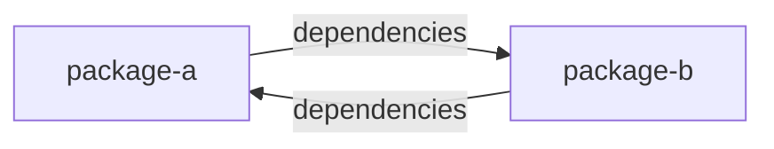

# Уровень 12: Циклы в монорепозиториях

## Аналогия: не квартиры, а дома

До сих пор мы говорили про циклы между файлами внутри одного проекта — это как две квартиры в одном доме, которые постоянно одалживают друг у друга вещи через общую стену. В монорепозитории появляется другой масштаб: циклы между целыми **пакетами** (workspace-пакетами) — это уже как два соседних дома, у которых в договоре аренды прописано «дом A получает воду от дома B», а в договоре дома B — «дом B получает электричество от дома A». Каждый договор по отдельности разумен, а вместе они создают ситуацию, при которой ни один дом нельзя «сдать в эксплуатацию» раньше другого.

## Другой масштаб — те же последствия

Если `package-a` в своём `package.json` объявляет зависимость от `package-b`, а `package-b` — зависимость от `package-a`, менеджер монорепозитория не может выстроить **топологический порядок** сборки: непонятно, что собирать первым. Это ломает не только рантайм (как в файловых циклах), но и саму систему сборки — параллелизм, кэширование, публикацию пакетов по отдельности.

## Инструменты другого уровня

Для файлов мы использовали madge и dependency-cruiser (уровень 5) — они умеют работать и на границах пакетов, если направить их на весь монорепозиторий. Но у современных монорепо-инструментов есть встроенные средства: `nx graph` строит визуальный граф зависимостей между проектами, `@nx/enforce-module-boundaries` запрещает недопустимые связи по тегам, а Turborepo и pnpm выстраивают **топологический порядок** запуска задач автоматически — и просто не смогут это сделать при цикле.

## Чинится тем же принципом

Решение узнаваемо из уровня 7: выделить общий пакет (`shared`/`core`), от которого оба зависимых пакета зависят однонаправленно, вместо того чтобы зависеть друг от друга напрямую. Разница лишь в том, что «третий модуль» здесь — это отдельный, отдельно версионируемый пакет.

📌 Запомнить: в монорепо цикл ломает не только рантайм, но и саму систему сборки — топологический порядок и кэш.

## Как это устроено в практике этого уровня

В браузерной песочнице настоящего `package.json` и workspace-протокола нет, поэтому пакеты эмулируются каталогами `packages/<pkg>/src/index.ts`, а связи между ними — bare-специфаерами вроде `@repo/a`, которые резолвятся в путь пакета через `aliases` задания. Импорт `import { x } from '@repo/b'` в этой схеме — прямой аналог записи `"@repo/b": "workspace:*"` в `dependencies` реального `package.json`: тот же граф, та же логика цикла, тот же набор приёмов починки (`import type`, динамический `import()`, третий пакет-посредник).
