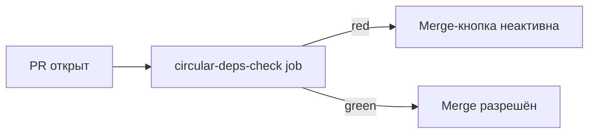
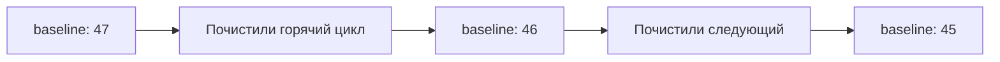

# Уровень 13 (подробно): CI-гейт и предотвращение новых циклов

## 1. Проблема: разовая чистка не защищает от рецидива

Представим, что команда потратила спринт на устранение всех циклов в проекте — применила приёмы из уровня 7, всё зелёное, `madge --circular` возвращает пустой список. Через месяц кто-то, не глядя, добавляет удобный импорт «в обход» — и цикл снова здесь, просто в другом месте. Без автоматического гейта в CI работа по устранению циклов становится сизифовым трудом: чистим — прорастает снова — чистим ещё раз.

Единственный устойчивый способ закрепить результат — сделать так, чтобы **CI физически не пропускал** PR с новым циклом, точно так же, как он не пропускает PR с падающими тестами.

## 2. Пример: шаг CI с madge --circular

Самый простой и универсальный вариант — отдельный шаг pipeline, который запускает madge с ненулевым exit code при найденном цикле:

```yaml
# .github/workflows/ci.yml
name: CI

on: [pull_request]

jobs:
  circular-deps-check:
    runs-on: ubuntu-latest
    steps:
      - uses: actions/checkout@v4
      - uses: actions/setup-node@v4
        with:
          node-version: 20
      - run: npm ci
      - name: Check for circular dependencies
        run: npx madge --circular --extensions ts,tsx src/
```

По умолчанию `madge --circular` завершается с кодом `1`, если находит хотя бы один цикл, и `0`, если циклов нет — этого достаточно, чтобы GitHub Actions пометил job как проваленный и заблокировал мерж, если в репозитории настроен required status check.

Альтернатива — dependency-cruiser с явным правилом `no-circular`:

```js
// .dependency-cruiser.js
module.exports = {
  forbidden: [
    {
      name: 'no-circular',
      severity: 'error',
      from: {},
      to: { circular: true },
    },
  ],
}
```

```yaml
- name: Check architecture rules
  run: npx depcruise src --config .dependency-cruiser.js
```

`severity: 'error'` — ключевая деталь: dependency-cruiser умеет выдавать и `warn`, который не ломает exit code, и `error`, который его ломает. Для гейта, блокирующего мерж, нужен именно `error`.

Третий вариант — ESLint-правило `import/no-cycle` (уровень 6) как часть обычного шага линта, который и так уже есть в большинстве CI-пайплайнов:

```yaml
- name: Lint
  run: npx eslint . --max-warnings=0
```

Здесь `--max-warnings=0` важен так же, как `severity: 'error'` у dependency-cruiser — если `import/no-cycle` настроено на уровень `warn`, а не `error`, обычный `eslint .` без этого флага завершится успешно даже при найденном цикле.

## 3. Как это работает: required status check

Сам факт, что шаг CI падает — недостаточен сам по себе. GitHub (и аналоги — GitLab CI, CircleCI) позволяют настроить **required status check**: правило ветки, при котором PR физически нельзя смержить, пока конкретный job не станет зелёным.



Без этой настройки в правилах ветки красный job — просто цветная иконка, которую можно проигнорировать и смержить руками. Обязательно проверяйте, что job с проверкой циклов добавлен именно в список required checks в настройках защиты ветки (Branch protection rules → Require status checks to pass).

## 4. Архитектурные фитнес-функции: не только про циклы

Термин **fitness function** (архитектурная фитнес-функция) пришёл из книги «Building Evolutionary Architectures» (Ford, Parsons, Kua) и означает автоматизированную проверку, которая измеряет, насколько текущее состояние системы соответствует желаемому архитектурному свойству — точно так же, как unit-тест проверяет соответствие поведения ожиданиям.

«Нет циклов в графе импортов» — одна из самых распространённых фитнес-функций, но далеко не единственная возможная в этом же pipeline:

```yaml
jobs:
  architecture-fitness:
    runs-on: ubuntu-latest
    steps:
      - uses: actions/checkout@v4
      - run: npm ci
      # Фитнес-функция 1: нет циклов
      - run: npx madge --circular --extensions ts,tsx src/
      # Фитнес-функция 2: границы FSD не нарушены (уровень 11)
      - run: npx eslint . --max-warnings=0
      # Фитнес-функция 3: структура FSD корректна (уровень 11)
      - run: npx steiger ./src
      # Фитнес-функция 4: границы пакетов монорепо (уровень 12)
      - run: npx nx run-many --target=lint --all
```

Ключевая мысль: циклы — это лишь одно из множества архитектурных свойств, которые стоит проверять автоматически на каждый PR, а не полагаться на память ревьюера. Мыслите о CI не просто как о «прогонщике тестов», а как о постоянном контроле соответствия кода архитектурным решениям, принятым командой.

## 5. Бюджет и baseline циклов для легаси-проектов

Строгий гейт «ноль циклов» отлично работает для нового проекта. Но что делать с проектом, в котором уже накопилось 47 циклов за три года разработки? Включить `severity: 'error'` в CI сразу — значит немедленно заблокировать вообще все PR, пока кто-то не почистит все 47 циклов разом, что на практике нереалистично.

Решение — подход **baseline** (снимок текущего состояния), знакомый по инструментам вроде ESLint (`--report-unused-disable-directives`) или системам отслеживания техдолга:

```js
// scripts/check-circular-baseline.js
const { execSync } = require('child_process')

const BASELINE = 47 // зафиксированное число известных циклов на дату внедрения гейта

const output = execSync('npx madge --circular --json --extensions ts,tsx src/').toString()
const cycles = JSON.parse(output)

if (cycles.length > BASELINE) {
  console.error(
    `❌ Найдено ${cycles.length} циклов, baseline — ${BASELINE}. ` +
      `Новые циклы запрещены — почините добавленный(е) цикл(ы) перед мержем.`
  )
  process.exit(1)
}

if (cycles.length < BASELINE) {
  console.warn(
    `⚠️ Отлично! Циклов стало меньше (${cycles.length} < ${BASELINE}). ` +
      `Обновите BASELINE в этом файле до ${cycles.length}, чтобы закрепить прогресс.`
  )
}

console.log(`✅ Циклов: ${cycles.length}, baseline: ${BASELINE} — гейт пройден.`)
```

```yaml
- name: Circular deps budget check
  run: node scripts/check-circular-baseline.js
```

Логика этого скрипта — правило-храповик (ratchet): число циклов может **только уменьшаться или оставаться прежним**, но никогда не расти. Это сразу останавливает деградацию, при этом не требует героического разового рефакторинга всего проекта.

## 6. Постепенное сокращение легаси-циклов

Зафиксировав baseline, дальше важно осознанно снижать число циклов, а не оставлять его навсегда «замороженным» на 47. Практичный подход:

1. **Приоритизация по «горячности»** — не все 47 циклов одинаково опасны. Начните с тех, что лежат в самых часто изменяемых файлах (можно узнать через `git log --format=format: --name-only | sort | uniq -c | sort -rn` — файлы с наибольшим числом коммитов) или в файлах с наибольшим числом входящих зависимостей (высокая связанность = наибольший риск).
2. **Один цикл за PR** — не пытайтесь чинить всё разом. Каждый почищенный цикл — маленький, самостоятельный, легко ревьюируемый PR с понятной причиной (уровень 10) и применённым приёмом (уровень 7).
3. **Метрика прогресса** — выводите число циклов как отслеживаемую метрику (например, в дашборд CI или просто в комментарий к PR), чтобы прогресс был виден команде, а не терялся молча в baseline-файле.
4. **Обновление baseline вниз по мере починки** — каждый раз, когда число циклов уменьшилось, снижайте `BASELINE`, чтобы храповик не давал регрессировать обратно к уже почищенному числу.



## ⚠️ Частые ошибки начинающих

### Ошибка 1: «Настроили madge --circular, но забыли добавить в required checks»

```yaml
# ❌ Job есть в workflow, но в branch protection rules
# он не отмечен как обязательный
```

Почему это проблема: без required status check красный job — это просто индикатор, который можно проигнорировать при мерже вручную (или через админский bypass). Гейт существует только формально, реальной защиты нет.

```
✅ Правильно — Settings → Branches → Branch protection rules →
Require status checks to pass before merging → выбрать job явно
```

### Ошибка 2: «severity: warn вместо error в dependency-cruiser»

```js
// ❌
{ name: 'no-circular', severity: 'warn', from: {}, to: { circular: true } }
```

Почему это проблема: `warn` не меняет exit code инструмента — CI job завершится успешно, даже если найден цикл, а предупреждение просто утонет в логе, который никто не читает построчно.

```js
// ✅
{ name: 'no-circular', severity: 'error', from: {}, to: { circular: true } }
```

### Ошибка 3: «Внедрить строгий гейт с нуля на легаси-проекте без baseline»

```yaml
# ❌ Сразу поставить madge --circular без --json и без сравнения с прошлым числом,
# заблокировав все 200 открытых PR разом
```

Почему это проблема: команда физически не может почистить сотни циклов за один спринт, а полностью заблокированный CI быстро приводит к тому, что гейт просто отключают «временно» — и это временное решение остаётся навсегда.

```js
// ✅ Правильно — начать с baseline (текущее число),
// запретить рост, снижать постепенно (см. раздел 5-6)
```

### Ошибка 4: «Гейт проверяет циклы, но не проверяет причину (границы FSD)»

```yaml
# ❌ Только madge --circular, без eslint-plugin-boundaries / @nx/enforce-module-boundaries
```

Почему это проблема: гейт на `no-circular` ловит уже случившийся цикл (симптом), но не мешает разработчику постоянно нарушать архитектурные границы, которые рано или поздно снова сомкнутся в цикл — CI будет краснеть регулярно вместо того, чтобы проблема не возникала вовсе (см. связку причина/симптом на уровнях 11-12).

```yaml
# ✅ Правильно — оба шага в одном pipeline:
# линтер границ (причина) + no-circular (симптом, страховка)
```

## 💡 Лучшие практики

- 📌 Добавляйте проверку циклов в CI на самом раннем этапе проекта — почти бесплатно поддерживать «ноль циклов», когда их и так ещё нет, и очень дорого внедрять гейт после того, как их накопились сотни.
- 📌 Используйте `severity: 'error'` (dependency-cruiser) или ненулевой exit code (madge) и обязательно добавляйте job в required status checks — иначе гейт существует только на бумаге.
- 📌 Для легаси — начинайте с baseline-скрипта (правило-храповик): рост запрещён, снижение приветствуется и постепенно обновляет порог.
- 📌 Приоритизируйте починку легаси-циклов по «горячности» файла (частота изменений, число входящих зависимостей), а не по алфавиту или случайному порядку.
- 📌 Рассматривайте проверку циклов как одну из нескольких архитектурных фитнес-функций CI, а не как единственную и самодостаточную — вместе с линтерами границ (уровни 11-12) она даёт куда более надёжную защиту.
