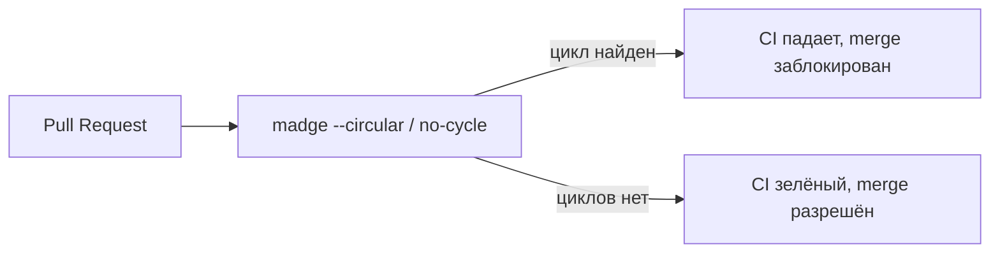

# Уровень 13: CI-гейт и предотвращение

## Аналогия: турникет, а не табличка на входе

Мы научились находить циклы (уровень 5), понимать их причины (уровни 2, 10) и чинить (уровни 7, 12). Но однажды почищенный проект не остаётся чистым сам по себе — новые циклы прорастают снова, если ничего не мешает им появиться. Табличка «пожалуйста, не создавайте циклы» на входе в репозиторий никого не остановит в пятницу вечером. Турникет на входе — остановит: не пройдёшь, пока не приложишь пропуск.

CI-гейт — это турникет для циклов: шаг pipeline, который явно падает (ненулевой exit code), если в PR обнаружен новый цикл. Не «предупреждение в логе, которое никто не читает», а реальная блокировка мержа.

## Фитнес-функции архитектуры

Такую проверку в CI называют **архитектурной фитнес-функцией** (architectural fitness function) — автоматизированным тестом, который проверяет не бизнес-логику, а свойство самой архитектуры («в графе импортов нет циклов», «слои не нарушены»). Она встраивается в pipeline так же, как обычные unit-тесты — и так же обязана быть зелёной для мержа.

## Легаси и бюджет циклов

Что делать, если циклов в проекте уже сотни, а гейт «запрещаем все циклы» немедленно ломает весь CI? Здесь работает подход, знакомый по борьбе с техдолгом: зафиксировать **baseline** — текущее число циклов — и разрешить в CI только не превышать его (запретить новые), а дальше постепенно, приоритизируя самые «горячие» файлы, сокращать существующие.

📌 Запомнить: цель CI-гейта не «нулевые циклы прямо завтра», а «циклы больше не растут, начиная с сегодня» — и это уже огромный шаг вперёд.
