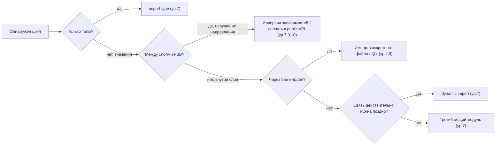

# Уровень 14 (подробно): Сквозной workflow устранения циклов

## 1. Проблема: разрозненные знания без порядка их применения

За тринадцать уровней мы разобрали много инструментов и приёмов по отдельности:

- **обнаружение**: madge, dependency-cruiser, `import/no-cycle` (уровни 5-6);
- **природа проблемы**: порядок инициализации модулей, hoisting, TDZ (уровни 1-3);
- **источники**: barrel-файлы (уровень 4), нарушения FSD (уровни 8-10);
- **приёмы починки**: `import type`, третий модуль, DIP, dynamic import, `@x`-нотация (уровень 7);
- **автоматизация защиты**: линтеры границ (уровень 11), монорепо (уровень 12), CI-гейт (уровень 13).

Проблема в том, что на реальном проекте эти знания нужно применять **в правильном порядке и по правильному диагнозу**, а не хаотично — иначе разработчик, увидев цикл, хватается за первый попавшийся приём (чаще всего — dynamic import, потому что «звучит понятно»), даже если правильный рецепт совсем другой и в разы проще.

📌 В отличие от предыдущих уровней, здесь теория — не самоцель, а разминка перед практикой: шесть практических заданий ниже (14.1–14.6) дают реальные графы модулей и FSD-срезы с уже готовыми циклами, где нужно применить именно тот приём, который подсказывает диагноз, а не первый попавшийся.

## 2. Пример: единый пошаговый workflow

### Шаг 1 — Обнаружить

```bash
npx madge --circular --extensions ts,tsx src/
```

```
✖ Found 3 circular dependencies!

1) entities/user/model/store.ts > features/cart/model/store.ts
2) shared/lib/format.ts > shared/lib/validate.ts
3) widgets/header/index.ts > widgets/header/ui/Header.tsx > entities/user/index.ts
```

На этом шаге у нас просто **список путей** — три разных цикла, про каждый из которых мы пока не знаем ничего, кроме того, что он существует.

### Шаг 2 — Классифицировать каждый цикл

Для каждого найденного цикла последовательно отвечаем на три вопроса:

| Цикл                                                 | Типовой или рантайм?                                 | Внутри слоя или между слоями?                                                                | Через barrel?                         |
| ---------------------------------------------------- | ---------------------------------------------------- | -------------------------------------------------------------------------------------------- | ------------------------------------- |
| 1) `entities/user` ⇄ `features/cart`                 | Рантайм (используются функции стора, не только типы) | Между слоями — `entities` не должен знать про `features` (нарушение направления, уровень 10) | Нет, прямой импорт файлов             |
| 2) `shared/lib/format.ts` ⇄ `shared/lib/validate.ts` | Рантайм (обе функции вызывают друг друга)            | Внутри одного слоя `shared` — направление не нарушено                                        | Нет                                   |
| 3) `widgets/header` ⇄ `entities/user`                | Рантайм, но связь идёт через public API виджета      | Между слоями, но по касательной — через barrel `widgets/header/index.ts`                     | Да, цикл замыкается через barrel-файл |

Уже на этом шаге видно: три цикла выглядят одинаково в выводе madge («список строк»), но диагнозы у них принципиально разные — и, соответственно, разное лечение.

### Шаг 3 — Выбрать приём под диагноз

- **Цикл 1** (нарушение направления FSD, рантайм-связь) → приём уровня 7 «инверсия зависимостей» + приём уровня 10 «вернуть импорт через public API»: `entities/user` не должен знать о существовании `features/cart` вообще. Правильно — событие/колбэк передаётся сверху, из `features/cart`, а не запрашивается снизу.
- **Цикл 2** (равноправные модули одного слоя, рантайм-связь) → приём уровня 7 «третий модуль»: обе функции используют общую логику — выносим её в `shared/lib/text-utils.ts`, от которого оба зависят однонаправленно.
- **Цикл 3** (цикл через barrel-файл, уровень 4) → приём уровня 9 «импортировать конкретный файл вместо public API» внутри самого же виджета, либо `@x`-нотация FSD, если `entities/user` действительно должен использовать что-то из `widgets/header` в исключительном случае.

### Шаг 4 — Починить: до / после

**Цикл 1 — до:**

```ts
// entities/user/model/store.ts
import { getCartTotal } from 'features/cart/model/store' // ❌ entities → features, нарушение направления

export function getUserSummary(userId: string) {
  return `${userId}: total ${getCartTotal()}`
}
```

**Цикл 1 — после (инверсия зависимостей, колбэк передаётся сверху):**

```ts
// entities/user/model/store.ts
export function getUserSummary(userId: string, cartTotal: number) {
  return `${userId}: total ${cartTotal}` // ✅ entities больше не знает про features
}

// features/cart/model/store.ts
import { getUserSummary } from 'entities/user' // features → entities, направление верное
export function renderSummary(userId: string) {
  return getUserSummary(userId, getCartTotal())
}
```

**Цикл 2 — до:**

```ts
// shared/lib/format.ts
import { isValidAmount } from './validate'
export function formatAmount(v: number) {
  return isValidAmount(v) ? `$${v.toFixed(2)}` : 'N/A'
}

// shared/lib/validate.ts
import { formatAmount } from './format' // ❌ обратная связь ради логирования
export function isValidAmount(v: number) {
  if (v < 0) console.warn(`Invalid: ${formatAmount(v)}`)
  return v >= 0
}
```

**Цикл 2 — после (третий модуль):**

```ts
// shared/lib/currency.ts — новый общий модуль
export function toDisplayAmount(v: number) {
  return `$${v.toFixed(2)}`
}

// shared/lib/format.ts
import { toDisplayAmount } from './currency'
export function formatAmount(v: number) {
  return v >= 0 ? toDisplayAmount(v) : 'N/A'
}

// shared/lib/validate.ts
import { toDisplayAmount } from './currency' // ✅ оба зависят от currency, не друг от друга
export function isValidAmount(v: number) {
  if (v < 0) console.warn(`Invalid: ${toDisplayAmount(v)}`)
  return v >= 0
}
```

**Цикл 3 — до:**

```ts
// widgets/header/index.ts (public API виджета)
export { Header } from './ui/Header'

// widgets/header/ui/Header.tsx
import { UserAvatar } from 'entities/user' // widgets → entities, направление верное

// entities/user/index.ts
import { Header } from 'widgets/header' // ❌ entities → widgets, цикл через barrel
```

**Цикл 3 — после (убрать обратную связь, `entities` не должен знать про `widgets`):**

```ts
// entities/user/index.ts
export { UserAvatar } from './ui/UserAvatar' // ✅ никакого импорта Header — entities ничего не знает о widgets
```

### Шаг 5 — Закрепить в CI

```yaml
# .github/workflows/ci.yml — гейт из уровня 13
- name: Circular deps check
  run: npx madge --circular --extensions ts,tsx src/
- name: Boundary linter
  run: npx eslint . --max-warnings=0 # eslint-plugin-boundaries / FSD-config, уровень 11
```

После починки всех трёх циклов CI-гейт гарантирует: если завтра кто-то снова напишет `import { getCartTotal } from 'features/cart'` внутри `entities/user`, линтер границ (причина) заблокирует PR ещё до того, как это станет циклом, а `madge --circular` (симптом) — подстрахует на случай, если граница где-то не покрыта линтером.

## 3. Как это работает: дерево решений целиком



Это дерево — не новая теория, а просто явная сборка вопросов, которые мы неявно задавали на протяжении всего курса. Каждая ветка ведёт к приёму, уже разобранному на конкретном уровне — капстоун лишь показывает, в каком порядке эти вопросы задавать на практике.

## 4. Связь со всем курсом

| Шаг workflow                         | На каком уровне курса разобран                                                                                   |
| ------------------------------------ | ---------------------------------------------------------------------------------------------------------------- |
| 1. Обнаружить                        | Уровень 5 (madge, dependency-cruiser), уровень 6 (ESLint `import/no-cycle`)                                      |
| 2. Классифицировать: типовой/рантайм | Уровень 3 (`import type` vs runtime import)                                                                      |
| 2. Классифицировать: слои/слайсы     | Уровни 8-10 (FSD-слои, изоляция слайсов, нарушения)                                                              |
| 2. Классифицировать: barrel          | Уровень 4 (barrel-файлы как источник транзитивных циклов)                                                        |
| 3-4. Выбрать приём и починить        | Уровень 7 (`import type`, третий модуль, DIP, dynamic import), уровень 9 (public API), уровень 10 (`@x`-нотация) |
| 5. Закрепить в CI                    | Уровень 11 (линтеры границ), уровень 12 (монорепо), уровень 13 (CI-гейт, baseline)                               |

Курс был построен именно в этом порядке не случайно: каждый следующий уровень давал один кирпичик, а капстоун — это чертёж дома, собранного из всех кирпичиков сразу.

## Частые ошибки новичков

### Ошибка 1: «Применить dynamic import ко всем найденным циклам без разбора»

```ts
// ❌ Универсальный "рецепт от всего": обернуть проблемный импорт в dynamic import,
// не разбираясь, типовой цикл это или рантайм-цикл между слоями
async function getUserSummary(userId: string) {
  const { getCartTotal } = await import('features/cart/model/store')
  return `${userId}: ${getCartTotal()}`
}
```

Почему это проблема: dynamic import — самый тяжёлый по последствиям приём (асинхронность распространяется по всей цепочке вызовов), а для цикла 1 из примера выше правильным решением была простая инверсия зависимостей без всякой асинхронности. Хватать самый мощный инструмент для любой задачи — источник переусложнения.

```ts
// ✅ Сначала классифицировать (шаг 2), потом выбирать приём (шаг 3) —
// dynamic import только тогда, когда связь ДЕЙСТВИТЕЛЬНО нужна асинхронно,
// а не как способ "заткнуть" любой цикл
```

### Ошибка 2: «Чинить все найденные циклы одним большим PR»

```
❌ fix: resolve all 12 circular dependencies
   (изменено 47 файлов)
```

Почему это проблема: такой PR невозможно нормально отревьюить, риск случайно сломать что-то незамеченным резко растёт, а откатить точечно одно изменение при проблеме в проде — тоже нельзя (уровень 13 — тот же принцип «один цикл за PR», только применённый не к легаси-бюджету, а к самому капстоуну).

```
✅ fix(entities/user): remove reverse dependency on features/cart
✅ fix(shared/lib): extract shared currency formatting
✅ fix(widgets/header): break barrel cycle with entities/user
```

### Ошибка 3: «Починить циклы, но не поставить CI-гейт»

```
❌ Все 3 цикла из примера почищены, PR смержен,
   про gate из уровня 13 "решили сделать позже"
```

Почему это проблема: без гейта ничего не мешает следующему разработчику снова написать `import { getCartTotal } from 'features/cart'` внутри `entities/user` уже через неделю — вся проделанная работа не закреплена и рискует раствориться незаметно (это же наблюдение, только для целого workflow, что и в начале уровня 13).

```
✅ Шаг 5 workflow — не опциональный последний штрих,
   а обязательная часть починки любого цикла
```

### Ошибка 4: «Пропустить классификацию, потому что "и так всё понятно"»

```
❌ Увидел цикл в выводе madge — сразу пишет патч,
   не выяснив, типовой он или рантайм, внутри слоя или между слоями
```

Почему это проблема: без явной классификации легко перепутать диагноз — например, принять цикл через barrel (диагноз «через barrel», приём — импорт конкретного файла) за нарушение направления FSD (диагноз другой, приём — инверсия зависимостей), потратив время не на то решение.

```
✅ Три вопроса шага 2 — это не бюрократия,
   а компактный чек-лист, который занимает меньше минуты
   и экономит часы неверных попыток починки
```

## Хорошие практики

- 📌 Никогда не чините цикл, не ответив сначала на три вопроса классификации (типовой/рантайм, внутри/между слоями, через barrel или нет) — диагноз определяет лечение.
- 📌 Держите каждую починку цикла отдельным, маленьким, легко ревьюируемым PR — даже если циклов найдено много сразу.
- 📌 Всегда завершайте работу с циклом закреплением в CI (уровень 13) — без этого шага результат не защищён от рецидива.
- 📌 Возвращайтесь к дереву решений (раздел 3) как к шпаргалке на реальных code review — это компактная выжимка всех приёмов уровня 7 в виде последовательности вопросов.
- 📌 Помните, что весь этот курс — не набор разрозненных фактов, а один связный workflow: обнаружение → диагностика → лечение → профилактика, применимый к любому JS/TS-проекту любого масштаба, от одного файла до монорепозитория.
