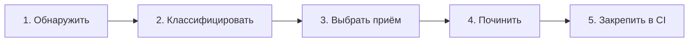

# Уровень 14: Капстоун — сквозной workflow

## Аналогия: от симптома к рецепту, а не наугад

Весь курс мы разбирали отдельные приёмы по отдельности: находить (уровень 5), понимать причины (уровни 1-2, 10), чинить (уровень 7), автоматизировать защиту (уровни 11-13). Врач, который видит любой симптом и сразу выписывает один и тот же препарат, — плохой врач. Хороший сначала **диагностирует** (какой именно это цикл?), потом **выбирает лечение** под конкретный диагноз, потом лечит, потом следит, чтобы болезнь не вернулась.

Этот уровень — сборка всего курса в единый пошаговый workflow, который применим к любому реальному проекту.

## Пять шагов

1. **Обнаружить** — madge / dependency-cruiser / ESLint `import/no-cycle` (уровни 5-6) дают список циклов.
2. **Классифицировать** — для каждого цикла ответить на вопросы: он **типовой** (только `import type`) или **рантайм** (значения/функции)? Он **внутри одного слоя** или **между слоями FSD** (нарушение направления, уровень 10)? Проходит ли он **через barrel-файл** (уровень 4)?
3. **Выбрать приём** — под каждый диагноз есть свой рецепт из уровня 7: `import type` для типового цикла, третий модуль или DIP для рантайм-цикла между равноправными модулями, dynamic import для по-настоящему нужной поздней связи, возврат к public API или `@x`-нотация для нарушений FSD.
4. **Починить** — применить выбранный приём, убедиться, что тесты и типы всё ещё зелёные.
5. **Закрепить в CI** — гейт из уровня 13, чтобы почищенный цикл не вернулся в этот же файл через месяц.

## Почему порядок важен

Пропуск шага 2 (классификация) — самая частая ошибка: применить dynamic import к типовому циклу — переусложнение, а `import type` к рантайм-циклу — не сработает вообще, ошибка останется. Диагноз определяет лечение, а не наоборот.

📌 Запомнить: обнаружение без классификации — это просто список красных строк в терминале, а не план действий.

## Практика

Шесть заданий ниже проверяют весь workflow на реальных фрагментах кода — двумя темами:

- **Тема A «Распутать модульный граф»** (14.1–14.3) — обычные модули, циклы разной сложности: от одного ребра до двух переплетённых циклов через общий узел.
- **Тема B «FSD-срез без циклов»** (14.4–14.6) — вертикальные срезы `entities → features → widgets`, где цикл рождается из нарушения направления слоёв или глубокого импорта в обход public API.
