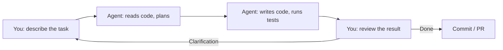
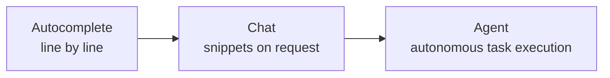

# Level 0: Agent-Based Development -- A New Paradigm

## Introduction

Programming is undergoing a tectonic shift. For decades, there was one model: a developer opens an editor, types code, runs tests, fixes bugs. Tools changed (from Notepad to vim, from vim to VS Code), but the essence remained -- **you write every line by hand**.

Then came autocomplete: GitHub Copilot, Tabnine, Codeium. They sped up code entry but didn't change the model. You're still the "driver", AI is the "navigator" suggesting the next turn.

Agent-based development is a fundamentally different model. You become the **"client and reviewer"**, and the AI agent becomes the **executor** that independently reads code, plans changes, writes code, runs tests, and commits the result.



Analogy: before you were a **cook** -- chopping ingredients yourself, standing at the stove, tasting. Now you're a **head chef** -- describing the dish, controlling the process, tasting the result, but your hands aren't in the sauce.

---

## 1. Evolution of Development Tools

To understand why agent-based development is not just "another AI tool", let's look at the evolution:

### Generation 1: Static Analysis (2010s)

IDE highlights errors, suggests auto-imports, hints at types. Tools: ESLint, TypeScript, IntelliSense.

**What changed:** fewer typos, faster code navigation.

### Generation 2: Smart Autocomplete (2021-2023)

AI predicts the next line or code block. Tools: GitHub Copilot, Tabnine, Codeium.

**What changed:** faster code entry, less routine input.

### Generation 3: Chat-in-IDE (2023-2024)

AI answers questions about code, generates snippets on request. Tools: Copilot Chat, Cursor Composer.

**What changed:** AI like a "smart StackOverflow" right in the editor.

### Generation 4: Agent-Based Development (2024-...)

AI autonomously performs tasks: reads files, writes code, runs commands, makes commits. Tools: Claude Code, Codex CLI, Gemini CLI.

**What changed:** AI is not an assistant, but an **executor**. You manage at the task level, not at the code line level.



---

## 2. The "Human -- Agent -- Code" Interaction Model

### Three Participants

In agent-based development, there are always three participants:

**Human (you):**
- Formulates tasks in natural language
- Makes architectural decisions
- Conducts code reviews
- Confirms or rejects agent actions

**Agent (Claude Code):**
- Reads project files and understands context
- Plans sequence of actions
- Writes and edits code
- Runs commands (tests, build, linting)
- Works with git (commits, branches, PR)

**Codebase:**
- Project files (source code, configuration)
- Git history (commits, branches)
- Infrastructure (package.json, CI/CD configs)
- Documentation (CLAUDE.md, README, JSDoc)

### Interaction Cycle

A typical Claude Code session looks like this:

```
You: "Add JWT authentication to the API"

Claude Code:
  1. Reads project structure
  2. Finds existing routes and middleware
  3. Installs jsonwebtoken
  4. Creates middleware/auth.ts
  5. Updates routes
  6. Writes tests
  7. Runs tests -- they pass
  8. Shows diff

You: "Great, but add refresh tokens"

Claude Code:
  1. Reads the just-written code
  2. Adds refresh token logic
  3. Updates tests
  ...
```

📌 **Important:** the agent remembers conversation context. Each subsequent message builds on previous ones -- no need to repeat "in the auth.ts file you just created".

---

## 3. Claude Code: Overview of Capabilities

### Form Factors

Claude Code is available in several variants:

**CLI (primary)**
```bash
# Interactive mode
claude

# One-time task
claude "add email validation to the registration form"

# Pipe mode (for scripts)
cat error.log | claude "explain this error"
```

**IDE Extensions**
- VS Code: integration via extension
- JetBrains: support for IntelliJ, WebStorm, etc.

**GitHub Actions**
```yaml
# In CI/CD pipeline
- uses: anthropics/claude-code-action@v1
  with:
    prompt: "Conduct a code review of this PR"
```

### Key Capabilities

| Capability | Example |
|------------|--------|
| File reading | Agent finds necessary files itself |
| Editing | Point fixes or creating new files |
| Running commands | `npm test`, `npm run build`, `git status` |
| Git operations | Commits, branch creation, PR |
| Code search | Grep, glob, dependency navigation |
| Package installation | `npm install`, `pip install` |
| Terminal work | Any bash commands |

### What Claude Code Does Differently

Unlike autocomplete, Claude Code **decides itself** which files to read, which commands to run, which tests to execute. You don't direct it "read file X, now change line Y" -- you describe the **goal**, and the agent finds the way.

```
❌ "Open src/utils/validate.ts, find the validateEmail function,
    replace the regex with /^[^\s@]+@[^\s@]+\.[^\s@]+$/"

✅ "There's a bug in email validation -- it allows addresses with two dots
    in the domain. Fix it."
```

---

## 4. Context Window -- The Main Resource

### What It Is

The context window is the amount of information the agent can "keep in mind" at once. Everything the agent sees (your instructions, project files, conversation history, command results) must fit within this window.

Analogy: the context window is a **desk**. The more papers you pile on it, the harder it is to find what you need. If the desk is clutterated, you start losing important documents among the clutter.

### Why It's Critically Important

When context runs out:
- Agent "forgets" early instructions
- Response quality degrades
- Hallucinations and repetitions appear
- You have to start a new session

### What Makes Up Context

```
┌─────────────────────────────────────────┐
│          Context Window                 │
├─────────────────────────────────────────┤
│ ~25% System instructions (CLAUDE.md)    │
│ ~25% Conversation history               │
│ ~50% Workspace                          │
│      (files, command results)           │
└─────────────────────────────────────────┘
```

💡 This entire course is about maximizing the efficiency of every percent of this window.

### Context Exhaustion Signals

Claude Code shows remaining context in the status bar. When you see context running low:

- `/compact` -- compresses conversation history, preserving the essence
- `/clear` -- complete reset, start with a clean slate
- Decompose the task into parts and handle each in a separate session

---

## 5. When Agent-Based Development is Effective (and When It's Not)

### ✅ Works Great

**Routine tasks:**
- CRUD operations, forms, tables
- Writing tests for existing code
- Data migrations, dependency updates

**Refactoring:**
- Project-wide renaming
- Splitting large modules
- Migration to new APIs

**Research:**
- Exploring unfamiliar codebases
- Finding bugs through call stacks
- Understanding complex dependencies

**Prototyping:**
- Quick MVPs and proof-of-concept
- Project skeleton generation
- Experimental features

### ⚠️ Requires Caution

**Complex business logic:**
- The agent doesn't know your business domain
- Provide detailed context or work step by step

**Security:**
- The agent might accidentally log secrets
- Always check diff before committing

### ❌ Not the Best Choice

**Low-level optimization:**
- Algorithm optimization, memory management
- Requires deep expertise and profiling here

**Non-standard environments:**
- Exotic platforms, custom toolchains
- Agent may not know the specifics

---

## 6. Comparison with Other Tools

### GitHub Copilot

**Focus:** line-by-line code autocomplete.

Copilot works **within your typing**. You write a comment or function start -- Copilot suggests a continuation. This speeds up typing but doesn't change the work model: you still decide which file to open, which code to write, which command to run.

### Cursor

**Focus:** AI IDE with chat and Composer.

Cursor is closer to the agent model -- Composer can edit multiple files. But Cursor is tied to its own IDE. Claude Code works in **any terminal**, can run **any commands**, and doesn't depend on a specific editor.

### Summary Table

| Capability | GitHub Copilot | Cursor | Claude Code |
|------------|---------------|--------|-------------|
| Line autocomplete | ✅ Primary mode | ✅ | ❌ |
| Code chat | ✅ | ✅ | ✅ |
| Multi-file editing | ❌ | ✅ Composer | ✅ |
| Running commands | ❌ | ⚠️ Limited | ✅ |
| Git operations | ❌ | ❌ | ✅ |
| Terminal work | ❌ | ❌ | ✅ |
| Autonomous execution | ❌ | ⚠️ | ✅ |
| File-based configuration | ❌ | `.cursorrules` | `CLAUDE.md` |
| Extensibility (MCP, hooks) | ❌ | ❌ | ✅ |
| CI/CD integration | ❌ | ❌ | ✅ GitHub Actions |

💡 These tools are not mutually exclusive. Many use Copilot for autocomplete **and** Claude Code for complex tasks.

---

## 7. First Steps with Claude Code

### Installation

```bash
# Install via npm
npm install -g @anthropic-ai/claude-code

# Verify
claude --version
```

### First Launch

```bash
# Navigate to your project
cd my-project

# Launch Claude Code
claude
```

On first launch, Claude Code:
1. Reads the project structure
2. Finds `CLAUDE.md` if it exists
3. Loads rules from `.claude/rules/`
4. Is ready for your tasks

### Useful Commands

| Command | What it does |
|---------|-------------|
| `/help` | List of all commands |
| `/init` | Create CLAUDE.md automatically |
| `/compact` | Compress history, free up context |
| `/clear` | Start session with a clean slate |
| `/status` | Information about current session |
| `/cost` | Show token usage |

---

## ⚠️ Common Beginner Mistakes

### 🐛 1. Vague Tasks

```
❌ "Make this code better"
```

> **Why this is a problem:** "better" is subjective. The agent doesn't know what matters more to you: performance, readability, type safety? It will guess, and the result likely won't satisfy you.

```
✅ "Split the processOrder function into three separate ones:
    validateOrder, calculateTotal, saveOrder.
    Add types for parameters and return values."
```

### 🐛 2. Giant Tasks Without Decomposition

```
❌ "Rewrite the entire project in TypeScript, add tests for all
    modules, set up CI/CD, and update documentation"
```

> **Why this is a problem:** such a task will consume all context in one go. The agent will start losing focus, forget initial instructions, and make mistakes. Plus, if something goes wrong, rolling back changes will be very difficult.

```
✅ Step 1: "Migrate src/utils/ module to TypeScript"
✅ Step 2: "Add tests for src/utils/"
✅ Step 3: "Set up GitHub Actions for running tests"
```

### 🐛 3. Blind Trust in Results

> **Why this is a problem:** the agent can write code that passes tests but contains a logical error, security issue, or suboptimal solution. "Tests are green" doesn't mean "code is perfect".

```
✅ Always run git diff before committing
✅ Check edge cases the agent might have missed
✅ For critical code -- ask the agent to explain its decision
```

### 🐛 4. Not Configuring the Agent for the Project

> **Why this is a problem:** without `CLAUDE.md`, the agent doesn't know your conventions: code style, project structure, build commands. Each time it will "guess", and guess differently.

```
✅ Create CLAUDE.md (next level of the course!)
✅ Describe code style, architectural decisions, build commands
```

---

## 📌 Summary

- ✅ Agent-based development is a fundamentally new model: you describe **what**, the agent does **how**
- ✅ Claude Code is a terminal-based agent that autonomously performs tasks
- ✅ Context window is the main limited resource -- conserve it
- ✅ Give specific, decomposed tasks
- ✅ Always review the agent's work
- ✅ Copilot, Cursor, and Claude Code are not competitors, but tools for different tasks
- 📌 Next step -- configure the agent for your project via `CLAUDE.md`
