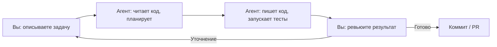

# Уровень 0: Агентская разработка -- новая парадигма

## Введение

Программирование переживает тектонический сдвиг. На протяжении десятилетий модель была одна: разработчик открывает редактор, набирает код, запускает тесты, исправляет баги. Инструменты менялись (от Notepad к vim, от vim к VS Code), но суть оставалась -- **вы пишете каждую строку руками**.

Потом появился автокомплит: GitHub Copilot, Tabnine, Codeium. Они ускорили набор кода, но не изменили модель. Вы по-прежнему "водитель", AI -- "навигатор", который подсказывает следующий поворот.

Агентская разработка -- это принципиально другая модель. Вы становитесь **"заказчиком и ревьюером"**, а AI-агент -- **исполнителем**, который самостоятельно читает код, планирует изменения, пишет код, запускает тесты и коммитит результат.



Аналогия: раньше вы были **поваром** -- сами нарезали ингредиенты, стояли у плиты, пробовали на вкус. Теперь вы **шеф-повар** -- описываете блюдо, контролируете процесс, пробуете результат, но руки в соусе не у вас.

---

## 1. Эволюция инструментов разработки

Чтобы понять, почему агентская разработка -- это не просто "ещё один AI-инструмент", посмотрим на эволюцию:

### Поколение 1: Статический анализ (2010-е)

IDE подчёркивает ошибки, предлагает автоимпорт, подсказывает типы. Инструменты: ESLint, TypeScript, IntelliSense.

**Что изменилось:** меньше опечаток, быстрее навигация по коду.

### Поколение 2: Умный автокомплит (2021-2023)

AI предсказывает следующую строку или блок кода. Инструменты: GitHub Copilot, Tabnine, Codeium.

**Что изменилось:** быстрее набор кода, меньше рутинного ввода.

### Поколение 3: Chat-in-IDE (2023-2024)

AI отвечает на вопросы о коде, генерирует фрагменты по запросу. Инструменты: Copilot Chat, Cursor Composer.

**Что изменилось:** AI как "умный StackOverflow" прямо в редакторе.

### Поколение 4: Агентская разработка (2024-...)

AI автономно выполняет задачи: читает файлы, пишет код, запускает команды, делает коммиты. Инструменты: Claude Code, Codex CLI, Gemini CLI.

**Что изменилось:** AI -- не помощник, а **исполнитель**. Вы управляете на уровне задач, не на уровне строк кода.


---

## 2. Модель взаимодействия "человек -- агент -- код"

### Три участника

В агентской разработке всегда три участника:

**Человек (вы):**
- Формулирует задачу на естественном языке
- Принимает архитектурные решения
- Проводит ревью изменений
- Подтверждает или отклоняет действия агента

**Агент (Claude Code):**
- Читает файлы проекта и понимает контекст
- Планирует последовательность действий
- Пишет и редактирует код
- Запускает команды (тесты, сборка, линтинг)
- Работает с git (коммиты, ветки, PR)

**Кодовая база:**
- Файлы проекта (исходный код, конфигурация)
- Git-история (коммиты, ветки)
- Инфраструктура (package.json, CI/CD конфиги)
- Документация (CLAUDE.md, README, JSDoc)

### Цикл взаимодействия

Типичная сессия работы с Claude Code выглядит так:

```
Вы: "Добавь авторизацию по JWT в API"

Claude Code:
  1. Читает структуру проекта
  2. Находит существующие роуты и middleware
  3. Устанавливает jsonwebtoken
  4. Создаёт middleware/auth.ts
  5. Обновляет роуты
  6. Пишет тесты
  7. Запускает тесты -- проходят
  8. Показывает diff

Вы: "Отлично, но добавь refresh tokens"

Claude Code:
  1. Читает только что написанный код
  2. Добавляет логику refresh tokens
  3. Обновляет тесты
  ...
```

📌 **Важно:** агент помнит контекст разговора. Каждое следующее сообщение опирается на предыдущие -- не нужно повторять "в файле auth.ts, который ты только что создал".

---

## 3. Claude Code: обзор возможностей

### Форм-факторы

Claude Code доступен в нескольких вариантах:

**CLI (основной)**
```bash
# Интерактивный режим
claude

# Одноразовая задача
claude "добавь валидацию email в форму регистрации"

# Pipe-режим (для скриптов)
cat error.log | claude "объясни эту ошибку"
```

**IDE-расширения**
- VS Code: интеграция через расширение
- JetBrains: поддержка IntelliJ, WebStorm и др.

**GitHub Actions**
```yaml
# В CI/CD пайплайне
- uses: anthropics/claude-code-action@v1
  with:
    prompt: "Проведи code review этого PR"
```

### Ключевые возможности

| Возможность | Пример |
|-------------|--------|
| Чтение файлов | Агент сам находит нужные файлы |
| Редактирование | Точечные правки или создание новых файлов |
| Запуск команд | `npm test`, `npm run build`, `git status` |
| Git-операции | Коммиты, создание веток, PR |
| Поиск по коду | Grep, glob, навигация по зависимостям |
| Установка пакетов | `npm install`, `pip install` |
| Работа с терминалом | Любые bash-команды |

### Что Claude Code делает иначе

В отличие от автокомплита, Claude Code **сам решает**, какие файлы прочитать, какие команды выполнить, какие тесты запустить. Вы не направляете его "прочитай файл X, теперь измени строку Y" -- вы описываете **цель**, а агент находит путь.

```
❌ "Открой файл src/utils/validate.ts, найди функцию validateEmail,
    замени регулярку на /^[^\s@]+@[^\s@]+\.[^\s@]+$/"

✅ "В валидации email есть баг -- она пропускает адреса с двумя точками
    в домене. Исправь."
```

---

## 4. Контекстное окно -- главный ресурс

### Что это такое

Контекстное окно -- это объём информации, который агент может "держать в голове" одновременно. Всё, что агент видит (ваши инструкции, файлы проекта, история диалога, результаты команд), должно помещаться в это окно.

Аналогия: контекстное окно -- это **рабочий стол**. Чем больше бумаг вы на него навалите, тем сложнее найти нужную. Если стол завален, вы начинаете терять важные документы среди мусора.

### Почему это критически важно

Когда контекст заканчивается:
- Агент "забывает" ранние инструкции
- Качество ответов снижается
- Появляются галлюцинации и повторения
- Приходится начинать новую сессию

### Из чего складывается контекст

```
┌─────────────────────────────────────────┐
│          Контекстное окно               │
├─────────────────────────────────────────┤
│ ~25% Системные инструкции (CLAUDE.md)   │
│ ~25% История разговора                  │
│ ~50% Рабочее пространство               │
│      (файлы, результаты команд)         │
└─────────────────────────────────────────┘
```

💡 Весь этот курс -- про то, как максимально эффективно использовать каждый процент этого окна.

### Сигналы исчерпания контекста

Claude Code показывает оставшийся контекст в строке статуса. Когда видите, что контекст на исходе:

- `/compact` -- сжимает историю разговора, сохраняя суть
- `/clear` -- полный сброс, начинаете с чистого листа
- Декомпозируйте задачу на части и решайте каждую в отдельной сессии

---

## 5. Когда агентская разработка эффективна (и когда нет)

### ✅ Отлично подходит

**Рутинные задачи:**
- CRUD-операции, формы, таблицы
- Написание тестов по существующему коду
- Миграции данных, обновление зависимостей

**Рефакторинг:**
- Переименование по всему проекту
- Разбиение крупных модулей
- Миграция на новый API

**Исследование:**
- Разбор незнакомой кодовой базы
- Поиск багов по стеку вызовов
- Понимание сложных зависимостей

**Прототипирование:**
- Быстрые MVP и proof-of-concept
- Генерация скелета проекта
- Экспериментальные фичи

### ⚠️ Требует осторожности

**Сложная бизнес-логика:**
- Агент не знает ваш бизнес-домен
- Давайте подробный контекст или работайте пошагово

**Безопасность:**
- Агент может случайно залогировать секреты
- Всегда проверяйте diff перед коммитом

### ❌ Не лучший выбор

**Низкоуровневая оптимизация:**
- Оптимизация алгоритмов, работа с памятью
- Здесь нужна глубокая экспертиза и профилирование

**Нестандартные окружения:**
- Экзотические платформы, кастомные тулчейны
- Агент может не знать специфику

---

## 6. Сравнение с другими инструментами

### GitHub Copilot

**Фокус:** автодополнение кода строка за строкой.

Copilot работает **внутри вашего набора текста**. Вы пишете комментарий или начало функции -- Copilot предлагает продолжение. Это ускоряет набор, но не меняет модель работы: вы по-прежнему сами решаете, какой файл открыть, какой код написать, какую команду запустить.

### Cursor

**Фокус:** AI-IDE с чатом и Composer.

Cursor ближе к агентской модели -- Composer может редактировать несколько файлов. Но Cursor привязан к своему IDE. Claude Code работает в **любом терминале**, может запускать **любые команды** и не зависит от конкретного редактора.

### Сводная таблица

| Возможность | GitHub Copilot | Cursor | Claude Code |
|-------------|---------------|--------|-------------|
| Автодополнение строк | ✅ Основной режим | ✅ | ❌ |
| Чат о коде | ✅ | ✅ | ✅ |
| Многофайловое редактирование | ❌ | ✅ Composer | ✅ |
| Запуск команд | ❌ | ⚠️ Ограниченно | ✅ |
| Git-операции | ❌ | ❌ | ✅ |
| Работа в терминале | ❌ | ❌ | ✅ |
| Автономное выполнение | ❌ | ⚠️ | ✅ |
| Настройка через файлы | ❌ | `.cursorrules` | `CLAUDE.md` |
| Расширяемость (MCP, хуки) | ❌ | ❌ | ✅ |
| CI/CD интеграция | ❌ | ❌ | ✅ GitHub Actions |

💡 Эти инструменты не взаимоисключающие. Многие используют Copilot для автокомплита **и** Claude Code для сложных задач.

---

## 7. Первые шаги с Claude Code

### Установка

```bash
# Установка через npm
npm install -g @anthropic-ai/claude-code

# Проверка
claude --version
```

### Первый запуск

```bash
# Перейдите в ваш проект
cd my-project

# Запустите Claude Code
claude
```

При первом запуске Claude Code:
1. Прочитает структуру проекта
2. Найдёт `CLAUDE.md`, если он есть
3. Загрузит правила из `.claude/rules/`
4. Будет готов к вашим задачам

### Полезные команды

| Команда | Что делает |
|---------|------------|
| `/help` | Список всех команд |
| `/init` | Создать CLAUDE.md автоматически |
| `/compact` | Сжать историю, освободить контекст |
| `/clear` | Начать сессию с чистого листа |
| `/status` | Информация о текущей сессии |
| `/cost` | Показать расход токенов |

---

## ⚠️ Частые ошибки новичков

### 🐛 1. Расплывчатые задачи

```
❌ "Сделай этот код лучше"
```

> **Почему это проблема:** "лучше" -- понятие субъективное. Агент не знает, что для вас важнее: производительность, читаемость, типобезопасность? Он будет гадать, и результат вас, скорее всего, не устроит.

```
✅ "Разбей функцию processOrder на три отдельные:
    validateOrder, calculateTotal, saveOrder.
    Добавь типы для параметров и возвращаемых значений."
```

### 🐛 2. Гигантские задачи без декомпозиции

```
❌ "Перепиши весь проект на TypeScript, добавь тесты для всех
    модулей, настрой CI/CD и обнови документацию"
```

> **Почему это проблема:** такая задача съест весь контекст за один заход. Агент начнёт терять фокус, забывать начальные инструкции и делать ошибки. К тому же, если что-то пойдёт не так, откатить изменения будет очень сложно.

```
✅ Шаг 1: "Мигрируй модуль src/utils/ на TypeScript"
✅ Шаг 2: "Добавь тесты для src/utils/"
✅ Шаг 3: "Настрой GitHub Actions для запуска тестов"
```

### 🐛 3. Слепое доверие результату

> **Почему это проблема:** агент может написать код, который проходит тесты, но содержит логическую ошибку, проблему безопасности или неоптимальное решение. "Тесты зелёные" не значит "код идеальный".

```
✅ Всегда делайте git diff перед коммитом
✅ Проверяйте edge cases, которые агент мог не учесть
✅ Для критичного кода -- просите агента объяснить своё решение
```

### 🐛 4. Не настраивать агента под проект

> **Почему это проблема:** без `CLAUDE.md` агент не знает ваших соглашений: стиль кода, структура проекта, какие тесты запускать. Каждый раз он будет "угадывать", и угадывать по-разному.

```
✅ Создайте CLAUDE.md (следующий уровень курса!)
✅ Опишите стиль кода, архитектурные решения, команды сборки
```

---

## 📌 Итоги

- ✅ Агентская разработка -- принципиально новая модель: вы описываете **что**, агент делает **как**
- ✅ Claude Code -- агент, работающий в терминале, автономно выполняющий задачи
- ✅ Контекстное окно -- главный ограниченный ресурс, экономьте его
- ✅ Давайте конкретные, декомпозированные задачи
- ✅ Всегда ревьюите результат работы агента
- ✅ Copilot, Cursor и Claude Code -- не конкуренты, а инструменты для разных задач
- 📌 Следующий шаг -- настроить агента под ваш проект через `CLAUDE.md`
