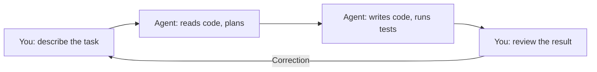

# Level 0: Agent-Based Development -- A New Paradigm

## What is Agent-Based Development

Imagine that instead of typing code in an IDE, you **talk** to a developer who instantly reads the entire project, writes code, runs tests, and commits the result. This is agent-based development -- a model where an AI agent autonomously performs tasks in your repository, while you manage the process through natural language.

Classic development is "you write code by hand". Copilot autocomplete is "you write code, AI suggests the next line". Agent-based development is **"you describe the task, the agent writes the code"**.



## Interaction Model

In agent-based development, there are three participants:

- **Human** -- sets the task, makes decisions, conducts reviews
- **Agent** -- reads code, makes changes, runs commands
- **Codebase** -- files, tests, git history, configuration

Your role shifts from "code writer" to **"architect and reviewer"**. You think more about **what** needs to be done, not **how** to type the code.

## Claude Code: Overview of Capabilities

Claude Code is an agent-based tool from Anthropic that works directly in the terminal:

```bash
# Launch in terminal
claude

# Or with a specific task
claude "add email validation to the registration form"
```

**Form factors:**
- **CLI** -- primary interface, works in any terminal
- **IDE extensions** -- integration with VS Code, JetBrains
- **GitHub Actions** -- automation in CI/CD

**What it can do:**
- Read and edit project files
- Run commands in the terminal (tests, build, linting)
- Work with git (commits, branches, PR)
- Search the codebase
- Install dependencies

## 🔥 Context Window -- The Main Resource

The context window is the agent's "working memory". Everything the agent sees (your instructions, files, conversation history) must fit within this window.

📌 **Key idea of this course:** the context window is a limited resource. The more efficiently you use it, the better the agent performs.

Analogy: imagine you're explaining a task to a colleague via sticky notes. You have a limited number of sticky notes -- if you cover them with unnecessary information, there won't be room for what matters.

## When Agent-Based Development is Effective

| Situation | Suitable? | Why |
|----------|-----------|--------|
| Routine tasks (CRUD, forms, tests) | ✅ Yes | Agent handles them faster |
| Project-wide refactoring | ✅ Yes | Agent sees all files at once |
| Working with unfamiliar codebase | ✅ Yes | Agent quickly explores code |
| Complex business logic | ⚠️ Partially | Needs your control at each step |
| Low-level optimization | ❌ No | Requires deep expertise |
| Prototyping from scratch | ✅ Yes | Agent quickly generates skeleton |

## Comparison with Other Tools

| Capability | GitHub Copilot | Cursor | Claude Code |
|------------|---------------|--------|-------------|
| Autocomplete | ✅ Primary mode | ✅ | ❌ Not the focus |
| Chat in IDE | ✅ | ✅ | ✅ Via extensions |
| Terminal work | ❌ | ❌ | ✅ Primary mode |
| Autonomous task execution | ❌ | ⚠️ Partially | ✅ |
| Running commands | ❌ | ⚠️ Limited | ✅ |
| Git operations | ❌ | ❌ | ✅ |
| Configuration via CLAUDE.md | -- | -- | ✅ |

💡 **Key difference of Claude Code** -- it's not a "smart autocomplete", but an **autonomous agent** that can complete a task end-to-end: from reading code to committing.

## ⚠️ Common Beginner Mistakes

### 🐛 1. Giving too vague tasks

```
❌ "Make this code better"
✅ "Split the processOrder function into three: validateOrder, calculateTotal, saveOrder"
```

The more specific the task, the more accurate the result.

### 🐛 2. Not checking the result

The agent is a powerful tool, but not infallible. Always review changes before committing.

### 🐛 3. Trying to fit everything into one request

```
❌ "Rewrite the entire project in TypeScript, add tests, and set up CI"
✅ Break it into steps: first migrate one module, then tests, then CI
```

## 📌 Summary

- ✅ Agent-based development is "you describe, the agent does"
- ✅ Claude Code works in the terminal and autonomously performs tasks
- ✅ Context window is the main limited resource
- ✅ Give the agent specific, decomposed tasks
- ✅ Always verify the agent's work
