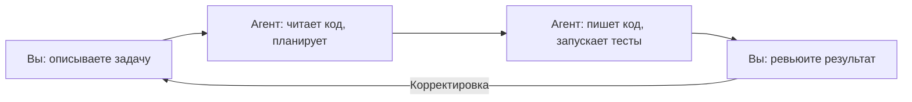

# Уровень 0: Агентская разработка -- новая парадигма

## Что такое агентская разработка

Представьте, что вместо набора текста в IDE вы **разговариваете** с разработчиком, который мгновенно читает весь проект, пишет код, запускает тесты и коммитит результат. Это и есть агентская разработка -- модель, где AI-агент выполняет задачи в вашем репозитории автономно, а вы управляете процессом через естественный язык.

Классическая разработка -- это "вы пишете код руками". Copilot-автодополнение -- это "вы пишете код, AI подсказывает следующую строку". Агентская разработка -- это **"вы описываете задачу, агент пишет код"**.



## Модель взаимодействия

В агентской разработке три участника:

- **Человек** -- ставит задачу, принимает решения, проводит ревью
- **Агент** -- читает код, вносит изменения, запускает команды
- **Кодовая база** -- файлы, тесты, git-история, конфигурация

Ваша роль смещается от "писателя кода" к **"архитектору и ревьюеру"**. Вы больше думаете о **что** нужно сделать, а не **как** набрать код.

## Claude Code: обзор возможностей

Claude Code -- агентский инструмент от Anthropic, работающий прямо в терминале:

```bash
# Запуск в терминале
claude

# Или с конкретной задачей
claude "добавь валидацию email в форму регистрации"
```

**Форм-факторы:**
- **CLI** -- основной интерфейс, работает в любом терминале
- **IDE-расширения** -- интеграция с VS Code, JetBrains
- **GitHub Actions** -- автоматизация в CI/CD

**Что умеет:**
- Читать и редактировать файлы проекта
- Запускать команды в терминале (тесты, сборка, линтинг)
- Работать с git (коммиты, ветки, PR)
- Искать по кодовой базе
- Устанавливать зависимости

## 🔥 Контекстное окно -- главный ресурс

Контекстное окно -- это "оперативная память" агента. Всё, что агент видит (ваши инструкции, файлы, история диалога), должно поместиться в это окно.

📌 **Ключевая идея курса:** контекстное окно -- ограниченный ресурс. Чем эффективнее вы его используете, тем лучше работает агент.

Аналогия: представьте, что вы объясняете задачу коллеге через записки на стикерах. У вас ограниченное количество стикеров -- если заклеить их ненужной информацией, для самого важного не останется места.

## Когда агентская разработка эффективна

| Ситуация | Подходит? | Почему |
|----------|-----------|--------|
| Рутинные задачи (CRUD, формы, тесты) | ✅ Да | Агент справляется быстрее |
| Рефакторинг по всему проекту | ✅ Да | Агент видит все файлы разом |
| Работа с незнакомой кодовой базой | ✅ Да | Агент быстро исследует код |
| Сложная бизнес-логика | ⚠️ Частично | Нужен ваш контроль на каждом шаге |
| Низкоуровневая оптимизация | ❌ Нет | Требует глубокой экспертизы |
| Прототипирование с нуля | ✅ Да | Агент быстро генерирует скелет |

## Сравнение с другими инструментами

| Возможность | GitHub Copilot | Cursor | Claude Code |
|-------------|---------------|--------|-------------|
| Автодополнение | ✅ Основной режим | ✅ | ❌ Не фокус |
| Чат в IDE | ✅ | ✅ | ✅ Через расширения |
| Работа в терминале | ❌ | ❌ | ✅ Основной режим |
| Автономное выполнение задач | ❌ | ⚠️ Частично | ✅ |
| Запуск команд | ❌ | ⚠️ Ограниченно | ✅ |
| Git-операции | ❌ | ❌ | ✅ |
| Настройка через CLAUDE.md | -- | -- | ✅ |

💡 **Ключевое отличие Claude Code** -- это не "умный автокомплит", а **автономный агент**, который может выполнить задачу целиком: от чтения кода до коммита.

## ⚠️ Частые ошибки новичков

### 🐛 1. Давать слишком расплывчатые задачи

```
❌ "Сделай этот код лучше"
✅ "Разбей функцию processOrder на три: validateOrder, calculateTotal, saveOrder"
```

Чем конкретнее задача, тем точнее результат.

### 🐛 2. Не проверять результат

Агент -- мощный инструмент, но не безошибочный. Всегда просматривайте изменения перед коммитом.

### 🐛 3. Пытаться уместить всё в один запрос

```
❌ "Перепиши весь проект на TypeScript, добавь тесты и настрой CI"
✅ Разбейте на шаги: сначала миграция одного модуля, потом тесты, потом CI
```

## 📌 Итоги

- ✅ Агентская разработка -- это "вы описываете, агент делает"
- ✅ Claude Code работает в терминале и автономно выполняет задачи
- ✅ Контекстное окно -- главный ограниченный ресурс
- ✅ Давайте агенту конкретные, декомпозированные задачи
- ✅ Всегда проверяйте результат работы агента
