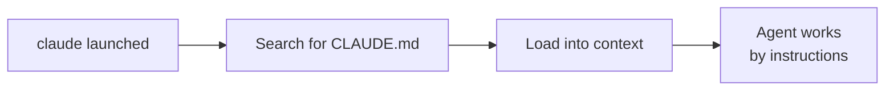

# Level 1: CLAUDE.md -- Instructions for the Agent

## Introduction

When you hire a new developer, their first days are spent reading documentation: how to build the project, what code conventions exist, which modules must not be touched, where the tests live. Without this onboarding document, every newcomer will step on the same rake.

An AI agent is the same "newcomer" who enters your project from scratch. The difference is that they "enter" **from scratch every single time** -- the agent has no persistent memory between sessions. The `CLAUDE.md` file solves this problem: it loads automatically every time Claude Code launches and gives the agent all the necessary context.

A well-written CLAUDE.md -- the difference between "the agent guesses your conventions" and "the agent follows your rules from the first command".

---

## 1. What is CLAUDE.md

CLAUDE.md is a Markdown file in the project root (or in `.claude/CLAUDE.md`) that Claude Code reads automatically on startup. It contains instructions for the agent: how to build the project, what code style to use, what constraints exist.

Analogy: CLAUDE.md is a **ship's logbook**. Every new watchman (agent session) opens the logbook and knows: course -- north, speed -- 12 knots, reefs -- to the right, do not enter zone X.

### How the Agent Uses CLAUDE.md

1. You run `claude` in the project directory
2. Claude Code finds CLAUDE.md
3. Contents are loaded into the context window as system instructions
4. All subsequent agent actions follow these instructions



---

## 2. Scopes: CLAUDE.md File Hierarchy

Claude Code supports several levels of CLAUDE.md, which apply differently.

### User-level: ~/.claude/CLAUDE.md

Your personal settings that apply to **all** projects:

```markdown
# My Preferences
- Respond in English
- Use Conventional Commits for commit messages
- I prefer functional style (map/filter/reduce instead of for)
```

💡 Things go here that are not tied to a specific project: communication language, commit style, personal preferences.

### Project-level: ./CLAUDE.md or .claude/CLAUDE.md

Settings for the **specific project** that are shared with the team via git:

```markdown
# Project: E-commerce Platform

## Commands
- `pnpm dev` -- start dev server
- `pnpm test` -- run tests
- `pnpm test:e2e` -- e2e tests (require Docker)

## Code Style
- TypeScript strict mode
- No semicolons
- CSS Modules (not styled-components)

## Architecture
- Feature-sliced design
- State: Zustand
- API: all requests through src/shared/api/
```

### Subdirectory-level: src/CLAUDE.md

Instructions for a **specific directory**. Loads when the agent works with files in that directory:

```markdown
# src/legacy/

⚠️ This is a legacy module. Rules:
- No refactoring without approval
- No dependency updates
- New code -- only critical bug fixes
- Tests required for every change
```

### Managed Policy

Set by the organization administrator, **cannot be overridden** at the project or user level. Used for corporate security policies.

### Priority Order

```
Managed Policy  (highest priority, cannot be overridden)
  ↓
User-level     (~/.claude/CLAUDE.md)
  ↓
Project-level  (./CLAUDE.md)
  ↓
Subdirectory   (src/CLAUDE.md, src/components/CLAUDE.md)
```

All levels **merge**, they do not replace each other. If user-level says "respond in English" and project-level says "use Zustand", the agent will do both.

---

## 3. What to Write in CLAUDE.md

### Build and Test Commands

This is the most important thing. The agent needs to know how to run the project:

```markdown
## Commands
- Install: `pnpm install`
- Dev server: `pnpm dev` (port 3000)
- Build: `pnpm build`
- Tests: `pnpm test`
- Single test: `pnpm test -- -t "test name"`
- Linting: `pnpm lint`
- Auto-fix: `pnpm lint --fix`
- Type check: `pnpm tsc --noEmit`
```

💡 Without these instructions, the agent will try `npm test`, `yarn test`, `jest` -- wasting context on guessing.

### Code Style and Conventions

Describe only what **cannot be inferred** from configuration (ESLint, Prettier):

```markdown
## Code Style
- No semicolons (configured in Prettier, but for reliability)
- Single quotes
- File naming: kebab-case for modules, PascalCase for components
- Exports: named (not default), except for Next.js pages
- Enums: use `as const` objects instead of TypeScript enum
```

### Architectural Decisions and Constraints

```markdown
## Architecture
- Feature-sliced design: src/features/, src/shared/, src/entities/
- State management: Zustand (NOT Redux, NOT MobX)
- Forms: React Hook Form + Zod
- API layer: all requests through src/shared/api/, do not use fetch directly
- Styles: CSS Modules (.module.css), NOT inline styles, NOT styled-components

## Constraints
- DO NOT add new dependencies without approval
- src/legacy/auth/ module -- legacy, changes only for critical fixes
- Do not use any in TypeScript -- only unknown with type guards
```

### Gotchas and Pitfalls

This is the most valuable part of CLAUDE.md -- things that cannot be learned from the code:

```markdown
## Gotchas
- CI fails if you forget `pnpm run generate` after changing the GraphQL schema
- auth module tests must be run sequentially: `pnpm test -- --runInBand`
- On macOS, Docker is needed for e2e tests (Playwright + PostgreSQL)
- Environment variables: copy .env.example to .env.local (NOT .env)
```

---

## 4. Import via @path

For large projects, CLAUDE.md can become too long. The solution -- decomposition via imports:

```markdown
# CLAUDE.md (project root)

## Main
- Monorepo: pnpm workspaces
- Node.js >= 20

## Detailed Instructions
@docs/code-style.md
@docs/architecture.md
@docs/testing-guide.md
@.claude/rules/security.md
```

Contents of files via @path are substituted into the context. This allows:
- Keeping the root CLAUDE.md concise
- Separating responsibilities (code style, architecture, tests -- separate files)
- Reusing documentation that already exists in the project

### Import Limitations

- Maximum depth: **5 levels** (A imports B, B imports C, ..., up to 5)
- Path is relative to the current file location
- Cyclic imports are not allowed

---

## 5. Auto-generation via /init

The `/init` command analyzes the project and creates an initial CLAUDE.md:

```bash
claude
> /init
```

Claude Code will examine:
- `package.json` (scripts, dependencies)
- `tsconfig.json` (TypeScript settings)
- `.eslintrc` / `eslint.config.js` (linting rules)
- `.prettierrc` (formatting)
- Directory structure
- `.gitignore`
- Existing documentation

And generate CLAUDE.md with basic instructions. You can then extend it with:
- Architectural decisions
- Gotchas and pitfalls
- Constraints and prohibitions
- Commands not present in package.json

💡 `/init` is a great starting point, but not the final result. Always refine the generated file.

---

## 6. HTML Comments for Maintainers

CLAUDE.md is a file for the agent, but people read it too. HTML comments allow leaving notes for maintainers that the agent will ignore:

```markdown
<!--
  Last updated: 2025-03-15 (Vasya)
  TODO: update after migration to React 19
  TODO: add instructions for the new CI pipeline
-->

# Code Style
- Functional components with hooks

<!-- This constraint is due to a bug in React Router,
     remove when we update to v7.1 -->
- DO NOT use lazy() for top-level routes
```

⚠️ **Note:** in practice, Claude Code may still see HTML comments if they are in context. Use them more as **metadata for people**, but don't count on the agent completely ignoring them.

---

## 7. Real CLAUDE.md Example

Here's an example for a typical React project:

```markdown
# E-commerce Platform

## Commands
- `pnpm dev` -- dev server (port 3000)
- `pnpm build` -- production build
- `pnpm test` -- run tests (Vitest)
- `pnpm test:e2e` -- e2e tests (Playwright, needs Docker)
- `pnpm lint` -- linting
- `pnpm tsc --noEmit` -- type check

## Code Style
- TypeScript strict mode, no any
- No semicolons, single quotes
- Named exports (not default)
- CSS Modules (.module.css)
- Components: PascalCase, utilities: kebab-case

## Architecture
- Feature-sliced: src/{app,pages,features,entities,shared}/
- State: Zustand (stores in src/shared/stores/)
- API: src/shared/api/ (fetch wrapper, NOT axios)
- Forms: React Hook Form + Zod validation

## Constraints
- DO NOT add dependencies without discussion
- src/legacy/ -- do not refactor, only fixes
- All API keys -- via env, NEVER hardcode

## Gotchas
- After changing .env.local, dev server needs a restart
- E2E tests: `docker compose up -d` before running
- CI: separate step for `pnpm run codegen` (GraphQL)

@docs/deployment.md
@docs/testing-conventions.md
```

Note: ~50 lines, concise, only the essence. Details -- in imported files.

---

## ⚠️ Common Beginner Mistakes

### 🐛 1. CLAUDE.md at 500 lines

```markdown
❌ Huge file with descriptions of every function, every component,
   full API reference and change history
```

> **Why this is a problem:** CLAUDE.md loads into the context window **entirely**. 500 lines -- that's hundreds of tokens that could be occupied by your code. Context is a limited resource (remember level 0?).

```markdown
✅ Compact CLAUDE.md (50-100 lines) + @path for details.
   Rule: if an instruction isn't needed in every session,
   move it to a separate file.
```

### 🐛 2. Outdated Instructions

```markdown
❌ "Use React Router v5 with Switch and Route components"
   (when the project is already on v7 with file-based routing)
```

> **Why this is a problem:** the agent will generate code with deprecated APIs. Worse, if the code compiles (but works incorrectly), you might not notice the problem immediately.

```markdown
✅ Review CLAUDE.md with every major dependency update.
   Add a reminder to the PR checklist: "Update CLAUDE.md?"
```

### 🐛 3. Duplicating Configuration

```markdown
❌ "The project uses TypeScript" (there's a tsconfig.json)
❌ "Indentation -- 2 spaces" (there's a .prettierrc)
❌ "We use React" (there's a package.json)
```

> **Why this is a problem:** the agent analyzes the project configuration files itself. Duplication wastes context tokens for no benefit.

```markdown
✅ Describe only what CANNOT be inferred from code:
   - Why Zustand, not Redux (architectural decision)
   - Why the legacy module cannot be refactored (business constraint)
   - How to run tests not listed in scripts (gotcha)
```

### 🐛 4. Contradictory Instructions

```markdown
❌ At the top: "Use named exports"
   At the bottom: "Export page components via export default"
```

> **Why this is a problem:** the agent will waver between instructions. If there are exceptions, state them explicitly.

```markdown
✅ "Named exports everywhere, EXCEPT:
    - Next.js pages (export default for router compatibility)
    - Lazy components (React.lazy requires default export)"
```

---

## 📌 Summary

- ✅ CLAUDE.md -- onboarding document for the agent, loads on every launch
- ✅ Scopes: user (~/.claude/), project (./), subdirectory (src/), managed policy
- ✅ Write: commands, code style, architectural decisions, gotchas
- ✅ Use @path for decomposition (up to 5 import levels)
- ✅ Keep the file compact: 50-100 lines, details -- in imports
- ✅ `/init` will create an initial version, you extend it
- ❌ Don't duplicate project configuration
- ❌ Don't forget to update when the project changes
- 📌 Next level: `.claude/rules/` for fine-tuning and saving context
