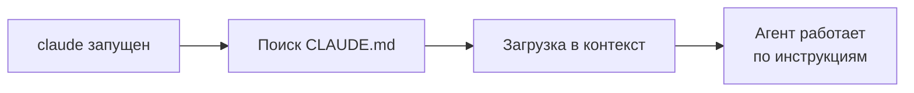

# Уровень 1: CLAUDE.md -- инструкции для агента

## Введение

Когда вы нанимаете нового разработчика, первые дни он читает документацию: как собирать проект, какие соглашения по коду, какие модули трогать нельзя, где лежат тесты. Без этого onboarding-документа каждый новичок будет наступать на одни и те же грабли.

AI-агент -- тот же "новичок", который приходит в ваш проект с нуля. Разница в том, что он "приходит" **каждый раз заново** -- у агента нет постоянной памяти между сессиями. Файл `CLAUDE.md` решает эту проблему: он загружается автоматически при каждом запуске Claude Code и даёт агенту весь необходимый контекст.

Хорошо написанный CLAUDE.md -- разница между "агент угадывает ваши соглашения" и "агент следует вашим правилам с первой команды".

---

## 1. Что такое CLAUDE.md

CLAUDE.md -- это Markdown-файл в корне проекта (или в `.claude/CLAUDE.md`), который Claude Code читает автоматически при запуске. Он содержит инструкции для агента: как собирать проект, какой стиль кода использовать, какие есть ограничения.

Аналогия: CLAUDE.md -- это **бортовой журнал корабля**. Каждый новый вахтенный (сессия агента) открывает журнал и знает: курс -- на север, скорость -- 12 узлов, рифы -- справа, не заходить в зону X.

### Как агент использует CLAUDE.md

1. Вы запускаете `claude` в директории проекта
2. Claude Code находит CLAUDE.md
3. Содержимое загружается в контекстное окно как системные инструкции
4. Все последующие действия агента учитывают эти инструкции



---

## 2. Скоупы: иерархия файлов CLAUDE.md

Claude Code поддерживает несколько уровней CLAUDE.md, которые применяются по-разному.

### User-level: ~/.claude/CLAUDE.md

Ваши персональные настройки, действующие для **всех** проектов:

```markdown
# Мои предпочтения
- Отвечай на русском языке
- При создании коммитов используй Conventional Commits
- Предпочитаю функциональный стиль (map/filter/reduce вместо for)
```

💡 Сюда идут вещи, не привязанные к конкретному проекту: язык общения, стиль коммитов, личные предпочтения.

### Project-level: ./CLAUDE.md или .claude/CLAUDE.md

Настройки **конкретного проекта**, которые шарятся с командой через git:

```markdown
# Проект: E-commerce Platform

## Команды
- `pnpm dev` -- запуск dev-сервера
- `pnpm test` -- запуск тестов
- `pnpm test:e2e` -- e2e тесты (требуют Docker)

## Стиль кода
- TypeScript strict mode
- Без точек с запятой
- CSS Modules (не styled-components)

## Архитектура
- Feature-sliced design
- Стейт: Zustand
- API: все запросы через src/shared/api/
```

### Subdirectory-level: src/CLAUDE.md

Инструкции для **конкретной директории**. Загружается, когда агент работает с файлами в этой директории:

```markdown
# src/legacy/

⚠️ Это legacy-модуль. Правила:
- Не рефакторить без согласования
- Не обновлять зависимости
- Новый код -- только фиксы критических багов
- Тесты обязательны для каждого изменения
```

### Managed Policy

Устанавливается администратором организации, **нельзя переопределить** на уровне проекта или пользователя. Используется для корпоративных политик безопасности.

### Порядок приоритетов

```
Managed Policy  (наивысший приоритет, нельзя переопределить)
  ↓
User-level     (~/.claude/CLAUDE.md)
  ↓
Project-level  (./CLAUDE.md)
  ↓
Subdirectory   (src/CLAUDE.md, src/components/CLAUDE.md)
```

Все уровни **объединяются**, не заменяют друг друга. Если в user-level написано "отвечай на русском", а в project-level -- "используй Zustand", агент будет делать и то, и другое.

---

## 3. Что писать в CLAUDE.md

### Команды сборки и тестов

Это самое важное. Агент должен знать, как запускать проект:

```markdown
## Команды
- Установка: `pnpm install`
- Dev-сервер: `pnpm dev` (порт 3000)
- Сборка: `pnpm build`
- Тесты: `pnpm test`
- Один тест: `pnpm test -- -t "название теста"`
- Линтинг: `pnpm lint`
- Автофикс: `pnpm lint --fix`
- Type check: `pnpm tsc --noEmit`
```

💡 Без этих инструкций агент будет пробовать `npm test`, `yarn test`, `jest` -- тратить контекст на угадывание.

### Стиль кода и соглашения

Описывайте только то, что **нельзя вывести** из конфигурации (ESLint, Prettier):

```markdown
## Стиль кода
- Без точек с запятой (настроено в Prettier, но для надёжности)
- Одинарные кавычки
- Именование файлов: kebab-case для модулей, PascalCase для компонентов
- Экспорт: именованный (не default), кроме страниц Next.js
- Enum: использовать `as const` объекты вместо TypeScript enum
```

### Архитектурные решения и ограничения

```markdown
## Архитектура
- Feature-sliced design: src/features/, src/shared/, src/entities/
- Стейт-менеджмент: Zustand (НЕ Redux, НЕ MobX)
- Формы: React Hook Form + Zod
- API-слой: все запросы через src/shared/api/, не использовать fetch напрямую
- Стили: CSS Modules (.module.css), НЕ inline styles, НЕ styled-components

## Ограничения
- НЕ добавляй новые зависимости без согласования
- Модуль src/legacy/auth/ -- legacy, изменения только критические фиксы
- Не используй any в TypeScript -- только unknown с type guards
```

### Gotchas и подводные камни

Это самая ценная часть CLAUDE.md -- вещи, которые невозможно узнать из кода:

```markdown
## Gotchas
- CI падает, если забыть `pnpm run generate` после изменения GraphQL-схемы
- Тесты auth-модуля нужно запускать последовательно: `pnpm test -- --runInBand`
- На macOS нужен Docker для e2e-тестов (Playwright + PostgreSQL)
- Переменные окружения: копируй .env.example в .env.local (НЕ .env)
```

---

## 4. Импорт через @path

Для больших проектов CLAUDE.md может стать слишком длинным. Решение -- декомпозиция через импорты:

```markdown
# CLAUDE.md (корень проекта)

## Основное
- Монорепозиторий: pnpm workspaces
- Node.js >= 20

## Подробные инструкции
@docs/code-style.md
@docs/architecture.md
@docs/testing-guide.md
@.claude/rules/security.md
```

Содержимое файлов по @path подставляется в контекст. Это позволяет:
- Держать корневой CLAUDE.md лаконичным
- Разделять ответственность (стиль кода, архитектура, тесты -- отдельные файлы)
- Переиспользовать документацию, которая уже есть в проекте

### Ограничения импорта

- Максимальная глубина: **5 уровней** (A импортирует B, B импортирует C, ..., до 5)
- Путь относительно расположения текущего файла
- Циклические импорты не допускаются

---

## 5. Автогенерация через /init

Команда `/init` анализирует проект и создаёт начальный CLAUDE.md:

```bash
claude
> /init
```

Claude Code изучит:
- `package.json` (скрипты, зависимости)
- `tsconfig.json` (настройки TypeScript)
- `.eslintrc` / `eslint.config.js` (правила линтинга)
- `.prettierrc` (форматирование)
- Структуру директорий
- `.gitignore`
- Существующую документацию

И сгенерирует CLAUDE.md с базовыми инструкциями. Вы затем дополните его:
- Архитектурными решениями
- Gotchas и подводными камнями
- Ограничениями и запретами
- Командами, которых нет в package.json

💡 `/init` -- отличная отправная точка, но не финальный результат. Всегда дорабатывайте сгенерированный файл.

---

## 6. HTML-комментарии для мейнтейнеров

CLAUDE.md -- это файл для агента, но его читают и люди. HTML-комментарии позволяют оставить заметки для мейнтейнеров, которые агент проигнорирует:

```markdown
<!-- 
  Последнее обновление: 2025-03-15 (Вася)
  TODO: обновить после миграции на React 19
  TODO: добавить инструкции по новому CI-пайплайну
-->

# Стиль кода
- Функциональные компоненты с хуками

<!-- Это ограничение из-за бага в React Router, 
     убрать когда обновимся до v7.1 -->
- НЕ использовать lazy() для роутов верхнего уровня
```

⚠️ **Внимание:** на практике Claude Code может видеть HTML-комментарии, если они находятся в контексте. Используйте их скорее как **метаданные для людей**, но не рассчитывайте, что агент их полностью проигнорирует.

---

## 7. Реальный пример CLAUDE.md

Вот пример для среднего React-проекта:

```markdown
# E-commerce Platform

## Команды
- `pnpm dev` -- dev-сервер (порт 3000)
- `pnpm build` -- production-сборка
- `pnpm test` -- запуск тестов (Vitest)
- `pnpm test:e2e` -- e2e тесты (Playwright, нужен Docker)
- `pnpm lint` -- линтинг
- `pnpm tsc --noEmit` -- проверка типов

## Стиль кода
- TypeScript strict mode, без any
- Без точек с запятой, одинарные кавычки
- Именованный экспорт (не default)
- CSS Modules (.module.css)
- Компоненты: PascalCase, утилиты: kebab-case

## Архитектура
- Feature-sliced: src/{app,pages,features,entities,shared}/
- Стейт: Zustand (stores в src/shared/stores/)
- API: src/shared/api/ (обёртка над fetch, НЕ axios)
- Формы: React Hook Form + Zod валидация

## Ограничения
- НЕ добавлять зависимости без обсуждения
- src/legacy/ -- не рефакторить, только фиксы
- Все API-ключи -- через env, НИКОГДА не хардкодить

## Gotchas
- После изменения .env.local нужен рестарт dev-сервера
- E2E тесты: `docker compose up -d` перед запуском
- CI: отдельный шаг для `pnpm run codegen` (GraphQL)

@docs/deployment.md
@docs/testing-conventions.md
```

Обратите внимание: ~50 строк, лаконично, только суть. Детали -- в импортируемых файлах.

---

## ⚠️ Частые ошибки новичков

### 🐛 1. CLAUDE.md на 500 строк

```markdown
❌ Огромный файл с описанием каждой функции, каждого компонента,
   полным API-reference и историей изменений
```

> **Почему это проблема:** CLAUDE.md загружается в контекстное окно **целиком**. 500 строк -- это сотни токенов, которые могли бы быть заняты вашим кодом. Контекст -- ограниченный ресурс (помните уровень 0?).

```markdown
✅ Компактный CLAUDE.md (50-100 строк) + @path для деталей.
   Правило: если инструкция нужна не в каждой сессии,
   вынесите её в отдельный файл.
```

### 🐛 2. Устаревшие инструкции

```markdown
❌ "Используй React Router v5 с компонентами Switch и Route"
   (когда проект уже на v7 с файловым роутингом)
```

> **Почему это проблема:** агент будет генерировать код с deprecated API. Хуже того, если код компилируется (но работает неправильно), вы можете не заметить проблему сразу.

```markdown
✅ Ревьюите CLAUDE.md при каждом крупном обновлении зависимостей.
   Добавьте напоминание в чеклист PR: "Обновить CLAUDE.md?"
```

### 🐛 3. Дублирование конфигурации

```markdown
❌ "Проект использует TypeScript" (есть tsconfig.json)
❌ "Отступы -- 2 пробела" (есть .prettierrc)
❌ "Используем React" (есть package.json)
```

> **Почему это проблема:** агент сам анализирует конфигурационные файлы проекта. Дублирование тратит токены контекста без пользы.

```markdown
✅ Описывайте только то, что НЕЛЬЗЯ вывести из кода:
   - Почему Zustand, а не Redux (архитектурное решение)
   - Почему legacy-модуль нельзя рефакторить (бизнес-ограничение)
   - Как запускать тесты, которых нет в scripts (gotcha)
```

### 🐛 4. Противоречивые инструкции

```markdown
❌ Вверху: "Используй именованный экспорт"
   Внизу: "Компоненты страниц экспортируй через export default"
```

> **Почему это проблема:** агент будет метаться между инструкциями. Если есть исключения, формулируйте их явно.

```markdown
✅ "Именованный экспорт везде, КРОМЕ:
    - Страниц Next.js (export default для совместимости с роутером)
    - Lazy-компонентов (React.lazy требует default export)"
```

---

## 📌 Итоги

- ✅ CLAUDE.md -- это onboarding-документ для агента, загружается при каждом запуске
- ✅ Скоупы: user (~/.claude/), project (./), subdirectory (src/), managed policy
- ✅ Пишите: команды, стиль кода, архитектурные решения, gotchas
- ✅ Используйте @path для декомпозиции (до 5 уровней импорта)
- ✅ Держите файл компактным: 50-100 строк, детали -- в импортах
- ✅ `/init` создаст начальную версию, вы дополните
- ❌ Не дублируйте конфигурацию проекта
- ❌ Не забывайте обновлять при изменениях в проекте
- 📌 Следующий уровень: `.claude/rules/` для тонкой настройки и экономии контекста
