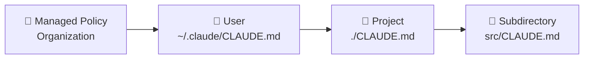

# Level 1: CLAUDE.md -- Instructions for the Agent

## Why CLAUDE.md is Needed

Imagine a new developer joined your team. You wouldn't repeat every day: "We use tabs, not spaces", "Tests run via `pnpm test`", "Don't touch the legacy auth module". You would write an **onboarding document** and have them read it.

`CLAUDE.md` is the same kind of onboarding document, but for an AI agent. It loads automatically every time Claude Code launches and determines how the agent will work with your project.

## Scopes: Where CLAUDE.md Lives

CLAUDE.md can exist at several levels:



| Scope | Location | Applies to |
|-------|----------|------------|
| User | `~/.claude/CLAUDE.md` | All your projects |
| Project | `./CLAUDE.md` or `.claude/CLAUDE.md` | Current project |
| Subdirectory | `src/CLAUDE.md` | Only within the directory |
| Managed Policy | Via organization | Mandatory for everyone |

💡 **The most important** -- project-level. This is what you'll create and maintain most often.

## What to Write in CLAUDE.md

### 1. Build and Test Commands

```markdown
# Commands
- Build: `pnpm build`
- Tests: `pnpm test`
- Single test: `pnpm test -- --grep "name"`
- Linting: `pnpm lint --fix`
```

### 2. Code Style

```markdown
# Code Style
- No semicolons
- Single quotes
- Functional React components with hooks
- File naming: kebab-case
```

### 3. Architectural Decisions

```markdown
# Architecture
- State management: Zustand (NOT Redux)
- Routing: React Router v7
- API layer: all requests through src/api/, do not use fetch directly
```

### 4. Gotchas and Pitfalls

```markdown
# Important
- DO NOT update package-lock.json manually
- auth/ module -- legacy, changes only after approval
- Test database -- SQLite, production -- PostgreSQL
```

## Import via @path

CLAUDE.md supports importing other files:

```markdown
# Project Instructions

@docs/architecture.md
@docs/api-conventions.md
@.claude/rules/testing.md
```

📌 Import depth -- up to 5 levels. Use this to decompose large instructions.

## Auto-generation via /init

Don't want to write CLAUDE.md from scratch? The `/init` command analyzes the project and creates an initial version:

```bash
claude
> /init
```

Claude Code will examine `package.json`, file structure, `.eslintrc`, `tsconfig.json` and generate a basic CLAUDE.md. Then you can extend it for your needs.

## ⚠️ Common Beginner Mistakes

### 🐛 1. File too long (>200 lines)

```markdown
❌ CLAUDE.md with 500 lines describing every function
```

> **Why this is a problem:** CLAUDE.md loads into the context window entirely. 500 lines = less room for your code and conversation.

```markdown
✅ Concise CLAUDE.md (50-100 lines) + @path imports for details
```

### 🐛 2. Outdated Instructions

```markdown
❌ "Use React Router v5" (when the project is already on v7)
```

> **Why this is a problem:** the agent will follow outdated instructions and generate code with deprecated APIs. Regularly update CLAUDE.md.

### 🐛 3. Duplicating What's Already Obvious

```markdown
❌ "The project is written in TypeScript" (when there's a tsconfig.json)
❌ "We use React" (when this is visible from package.json)
```

> **Why this is a problem:** the agent analyzes the project configuration itself. Describe what **cannot be inferred** from files: conventions, constraints, non-obvious decisions.

```markdown
✅ "We use Preact instead of React (alias in vite.config.ts)"
✅ "CSS Modules, NOT styled-components"
```

## HTML Comments for Maintainers

Add comments that only people see, not the agent:

```markdown
<!-- This section was updated by Vasya 2025-01-15, check relevance in March -->

# API Conventions
- All endpoints RESTful
- Versioning via URL: /api/v1/
```

## 📌 Summary

- ✅ CLAUDE.md -- onboarding document for the agent, loads automatically
- ✅ Write what cannot be inferred from code: conventions, constraints, gotchas
- ✅ Keep the file compact (<200 lines), use @path for details
- ✅ Use `/init` to generate an initial version
- ❌ Don't duplicate what the agent already sees in configuration
- ❌ Don't forget to update instructions when the project changes
