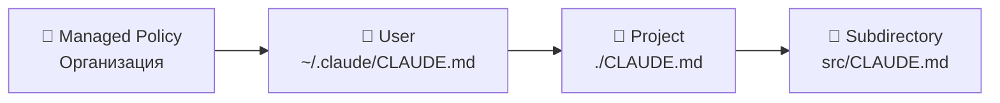

# Уровень 1: CLAUDE.md -- инструкции для агента

## Зачем нужен CLAUDE.md

Представьте, что к вам в команду пришёл новый разработчик. Вы не станете каждый день повторять ему: "У нас табы, не пробелы", "Тесты запускаются через `pnpm test`", "Не трогай legacy-модуль auth". Вы напишете **onboarding-документ** и дадите ему прочитать.

`CLAUDE.md` -- это такой же onboarding-документ, только для AI-агента. Он загружается автоматически при каждом запуске Claude Code и определяет, как агент будет работать с вашим проектом.

## Скоупы: где лежит CLAUDE.md

CLAUDE.md может существовать на нескольких уровнях:



| Скоуп | Расположение | Применяется |
|-------|-------------|-------------|
| User | `~/.claude/CLAUDE.md` | Ко всем вашим проектам |
| Project | `./CLAUDE.md` или `.claude/CLAUDE.md` | К текущему проекту |
| Subdirectory | `src/CLAUDE.md` | Только внутри директории |
| Managed Policy | Через организацию | Принудительно для всех |

💡 **Самый важный** -- project-level. Именно его вы будете создавать и поддерживать чаще всего.

## Что писать в CLAUDE.md

### 1. Команды сборки и тестов

```markdown
# Команды
- Сборка: `pnpm build`
- Тесты: `pnpm test`
- Один тест: `pnpm test -- --grep "название"`
- Линтинг: `pnpm lint --fix`
```

### 2. Стиль кода

```markdown
# Стиль кода
- Без точек с запятой
- Одинарные кавычки
- Функциональные компоненты React с хуками
- Именование файлов: kebab-case
```

### 3. Архитектурные решения

```markdown
# Архитектура
- Стейт-менеджмент: Zustand (НЕ Redux)
- Роутинг: React Router v7
- API-слой: все запросы через src/api/, не делать fetch напрямую
```

### 4. Gotchas и ловушки

```markdown
# Важно
- НЕ обновляй package-lock.json вручную
- Модуль auth/ -- legacy, изменения только после согласования
- База данных в тестах -- SQLite, в проде -- PostgreSQL
```

## Импорт через @path

CLAUDE.md поддерживает импорт других файлов:

```markdown
# Проектные инструкции

@docs/architecture.md
@docs/api-conventions.md
@.claude/rules/testing.md
```

📌 Глубина импорта -- до 5 уровней. Используйте это для декомпозиции больших инструкций.

## Автогенерация через /init

Не хотите писать CLAUDE.md с нуля? Команда `/init` проанализирует проект и создаст начальную версию:

```bash
claude
> /init
```

Claude Code изучит `package.json`, структуру файлов, `.eslintrc`, `tsconfig.json` и сгенерирует базовый CLAUDE.md. Дальше вы его дополните под свои нужды.

## ⚠️ Частые ошибки новичков

### 🐛 1. Слишком длинный файл (>200 строк)

```markdown
❌ CLAUDE.md на 500 строк с описанием каждой функции
```

> **Почему это проблема:** CLAUDE.md загружается в контекстное окно целиком. 500 строк = меньше места для вашего кода и диалога.

```markdown
✅ Лаконичный CLAUDE.md (50-100 строк) + импорты @path для деталей
```

### 🐛 2. Устаревшие инструкции

```markdown
❌ "Используй React Router v5" (когда проект уже на v7)
```

> **Почему это проблема:** агент будет следовать устаревшим инструкциям и генерировать код с deprecated API. Регулярно обновляйте CLAUDE.md.

### 🐛 3. Дублирование того, что и так очевидно

```markdown
❌ "Проект написан на TypeScript" (когда есть tsconfig.json)
❌ "Используем React" (когда это видно из package.json)
```

> **Почему это проблема:** агент сам анализирует конфигурацию проекта. Описывайте то, что **нельзя вывести** из файлов: соглашения, ограничения, неочевидные решения.

```markdown
✅ "Используем Preact вместо React (алиас в vite.config.ts)"
✅ "CSS Modules, НЕ styled-components"
```

## HTML-комментарии для мейнтейнеров

Добавляйте комментарии, которые увидят только люди, а не агент:

```markdown
<!-- Этот раздел обновил Вася 2025-01-15, проверить актуальность в марте -->

# API-соглашения
- Все эндпоинты RESTful
- Версионирование через URL: /api/v1/
```

## 📌 Итоги

- ✅ CLAUDE.md -- onboarding-документ для агента, загружается автоматически
- ✅ Пишите то, что нельзя вывести из кода: соглашения, ограничения, gotchas
- ✅ Держите файл компактным (<200 строк), используйте @path для деталей
- ✅ Используйте `/init` для генерации начальной версии
- ❌ Не дублируйте то, что агент и так видит в конфигурации
- ❌ Не забывайте обновлять инструкции при изменении проекта
