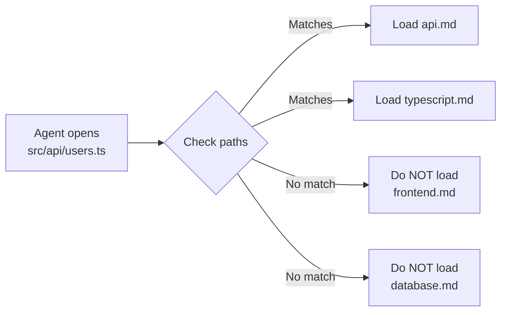

# Level 2: Rules and Context (.claude/rules/)

## Introduction

In the previous level, we studied CLAUDE.md -- a single instruction file loaded on every launch. For small projects, this is sufficient. But real projects grow: frontend and backend appear, tests and deployment, legacy modules and new features. Instructions for each area differ, and loading them all simultaneously is wasteful.

Imagine a **library**. CLAUDE.md is a poster at the entrance: "Silence!", "Return books on time". Everyone needs it, always. And `.claude/rules/` is the **subject catalogs** by rooms: "Physics Room", "Literature Room". You take the catalog only for the room you entered.

The `.claude/rules/` directory provides:
- **Modularity** -- each topic in a separate file
- **Lazy loading** -- rules load only when working with relevant files
- **Teamwork** -- each person is responsible for their own rule file

---

## 1. Structure of .claude/rules/ Directory

### Basic Structure

```
your-project/
├── .claude/
│   ├── CLAUDE.md              # General instructions (always)
│   └── rules/
│       ├── code-style.md      # Code style
│       ├── testing.md         # Testing rules
│       ├── security.md        # Security
│       ├── frontend.md        # Frontend specifics
│       ├── backend.md         # Backend specifics
│       └── deployment.md      # Deployment
```

### Monorepo Example

```
monorepo/
├── .claude/
│   ├── CLAUDE.md
│   └── rules/
│       ├── general.md         # General rules (no paths)
│       ├── react.md           # React components
│       ├── api.md             # API server
│       ├── database.md        # Database work
│       ├── testing.md         # Testing
│       └── ci-cd.md           # CI/CD configuration
├── packages/
│   ├── web/                   # React application
│   ├── api/                   # Express server
│   └── shared/                # Shared modules
```

Each file is regular Markdown, optionally with frontmatter for file binding.

---

## 2. Path-specific Rules with Glob Patterns

### Frontmatter Syntax

At the beginning of the file, add YAML frontmatter with a `paths` field:

```markdown
---
paths:
  - "src/**/*.{ts,tsx}"
  - "lib/**/*.ts"
---

# TypeScript Rules
- Do not use any, only unknown with type guards
- Use as const instead of enum
- All public functions must have JSDoc
```

### How Matching Works

When the agent opens or edits a file, Claude Code checks the file path against glob patterns of all rules. Matching rules load into context.

```markdown
---
paths:
  - "src/components/**/*.tsx"
  - "src/pages/**/*.tsx"
---

# React Components
- Functional components with hooks (not classes)
- Props -- via interface, not type
- Memoization: React.memo only when proven necessary
- Styles: CSS Modules (.module.css)
```

If the agent edits `src/components/Button/Button.tsx` -- the rule loads. If `src/utils/format.ts` -- it doesn't.

### Glob Pattern Examples

| Pattern | Matches |
|---------|---------|
| `**/*.ts` | All .ts files at any depth |
| `src/**/*.{ts,tsx}` | .ts and .tsx files in src/ |
| `tests/**/*.test.ts` | Test files |
| `*.config.{js,ts}` | Configuration files in root |
| `packages/api/**` | All files in the API package |
| `**/*.css` | All CSS files |

### Multiple Paths in One Rule

```markdown
---
paths:
  - "tests/**/*.test.ts"
  - "tests/**/*.spec.ts"
  - "**/__tests__/**"
---

# Testing Rules
- Vitest, not Jest
- describe/it, not test()
- Mocks: vi.mock(), vi.spyOn()
- Each test: Arrange → Act → Assert
- Naming: "should [expected behavior] when [condition]"
```

---

## 3. Lazy Loading vs Always-On

### Always-On (loaded every time)

Two types of instructions load on every launch:

1. **CLAUDE.md** -- always, at all levels (project, user, subdirectory)
2. **rules/ without frontmatter** -- files in .claude/rules/ without a `paths:` block

```markdown
# .claude/rules/security.md (no frontmatter -- always loaded)

# Security Rules
- NEVER hardcode API keys and passwords
- All secrets -- via environment variables
- Do not log sensitive data (passwords, tokens, PII)
```

💡 Security rules -- a good candidate for always-on, because they are needed **when working with any file**.

### Lazy Loading (loaded on match)

Files with frontmatter `paths:` load only when working with matching files:

```markdown
---
paths:
  - "src/database/**"
  - "prisma/**"
---

# Database Rules
- All queries through Prisma ORM
- Do not use raw SQL, except migrations
- Transactions for multi-table operations
- Indexes: add along with migration
```

### Visualization



Result: only needed rules in context, token savings.

---

## 4. Context Budget

### How the Context Window is Distributed

The context window is a fixed resource. Here's the recommended distribution:

```
┌──────────────────────────────────────────┐
│           Context Window                 │
├──────────────────────────────────────────┤
│  ~25%  System Instructions               │
│        ├── CLAUDE.md                     │
│        ├── rules/ (loaded)               │
│        └── managed policies              │
├──────────────────────────────────────────┤
│  ~25%  Conversation History              │
│        ├── Your messages                 │
│        ├── Agent responses               │
│        └── Intermediate reasoning        │
├──────────────────────────────────────────┤
│  ~50%  Working Space                     │
│        ├── Read files                    │
│        ├── Command results               │
│        ├── Diff contents                 │
│        └── Search results                │
└──────────────────────────────────────────┘
```

### Why Balance Matters

- **Instructions > 30%** -- the agent lacks space to read files and work
- **History > 40%** -- a long conversation displaces instructions and working space
- **Working space < 30%** -- the agent cannot read enough code for quality work

📌 **Golden rule:** if instructions take more than a quarter of context, it's time to optimize. Move details to rules/ with paths, remove duplication, shorten formulations.

### How to Measure Consumption

Claude Code shows context information in the status line. Pay attention to:
- Context usage percentage
- Number of remaining tokens
- Warnings about approaching the limit

---

## 5. Context Saving Strategies

### /compact -- Lossless Compression

```bash
> /compact
```

The `/compact` command summarizes conversation history:
- Key decisions are preserved
- Intermediate reasoning is compressed
- Files the agent read are not duplicated

**When to use:**
- Context is 50-70% full
- Long conversation with many steps
- Before a large task requiring many files

💡 `/compact` can be called with a hint for focus:

```bash
> /compact keep context about the database migration
```

### /clear -- Full Reset

```bash
> /clear
```

Completely clears conversation history. CLAUDE.md and rules/ reload from scratch.

**When to use:**
- Switching to a completely different task
- Context is hopelessly polluted
- The agent starts "confusing" and repeating itself

### Sub-agents -- Sub-task Delegation

For isolated sub-tasks, Claude Code can launch a **sub-agent** -- a separate process with its own context window:

```
Main agent (your session):
  "I need to update the API and tests"
  │
  ├── Sub-agent 1: "Update API types"
  │   (own context, does not load main)
  │
  └── Sub-agent 2: "Update tests"
      (own context, does not load main)
```

The sub-agent performs the task and returns **only the result** -- files it created or modified. Intermediate reasoning, read files, and command history stay in its context and do not enter yours.

Analogy: you are a project manager. Instead of personally digging into details of every task, you delegate them to specialists. Each specialist works in their own "office" (context) and brings you only the result.

### Monitoring via Status Line

The Claude Code status line is your "fuel gauge". Action recommendations:

| Context Usage | Status | Action |
|---------------|--------|--------|
| 0-30% | Free | Work without restrictions |
| 30-60% | Normal | Can continue, but monitor |
| 60-80% | Attention | Use /compact |
| 80-95% | Critical | /compact or /clear |
| >95% | Overflow | /clear, start a new session |

---

## 6. Strategy: CLAUDE.md vs rules/

### When to Use CLAUDE.md

CLAUDE.md -- for information needed **in every session**, regardless of which files the agent works with:

- Build and test commands (`pnpm build`, `pnpm test`)
- General project architecture (Feature-sliced, monorepo)
- Global constraints ("do not add dependencies without approval")
- Key gotchas ("CI requires codegen before tests")

### When to Use rules/

Rules -- for context-dependent instructions:

- Code style for a specific language (TypeScript rules for `*.ts`)
- Testing rules (for `*.test.ts`)
- Module specifics (rules for `src/database/**`)
- CSS conventions (for `*.css`, `*.module.css`)
- Infrastructure rules (for `Dockerfile`, `*.yaml`)

### Practical Example

Imagine a React + Express monorepo:

**CLAUDE.md (always loaded, ~40 lines):**
```markdown
# Monorepo: TaskManager

## Commands
- `pnpm dev` -- start all services
- `pnpm test` -- all tests
- `pnpm build` -- production build

## Architecture
- packages/web -- React SPA
- packages/api -- Express API
- packages/shared -- shared types and utilities

## Constraints
- Node.js >= 20
- DO NOT add dependencies without discussion
```

**.claude/rules/react.md (only for React files):**
```markdown
---
paths:
  - "packages/web/src/**/*.{ts,tsx}"
---

# React Rules
- Functional components + hooks
- Zustand for state (not Redux)
- CSS Modules for styles
- React.lazy for routes
```

**.claude/rules/api.md (only for API):**
```markdown
---
paths:
  - "packages/api/src/**/*.ts"
---

# API Rules
- Express + Zod for validation
- All routes in separate files
- Middleware: auth → validate → handler
- Responses: { data, error, meta }
```

**.claude/rules/testing.md (only for tests):**
```markdown
---
paths:
  - "**/*.test.ts"
  - "**/*.spec.ts"
---

# Testing
- Vitest for unit tests
- Playwright for e2e
- describe/it, not test()
- Mocks: vi.mock()
```

Result: when working with `packages/web/src/App.tsx`, react.md loads. When working with `packages/api/src/routes/users.ts` -- api.md. Testing rules connect only when working with tests.

---

## 7. Excluding CLAUDE.md Files

In large monorepos, you can exclude certain CLAUDE.md files from loading:

```json
{
  "claudeMdExcludes": [
    "**/legacy/CLAUDE.md",
    "/home/user/monorepo/other-team/.claude/rules/**"
  ]
}
```

This is useful when:
- A monorepo has CLAUDE.md from another team
- A legacy module has outdated instructions
- You want to temporarily disable a rule set

---

## ⚠️ Common Beginner Mistakes

### 🐛 1. All rules without frontmatter

```markdown
❌ .claude/rules/typescript.md (no paths)
❌ .claude/rules/react.md (no paths)
❌ .claude/rules/testing.md (no paths)
```

> **Why this is a problem:** without frontmatter, rules load **always** -- as if you wrote everything in CLAUDE.md. The main advantage of rules/ -- lazy loading -- is lost. Context fills with rules not needed for the current task.

```markdown
✅ Add paths to file-specific rules:

---
paths:
  - "src/**/*.tsx"
---
```

### 🐛 2. Too Broad Glob Patterns

```markdown
❌ paths: ["**/*"]
```

> **Why this is a problem:** the pattern `**/*` matches **any file**. The rule will load always -- equivalent to a rule without frontmatter.

```markdown
✅ Use specific patterns:
paths:
  - "src/components/**/*.tsx"
  - "src/pages/**/*.tsx"
```

### 🐛 3. Duplication Between CLAUDE.md and rules/

```markdown
❌ In CLAUDE.md: "Do not use any in TypeScript"
❌ In rules/typescript.md: "Do not use any in TypeScript"
```

> **Why this is a problem:** the same rule loads twice, wasting context. Define the rule in one place.

```markdown
✅ TypeScript-specific rule -- in rules/typescript.md with paths
✅ Universal rules -- in CLAUDE.md
```

### 🐛 4. Too Many Small Files

```markdown
❌ rules/no-any.md
❌ rules/use-const.md
❌ rules/named-exports.md
❌ rules/no-semicolons.md
```

> **Why this is a problem:** each file has overhead (frontmatter, headings). Dozens of files with one rule each create unnecessary load. Group by topic.

```markdown
✅ rules/typescript.md  (all TS rules in one file)
✅ rules/react.md       (all React rules in one file)
```

### 🐛 5. Not Monitoring Context

> **Why this is a problem:** if you don't watch the status line, you won't notice context running low. The agent will start losing instructions and generating less accurate code.

```
✅ Make it a habit:
   - Check status line every 5-10 messages
   - /compact when 60%+ full
   - /clear when switching to a new task
```

---

## 📌 Summary

- ✅ `.claude/rules/` -- modular rule system complementing CLAUDE.md
- ✅ Path-specific rules (frontmatter `paths:`) load only when working with matching files
- ✅ Rules without frontmatter load always -- use for critical global rules (security)
- ✅ Context budget: ~25% instructions, ~25% history, ~50% working space
- ✅ `/compact` compresses history, `/clear` resets session, sub-agents isolate sub-tasks
- ✅ CLAUDE.md for "always needed", rules/ for "needed when working with specific files"
- ❌ Don't forget paths -- without them rules/ are pointless
- ❌ Don't duplicate rules between CLAUDE.md and rules/
- 📌 Watch the status line -- context is not infinite
