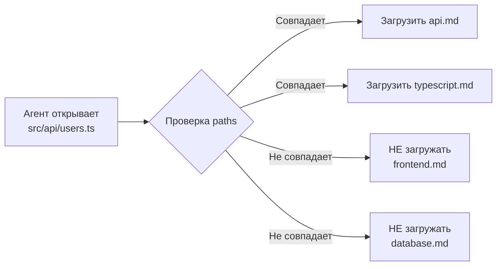

# Уровень 2: Правила и контекст (.claude/rules/)

## Введение

На прошлом уровне мы изучили CLAUDE.md -- единый файл инструкций, загружаемый при каждом запуске. Для небольших проектов этого достаточно. Но реальные проекты растут: появляются фронтенд и бэкенд, тесты и деплой, legacy-модули и новые фичи. Инструкции для каждой области разные, и загружать их все одновременно -- расточительно.

Представьте **библиотеку**. CLAUDE.md -- это плакат на входе: "Тишина!", "Книги возвращать в срок". Он нужен всем и всегда. А `.claude/rules/` -- это **предметные каталоги** по залам: "Зал физики", "Зал литературы". Вы берёте каталог только того зала, куда пришли.

Директория `.claude/rules/` предоставляет:
- **Модульность** -- каждая тема в отдельном файле
- **Lazy loading** -- правила загружаются только при работе с нужными файлами
- **Командную работу** -- каждый отвечает за свой файл правил

---

## 1. Структура директории .claude/rules/

### Базовая структура

```
your-project/
├── .claude/
│   ├── CLAUDE.md              # Общие инструкции (всегда)
│   └── rules/
│       ├── code-style.md      # Стиль кода
│       ├── testing.md         # Правила тестирования
│       ├── security.md        # Безопасность
│       ├── frontend.md        # Фронтенд-специфика
│       ├── backend.md         # Бэкенд-специфика
│       └── deployment.md      # Деплой
```

### Пример для монорепозитория

```
monorepo/
├── .claude/
│   ├── CLAUDE.md
│   └── rules/
│       ├── general.md         # Общие правила (без paths)
│       ├── react.md           # React-компоненты
│       ├── api.md             # API-сервер
│       ├── database.md        # Работа с БД
│       ├── testing.md         # Тестирование
│       └── ci-cd.md           # CI/CD конфигурация
├── packages/
│   ├── web/                   # React-приложение
│   ├── api/                   # Express-сервер
│   └── shared/                # Общие модули
```

Каждый файл -- это обычный Markdown, опционально с frontmatter для привязки к файлам.

---

## 2. Path-specific правила с glob-паттернами

### Синтаксис frontmatter

В начале файла добавляется YAML-frontmatter с полем `paths`:

```markdown
---
paths:
  - "src/**/*.{ts,tsx}"
  - "lib/**/*.ts"
---

# TypeScript-правила
- Не используй any, только unknown с type guards
- Используй as const вместо enum
- Все публичные функции должны иметь JSDoc
```

### Как работает matching

Когда агент открывает или редактирует файл, Claude Code проверяет путь файла против glob-паттернов всех правил. Совпавшие правила загружаются в контекст.

```markdown
---
paths:
  - "src/components/**/*.tsx"
  - "src/pages/**/*.tsx"
---

# React-компоненты
- Функциональные компоненты с хуками (не классы)
- Props -- через interface, не type
- Мемоизация: React.memo только при доказанной необходимости
- Стили: CSS Modules (.module.css)
```

Если агент редактирует `src/components/Button/Button.tsx` -- правило загрузится. Если `src/utils/format.ts` -- нет.

### Примеры glob-паттернов

| Паттерн | Совпадает с |
|---------|-------------|
| `**/*.ts` | Все .ts файлы в любой глубине |
| `src/**/*.{ts,tsx}` | .ts и .tsx файлы в src/ |
| `tests/**/*.test.ts` | Тестовые файлы |
| `*.config.{js,ts}` | Конфигурационные файлы в корне |
| `packages/api/**` | Все файлы API-пакета |
| `**/*.css` | Все CSS файлы |

### Несколько paths в одном правиле

```markdown
---
paths:
  - "tests/**/*.test.ts"
  - "tests/**/*.spec.ts"
  - "**/__tests__/**"
---

# Правила тестирования
- Vitest, не Jest
- describe/it, не test()
- Моки: vi.mock(), vi.spyOn()
- Каждый тест: Arrange → Act → Assert
- Именование: "should [ожидаемое поведение] when [условие]"
```

---

## 3. Lazy loading vs always-on

### Always-on (всегда загружены)

Два типа инструкций загружаются при каждом запуске:

1. **CLAUDE.md** -- всегда, на всех уровнях (project, user, subdirectory)
2. **rules/ без frontmatter** -- файлы в .claude/rules/ без блока `paths:`

```markdown
# .claude/rules/security.md (без frontmatter -- всегда загружен)

# Правила безопасности
- НИКОГДА не хардкодить API-ключи и пароли
- Все секреты -- через переменные окружения
- Не логировать чувствительные данные (пароли, токены, PII)
```

💡 Правила безопасности -- хороший кандидат на always-on, потому что они нужны **при работе с любым файлом**.

### Lazy loading (загружаются по совпадению)

Файлы с frontmatter `paths:` загружаются только при работе с совпадающими файлами:

```markdown
---
paths:
  - "src/database/**"
  - "prisma/**"
---

# Правила работы с БД
- Все запросы через Prisma ORM
- Не использовать raw SQL, кроме миграций
- Транзакции для операций с несколькими таблицами
- Индексы: добавлять вместе с миграцией
```

### Визуализация



Результат: в контексте только нужные правила, экономия токенов.

---

## 4. Бюджет контекста

### Как распределяется контекстное окно

Контекстное окно -- это фиксированный ресурс. Вот рекомендуемое распределение:

```
┌──────────────────────────────────────────┐
│           Контекстное окно               │
├──────────────────────────────────────────┤
│  ~25%  Системные инструкции              │
│        ├── CLAUDE.md                     │
│        ├── rules/ (загруженные)          │
│        └── managed policies              │
├──────────────────────────────────────────┤
│  ~25%  История разговора                 │
│        ├── Ваши сообщения                │
│        ├── Ответы агента                 │
│        └── Промежуточные рассуждения     │
├──────────────────────────────────────────┤
│  ~50%  Рабочее пространство              │
│        ├── Прочитанные файлы             │
│        ├── Результаты команд             │
│        ├── Содержимое diff               │
│        └── Поисковые результаты          │
└──────────────────────────────────────────┘
```

### Почему важен баланс

- **Инструкции > 30%** -- агенту не хватает места для чтения файлов и работы
- **История > 40%** -- длинный разговор вытесняет инструкции и рабочее пространство
- **Рабочее пространство < 30%** -- агент не может прочитать достаточно кода для качественной работы

📌 **Золотое правило:** если инструкции занимают больше четверти контекста, пора оптимизировать. Вынесите детали в rules/ с paths, уберите дублирование, сократите формулировки.

### Как измерить расход

Claude Code показывает информацию о контексте в строке статуса. Обращайте внимание на:
- Процент использования контекста
- Количество оставшихся токенов
- Предупреждения о приближении к лимиту

---

## 5. Стратегии экономии контекста

### /compact -- сжатие без потерь

```bash
> /compact
```

Команда `/compact` суммаризирует историю разговора:
- Ключевые решения сохраняются
- Промежуточные рассуждения сжимаются
- Файлы, которые агент читал, не дублируются

**Когда использовать:**
- Контекст заполнен на 50-70%
- Длинный разговор с множеством шагов
- Перед большой задачей, требующей много файлов

💡 `/compact` можно вызывать с подсказкой для фокуса:

```bash
> /compact сохрани контекст про миграцию базы данных
```

### /clear -- полный сброс

```bash
> /clear
```

Полностью очищает историю разговора. CLAUDE.md и rules/ перезагружаются с нуля.

**Когда использовать:**
- Переход к совершенно другой задаче
- Контекст безнадёжно загрязнён
- Агент начал "путаться" и повторяться

### Субагенты -- делегирование подзадач

Для изолированных подзадач Claude Code может запустить **субагента** -- отдельный процесс с собственным контекстным окном:

```
Основной агент (ваша сессия):
  "Мне нужно обновить API и тесты"
  │
  ├── Субагент 1: "Обнови типы API"
  │   (свой контекст, не нагружает основной)
  │
  └── Субагент 2: "Обнови тесты"
      (свой контекст, не нагружает основной)
```

Субагент выполняет задачу и возвращает **только результат** -- файлы, которые он создал или изменил. Промежуточные рассуждения, прочитанные файлы и история команд остаются в его контексте и не попадают в ваш.

Аналогия: вы -- менеджер проекта. Вместо того чтобы лично разбираться в деталях каждой задачи, вы делегируете их специалистам. Каждый специалист работает в своём "кабинете" (контексте) и приносит вам только результат.

### Мониторинг через status line

Строка состояния Claude Code -- ваш "датчик топлива". Рекомендации по действиям:

| Использование контекста | Статус | Действие |
|------------------------|--------|----------|
| 0-30% | Свободно | Работайте без ограничений |
| 30-60% | Нормально | Можно продолжать, но следите |
| 60-80% | Внимание | Используйте /compact |
| 80-95% | Критично | /compact или /clear |
| >95% | Переполнение | /clear, начните новую сессию |

---

## 6. Стратегия: CLAUDE.md vs rules/

### Когда использовать CLAUDE.md

CLAUDE.md -- для информации, которая нужна **в каждой сессии**, независимо от того, с какими файлами работает агент:

- Команды сборки и тестов (`pnpm build`, `pnpm test`)
- Общая архитектура проекта (Feature-sliced, монорепозиторий)
- Глобальные ограничения ("не добавлять зависимости без согласования")
- Ключевые gotchas ("CI требует codegen перед тестами")

### Когда использовать rules/

Rules -- для контекстно-зависимых инструкций:

- Стиль кода для конкретного языка (TypeScript-правила для `*.ts`)
- Правила тестирования (для `*.test.ts`)
- Специфика модуля (правила для `src/database/**`)
- CSS-соглашения (для `*.css`, `*.module.css`)
- Правила для инфраструктуры (для `Dockerfile`, `*.yaml`)

### Практический пример

Представим React + Express монорепозиторий:

**CLAUDE.md (всегда загружен, ~40 строк):**
```markdown
# Монорепозиторий: TaskManager

## Команды
- `pnpm dev` -- запуск всех сервисов
- `pnpm test` -- все тесты
- `pnpm build` -- production-сборка

## Архитектура
- packages/web -- React SPA
- packages/api -- Express API
- packages/shared -- общие типы и утилиты

## Ограничения
- Node.js >= 20
- НЕ добавлять зависимости без обсуждения
```

**.claude/rules/react.md (только для React-файлов):**
```markdown
---
paths:
  - "packages/web/src/**/*.{ts,tsx}"
---

# React-правила
- Функциональные компоненты + хуки
- Zustand для стейта (не Redux)
- CSS Modules для стилей
- React.lazy для роутов
```

**.claude/rules/api.md (только для API):**
```markdown
---
paths:
  - "packages/api/src/**/*.ts"
---

# API-правила
- Express + Zod для валидации
- Все роуты в отдельных файлах
- Middleware: auth → validate → handler
- Ответы: { data, error, meta }
```

**.claude/rules/testing.md (только для тестов):**
```markdown
---
paths:
  - "**/*.test.ts"
  - "**/*.spec.ts"
---

# Тестирование
- Vitest для юнит-тестов
- Playwright для e2e
- describe/it, не test()
- Моки: vi.mock()
```

Результат: при работе с `packages/web/src/App.tsx` загружается react.md. При работе с `packages/api/src/routes/users.ts` -- api.md. Тестовые правила подключаются только при работе с тестами.

---

## 7. Исключение файлов CLAUDE.md

В больших монорепозиториях можно исключить определённые CLAUDE.md из загрузки:

```json
{
  "claudeMdExcludes": [
    "**/legacy/CLAUDE.md",
    "/home/user/monorepo/other-team/.claude/rules/**"
  ]
}
```

Это полезно когда:
- В монорепозитории есть CLAUDE.md от другой команды
- Legacy-модуль имеет устаревшие инструкции
- Вы хотите временно отключить набор правил

---

## ⚠️ Частые ошибки новичков

### 🐛 1. Все правила без frontmatter

```markdown
❌ .claude/rules/typescript.md (нет paths)
❌ .claude/rules/react.md (нет paths)
❌ .claude/rules/testing.md (нет paths)
```

> **Почему это проблема:** без frontmatter правила загружаются **всегда** -- как если бы вы всё написали в CLAUDE.md. Теряется главное преимущество rules/ -- lazy loading. Контекст забивается правилами, которые не нужны для текущей задачи.

```markdown
✅ Добавляйте paths к файл-специфичным правилам:

---
paths:
  - "src/**/*.tsx"
---
```

### 🐛 2. Слишком широкие glob-паттерны

```markdown
❌ paths: ["**/*"]
```

> **Почему это проблема:** паттерн `**/*` совпадает с **любым файлом**. Правило будет загружаться всегда -- эквивалент правила без frontmatter.

```markdown
✅ Используйте конкретные паттерны:
paths:
  - "src/components/**/*.tsx"
  - "src/pages/**/*.tsx"
```

### 🐛 3. Дублирование между CLAUDE.md и rules/

```markdown
❌ В CLAUDE.md: "Не используй any в TypeScript"
❌ В rules/typescript.md: "Не используй any в TypeScript"
```

> **Почему это проблема:** одно правило загружается дважды, тратя контекст впустую. Определите правило в одном месте.

```markdown
✅ TypeScript-специфичное правило -- в rules/typescript.md с paths
✅ Универсальные правила -- в CLAUDE.md
```

### 🐛 4. Слишком много мелких файлов

```markdown
❌ rules/no-any.md
❌ rules/use-const.md
❌ rules/named-exports.md
❌ rules/no-semicolons.md
```

> **Почему это проблема:** каждый файл -- это overhead (frontmatter, заголовки). Десятки файлов с одним правилом каждый создают лишнюю нагрузку. Группируйте по теме.

```markdown
✅ rules/typescript.md  (все TS-правила в одном файле)
✅ rules/react.md       (все React-правила в одном файле)
```

### 🐛 5. Не следить за контекстом

> **Почему это проблема:** если вы не смотрите на status line, вы не заметите, что контекст на исходе. Агент начнёт терять инструкции и генерировать менее точный код.

```
✅ Выработайте привычку: 
   - Проверяйте status line каждые 5-10 сообщений
   - /compact при заполнении на 60%+
   - /clear при переходе к новой задаче
```

---

## 📌 Итоги

- ✅ `.claude/rules/` -- модульная система правил, дополняющая CLAUDE.md
- ✅ Path-specific правила (frontmatter `paths:`) загружаются только при работе с совпадающими файлами
- ✅ Правила без frontmatter загружаются всегда -- используйте для критичных глобальных правил (безопасность)
- ✅ Бюджет контекста: ~25% инструкции, ~25% история, ~50% рабочее пространство
- ✅ `/compact` сжимает историю, `/clear` сбрасывает сессию, субагенты изолируют подзадачи
- ✅ CLAUDE.md для "нужно всегда", rules/ для "нужно при работе с конкретными файлами"
- ❌ Не забывайте paths -- без них rules/ бессмысленны
- ❌ Не дублируйте правила между CLAUDE.md и rules/
- 📌 Следите за строкой состояния -- контекст не бесконечен
