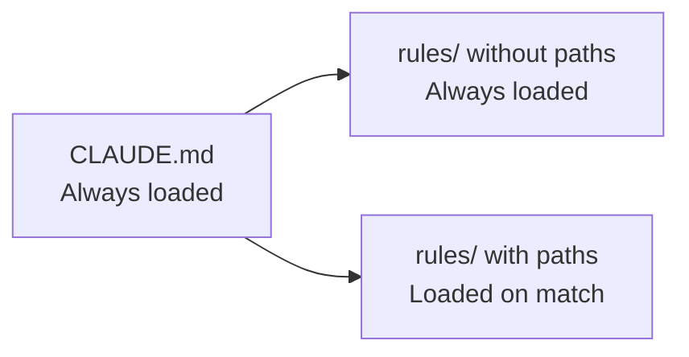

# Level 2: Rules and Context (.claude/rules/)

## From CLAUDE.md to rules/

In the previous level, we learned to write CLAUDE.md. But what if you have a monorepo with a dozen services? Or the rules for frontend and backend are completely different? Loading everything into context simultaneously is wasteful.

The `.claude/rules/` directory solves this problem: rules load **only when needed**.

Analogy: CLAUDE.md is a **company-wide policy** (everyone needs to know). Rules are **department-specific instructions** (accounting reads theirs, development reads theirs).

## Structure of .claude/rules/

```
your-project/
├── .claude/
│   ├── CLAUDE.md              # General instructions (always loaded)
│   └── rules/
│       ├── code-style.md      # Code style
│       ├── testing.md         # Testing rules
│       ├── security.md        # Security
│       └── frontend.md        # Frontend only
```

Each file in `rules/` is regular Markdown. But unlike CLAUDE.md, rules can be **tied to specific files** via frontmatter.

## Path-specific Rules

The most powerful feature of rules/ -- file binding via glob patterns:

```markdown
---
paths:
  - "src/**/*.{ts,tsx}"
  - "lib/**/*.ts"
---

# TypeScript rules
- Do not use any, only unknown with type guards
- Use as const instead of enum
- All functions must have explicit return type annotation
```

This rule loads **only** when the agent works with `.ts` and `.tsx` files. If it edits `README.md` or `Dockerfile` -- the rule doesn't consume context.

```markdown
---
paths:
  - "tests/**/*.test.ts"
  - "**/*.spec.ts"
---

# Testing Rules
- Use describe/it, not test()
- Mocks only via vi.mock(), not jest.mock()
- One assert per test (if possible)
```

## Lazy loading vs always-on



| Type | When loaded | Example |
|------|-------------|---------|
| CLAUDE.md | Always | Build commands, general architecture |
| rules/ without frontmatter | Always | General security rules |
| rules/ with `paths:` | When working with matching files | TypeScript rules for `*.ts` |

💡 **Rule of thumb:** if an instruction is needed in every session -- CLAUDE.md. If only when working with certain code -- rules/ with paths.

## 🔥 Context Budget

The context window is your main resource. Here's how to distribute it:

```
┌──────────────────────────────────────┐
│         Context Window               │
├──────────────────────────────────────┤
│ ~25%  Instructions                   │
│       (CLAUDE.md + rules/)           │
├──────────────────────────────────────┤
│ ~25%  Conversation History           │
│       (your messages + responses)    │
├──────────────────────────────────────┤
│ ~50%  Working Space                  │
│       (files, command results)       │
└──────────────────────────────────────┘
```

📌 If instructions take 40% of context -- you have a problem. The agent won't have enough room to work.

## Context Saving Strategies

### /compact -- history compression

```bash
> /compact
```

Summarizes conversation history, preserving key decisions. Use when you see context running low.

### /clear -- fresh start

```bash
> /clear
```

Complete session reset. Useful when switching to an unrelated task.

### Sub-agents -- delegation

For isolated sub-tasks, Claude Code can launch a **sub-agent** -- a separate session with its own context. The sub-agent performs the task and returns only the result, not loading the main context with details.

### Monitoring via status line

The Claude Code status line shows remaining context. Watch it:
- **>70% free** -- work freely
- **30-70%** -- consider /compact
- **<30%** -- time for /compact or /clear

## When CLAUDE.md, when rules/

| Criterion | CLAUDE.md | .claude/rules/ |
|-----------|-----------|----------------|
| Needed always | ✅ | ⚠️ Only without paths |
| Needed for specific files | ❌ | ✅ With paths |
| Build commands | ✅ | ❌ |
| TS code style | ⚠️ Possible | ✅ Better |
| Testing rules | ⚠️ Possible | ✅ Better |
| General architecture | ✅ | ❌ |

## ⚠️ Common Beginner Mistakes

### 🐛 1. All rules without paths

```markdown
❌ rules/typescript.md (no frontmatter)
❌ rules/testing.md (no frontmatter)
❌ rules/css.md (no frontmatter)
```

> **Why this is a problem:** rules without paths load **always** -- as if you wrote everything in CLAUDE.md. The main advantage of rules/ is lost.

```markdown
✅ Add paths to all file-specific rules:
---
paths:
  - "**/*.css"
  - "**/*.module.css"
---
```

### 🐛 2. Too broad glob patterns

```markdown
❌ paths: ["**/*"]  # Matches ANY file = always loaded
```

```markdown
✅ paths: ["src/components/**/*.tsx"]  # Only React components
```

### 🐛 3. Duplication between CLAUDE.md and rules/

> If the same rule exists in both places -- it loads twice and wastes context twice.

## 📌 Summary

- ✅ `.claude/rules/` -- modular rule system with lazy loading
- ✅ Path-specific rules load only when working with matching files
- ✅ Budget: ~25% instructions, ~25% history, ~50% working space
- ✅ `/compact` and `/clear` -- your context management tools
- ✅ Sub-agents help delegate tasks without loading the main context
- ❌ Don't forget paths -- without them rules/ lose their purpose
