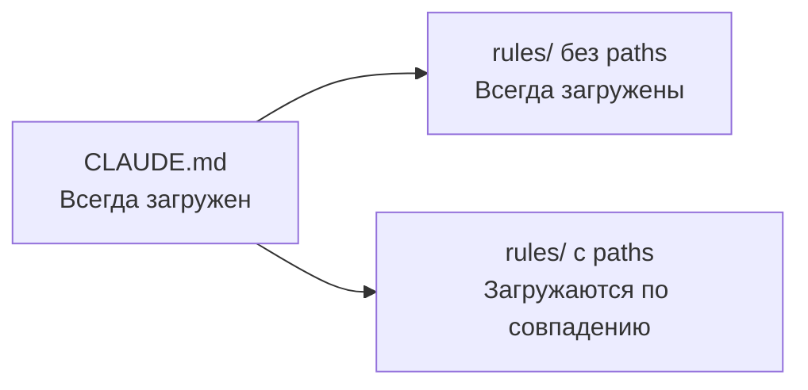

# Уровень 2: Правила и контекст (.claude/rules/)

## От CLAUDE.md к rules/

На прошлом уровне мы научились писать CLAUDE.md. Но что, если у вас монорепозиторий с десятком сервисов? Или правила для фронтенда и бэкенда совершенно разные? Загружать всё в контекст одновременно -- расточительно.

Директория `.claude/rules/` решает эту проблему: правила загружаются **только когда нужны**.

Аналогия: CLAUDE.md -- это **общий регламент компании** (знать всем). Rules -- это **инструкции для конкретных отделов** (бухгалтерия читает свои, разработка -- свои).

## Структура .claude/rules/

```
your-project/
├── .claude/
│   ├── CLAUDE.md              # Общие инструкции (всегда загружены)
│   └── rules/
│       ├── code-style.md      # Стиль кода
│       ├── testing.md         # Правила тестирования
│       ├── security.md        # Безопасность
│       └── frontend.md        # Только для фронтенда
```

Каждый файл в `rules/` -- обычный Markdown. Но в отличие от CLAUDE.md, правила могут быть **привязаны к конкретным файлам** через frontmatter.

## Path-specific правила

Самая мощная возможность rules/ -- привязка к файлам через glob-паттерны:

```markdown
---
paths:
  - "src/**/*.{ts,tsx}"
  - "lib/**/*.ts"
---

# TypeScript-правила
- Не используй any, только unknown с type guards
- Используй as const вместо enum
- Все функции должны иметь явную типизацию возвращаемого значения
```

Это правило загрузится **только** когда агент работает с `.ts` и `.tsx` файлами. Если он редактирует `README.md` или `Dockerfile` -- правило не тратит контекст.

```markdown
---
paths:
  - "tests/**/*.test.ts"
  - "**/*.spec.ts"
---

# Правила тестирования
- Используй describe/it, не test()
- Моки только через vi.mock(), не jest.mock()
- Каждый тест -- один assert (по возможности)
```

## Lazy loading vs always-on



| Тип | Когда загружается | Пример |
|-----|-------------------|--------|
| CLAUDE.md | Всегда | Команды сборки, общая архитектура |
| rules/ без frontmatter | Всегда | Общие правила безопасности |
| rules/ с `paths:` | При работе с совпадающими файлами | TypeScript-правила для `*.ts` |

💡 **Правило большого пальца:** если инструкция нужна в каждой сессии -- CLAUDE.md. Если только при работе с определённым кодом -- rules/ с paths.

## 🔥 Бюджет контекста

Контекстное окно -- ваш главный ресурс. Вот как его распределять:

```
┌──────────────────────────────────────┐
│         Контекстное окно             │
├──────────────────────────────────────┤
│ ~25%  Инструкции                     │
│       (CLAUDE.md + rules/)           │
├──────────────────────────────────────┤
│ ~25%  История разговора              │
│       (ваши сообщения + ответы)      │
├──────────────────────────────────────┤
│ ~50%  Рабочее пространство           │
│       (файлы, результаты команд)     │
└──────────────────────────────────────┘
```

📌 Если инструкции занимают 40% контекста -- у вас проблема. Агенту не хватит места для работы.

## Стратегии экономии контекста

### /compact -- сжатие истории

```bash
> /compact
```

Суммаризирует историю разговора, сохраняя ключевые решения. Используйте, когда видите, что контекст на исходе.

### /clear -- чистый старт

```bash
> /clear
```

Полный сброс сессии. Полезно, когда переходите к несвязанной задаче.

### Субагенты -- делегирование

Для изолированных подзадач Claude Code может запустить **субагента** -- отдельную сессию с собственным контекстом. Субагент выполняет задачу и возвращает только результат, не загружая основной контекст деталями.

### Мониторинг через status line

Строка состояния Claude Code показывает оставшийся контекст. Следите за ней:
- **>70% свободно** -- работайте спокойно
- **30-70%** -- подумайте о /compact
- **<30%** -- пора /compact или /clear

## Когда CLAUDE.md, а когда rules/

| Критерий | CLAUDE.md | .claude/rules/ |
|----------|-----------|----------------|
| Нужно всегда | ✅ | ⚠️ Только без paths |
| Нужно для конкретных файлов | ❌ | ✅ С paths |
| Команды сборки | ✅ | ❌ |
| Стиль кода для TS | ⚠️ Можно | ✅ Лучше |
| Правила тестирования | ⚠️ Можно | ✅ Лучше |
| Общая архитектура | ✅ | ❌ |

## ⚠️ Частые ошибки новичков

### 🐛 1. Все правила без paths

```markdown
❌ rules/typescript.md (без frontmatter)
❌ rules/testing.md (без frontmatter)
❌ rules/css.md (без frontmatter)
```

> **Почему это проблема:** правила без paths загружаются **всегда** -- как если бы вы всё написали в CLAUDE.md. Теряется главное преимущество rules/.

```markdown
✅ Добавляйте paths ко всем файл-специфичным правилам:
---
paths:
  - "**/*.css"
  - "**/*.module.css"
---
```

### 🐛 2. Слишком широкие glob-паттерны

```markdown
❌ paths: ["**/*"]  # Совпадает с ЛЮБЫМ файлом = всегда загружено
```

```markdown
✅ paths: ["src/components/**/*.tsx"]  # Только компоненты React
```

### 🐛 3. Дублирование между CLAUDE.md и rules/

> Если одно и то же правило есть в обоих местах -- оно загружается дважды и тратит контекст дважды.

## 📌 Итоги

- ✅ `.claude/rules/` -- модульная система правил с lazy loading
- ✅ Path-specific правила загружаются только при работе с совпадающими файлами
- ✅ Бюджет: ~25% инструкции, ~25% история, ~50% рабочее пространство
- ✅ `/compact` и `/clear` -- ваши инструменты управления контекстом
- ✅ Субагенты помогают делегировать задачи без нагрузки на основной контекст
- ❌ Не забывайте про paths -- без них rules/ теряют смысл
