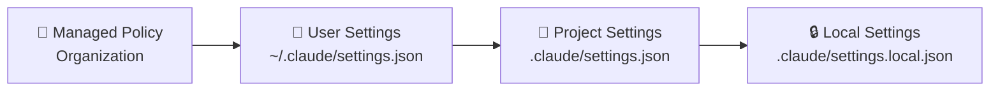
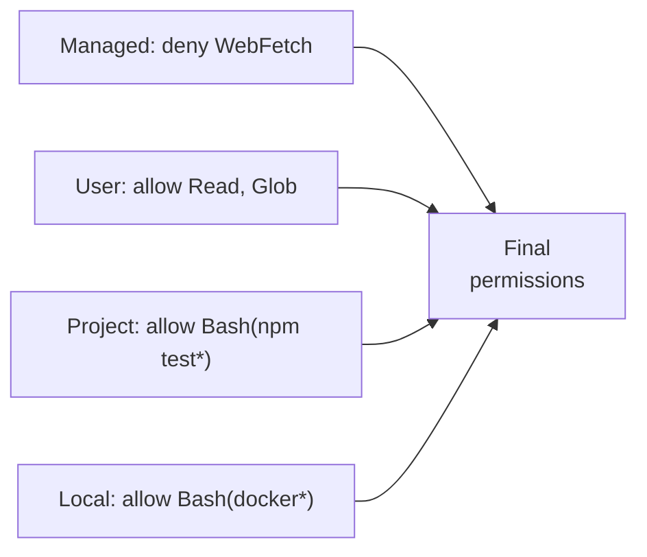
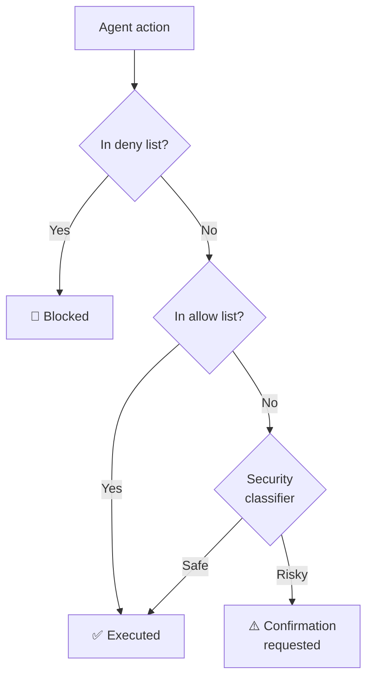

# Level 3: Settings and Permissions

## Introduction

When you work with Claude Code alone on a pet project, settings seem unimportant -- you confirm actions manually and that's it. But once a team, CI/CD, or corporate security policy enters the picture, the settings system becomes critically important.

Imagine an apartment building. There are rules from the management company (no noise after 11 PM -- and this is not up for discussion). There are specific building rules (intercom locks at 10 PM). There are agreements within the apartment (take off shoes at the door). And there are your personal habits (set alarm for 7 AM). Each lower level can add its own rules, but **cannot cancel** rules from a higher level.

Claude Code's settings system works on the same principle -- four levels with a clear priority hierarchy.

## Settings Hierarchy



**Priority: managed > user > project > local.** The upper level always wins in case of conflict.

### Managed Policy (Organization)

Set by DevOps or the Security team at the organization level. Developers cannot change or override these settings.

```json
// Example of strict corporate policy
{
  "permissions": {
    "disableBypassPermissionsMode": "disable",
    "ask": ["Bash"],
    "deny": ["WebSearch", "WebFetch"]
  },
  "allowManagedPermissionRulesOnly": true,
  "allowManagedHooksOnly": true
}
```

Typical restrictions: network request ban, mandatory sandbox, `bypassPermissions` ban.

### User Settings (~/.claude/settings.json)

Your global settings that apply to all projects. Stored in the home directory, not committed to git.

```json
// ~/.claude/settings.json
{
  "permissions": {
    "allow": [
      "Read",
      "Glob",
      "Grep",
      "Bash(git log*)",
      "Bash(git diff*)",
      "Bash(git status*)"
    ]
  }
}
```

💡 This is where you put permissions for safe operations you use in any project: file reading, git commands, linters.

### Project Settings (.claude/settings.json)

Team settings that **are committed to git**. All project participants get the same rules.

```json
// .claude/settings.json
{
  "permissions": {
    "allow": [
      "Bash(npm test*)",
      "Bash(npm run lint*)",
      "Bash(npx tsc*)",
      "Bash(npx prisma*)"
    ],
    "deny": [
      "Bash(rm -rf*)",
      "Bash(curl*)",
      "Bash(wget*)"
    ]
  }
}
```

📌 **Important:** this is where project-specific permissions are defined. If the project uses Prisma -- allow `Bash(npx prisma*)`. If Docker -- add `Bash(docker *)`.

### Local Settings (.claude/settings.local.json)

Personal settings for a specific project. This file is added to `.gitignore` -- does not enter the repository.

```json
// .claude/settings.local.json
{
  "permissions": {
    "allow": [
      "Bash(docker compose*)"
    ]
  }
}
```

Use for temporary permissions or settings specific to your machine.

---

## Permission Rules: allow, deny, ask

The permission system operates with three lists:

| List | Behavior |
|------|----------|
| `allow` | Tool runs without confirmation |
| `deny` | Tool is completely blocked |
| `ask` | Claude asks before each invocation (default behavior) |

### Tool Patterns

Rules support wildcard patterns with `*`:

```json
{
  "permissions": {
    "allow": [
      "Read",                    // Reading any files
      "Glob",                    // File search by pattern
      "Grep",                    // Content search
      "Edit",                    // File editing
      "Write",                   // File creation
      "Bash(git *)",             // Any git commands
      "Bash(npm test*)",         // npm test and npm test:unit, etc.
      "Bash(npx tsc*)",          // TypeScript compiler
      "Bash(npx eslint*)"        // Linter
    ],
    "deny": [
      "Bash(rm -rf *)",          // Recursive deletion
      "Bash(curl *)",            // Network requests
      "Bash(wget *)",            // File downloads
      "Bash(*> /dev/null*)",     // Output suppression
      "WebFetch",                // Web requests via MCP
      "WebSearch"                // Web search via MCP
    ]
  }
}
```

⚠️ **deny takes priority over allow:** if a tool appears in both lists, `deny` wins.

### How Final Permissions are Formed

Claude Code merges rules from all four levels:



1. All `allow` and `deny` from all levels are collected
2. In case of conflict between levels, the higher level wins
3. `deny` always takes priority over `allow` at the same level
4. Everything not in `allow` and not in `deny` falls into `ask`

---

## Operating Modes

Claude Code supports five modes that determine the agent's autonomy level:

### default -- Standard Mode

Safe operations (reading, search) run automatically. Potentially dangerous ones (file writing, Bash commands) require confirmation unless added to `allow`.

```bash
# Claude will read a file without questions
# But will ask before running npm install
```

Suitable for everyday work -- a balance between convenience and security.

### plan -- Planning Mode

Claude **only analyzes** code and suggests an action plan, but **changes nothing**. No files are edited, no commands are executed.

```bash
claude --mode plan "How would you implement caching in this service?"
# Claude will analyze the code and suggest a plan
# No file will be modified
```

🎯 **When to use:**
- Exploring an unfamiliar repository
- Code review -- ask Claude to analyze a PR
- Learning -- understand how the code works before changing it

### auto -- Full Autonomy

Claude performs all actions from the `allow` list without confirmation. Actions from `deny` remain blocked, and actions not in either list are checked by the security classifier.

```bash
claude --mode auto "Update all dependencies and run tests"
# Claude will run npm update, npm test, fix breaking changes on its own
```

⚠️ **When to use:**
- CI/CD pipelines
- Routine tasks with predictable results
- When you have strict allow/deny rules configured

### acceptEdits -- Automatic Edit Acceptance

Claude automatically applies all file changes (Edit, Write), but asks before Bash commands.

🎯 Convenient for mass refactoring: "Rename all `userId` to `accountId` across the project".

### bypassPermissions -- No Restrictions

⚠️ **Dangerous mode.** Disables all security checks. Claude can do absolutely everything without confirmation.

```bash
# ⚠️ Only for one-off experiments on an isolated machine!
claude --mode bypassPermissions "..."
```

An organization can block this mode via managed policy:

```json
{
  "permissions": {
    "disableBypassPermissionsMode": "disable"
  }
}
```

---

## Security Classifier in Auto Mode

In `auto` mode, Claude doesn't blindly execute everything. Each action passes through a built-in security classifier:



The classifier evaluates:
- **Operation type** -- reading is safer than writing, search is safer than deletion
- **Target files** -- modifying `package.json` is riskier than modifying `README.md`
- **Bash command** -- `git status` is safe, `rm -rf` is dangerous
- **Context** -- a repeated action is less suspicious than a sudden new one

---

## Mode Selection: Decision Matrix

| Situation | Recommended Mode |
|-----------|-----------------|
| Getting familiar with a new repository | `plan` |
| Regular feature work | `default` |
| Mass refactoring | `acceptEdits` |
| CI/CD pipeline | `auto` + strict allow/deny |
| Quick prototype on a throwaway branch | `auto` |
| Critical production code | `default` + minimal allow |
| Local experiment | `bypassPermissions` (with caution) |

💡 **Rule of thumb:** the more critical the code and the less experience you have with Claude Code, the stricter the mode.

---

## ⚠️ Common Beginner Mistakes

### 🐛 1. Overly Broad Permissions

```json
// ❌ Bad -- allows absolutely everything
{
  "permissions": {
    "allow": ["Bash(*)"]
  }
}
```

> Claude gets carte blanche for any Bash command: file deletion, network requests, package installation. One misunderstood prompt -- and `rm -rf` destroys the working directory.

```json
// ✅ Good -- only specific tools
{
  "permissions": {
    "allow": [
      "Bash(git *)",
      "Bash(npm test*)",
      "Bash(npx tsc*)"
    ]
  }
}
```

### 🐛 2. Secrets in Project Settings

```bash
# ❌ .claude/settings.json is committed to git!
# It will include:
# - Paths like /Users/vasya/... (username leak)
# - Local ports and addresses
# - Machine-specific settings
```

```bash
# ✅ For personal settings:
# .claude/settings.local.json -- gitignored, for this project
# ~/.claude/settings.json -- global, for all projects
```

### 🐛 3. bypassPermissions in Shared Environments

The `bypassPermissions` mode on a CI/CD server or in a Docker container with mounted volumes is a direct path to an incident. Claude can modify files outside the project, send data externally, or execute destructive commands.

```json
// ✅ For CI/CD -- auto + strict rules
{
  "permissions": {
    "disableBypassPermissionsMode": "disable",
    "allow": ["Bash(npm test*)", "Bash(npm run build*)"],
    "deny": ["Bash(curl*)", "Bash(wget*)", "WebFetch"]
  }
}
```

### 🐛 4. Forgotten Deny Rules in Project Settings

```json
// ❌ Allowed npm, but forgot to forbid dangerous
{
  "permissions": {
    "allow": ["Bash(npm *)"]
  }
}
// npm * includes: npm publish, npm unpublish, npm adduser...
```

```json
// ✅ Explicitly forbid dangerous subcommands
{
  "permissions": {
    "allow": [
      "Bash(npm test*)",
      "Bash(npm run *)",
      "Bash(npm install*)"
    ],
    "deny": [
      "Bash(npm publish*)",
      "Bash(npm unpublish*)"
    ]
  }
}
```

---

## Best Practices

### For Individual Developers

1. In `~/.claude/settings.json`, allow safe global operations: `Read`, `Glob`, `Grep`, `Bash(git log*)`, `Bash(git diff*)`
2. In the project's `.claude/settings.json`, add specific commands: tests, linter, compiler
3. Start with `plan` for new code, switch to `default` when comfortable

### For Teams

1. Discuss `.claude/settings.json` on code review like any other configuration file
2. Add `deny` for destructive operations: `rm -rf`, `git push --force`, `npm publish`
3. Document why specific permissions are added (JSON doesn't support comments -- maintain a separate file or use PR descriptions)

### For Organizations

1. Managed policy: ban `bypassPermissions`, restrict network access
2. Enable `allowManagedPermissionRulesOnly` if full control is needed
3. Configure sandbox for filesystem and network isolation

## 📌 Summary

- 🔥 Four levels of settings with a clear priority hierarchy
- ✅ `allow` / `deny` / `ask` -- three categories for each tool
- 📌 `deny` always beats `allow`, upper level beats lower level
- 💡 Five modes: from `plan` (read only) to `bypassPermissions` (no restrictions)
- ⚠️ In `auto` mode, the security classifier is active -- not everything runs blindly
- 🎯 Principle of least privilege: grant only the permissions actually needed
