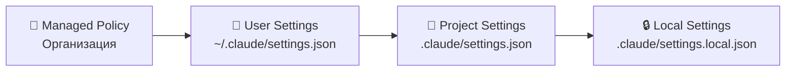
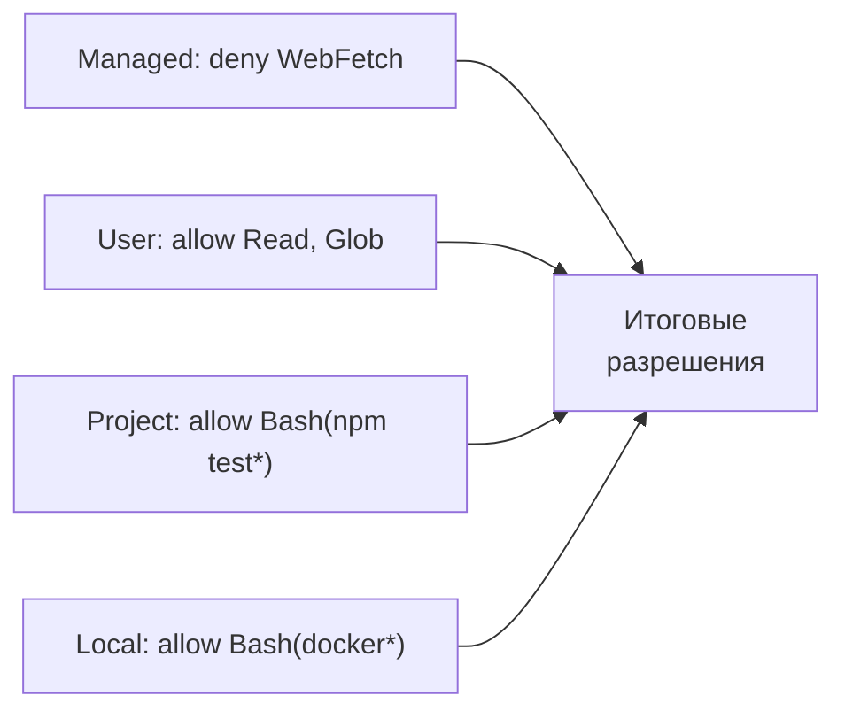
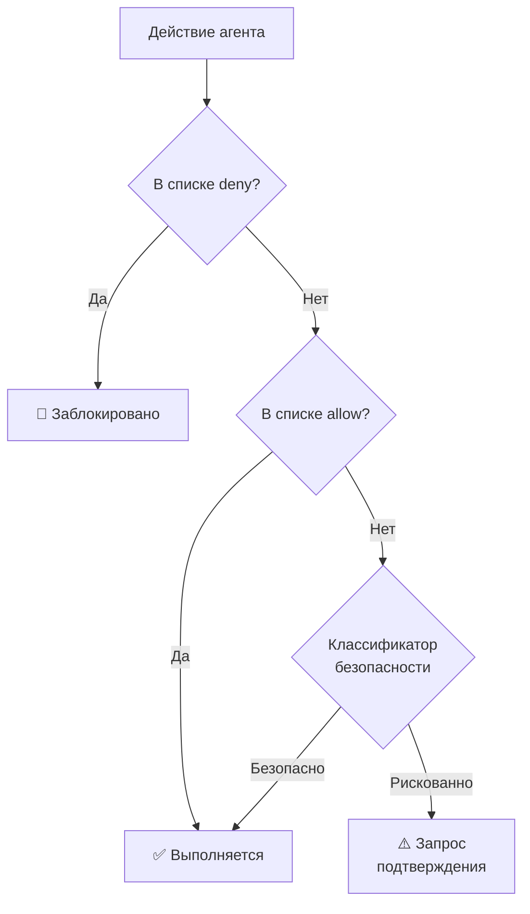

# Уровень 3: Настройки и разрешения

## Введение

Когда вы работаете с Claude Code в одиночку на pet-проекте, вопрос настроек кажется несущественным -- подтверждаешь действия вручную и всё. Но как только в игру вступает команда, CI/CD или корпоративная политика безопасности, система настроек становится критически важной.

Представьте многоквартирный дом. Есть правила от управляющей компании (нельзя шуметь после 23:00 -- и это не обсуждается). Есть правила конкретного дома (домофон закрывается в 22:00). Есть договорённости внутри квартиры (снимаем обувь у двери). И есть ваши личные привычки (ставлю будильник на 7:00). Каждый нижестоящий уровень может добавлять свои правила, но **не может отменить** правила вышестоящего.

Система настроек Claude Code работает по тому же принципу -- четыре уровня с чёткой иерархией приоритетов.

## Иерархия настроек



**Приоритет: managed > user > project > local.** Верхний уровень всегда побеждает при конфликте.

### Managed Policy (организация)

Устанавливается DevOps или Security-командой на уровне организации. Разработчик не может изменить или переопределить эти настройки.

```json
// Пример строгой корпоративной политики
{
  "permissions": {
    "disableBypassPermissionsMode": "disable",
    "ask": ["Bash"],
    "deny": ["WebSearch", "WebFetch"]
  },
  "allowManagedPermissionRulesOnly": true,
  "allowManagedHooksOnly": true
}
```

Типичные ограничения: запрет сетевых запросов, обязательный sandbox, запрет `bypassPermissions`.

### User Settings (~/.claude/settings.json)

Ваши глобальные настройки, действующие во всех проектах. Хранятся в домашней директории, не попадают в git.

```json
// ~/.claude/settings.json
{
  "permissions": {
    "allow": [
      "Read",
      "Glob",
      "Grep",
      "Bash(git log*)",
      "Bash(git diff*)",
      "Bash(git status*)"
    ]
  }
}
```

💡 Сюда удобно складывать разрешения для безопасных операций, которые вы используете в любом проекте: чтение файлов, git-команды, линтеры.

### Project Settings (.claude/settings.json)

Командные настройки, которые **коммитятся в git**. Все участники проекта получают одинаковые правила.

```json
// .claude/settings.json
{
  "permissions": {
    "allow": [
      "Bash(npm test*)",
      "Bash(npm run lint*)",
      "Bash(npx tsc*)",
      "Bash(npx prisma*)"
    ],
    "deny": [
      "Bash(rm -rf*)",
      "Bash(curl*)",
      "Bash(wget*)"
    ]
  }
}
```

📌 **Важно:** именно здесь определяются специфичные для проекта разрешения. Если проект использует Prisma -- разрешите `Bash(npx prisma*)`. Если Docker -- добавьте `Bash(docker *)`.

### Local Settings (.claude/settings.local.json)

Личные настройки для конкретного проекта. Файл добавлен в `.gitignore` -- не попадает в репозиторий.

```json
// .claude/settings.local.json
{
  "permissions": {
    "allow": [
      "Bash(docker compose*)"
    ]
  }
}
```

Используйте для временных разрешений или настроек, специфичных для вашей машины.

---

## Правила разрешений: allow, deny, ask

Система разрешений оперирует тремя списками:

| Список | Поведение |
|--------|----------|
| `allow` | Инструмент выполняется без подтверждения |
| `deny` | Инструмент заблокирован полностью |
| `ask` | Claude спрашивает перед каждым вызовом (поведение по умолчанию) |

### Паттерны инструментов

Правила поддерживают wildcard-паттерны с `*`:

```json
{
  "permissions": {
    "allow": [
      "Read",                    // Чтение любых файлов
      "Glob",                    // Поиск файлов по паттерну
      "Grep",                    // Поиск по содержимому
      "Edit",                    // Редактирование файлов
      "Write",                   // Создание файлов
      "Bash(git *)",             // Любые git-команды
      "Bash(npm test*)",         // npm test и npm test:unit и т.д.
      "Bash(npx tsc*)",          // TypeScript compiler
      "Bash(npx eslint*)"        // Линтер
    ],
    "deny": [
      "Bash(rm -rf *)",          // Рекурсивное удаление
      "Bash(curl *)",            // Сетевые запросы
      "Bash(wget *)",            // Скачивание файлов
      "Bash(*> /dev/null*)",     // Подавление вывода
      "WebFetch",                // Веб-запросы через MCP
      "WebSearch"                // Веб-поиск через MCP
    ]
  }
}
```

⚠️ **Приоритет deny над allow:** если инструмент попадает в оба списка, `deny` побеждает.

### Как формируются итоговые разрешения

Claude Code объединяет правила со всех четырёх уровней:



1. Собираются все `allow` и `deny` со всех уровней
2. При конфликте между уровнями побеждает более высокий
3. `deny` всегда приоритетнее `allow` на одном уровне
4. Всё, что не в `allow` и не в `deny`, попадает в `ask`

---

## Режимы работы

Claude Code поддерживает пять режимов, которые определяют уровень автономии агента:

### default -- стандартный режим

Безопасные операции (чтение, поиск) выполняются автоматически. Потенциально опасные (запись файлов, Bash-команды) требуют подтверждения, если не добавлены в `allow`.

```bash
# Claude прочитает файл без вопросов
# Но перед выполнением npm install спросит
```

Подходит для повседневной работы -- баланс между удобством и безопасностью.

### plan -- режим планирования

Claude **только анализирует** код и предлагает план действий, но **ничего не меняет**. Никакие файлы не редактируются, никакие команды не выполняются.

```bash
claude --mode plan "Как бы ты реализовал кэширование в этом сервисе?"
# Claude проанализирует код и предложит план
# Ни один файл не будет изменён
```

🎯 **Когда использовать:**
- Разведка в незнакомом репозитории
- Code review -- попросите Claude проанализировать PR
- Обучение -- разберитесь как работает код, прежде чем менять

### auto -- полная автономия

Claude выполняет все действия из списка `allow` без подтверждения. Действия из `deny` по-прежнему заблокированы, а действия не из обоих списков проверяются классификатором безопасности.

```bash
claude --mode auto "Обнови все зависимости и прогони тесты"
# Claude сам выполнит npm update, npm test, исправит breaking changes
```

⚠️ **Когда использовать:**
- CI/CD пайплайны
- Рутинные задачи с предсказуемым результатом
- Когда у вас настроены строгие allow/deny правила

### acceptEdits -- автоматическое принятие правок

Claude автоматически применяет все изменения файлов (Edit, Write), но спрашивает перед Bash-командами.

🎯 Удобно для массового рефакторинга: "Переименуй все `userId` в `accountId` по всему проекту".

### bypassPermissions -- без ограничений

⚠️ **Опасный режим.** Отключает все проверки безопасности. Claude может делать абсолютно всё без подтверждений.

```bash
# ⚠️ Только для одноразовых экспериментов на изолированной машине!
claude --mode bypassPermissions "..."
```

Организация может запретить этот режим через managed policy:

```json
{
  "permissions": {
    "disableBypassPermissionsMode": "disable"
  }
}
```

---

## Классификатор безопасности в auto mode

В режиме `auto` Claude не выполняет всё подряд вслепую. Каждое действие проходит через встроенный классификатор безопасности:



Классификатор оценивает:
- **Тип операции** -- чтение безопаснее записи, поиск безопаснее удаления
- **Целевые файлы** -- изменение `package.json` рискованнее изменения `README.md`
- **Bash-команда** -- `git status` безопасен, `rm -rf` опасен
- **Контекст** -- повторяющееся действие менее подозрительно, чем внезапное новое

---

## Выбор режима: матрица решений

| Ситуация | Рекомендуемый режим |
|----------|-------------------|
| Знакомлюсь с новым репозиторием | `plan` |
| Обычная работа над фичей | `default` |
| Массовый рефакторинг | `acceptEdits` |
| CI/CD пайплайн | `auto` + строгие allow/deny |
| Быстрый прототип на throwaway-ветке | `auto` |
| Критичный продакшн-код | `default` + минимальные allow |
| Локальный эксперимент | `bypassPermissions` (с осторожностью) |

💡 **Правило большого пальца:** чем критичнее код и чем меньше ваш опыт с Claude Code, тем строже режим.

---

## ⚠️ Частые ошибки новичков

### 🐛 1. Слишком широкие разрешения

```json
// ❌ Плохо -- разрешает абсолютно всё
{
  "permissions": {
    "allow": ["Bash(*)"]
  }
}
```

> Claude получает карт-бланш на любые Bash-команды: удаление файлов, сетевые запросы, установка пакетов. Один неверно понятый промпт -- и `rm -rf` уничтожит рабочую директорию.

```json
// ✅ Хорошо -- только конкретные инструменты
{
  "permissions": {
    "allow": [
      "Bash(git *)",
      "Bash(npm test*)",
      "Bash(npx tsc*)"
    ]
  }
}
```

### 🐛 2. Секреты в project settings

```bash
# ❌ .claude/settings.json коммитится в git!
# Туда попадут:
# - Пути вида /Users/vasya/... (утечка username)
# - Локальные порты и адреса
# - Специфичные для вашей машины настройки
```

```bash
# ✅ Для личных настроек:
# .claude/settings.local.json -- gitignored, для этого проекта
# ~/.claude/settings.json -- глобальный, для всех проектов
```

### 🐛 3. bypassPermissions в shared-окружениях

Режим `bypassPermissions` на CI/CD-сервере или в docker-контейнере с mounted volumes -- это прямая дорога к инциденту. Claude может модифицировать файлы за пределами проекта, отправить данные наружу или выполнить деструктивные команды.

```json
// ✅ Для CI/CD -- auto + строгие правила
{
  "permissions": {
    "disableBypassPermissionsMode": "disable",
    "allow": ["Bash(npm test*)", "Bash(npm run build*)"],
    "deny": ["Bash(curl*)", "Bash(wget*)", "WebFetch"]
  }
}
```

### 🐛 4. Забытые deny-правила в project settings

```json
// ❌ Разрешили npm, но забыли запретить опасное
{
  "permissions": {
    "allow": ["Bash(npm *)"]
  }
}
// npm * включает: npm publish, npm unpublish, npm adduser...
```

```json
// ✅ Явно запрещаем опасные подкоманды
{
  "permissions": {
    "allow": [
      "Bash(npm test*)",
      "Bash(npm run *)",
      "Bash(npm install*)"
    ],
    "deny": [
      "Bash(npm publish*)",
      "Bash(npm unpublish*)"
    ]
  }
}
```

---

## Best practices

### Для индивидуального разработчика

1. В `~/.claude/settings.json` разрешите безопасные глобальные операции: `Read`, `Glob`, `Grep`, `Bash(git log*)`, `Bash(git diff*)`
2. В `.claude/settings.json` проекта добавьте специфичные команды: тесты, линтер, компилятор
3. Начинайте с `plan` в новом коде, переходите на `default` когда освоились

### Для команды

1. Обсудите `.claude/settings.json` на code review как любой другой конфигурационный файл
2. Добавьте `deny` для деструктивных операций: `rm -rf`, `git push --force`, `npm publish`
3. Документируйте, почему конкретные разрешения добавлены (комментарии в JSON не поддерживаются -- ведите отдельный файл или используйте PR-описания)

### Для организации

1. Managed policy: запретите `bypassPermissions`, ограничьте сетевой доступ
2. Включите `allowManagedPermissionRulesOnly` если нужен полный контроль
3. Настройте sandbox для изоляции файловой системы и сети

## 📌 Итоги

- 🔥 Четыре уровня настроек с чёткой иерархией приоритетов
- ✅ `allow` / `deny` / `ask` -- три категории для каждого инструмента
- 📌 `deny` всегда побеждает `allow`, верхний уровень побеждает нижний
- 💡 Пять режимов: от `plan` (только чтение) до `bypassPermissions` (без ограничений)
- ⚠️ В `auto` mode работает классификатор безопасности -- не всё выполняется вслепую
- 🎯 Правило минимальных привилегий: давайте только те разрешения, которые реально нужны
