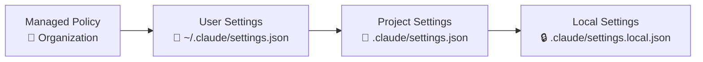

# Level 3: Settings and Permissions

## Why a Settings System is Needed

Imagine an apartment building. There are rules from the management company (no noise after 11 PM), building rules (intercom locks at 10 PM), apartment rules (take off shoes at the door), and your personal habits (set alarm for 7 AM). Each level can tighten rules, but not relax what is set above.

That's how Claude Code settings work -- four levels, from corporate policy to personal preferences.

## Settings Hierarchy



**Priority: managed > user > project > local.** The upper level always wins.

| File | Location | In Git? | Who manages |
|------|----------|---------|-------------|
| Managed policy | Set by organization | -- | DevOps / Security |
| User settings | `~/.claude/settings.json` | No | Developer |
| Project settings | `.claude/settings.json` | Yes | Team |
| Local settings | `.claude/settings.local.json` | No | Developer |

## Permission Rules: allow and deny

Settings determine which tools Claude can use without asking:

```json
{
  "permissions": {
    "allow": [
      "Read",
      "Glob",
      "Grep",
      "Bash(git log*)",
      "Bash(npm test*)",
      "Bash(npx tsc*)"
    ],
    "deny": [
      "Bash(rm -rf*)",
      "Bash(curl*)",
      "WebFetch"
    ]
  }
}
```

Patterns support `*` as a wildcard: `Bash(git *)` allows any git command, `Bash(npm *)` -- any npm command.

## Operating Modes

Claude Code supports several modes that determine how much autonomy the agent gets:

| Mode | What it does | When to use |
|------|-------------|-------------|
| `default` | Asks before dangerous actions | Everyday work |
| `plan` | Only analyzes, doesn't change files | Exploration in unfamiliar code |
| `auto` | Performs actions without confirmation | Trusted tasks, CI/CD |
| `acceptEdits` | Automatically accepts file edits | Mass refactoring |
| `bypassPermissions` | Ignores all restrictions | ⚠️ Experiments only |

💡 **Tip:** start with `plan` for analysis, switch to `default` for work. `auto` -- only when you fully trust the task.

## Security Classifier in Auto Mode

In `auto` mode, Claude doesn't blindly execute everything. A built-in classifier evaluates each action:

- ✅ **Safe** (file reading, git status) -- executed immediately
- ⚠️ **Conditionally safe** (file editing) -- depends on allow/deny settings
- ❌ **Dangerous** (file deletion, network requests) -- require confirmation even in auto

## ⚠️ Common Beginner Mistakes

### 🐛 1. Overly Broad Permissions

```json
// ❌ Bad -- allows absolutely everything in Bash
{
  "permissions": {
    "allow": ["Bash(*)"]
  }
}
```

> This removes all restrictions. Claude will be able to run `rm -rf /`, `curl` with data exfiltration, and any other command.

```json
// ✅ Good -- only specific tools
{
  "permissions": {
    "allow": [
      "Bash(git *)",
      "Bash(npm test*)",
      "Bash(npx tsc*)"
    ]
  }
}
```

### 🐛 2. Secrets in Project Settings

```bash
# ❌ .claude/settings.json is committed to git!
# Never put tokens or paths with username there

# ✅ For personal settings use:
# .claude/settings.local.json (gitignored)
# ~/.claude/settings.json (global, outside repository)
```

### 🐛 3. bypassPermissions in Production

The `bypassPermissions` mode disables **all** security checks. Use it only for local experiments, never -- on CI/CD or shared environments.

## 📌 Summary

- 🔥 Settings form a hierarchy: managed > user > project > local
- ✅ `allow` / `deny` set precise rules for tools with wildcard support
- 💡 `plan` mode -- safe exploration, `auto` -- for trusted tasks
- ⚠️ Minimize permissions: grant only what's actually needed
- 📌 Personal settings -- in `settings.local.json`, team settings -- in `settings.json`
